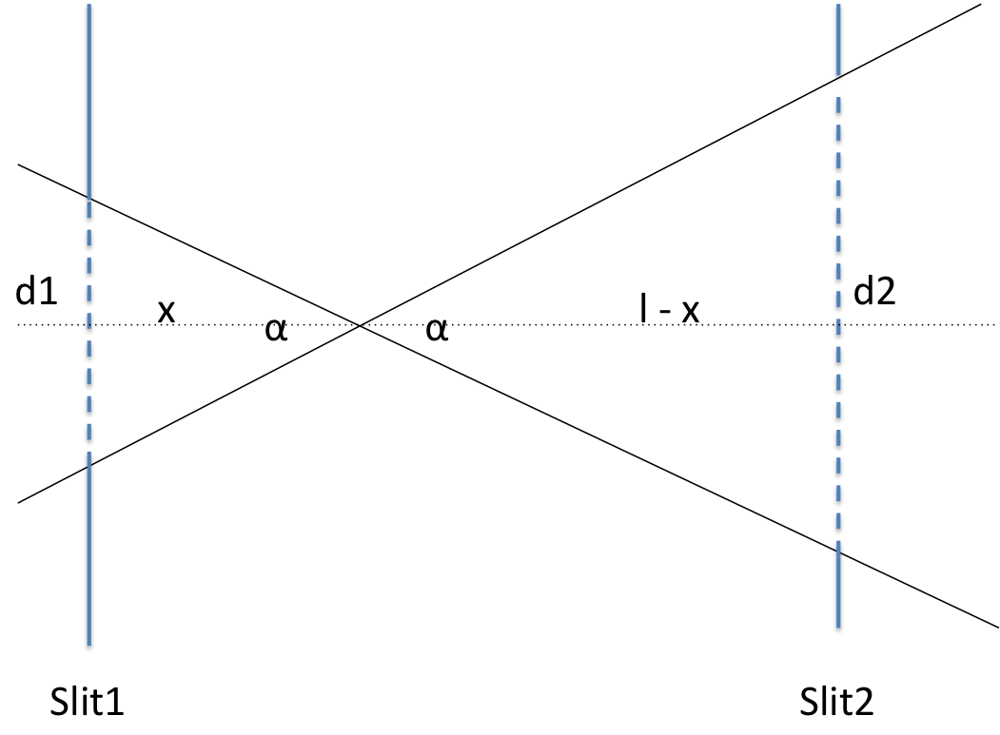

.. algorithm::

.. summary::

.. alias::

.. properties::

Description
-----------

This algorithm takes a workspace and a value for two theta, and attempts to calculate
the reflectometry resolution (dQ/Q) from them. If no value is provided for two theta
then CalculateResolution will attempt to fetch a value from the workspace's log
using the two theta log name provided.

CalculateResolution outputs two values, the calculated resolution and the value of
TwoTheta that was used in the calculation. The latter is useful when TwoTheta was not
given to CalculateResolution, causing CalculateResolution to extract it from the
workspace's sample log.

Beam Divergence
***************

   Schematic showing beam divergence using two slits (*Slit1* and *Slit2*)

**Proof**

.. math::

   \frac{d1}{x}  \equiv \frac{d2}{l - x}  \equiv tan\alpha

    \therefore \frac{d1}{x} = \frac{d1 + d2}{l}

    \therefore \alpha = tan^{-1}\left(\frac{d1 + d2}{l}\right)

where :math:`\alpha` gives is the beam divergence in radians. Parameter *d1* is the vertical distance of *Slit1* opening, *d2* is the same for *Slit2*. parameter *l* is the distance between the slits in the beam direction. See figure above for 
reference.

Usage
-----

.. testcode::

  ws = Load('INTER00013460')
  res, two_theta = CalculateResolution(Workspace = ws, TwoTheta = 0.7)
  print("Resolution: %.4f" % res)
  print("Two Theta: %.4f" % two_theta)

.. testoutput::

  Resolution: 0.0340
  Two Theta: 0.7000

.. categories::
