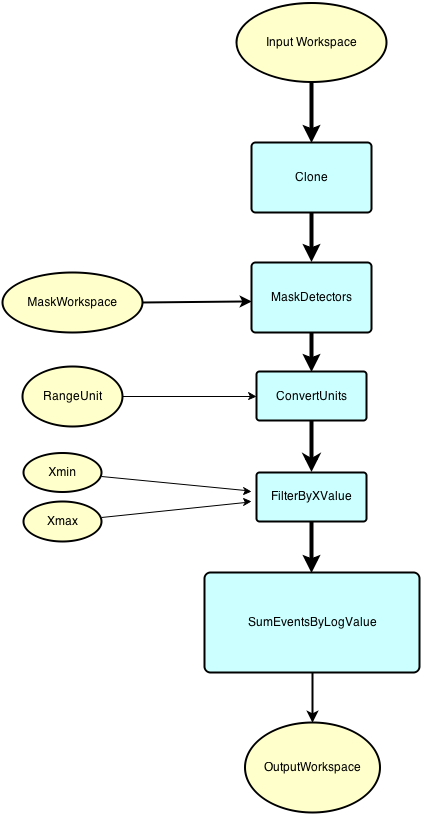

.. algorithm::

.. summary::

.. alias::

.. properties::

Description
-----------

This algorithm is for producing rocking curves from alignment scan runs.
It is for use only with ADARA-style SNS datasets as it requires the
'scan\_index' log variable.
The algorithm optionally uses the :ref:`algm-MaskDetectors`
and/or :ref:`algm-FilterByXValue` algorithms to restrict the
region of data included. **N.B. If these options are used, then this
algorithm will modify the input workspace.**

The :ref:`algm-SumEventsByLogValue` algorithm is then
called, with 'scan\_index' as the log to sum against. The row of the
resulting table pertaining to scan\_index=0 (which indicates 'not a scan
point') is then removed.
 
Before then it will call other algorithms as shown in the flowchart,
if the relevent inputs have been set.
:ref:`algm-MaskDetectors` will be called if a MaskWorkspace is supplied.
If either Xmin or Xmax or both are supplied, 
then :ref:`algm-FilterByXValue` algorithm is run to restrict the
region of data included and if RangeUnit is not TOF,
:ref:`algm-ConvertUnits` is run beforehand.  

If necessary, the imput workspace is cloned, to save it from being modified.

.. categories::
