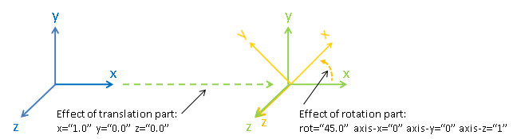
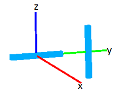

.. _InstrumentDefinitionFile:

Instrument Definition File
==========================

.. role:: xml(literal)
   :class: highlight

The documentation on this wiki page is the full detailed description of
the syntax you can use in an IDF to describe an instrument (note
parameters of instrument components may optionally be stored in
:ref:`parameter file <InstrumentParameterFile>`).

To get started creating an IDF follow the instructions on the :ref:`Create an
IDF <Create_an_IDF>` page, then return here for more detailed
explanations of syntax and structures.

Introduction
------------

An instrument definition file (IDF) aims to describe an instrument, in
particular providing details about those components of the instruments
that are critically affecting the observed signal from an experiment.
Parameter values of components may also be specified such as information
about the opening height of a slit, the final energy of a detector and
so on. The value of such parameters can optionally be linked to values
stored in log-files.

In summary an IDF may be used to describe any or all of the following:

#. Instrument components defined using a hierarchical structure. Take,
   for example, a detector bank containing 100 identical tubes each
   containing 100 detector pixels. One option is to describe this setup
   using a flat structure of 100\*100=10000 pixel components. Although
   this is a valid approach it
   #. create unnecessarily large files
   #. but most importantly it does not capture the layout of the instrument.
   The preferred option is to describe this example by first defining a
   “pixel” type, then a “tube” type containing 100 "pixels" and finally
   a “bank” component containing 100 "tubes". This latter approach
   requires the specification of 1(the bank)+100(tubes)+100(pixels)=201
   components as compared to specifying 10000 components using the
   former approach. The other benefit of organising the IDF according to
   the layout of the instrument is that users can subsequently refer to
   the structure of the instrument as it is laid out. For example can
   then subsequently easily move entire 'bank' or associate parameters
   which relevant for a specific say 'tube' or 'bank'.
#. The geometric shape and position of any component including: slits,
   mirrors, detectors etc.
#. A number of :ref:`specialised component
   types <Special types>` are defined
   including:

   -  detector and monitor components: required to be associated with
      unique detector or monitor ID numbers. The importance of these IDs
      are described further in
      `1 <Using_detector.2Fmonitor_IDs_.3Cidlist.3E>`_
   -  SamplePos component: Purpose to store the sample position. Needed
      e.g. to calculate sample-to-detector distances
   -  Source component: Purpose to store the source position or a
      position along the beamline but before the sample. Needed e.g. for
      spallation source instruments to calculate neutron flightpaths
      including the source-to-sample (primary path) distance. Also, used
      to define a point along the beam located before the sample. The
      direction from this position to the SamplePos is currently used to
      calculate the beam direction in some calculates (for example
      two-theta scattering angles).

#. Handling of log-files. Values specified in log-files can be used to
   modify parameters of components, such as a detector position
   coordinate or a slit opening height, in addition to assign values to
   such parameters directly
#. Specifying 'fitting' parameters of instrument profile functions and
   other function to be used when data from the instrument are analysed.
#. Choice of preferred coordinate system. For example the default is to
   define the beam along the z-axis and the y-axis to point up.

An IDF is structured as an `XML <http://en.wikipedia.org/wiki/XML>`__
document. For the purpose here it is enough to know that an XML document
follows a tree-based structure of elements with attributes. For example:

.. code-block:: xml

      <type name="main-detector-bank">
        <component type="main-detector-pixel" >
          <location x="-0.31" y="0.1" z="0.0" />
          <location x="-0.32" y="0.1" z="0.0" />
          <location x="-0.33" y="0.1" z="0.0" />
        </component>
      </type>

defines an XML element with has the attribute name="main-detector-bank".
This element contains one sub-element , which again contains 3 elements.
In plain English the above XML code aims to describe a
“main-detector-bank” that contains 3 detector pixels and their locations
within the bank.

If a component is a cylindrical tube where slices of this types are
treated as detector pixels the tube detector performance enhancement can
optionally be used, which will e.g. make the display of this tube in the
instrument viewer faster. This can be done by adding 'outline' attribute
to the tag and setting its value to "yes".

.. code-block:: xml

      <type name="standard-tube" outline="yes">
        <component type="standard-pixel" >
          <location y="-1.4635693359375"/>
          <location y="-1.4607080078125"/>
          <location y="-1.4578466796875"/>
        </component>
      </type>

The 'outline attribute' only affects the 3D view of the instrument,
which appears by default. It may lead to a less accurate placing of the
detector pixels and in particular may not show the effects of tube
calibration. However a 2D view of the instrument will still place pixel
detectors accurately.

IDF filename convention
-----------------------

An IDF can be loaded manually from any file with extension .xml or .XML
using :ref:`LoadInstrument <algm-LoadInstrument>` or
:ref:`LoadEmptyInstrument <algm-LoadEmptyInstrument>`.

IDFs located in the MantidInstall instrument directory are automatically
loaded together with e.g. the loading of raw data file. Such files are
required to have the format INSTRUMENTNAME\_DefinitionANYTHING.xml,
where INSTRUMENTNAME is the name of the instrument and ANYTHING can be
any string including an empty string. Where more than one IDF is defined
for an instrument the appropriate IDF is loaded based on its
:ref:`valid-from <Top level instrument>` and
`valid-to <Top level instrument>` dates. Note for this to work
the :ref:`Workspace <Workspace>` for which an IDF is loaded into must
contain a record of when the data were collected. This information is
taken from the workspace's :ref:`Run <Run>` object, more specifically the
*run\_start* property of this object.

In order to programmatically determine which is the correct filename for
a given date/time you can access a helper method from Python:

.. code-block:: python

   import mantid.api
   # if no date is given it will default to returning the IDF filename that is currently valid.
   currentIDF = mantid.api.ExperimentInfo.getInstrumentFilename("ARCS")
   otherIDF = mantid.api.ExperimentInfo.getInstrumentFilename("ARCS", "2012-10-30")

More detailed descriptions of various parts of the IDF
------------------------------------------------------

Geometry shapes
~~~~~~~~~~~~~~~

For information on how to define geometric shapes see
:ref:`HowToDefineGeometricShape <HowToDefineGeometricShape>`.

.. _Top level instrument:

Top level <instrument>
~~~~~~~~~~~~~~~~~~~~~~

<instrument> is the top level XML element of an IDF. It takes attributes, two of
which must be included. An example is

.. code-block:: xml

      <instrument name="ARCS"
                  valid-from="1900-01-31 23:59:59"
                  valid-to="2100-01-31 23:59:59"
                  last-modified="2010-10-12 08:54:07.279621">

Of the four attributes in the example above

-  name is (at present) optional, although it is recommended to specify
   something sensible
-  valid-from is compulsory and is the date from which the IDF is valid
   from (+). This date must be larger than or equal to 1900-01-31
   23:59:01
-  valid-to may optionally be added to indicate the date to which the
   IDF is valid to. If not used, the file is permanently valid. (+)
-  last-modified is optional. Changing it can be used as an alternative
   to force MantidPlot to reload the IDF, which e.g. might be useful
   during the build up of an IDF

(+) Both valid-from and valid-to are required to be set using the ISO
8601 date-time format, i.e. as YYYY-MM-DD HH:MM:SS or
YYYY-MM-DDTHH:MM:SS `2 <http://en.wikipedia.org/wiki/ISO_8601YYYY>`__.
Valid ranges may overlap, provided the valid-from times are all
different. If several files are currently valid, the one with the most
recent valid-from time is selected.

.. _Using component and type:

Using <component> and <type>
~~~~~~~~~~~~~~~~~~~~~~~~~~~~

Use the element to define a physical part of the instrument. A requires
two things

#. It must have a type="some type" attribute. This specify the 'type' of
   the component and this type must be specified somewhere in the IDF
   using: .
#. It must contain at least one <location> element. If multiple <location> are specified then
   this is essentially a shorthand notation for defining multiple
   components of the same type at different locations.

Here is an example

.. code-block:: xml

      <component type="slit" name="bob">
        <location x="10.651"/>
        <location x="11.983"/>
      </component>

      <type name="slit"></type>

Which defined two slits at two difference locations. Optionally a <component> can be
given a 'name', in the above example this name is "bob". If no 'name'
attribute is specified the name of the <component> defaults to the 'type' string, in
the above this is "slit". Giving sensible names to components is
recommended for a number of reasons including
#. The 'Instrument Tree' view of an instrument in MantidPlot uses these names
#. when specifying <parameter>s through  <component-link>s these names are used.

.. _Special types:

Special <type>s
^^^^^^^^^^^^^^^

Within Mantid certain <type>s have special meaning. A special <type> is specified by
including an 'is' attribute as demonstrated below

.. code-block:: xml

      <type name="pixel" is="detector">
        <cuboid id="app-shape">
          <left-front-bottom-point x="0.0025" y="-0.1" z="0.0"  />
          <left-front-top-point  x="0.0025" y="-0.1" z="0.0002"  />
          <left-back-bottom-point  x="-0.0025" y="-0.1" z="0.0"  />
          <right-front-bottom-point  x="0.0025" y="0.1" z="0.0"  />
        </cuboid>
      </type>

where the 'is' attribute of is used to say this is a detector-<type> (note
this particular detector-<type> has been assigned a geometric shape, in this
case a cuboid, see
:ref:`HowToDefineGeometricShape <HowToDefineGeometricShape>`). Special
types recognised are:

#. Detector (or detector)
#. Monitor (or monitor)
#. :ref:`RectangularDetector <Creating Rectangular Area Detectors>`
   (or rectangularDetector, rectangulardetector, or
   rectangular\_detector)
#. Source (or source)
#. SamplePos (or samplePos)
#. ChopperPos (or chopperPos)

For example it is important to specify the location of one Source-<type> and
one SamplePos-<type> in order for Mantid to be able to calculate L1 and L2
distances and convert time-of-flight to, for instance, d-spacing. An
example of specifying a Source and SamplePos is shown below

.. code-block:: xml

      <component type="neutron moderator"> <location z="-10.0"/> </component>
      <type name="neutron moderator" is="Source"/>

      <component type="some sample holder"> <location /> </component>
      <type name="some sample holder" is="SamplePos" />

Using detector/monitor IDs
~~~~~~~~~~~~~~~~~~~~~~~~~~~

Any component that is either a detector or monitor must be assigned a
unique detector/monitor ID numbers (note this is *not* spectrum ID
numbers but detector/monitor ID numbers). There are at least two
important reason to insist on this.

-  Data stored in files need to have a way to be linked to
   detectors/monitors defined in the IDF. For example, at the ISIS
   facility, data are recorded together with unique detector ID numbers.
   Hence the job here to match the IDs in the data file with the IDs of
   the IDF. Where unique IDs are not stored with the data the creator of
   an IDF have some flexibility to chose these ID numbers since the data
   themselves does not contain such number. However a link between the IDs
   and spectra in a workspace still needs to be made. By default the
   :ref:`LoadInstrument <algm-LoadInstrument>` algorithm, see in particular the
   RewriteSpectraMap parameter of this algorithm, will map the
   detector/monitor IDs with spectrum numbers as follows: the
   detector/monitor IDs in the IDF are ordered from smallest to largest
   number and then assigned in that order to the spectra in the
   workspace used to hold the data in Mantid.
-  Mantid needs to have a way to associate data which the
   detectors/monitors of the instrument, which is do this using the
   detector IDs. Although not mandatory it is recommended to give
   memorisable names to collection of detectors/monitors or individual
   detectors/monitors that a user is likely to want to refer. This allow
   a user to refer to a collection of detectors by name rather than
   trying to remember a sequence of IDs. Note the counts in a histogram
   spectrum may be the sum of counts from a number of detectors and
   Mantid, behind the scene, use the IDs to keep track of this.

The <idlist> element and the idlist attribute of the elements is used to assign
detector IDs. The notation for using idlist is

.. code-block:: xml

      <component type="monitor" idlist="monitor-id-list">
        <location r="5.15800" t="180.0" p="0.0" /> <!-- set to ID=500 in list below -->
        <location r="5.20400" t="180.0" p="0.0" /> <!-- set to ID=510 -->
        <location r="5.30400" t="180.0" p="0.0" /> <!-- set to ID=520 -->
        <location r="5.40400" t="180.0" p="0.0" /> <!-- set to ID=531 -->
        <location r="6.10400" t="180.0" p="0.0" /> <!-- set to ID=611 -->
        <location r="6.24700" t="0.000" p="0.0" /> <!-- set to ID=612 -->
        <location r="6.34700" t="0.000" p="0.0" /> <!-- set to ID=613 -->
        <location r="6.50000" t="0.000" p="0.0" /> <!-- set to ID=650 -->
      </component>

      <type name="monitor" is="monitor"/>

      <idlist idname="monitor-id-list">
        <id start="500" step="10" end="530" />  <!-- specifies IDs: 500, 510, 520, 530 -->
        <id start="611" end="613" />            <!-- specifies IDs: 611, 612 and 613 -->
        <id val="650" />                        <!-- specifies ID: 650 -->
      </idlist>

As can be seen to specify a sequence of IDs use the notation <id start="500" step="10" end="530" />, where if
the step attribute defaults to step="1" if it is left out. Just specify
just a single ID number you may alternatively use the notation <id val="650" />. Please
note the number of ID specified must match the number of
detectors/monitors defined.

.. _Creating Rectangular Area Detectors:

Creating Rectangular Area Detectors
~~~~~~~~~~~~~~~~~~~~~~~~~~~~~~~~~~~

There is a shortcut way to create 2D arrays of detector pixels. Here is
an example of how to do it:

.. code-block:: xml

    <component type="panel"  idstart="1000" idfillbyfirst="y" idstepbyrow="300">
      <location r="0" t="0" name="bank1">
      </location>
    </component>

    <component type="panel"  idstart="100000" idfillbyfirst="y" idstepbyrow="300">
      <location r="45.0" t="0" name="bank2">
      </location>
    </component>

    <!-- Rectangular Detector Panel. Position 100 "pixel" along x from -0.1 to 0.1
         and 200 "pixel" along y from -0.2 to 0.2 (relative to the coordinate system of the bank) -->
    <type name="panel" is="RectangularDetector" type="pixel"
        xpixels="100" xstart="-0.100" xstep="+0.002"
        ypixels="200" ystart="-0.200" ystep="+0.002" >
    </type>

    <!-- Pixel for Detectors. Shape defined to be a (0.001m)^2 square in XY-plane with tickness 0.0001m -->
    <type is="detector" name="pixel">
      <cuboid id="pixel-shape">
        <left-front-bottom-point y="-0.001" x="-0.001" z="0.0"/>
        <left-front-top-point y="0.001" x="-0.001" z="0.0"/>
        <left-back-bottom-point y="-0.001" x="-0.001" z="-0.0001"/>
        <right-front-bottom-point y="-0.001" x="0.001" z="0.0"/>
      </cuboid>
      <algebra val="pixel-shape"/>
    </type>

-  The "panel" type defined above has the special "is" tag of
   "RectangularDetector". The same type definition then needs these
   attributes specified:

   -  type: point to another type defining your pixel shape and size.
   -  xpixels: number of pixels in X
   -  xstart: x-position of the 0-th pixel (in length units, normally
      meters)
   -  xstep: step size between pixels in the horizontal direction (in
      length units, normally meters)
   -  ypixels: number of pixels in Y
   -  ystart: y-position of the 0-th pixel (in length units, normally
      meters)
   -  ystep: step size between pixels in the vertical direction (in
      length units, normally meters)

-  Detectors of the type specified ("pixel" in the example) will be
   replicated at the X Y coordinates given. The usual rotation and
   translation of the panel will rotate the pixels as needed.
-  Each instance of a "panel" needs to set these attributes, at the <component> tag,
   in order to specify the Pixel IDs of the 2D array.

   -  idstart: detector ID of the first pixel
   -  idfillbyfirst: set to true if ID numbers increase with Y indices
      first. That is: (0,0)=0; (0,1)=1, (0,2)=2 and so on. Default is
      idfillbyfirst="y".
   -  idstepbyrow: amount to increase the ID number on each row. e.g, if
      you fill by Y first,and set idstepbyrow = 100, and have 50 Y
      pixels, you would get: (0,0)=0; (0,1)=1; ... (0,49)=49; (1,0)=100;
      (1,1)=101; etc.
   -  idstep. Default to 1. Set the ID increment within a row.

-  DO NOT also specify an "idlist" attribute for rectangular detectors,
   as it will not be used.

-  Advantages of using a Rectangular Detector tag instead of defining
   every single pixel:

   -  The data will be displayed as a bitmap in the instrument 3D view,
      making rendering much faster.
   -  Smaller IDF and faster instrument loading times.
   -  No need to make a script to generate the pixel positions.

-  Disadvantages/Limitations:

   -  Must have constant pixel spacing in each direction.
   -  Must be rectangular shape.

.. _Using location:

Using <location>
~~~~~~~~~~~~~~~~

The <location> element allows the specification of both the position of a component
and a rotation or the component's coordinate system. The position part
can be specified either using standard x, y and z coordinates or using
spherical coordinates: r, t and p, which stands for radius, theta and
phi, t is the angle from the z-axis towards the x-axis and p is the
azimuth angle in the xy-plane
`3 <http://en.wikipedia.org/wiki/Spherical_coordinate_system>`__.
Examples of translations include

.. code-block:: xml

      <component type="something" name="bob">
        <location x="1.0" y="0.0" z="0.0" name="benny" />
        <location r="1.0" t="90.0" p="0.0"/>
      </component>

The above two translations have identical effect. They both translate a
component along the x-axis by "1.0". Note that optionally a <location> can be given
a name similarly to how a <location> can optionally be given a name. If a 'name'
attribute is not specified for a <location> element it defaults to the name of the
<component>.

The rotation part is specified using the attributes 'rot', 'axis-x',
'axis-y', 'axis-z' and these result in a rotation about the axis defined
by the latter three attributes. As an example the effect of

.. code-block:: xml

      <location rot="45.0" axis-x="0.0" axis-y="0.0" axis-z="1.0"/>

is to set the coordinate frame of the this component equal to that of
the parent component rotated by 45 degrees around the z-axis.

Both a translation and rotation can be defined within one <location> element. For
example

.. code-block:: xml

      <location x="1.0" y="0.0" z="0.0" rot="45.0" axis-x="0.0" axis-y="0.0" axis-z="1.0"/>

will cause this component to be translation along the x-axis by "1.0"
relative to the coordinate frame of the parent component followed by a
rotation of the coordinate frame by 45 degrees around the z-axis as
demonstrated in the figure below.

   Location-element-transformation.png

Any rotation of a coordinate system can be performed by a rotation about
some axis, however, sometime it may be advantageous to think of such a
rotation as a composite of two or more rotations. For this reason a <location>
element is allowed to have sub-rotation-elements, and an example of a
composite rotation is

.. code-block:: xml

      <location r="4.8" t="5.3" p="102.8" rot="-20.6" axis-x="0" axis-y="1" axis-z="0">
        <rot val="102.8">
          <rot val="50" axis-x="0" axis-y="1" axis-z="0" />
        </rot>
      </location>

The outermost is applied first followed by the 2nd outermost operation
and so on. In the above example this results in a -20.6 degree rotation
about the y-axis followed by a 102.8 degree rotation about the z-axis
(of the frame which has just be rotated by -20.6 degrees) and finally
followed by another rotation about the y-axis, this time by 50 degrees.
The ISIS NIMROD instrument (NIM\_Definition.xml) uses this feature.

The translation part of a <location> element can like the rotation part also be
split up into a nested set of translations. This is demonstrated below

.. code-block:: xml

      <location  r="10" t="90" >
        <trans r="8" t="-90" />
      </location>

This combination of two translations: one moving 10 along the x-axis in
the positive direction and the other in the opposite direction by 8 adds
up to a total translation of 2 in the positive x-direction. This
feature, for example, is useful when the positions of detectors are best
described in spherical coordinates with respect to an origin different
from the origin of the parent component. For example, say you have
defined a <type name="bank"> with contains 3 pixels. The centre of the bank is at the
location r="1" with respect to the sample and the positions of the 3
pixels are known with respect to the sample to be at r="1" and with
t="-1", t="0" and t="1". One option is to describe this bank/pixels
structure as

.. code-block:: xml

      <component type="bank">
        <location />
      </component>

      <type name="bank">
        <component type="pixel">
          <location r="1" t="-1" />
          <location r="1" t="0" />
          <location r="1" t="1" />
        </component>
      </type>

However a better option for this case is to use nested translations as
demonstrated below

.. code-block:: xml

      <component type="bank">
        <location r="1"/>
      </component>

      <type name="bank">
        <component type="pixel">
          <location r="1" t="180"> <trans r="1" t="-1" /> </location>
          <location r="1" t="180"> <trans r="1" t="0" /> </location>
          <location r="1" t="180"> <trans r="1" t="1" /> </location>
        </component>
      </type>

since this means the bank is actually specified at the right location,
and not artificially at the sample position.

Finally a combination of <trans> and  <rot> sub-elements of a <location> element can be used as
demonstrated below

.. code-block:: xml

      <location x="10" >
        <rot val="90" >
          <trans x="-8" />
        </rot>
      </location>

which put something at the location (x,y,z)=(10,-8,0) relative to the
parent component and with a 90 rotation around the z-axis, which causes
the x-axis to be rotated onto the y-axis.

Most of the attributes of have default values. These are: x="0" y="0"
z="0" rot="0" axis-x="0" axis-y="0" axis-z="1"

.. _Using facing:

Using <facing>
^^^^^^^^^^^^^^

The <facing> element is an element you can use together with a <location>. Its purpose is
to be able, with one line of IDF code, to make a given component face a
point in space. For example many detectors on ISIS instruments are setup
to face the sample. A <facing>element must be specified as a sub-element of a
<location> element, and the facing operation is applied after the translation
and/or rotation operation as specified by the location element. An
example of a <facing> element is

.. code-block:: xml

      <facing x="0.0" y="0.0" z="0.0"/>
      or
      <facing r="0.0" t="0.0" p="0.0"/>

In addition if the <components-are-facing> is set under <defaults>,
i.e. by default any component in the IDF will be rotated to face a
default position then

.. code-block:: xml

      <facing val="none"/>

can be used to overwrite this default to say you don't want to apply
'facing' to given component.

The process of facing is to make the xy-plane of the geometric shape
of the component face the position specified in the <facing> element.
The z-axis is normal to the xy-plan, and the operation of facing is
to change the direction of the z-axis so that it points in the direction
from the position specified in the facing <facing> towards the position
of the component.

<facing> supports a rot attribute, which allow rotation of the
z-axis around it own axis before changing its direction. The
effect of rot here is identical to the effect of using rot in a
<location> where axis-x="0.0" axis-y="0.0" axis-z="1.0". Allowing
rot here perhaps make it slightly clearly that such a rot is as
part of facing a component towards another component.

which rotate the is a convenient element for adjusting the orientation
of the z-axis. The base rotation is to take the direction the z-axis
points and change it to point from the position specified by the
<facing> element to the position of the component.

.. _Using exclude:

Using <exclude>
^^^^^^^^^^^^^^^

A <location> specifies the location of a <type>. If this type consists
of a number of sub-parts <exclude> can be used to exclude certain parts
of a type. For example say the type below is defined in an IDF

.. code-block:: xml

      <type name="door">
        <component type="standard-tube">
          <location r="2.5" t="19.163020" name="tube1"/>
          <location r="2.5" t="19.793250" name="tube2"/>
          <location r="2.5" t="20.423470" name="tube3"/>
          <location r="2.5" t="21.053700" name="tube4"/>
          <location r="2.5" t="21.683930" name="tube5"/>
        </component>
      </type>

and the instrument consists of a number of these doors but where some of
the doors are different in the sense that for example the 1st and/or the
2nd tube is missing from some of these. Using <exclude> this can be
succinctly described as follows:

.. code-block:: xml

      <component type="door">
        <location x="0">
          <exclude sub-part="tube1"/>
          <exclude sub-part="tube3"/>
        </location>
        <location x="1" />
        <location x="2" />
        <location x="3">
          <exclude sub-part="tube3"/>
        </location>
      </component>

where the sub-part of refers to the 'name' of a part of the type 'door'.

Extra options for indirect geometry instruments
^^^^^^^^^^^^^^^^^^^^^^^^^^^^^^^^^^^^^^^^^^^^^^^

Optionally, both physical and 'neutronic' detector positions can be
specified for indirect geometry instrument. This is described
`here <http://www.mantidproject.org/Indirect_Instrument_Definition_Options>`__.

.. _Using locations:

Using <locations>
~~~~~~~~~~~~~~~~~

Most instruments have detectors which are ordered in some way. For a
:ref:`rectangular array of
detectors <Creating Rectangular Area Detectors>` we have a
shorthand notation. The <locations> tag is a shorthand notation to use
for a linear/spherical sequence of detectors, as any of the position
coordinates or the coordinate rotation angles of a <location> tag are changing.

For example a <locations> element may be used to describe the position
of equally distanced pixels along a tube, in the example below along
the y variable

.. code-block:: xml

      <locations y="1.0" y-end="10.0" n-elements="10" name="det"/>

The above one line of XML is shorthand notation for

.. code-block:: xml

      <location y="1.0" name="det0"/>
      <location y="2.0" name="det1" />
      <location y="3.0" name="det2" />
      <location y="4.0" name="det3" />
      <location y="5.0" name="det4" />
      <location y="6.0" name="det5" />
      <location y="7.0" name="det6" />
      <location y="8.0" name="det7" />
      <location y="9.0" name="det8" />
      <location y="10.0" name="det9" />

As is seen n-elements is the number of <location> elements this <locations>
element is shorthand for. y-end specifies the y end position, and the equal
distance in y between the pixels is calculated in the code as
('y'-'y-end')/('n-elements'-1). Multiple 'variable'-end attributes can be
specified for the <locations> tag, where 'variable' here is any of the
<location> attributes: x, y, z, r, t, p and rot. The example below
describes a list of detectors aligned in a semi-circle:

.. code-block:: xml

    <locations n-elements="7" r="0.5" t="0.0" t-end="180.0" rot="0.0" rot-end="180.0" axis-x="0.0" axis-y="1.0" axis-z="0.0"/>

The above one line of XML is shorthand notation for

.. code-block:: xml

      <location r="0.5" t="0"   rot="0"   axis-x="0.0" axis-y="1.0" axis-z="0.0"/>
      <location r="0.5" t="30"  rot="30"  axis-x="0.0" axis-y="1.0" axis-z="0.0"/>
      <location r="0.5" t="60"  rot="60"  axis-x="0.0" axis-y="1.0" axis-z="0.0"/>
      <location r="0.5" t="90"  rot="90"  axis-x="0.0" axis-y="1.0" axis-z="0.0"/>
      <location r="0.5" t="120" rot="120" axis-x="0.0" axis-y="1.0" axis-z="0.0"/>
      <location r="0.5" t="150" rot="150" axis-x="0.0" axis-y="1.0" axis-z="0.0"/>
      <location r="0.5" t="180" rot="180" axis-x="0.0" axis-y="1.0" axis-z="0.0"/>

If name is specified, e.g. as name="det" in the first example, then as seen the
<location> elements are given the 'name' plus a counter, where by default this counter starts from zero. This counter can optionally be changed by using
attribute name-count-start, e.g. setting name-count-start="1" in the above
example would have named the 10 <location> elements det1, det2, ..., det10.

When one <locations> tag was used in ISIS LET_Definition.xml the number of
lines of this file reduced from 1590 to 567.

.. _Using parameter:

Using <parameter>
~~~~~~~~~~~~~~~~~

Parameters which do not change or are changed via <logfile> should be stored using
this element inside the IDF, however parameters which may need to be
accessed and changed manually on a regular basis should be stored in a
separate :ref:`parameter file <InstrumentParameterFile>`.

<parameter> is used to specify a value to a parameter which can then be extracted
from Mantid. One usage of <parameter> is to link values stored in log-files to
parameter names. For example

.. code-block:: xml

      <parameter name="x">
        <logfile id="trolley2_x_displacement" extract-single-value-as="position 1" />
      </parameter>

reads: “take the first value in the “trolley2\_x\_displacement" log-file
and use this value to set the parameter named 'x'.

The name of the <parameter> is specified using the 'name' tag. You may specify any
name for a parameter except for name="pos" and name="rot". These are
reserved keywords. Further a few names have a special effect when
processed by Mantid

-  "x", "y", and "z" overwrite the x, y and z coordinate respectively of
   the element of the component the is a sub-element of.
-  "r-position", "t-position" and "p-position" like "x", "y" and "z"
   overwrite the x, y, z coordinates but specified using spherical
   coordinates (as defined ). Note that the parameters "t-position" and
   "p-position" are ignored if the parameter "r-position" is not also
   set for the same component. If only "r-position" is set, say to
   r-position="10.0", than the component will be set to
   (x,y,z)=(0,0,10.0) i.e. theta and phi default to zero where not
   specified.
-  "rotx", "roty" and "rotz" rotate the component's coordinate system
   around the x-axis, y-axis and z-axis respectively in units of
   degrees. If any of these are specified they re-define the rotation
   for the component. You can specify two or three of these to create
   any rotation. Regardless of what order rotx, roty and rotz is
   specified in the IDF the combined rotation is equals that obtained by
   applying rotx, then roty and finally rotz.
-  "Efixed". If specified the :ref:`ConvertUnits <algm-ConvertUnits>` algorithm
   uses this value in unit conversion
-  "SplitInto". How many MD boxes to split into when converting to MD.
-  "SplitThreshold". The threshold number of MDEvents in an MDBox before
   splitting into a new MDBox. Concerns convert to MD.
-  "MaxRecursionDepth". The maximum depth of the MDBox tree when
   converting to MD.
-  "offset-phi". Effective boolean for turning on/off Phi offsets by PI.
   Set to Always to apply.

The value of the parameter is in the above example specified using a log-file as
specified with the element <logfile>. The required attribute of <logfile> is

-  *id* - the logfile name minus the file extension and the ISIS raw
   file name. For example the id for the logfile 'CSP78173\_height.txt'
   is 'height'.

Optional attributes of <logfile> are:

-  *extract-single-value-as* - specify which value (or values) from the
   logfile should be used to. This attribute takes any of the following
   strings

   -  **mean** (default)
   -  **position n** where n is an integer
   -  **first\_value** The first value in the run
   -  **last\_value** The last value in the run
   -  **median** The median value in the run
   -  **minimum** The minimum value in the run
   -  **maximum** The maximum value in the run

-  *eq* - the values in the log-file may not directly specify the
   parameter you want to set in the IDF. A simple example is where the
   values in the logfile are in units of mm, whereas the unit of length
   in the IDF is meters. Hence for this case by setting
   eq="0.001\*value" the values in the logfile are automatically
   converted to meters. A more complicated example is where the height
   of a detector is recorded in a log-file as the angle between from the
   horizontal plane to the detector in unit of degrees. Say the distance
   between the sample (which is assumed to be in the horizontal plane)
   and the detector is 1.863m then by specifying
   eq="1.863\*sin(value\*0.0174533)" the values in the log-file are
   automatically converted into the height of the detector from the
   horizontal plane in units of meters. Note pi/180=0.0174533 in
   "sin(value\*0.0174533)" above is to transform degrees to radians.

Another option for specifying a value for a parameter is to use the
notation:

.. code-block:: xml

      <parameter name="x">
        <value val="7.2"/>
      </parameter>

Here a value for the parameter with name "x" is set directly to 7.2. The only and
required attribute of the <value> element is 'val'.

For a given <parameter> you should specify its value only once. If by mistake you
specify a value twice as demonstrated in the example below then the first encountered
<value> element is used, and if no <value> element is present then the first
encountered <logfile> element is used.

.. code-block:: xml

      <parameter name="x">
        <value val="7.2"/>
        <logfile id="trolley2_x_displacement" extract-single-value-as="position 1" />
      </parameter>

In the above example <value val="7.2"/> is used.

.. _Accessing parameter:

Accessing <parameter>
~~~~~~~~~~~~~~~~~~~~~

Parameters are by default accessed recursively.
Demonstrated with an example:

.. code-block:: xml

      <component type="dummy">
        <location/>
        <parameter name="something"> <value val="35.0"/> </parameter>
      </component>

      <type name="dummy">
        <component type="pixel" name="pixel1">
          <location y="0.0" x="0.707" z="0.707"/>
          <parameter name="something1"> <value val="25.0"/> </parameter>
        </component>

        <component type="pixel" name="pixel2">
          <location y="0.0" x="1.0" z="0.0"/>
          <parameter name="something2"> <value val="15.0"/> </parameter>
        </component>
      </type>

this implies that if you for instance ask the component with
name="pixel1" what parameters it has then the answer is two:
something1=25.5 and something=35.0. If you ask the component
name="dummy" the same question the answer is one: something=35.0 and so
on.

.. _Using string parameter:

Using *string* <parameter>
~~~~~~~~~~~~~~~~~~~~~~~~~~

This is a special category of parameters where the value specified for
the parameter is string rather than a double. The syntax is

.. code-block:: xml

      <parameter name="instrument-status" type="string">
        <value val="closed"/>
      </parameter>

.. _Using fitting parameter:

Using *fitting* <parameter>
~~~~~~~~~~~~~~~~~~~~~~~~~~~

This is a special category of parameters, which follows the same syntax
as other but allows a few extra features. Fitting parameters are meant
to be used when raw data are fitted against models that contain
parameters, where some of these parameters are instrument specific. If
such parameters are specified these will be pulled in before the fitting
process starts, where optionally these may, for instance, be specified
to be treated as fixed by default. To specify a fitting parameter use
the additional tag type="fitting" as shown in the example below

.. code-block:: xml

      <parameter name="IkedaCarpenterPV:Alpha0" type="fitting">
        <value val="7.2"/>
      </parameter>

It is required that the parameter name uses the syntax
NameOfFunction:Parameter, where NameOfFunction is the name of the
fitting function the parameter is associated with. In the example above
the fitting function name is :ref:`IkedaCarpenterPV <func-IkedaCarpenterPV>` and
the parameter name is Alpha0.

To specify that a parameter should be treated as fixed in the fitting
process use the element as demonstrated in the example below

.. code-block:: xml

      <parameter name="IkedaCarpenterPV:Alpha0" type="fitting">
        <value val="7.2"/>
        <fixed />
      </parameter>

A parameter can be specified to have a min/max value, which results in a
constraint being applied to this parameter. An example of this is shown
below

.. code-block:: xml

      <parameter name="IkedaCarpenterPV:Alpha0" type="fitting">
        <value val="7.2"/>
        <min val="4"/> <max val="12"/>
      </parameter>

The min/max values may also be specified as percentage values. For
example:

.. code-block:: xml

      <parameter name="IkedaCarpenterPV:Alpha0" type="fitting">
        <value val="250"/>
        <min val="80%"/> <max val="120%"/>
        <penalty-factor val="2000"/>
      </parameter>

results in Alpha0 being constrained to sit between 250\*0.8=200 and
250\*1.20=300. Further this example also demonstrates how a can be
specified to tell how strongly the min/max constraints should be
enforced. The default value for the penalty-factor is 1000. For more
information about this factor see :ref:`FitConstraint <FitConstraint>`.

A value for a parameter may alternatively be set using a look-up-table
or a formula. An example demonstrating a formula is

.. code-block:: xml

      <parameter name="IkedaCarpenterPV:Alpha0" type="fitting">
        <formula eq="100.0+10*centre+centre^2" unit="TOF" result-unit="1/dSpacing^2"/>
      </parameter>

'centre' in the formula is substituted with the centre-value of the peak
shape function as known prior to the start of the fitting process. The
attributes 'unit' is optional. If it is not set then the peak
centre-value is directly substituted for the centre variable in the
formula. If it is set then it must be set to no one of the units defined
in :ref:`Unit Factory <Unit Factory>`, and what happens is that the peak
centre-value is converted to this unit before assigned to the centre
variable in the formula.

The optional 'result-unit' attribute tells what the unit is of the
output of the formula. In the example above this unit is "1/dSpacing^2"
(for the 'result-unit' this attribute can be set to an algebraic
expression of the units defined in :ref:`Unit Factory <Unit Factory>`). If
the x-axis unit of the data you are trying to fit is dSpacing then the
output of the formula is left as it is. But for example if the x-axis
unit of the data is TOF then the formula output is converted into, it in
this case, the unit "1/TOF^2". Examples where 'unit' and 'result-unit'
are used include:
`CreateBackToBackParameters <http://www.mantidproject.org/CreateBackToBackParameters>`_ and
`CreateIkedaCarpenterParameters <http://www.mantidproject.org/CreateIkedaCarpenterParameters>`_.

An example which demonstrate using a look-up-table is

.. code-block:: xml

      <parameter name="IkedaCarpenterPV:Alpha0" type="fitting">
        <lookuptable interpolation="linear" x-unit="TOF" y-unit="dSpacing">
          <point x="1" y="1" />
          <point x="3" y="100" />
          <point x="5" y="1120" />
          <point x="10" y="1140" />
        </lookuptable>
      </parameter>

As with a formula the look-up is done for the 'x'-value that corresponds
to the centre of the peak as known prior to the start of the fitting
process. The only interpolation option currently supported is 'linear'.
The optional 'x-unit' and 'y-unit' attributes must be set to one of the
units defined in :ref:`Unit Factory <Unit Factory>`. The 'x-unit' and
'y-unit' have very similar effect to the 'unit' and 'result-unit'
attributes for described above. 'x-unit' converts the unit of the centre
before lookup against the x-values. 'y-axis' is the unit of the y values
listed, which for the example above correspond to Alpha0.

.. _Using component-link:

Using <component-link>
~~~~~~~~~~~~~~~~~~~~~~

Allow <parameter>s to be linked to components without needing <parameter>s to be
defined inside, as sub-elements, of the components they belong to. The standard
approach for defining a parameter is

.. code-block:: xml

    <component type="bank" name="bank_90degnew">
      <location />
      <parameter name="test"> <value val="50.0" /> </parameter>
    </component>

where a parameter 'test' is defined to belong to the component with the
name 'bank\_90degnew'. However, alternatively the parameter can be
defined using the notation in the an example below. Note that if more
than one component e.g. have the name 'bank\_90degnew' then the
specified parameters are applied to all such components.

.. code-block:: xml

    <component type="bank" name="bank_90degnew">
      <location />
    </component>

    <component-link name="bank_90degnew" >
      <parameter name="test"> <value val="50.0" /> </parameter>
    </component-link>

<component-link> is the only way parameters can be defined in a **parameter file** used
by the :ref:`LoadParameterFile <algm-LoadParameterFile>` algorithm.

If there are several components with name 'bank\_90degnew' but you want
specified paramentes to apply to only one of them, then you can specify
the name by a path name.

.. code-block:: xml

    <component-link name="HRPD/leftside/bank_90degnew" >
      <parameter name="test"> <value val="50.0" /> </parameter>
    </component-link>

The path name need not be complete provided it specifies a unique
component. Here we drop the instrument name HRPD.

.. code-block:: xml

    <component-link name="leftside/bank_90degnew" >
      <parameter name="test"> <value val="50.0" /> </parameter>
    </component-link>

.. _Using combine-components-into-one-shape:

Using <combine-components-into-one-shape>
~~~~~~~~~~~~~~~~~~~~~~~~~~~~~~~~~~~~~~~~~

The standard way of making up geometric shapes as a collection of parts
is described here:
:ref:`HowToDefineGeometricShape <HowToDefineGeometricShape>`. However, <combine-components-into-one-shape>
offers in some circumstances a more convenient way of defining more
complicated shapes, as for example is the case for the ISIS POLARIS
instrument. This tag combining components into one shape as demonstrated
below:

.. code-block:: xml

    <component type="adjusted cuboid"
      <location />
    </component>

    <type name="adjusted cuboid" is="detector">
      <combine-components-into-one-shape />
      <component type="cuboid1">
        <location name="A"/>
        <!-- "A" translated by y=10 and rotated around x-axis by 90 degrees -->
        <location name="B" y="10" rot="90" axis-x="1" axis-y="0" axis-z="0" />
      </component>
      <algebra val="A : B" />

      <!-- this bounding box is used for this combined into one shape-->
      <bounding-box>
        <x-min val="-0.5"/>
        <x-max val="0.5"/>
        <y-min val="-5.0"/>
        <y-max val="10.5"/>
        <z-min val="-5.0"/>
        <z-max val="5.0"/>
      </bounding-box>

    </type>

    <type name="cuboid1" is="detector">
      <cuboid id="bob">
        <left-front-bottom-point x="0.5" y="-5.0" z="-0.5"  />
        <left-front-top-point  x="0.5" y="-5.0" z="0.5"  />
        <left-back-bottom-point  x="-0.5" y="-5.0" z="-0.5"  />
        <right-front-bottom-point  x="0.5" y="5.0" z="-0.5"  />
      </cuboid>

      <!-- this bounding box is not used in the combined shape -->
      <!-- Note you would not normally need to add a bounding box
           for a single cuboid shape. The reason for adding one
           here is just to illustrate that a bounding added here
           will not be used in created a combined shape as in
           "adjusted cuboid" above -->
      <bounding-box>
        <x-min val="-0.5"/>
        <x-max val="0.5"/>
        <y-min val="-5.0"/>
        <y-max val="5.0"/>
        <z-min val="-0.5"/>
        <z-max val="0.5"/>
      </bounding-box>
    </type>

which combines two components "A" and "B" into one shape. The resulting
shape is shape is shown here:

   CombineIntoOneShapeExample.png

Note for this to work, a unique name for each component must be provided
and these names must be used in the algebra sting (here "A : B", see
:ref:`HowToDefineGeometricShape <HowToDefineGeometricShape>`). Further a
bounding-box may optionally be added to the to the type.
Note the above geometric shape can alternatively be defined with the XML
(Mantid behind the scene translates the above XML to the XML below
before proceeding):

.. code-block:: xml

    <component type="adjusted cuboid">
      <location />
    </component>

    <type name="adjusted cuboid" is="detector">
      <cuboid id="A">
        <left-front-bottom-point x="0.5" y="-5.0" z="-0.5"  />
        <left-front-top-point  x="0.5" y="-5.0" z="0.5"  />
        <left-back-bottom-point  x="-0.5" y="-5.0" z="-0.5"  />
        <right-front-bottom-point  x="0.5" y="5.0" z="-0.5"  />
      </cuboid>
      <!-- cuboid "A" translated along y by 10 and rotated around x by 90 degrees -->
      <cuboid id="B">
        <left-front-bottom-point x="0.5" y="10.5" z="-5.0"  />
        <left-front-top-point  x="0.5" y="9.5" z="-5.0"  />
        <left-back-bottom-point  x="-0.5" y="9.5" z="-5.0"  />
        <right-front-bottom-point  x="0.5" y="10.5" z="5.0"  />
      </cuboid>
      <algebra val="A : B" />
    </type>

<combine-components-into-one-shape> for now works only for combining cuboids. Please do not hesitate to
contact the Mantid team if you would like to extend this.

This applies when defining any geometric shape, but perhaps something which a user
has to be in particular aware of when defining more complicated geometry shapes, for
example, using the <combine-components-into-one-shape> tag: the coordinate system in
which a shape is defined can be chosen arbitrary, and the origin of this coordinate
system is the position returned when a user asked for its position. It is therefore
highly recommended that when a user define a detector geometric shape, this could be
simple cuboid, that it is defined with the origin at the centre of the front of the
detector. For detector shapes build up of for example multiple cuboids the origin
should be chosen perhaps for the center of the front face of the 'middle' cuboid.
When Mantid as for the position of such a shape it will be with reference to
coordinate system origin of the shape. However, sometimes it may simply be
inconvenient to build up a geometry shape with an coordinate system as explained above.
For this case, and for now only when using <combine-components-into-one-shape> it
possible to get around this by using the element <translate-rotate-combined-shape-to>,
which takes the same attributes as a <location> element. The effect of this element
is basically to redefine the shape coordinate system origin (in fact also rotate it
if requested).

.. _Using defaults:

Using <defaults>
~~~~~~~~~~~~~~~~

Used for setting various defaults.

.. _components-are-facing:

<components-are-facing>
^^^^^^^^^^^^^^^^^^^^^^^

Used to make the xy-plane of the geometric shape of any component by
default face a given location. For example

.. code-block:: xml

      <components-are-facing x="0.0" y="0.0" z="0.0" />

If this element is not specified the default is to *not* attempt to
apply facing.

.. _offsets:

<offsets>
^^^^^^^^^

Originally introduced to handle detector position coordinates as defined
by the
`Ariel <http://www.isis.rl.ac.uk/Disordered/GEM/ariel/index_ariel.htm>`__
software.

.. code-block:: xml

      <offsets spherical="delta" />

When this is set all components which have coordinates specified using
spherical coordinates (i.e. using the r, t, p attributes, see
description of <location>) are then treated as offsets to the spherical position
of the parent, i.e. the value given for :math:`r` are added to the
parent's :math:`r` to give the total radial coordinate, and the same for
:math:`\theta` and :math:`\phi`. Note using this option breaks the
symmetry that the <location> element of a child component equals the position of
this component relative to its parent component.

.. _reference-frame:

<reference-frame>
^^^^^^^^^^^^^^^^^

Reference frame in which instrument is described. The author/reader of
an IDF can chose the reference coordinate system in which the instrument
is described. The default reference system is the one shown below.

.. code-block:: xml

      <reference-frame>
        <!-- The z-axis is set parallel to and in the direction of the beam. the
             y-axis points up and the coordinate system is right handed. -->
        <along-beam axis="z"/>
        <pointing-up axis="y"/>
        <handedness val="right"/>
      </reference-frame>

This reference frame is e.g. used when a signed theta detector values
are calculated where it is needed to know which direction is defined as
up. The direction here means the direction of the beam if it was not
modified by any mirrors etc.

.. _default-view:

<default-view>
^^^^^^^^^^^^^^

This tag is used to control how the instrument first appears in the
`Instrument View <http://www.mantidproject.org/MantidPlot:_Instrument_View>`__. Attribute ``view``
defines the type of the view that opens by default. It can have the
following values: "3D", "cylindrical\_x", "cylindrical\_y",
"cylindrical\_z", "spherical\_x", "spherical\_y", "spherical\_z". If the
attribute is omitted value "3D" is assumed. Opening the 3D view on
start-up is also conditioned on the value of the
``MantidOptions.InstrumentView.UseOpenGL`` property in the :ref:`Properties
File <Properties File>`. If set to "Off" this property prevents the
Instrument View to start in 3D mode and "cylindrical\_y" is used
instead. The user can change to 3D later.

Another attribute, ``axis-view`` governs on which axis the instrument is
initially viewed from in 3D and can be set equal to one of "Z-", "Z+",
"X-", etc. If "Z-" were selected then the view point would be on the
z-axis on the negative of the origin looking in the +z direction.

.. _angle unit="radian":

<angle unit="radian">
^^^^^^^^^^^^^^^^^^^^^

If

.. code-block:: xml

      <angle unit="radian"/>

is set then all angles specified in <location> elements and <parameter>'s with names
"rotx", "roty", "rotz", "t-position" and "p-position" are assumed to in radians. The
default is to assume all angles are specified in degrees.

Other defaults
^^^^^^^^^^^^^^

.. code-block:: xml

      <length unit="meter"/>

This default, for now, does not do anything, but is the default unit for
length used by Mantid. If it would be useful for you to specify user
defined units do not hesitate to `request
this <mailto:mantid-help@mantidproject.org>`__.

Parameter Files
---------------

To prevent an IDF file from getting too long and complicated,
information not related to the geometry of the instrument may be put
into a separate file, whose content is automatically included into the
IDF file.

For more information see the :ref:`parameter file
page <InstrumentParameterFile>`.

Deprecated Features
-------------------

The following features are now deprecated and should no longer be used.

*mark-as="monitor"*

The following notation to mark a detector as a
monitor is now deprecated:

.. code-block:: xml

      <component type="monitor" idlist="monitor">
          <location r="3.25800" t="180.0" p="0.0" mark-as="monitor"/>
      </component>

      <type name="monitor" is="detector"/>

      <idlist idname="monitor">
        <id val="11" />
      </idlist>

The above XML should be replaced with

.. code-block:: xml

      <component type="monitor" idlist="monitor">
          <location r="3.25800" t="180.0" p="0.0"/>
      </component>

      <type name="monitor" is="monitor"/>

      <idlist idname="monitor">
        <id val="11" />
      </idlist>

.. categories:: Concepts
