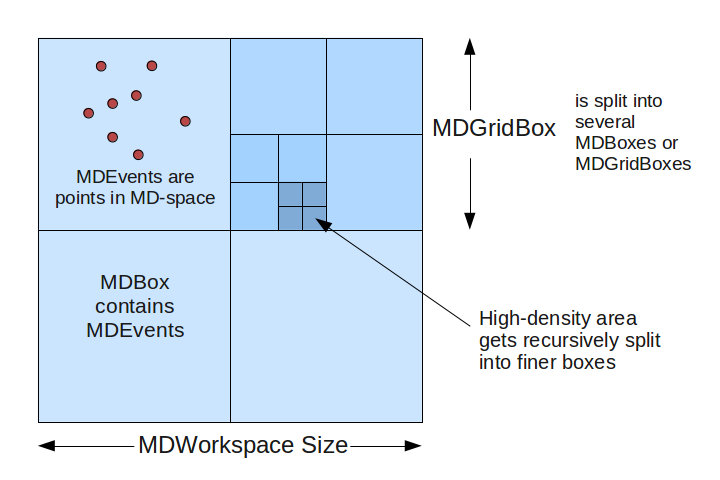

.. _MDWorkspace:

MDWorkspace
===========

The MDWorkspace (short for "Multi-Dimensional" Workspace) is a generic
data structure holdings points (MDEvents) that are defined by their
position in several dimensions. See also
:ref:`MDHistoWorkspace <MDHistoWorkspace>`.

Description of MDWorkspace
--------------------------

-  **Dimensions**: A MDWorkspace can have between 1 and 9 dimensions.

   -  Each dimension is defined with a name, units, and minimum/maximum
      extents.

-  **MDEvent**: A MDEvent is simply a point in space defined by its
   coordinates, plus a signal (weight) and error.

   -  The MDLeanEvent type contains only coordinates, signal and error.
   -  The MDEvent type also contains a run index (for multiple runs
      summed into one workspace) and a detector ID, allowing for more
      information to be extracted.

-  The class is named MDEventWorkspace.

Structure
~~~~~~~~~

The MDWorkspace is a container that can hold a large number of MDEvents.
The events are organized into "boxes": types are MDBox and MDGridBox. At
the simplest level, an MDWorkspace will be a single MDBox with an
unsorted bunch of events.

In order to allow for efficient searching and binning of these events,
the boxes are organized into a recursive boxing structure (adaptive mesh
refinement). During MDWorkspace construction, if a MDBox is found to
contain too many events, it will be split into smaller boxes.

   MDWorkspace\_structure.png
   
The threshold for splitting is defined in
:ref:`CreateMDWorkspace <algm-CreateMDWorkspace>` as the SplitThreshold
parameter. Each parent box will get split into N sub-boxes in each
dimension. For example, in a 2D workspace, you might split a parent box
into 4x4 sub-boxes, creating 16 MDBoxes under the parent box (which
becomes a MDGridBox). The level of splitting is defined in the SplitInto
parameter.

Creating a MDWorkspace
----------------------

There are several algorithms that will create a MDWorkspace:

-  :ref:`CreateMDWorkspace <algm-CreateMDWorkspace>` creates a blank MDWorkspace
   with any arbitrary set of dimensions.
-  :ref:`ConvertToDiffractionMDWorkspace <algm-ConvertToDiffractionMDWorkspace>`
   converts an :ref:`EventWorkspace <EventWorkspace>` or
   :ref:`Workspace2D <Workspace2D>` from detector space to reciprocal
   space, for elastic single-crystal or powder diffraction experiments.
-  :ref:`ConvertToMD <algm-ConvertToMD>` converts workspaces for
   inelastic experiments.
-  :ref:`SliceMD <algm-SliceMD>` takes a slice out of a MDWorkspace to create a
   new one.
-  :ref:`LoadSQW <algm-LoadSQW>` converts from the SQW format.

File-Backed MDWorkspaces
------------------------

For workspaces with a large number of events that would not fit in
memory, it is possible to use a NXS file back-end as a data store. The
box structure will always remain in memory, but the underlying events
will be stored in a file and retrieved only when required. This can be
set at creation (:ref:`CreateMDWorkspace <algm-CreateMDWorkspace>`) or when
loading from a file, or an in-memory MDWorkspace can be converted to
file-backed with the :ref:`SaveMD <algm-SaveMD>` algorithm.

Because of disk IO, file-backed MDWorkspaces are slower to process for
some operations (e.g. binning or slicing). Some types of visualization
and analysis, however, are just as fast with file-backed MDWorkspaces as
their in-memory equivalent.

Viewing MDWorkspaces
--------------------

-  Right-click on a MDWorkspace and select:

   -  **Show Vates Simple Interface**: to open a `simplified 3D
      view <http://www.mantidproject.org/VatesSimpleInterface>`__ based on Paraview.
   -  **Show Slice Viewer**: to open the `Slice
      Viewer <http://www.mantidproject.org/MantidPlot:_SliceViewer>`__, which shows 2D slices of the
      multiple-dimensional workspace.

-  You can also `use Python script to open the
   SliceViewer <http://www.mantidproject.org/SliceViewer_Python_Interface>`__.

Or, you can load a MDWorkspace .nxs file in Paraview if
the proper plugin is installed.

.. categories:: Concepts