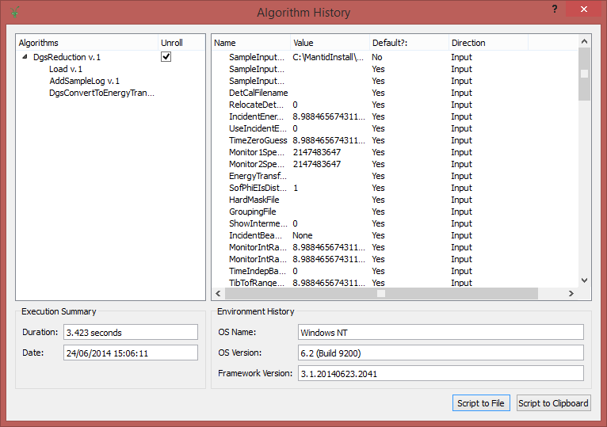

.. _Workflow Algorithm:

Workflow_Algorithm
==================

A workflow algorithm is a special subset of algorithms that perform
higher level tasks by solely making use of other algorithms. These
algorithms inherit from a specialized base class DataProcessorAlgorithm,
to indicate that these are indeed WorkflowAlgorithms. Due to the special
functions that can be applied to these algorithms it is vital that they
do not alter the data in any way directly themselves and rather use
child algorithms to do so.

Special Functions
~~~~~~~~~~~~~~~~~

   NestedHistory.png

Nested History
^^^^^^^^^^^^^^

As workflow algorithms are effectively just a collection of sub
algorithms tied together with some logic it is possible to represent
them as a simple flow diagram, and extract out the child algorithms from
any particular run. The nested history approach on Mantid allow any
workflow algorithm to be "unrolled" into the child algorithms that were
used by it.

Flow Diagrams
^^^^^^^^^^^^^

As workflow algorithms are effectively just a collection of sub
algorithms tied together with some logic it is possible to represent
them as a simple flow diagram. Each worklow algorithm should provide a
flow diagram of it's operations.

Examples
''''''''

-  :ref:`DGSReduction <algm-DgsReduction>`
-  :ref:`MuonLoad <algm-MuonLoad>`

.. categories:: Concepts