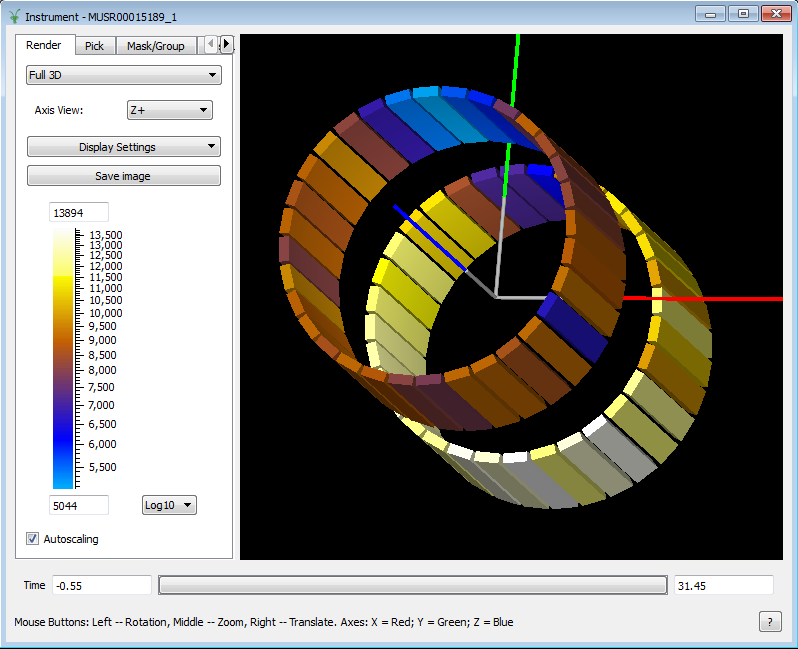

.. _train-MBC_Connecting_Data_To_Instrument:

=================================
Connecting Data To The Instrument
=================================

Introduction
============

The Instrument View is a widget for displaying instrument geometry. It
consists of three elements:

-  the controls panel
-  the graphical display
-  the data integration slider

The controls in the controls panel are placed into four tabs according
to their functions

-  Render
-  Pick
-  Mask/Group
-  Instrument Tree

The display window show the instrument detector coloured according to
the integrated counts in a workspace. The integration range is adjusted
using the data integration slider.

