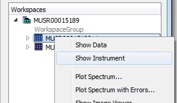
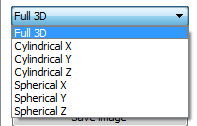
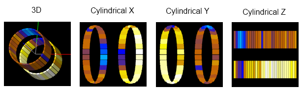
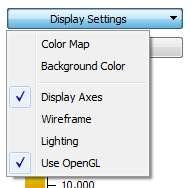
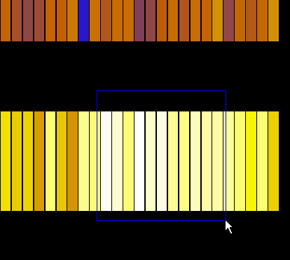

.. _train-MBC_Displaying_and_Navigating_Instrument:

========================================
Displaying and Navigating The Instrument
========================================

Opening the Instrument View
===========================

To see the Instrument View

#. :ref:`Load <algm-Load>` a data set
#. Right-click on the workspace and select Show Instrument

Different projections
=====================

There are two ways to display the instrument geometry: the 3D view and
an "unwrapped" view. An "unwrapped" view shows a projection of the
instrument onto a surface (a cylinder or a sphere) unfolded onto the
screen. Use this drop-down menu to select the type of the projection

Here is an example of how an instrument may look in different views:

Settings
========

Some aspects of the instrument appearance in the view can be set from
the Display Settings drop-down menu.

Navigating in 3D
================

.. role:: red

.. role:: green

.. role:: blue

In the 3D view:

-  The X axis is :red:`red`.
-  The Y axis is :green:`green`.
-  The Z axis is :blue:`blue`.

Rotate the instrument by left-clicking and dragging.

Pan the view by right-clicking and dragging.

Zoom in and out by rotating the wheel or holding down the middle button
and dragging up and down.

Zooming in 2D
=============

In an unwrapped view to zoom in select an area by left-clicking and
dragging.

Right click to zoom out.

