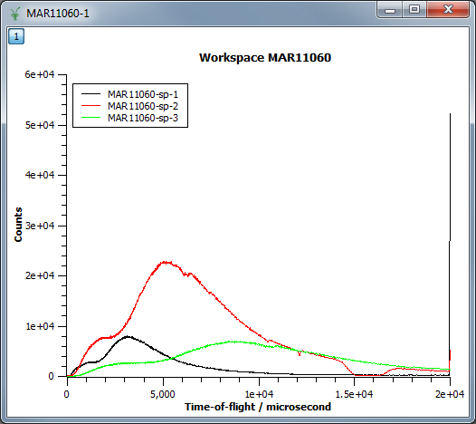
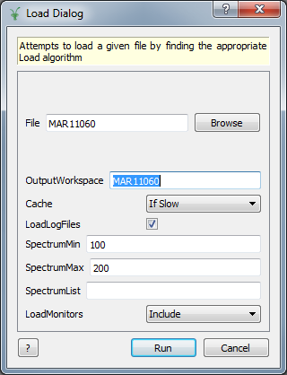
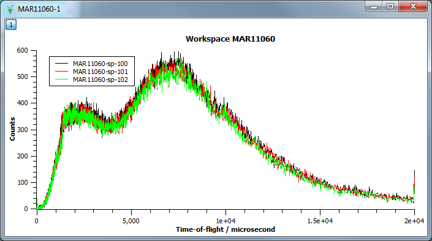
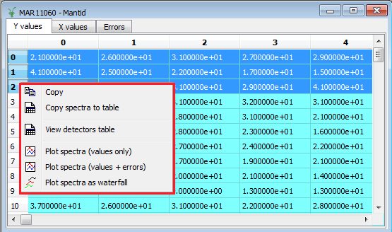

.. _train-MBC_Displaying_data:

===============
Displaying data
===============

The Simplest Plot
=================

#. :ref:`Load <algm-Load>` "MAR11060".
#. Right click the workspace in the workspace list.
#. Select "Plot Spectrum ...".
#. In the dialog that appears enter "1-3" in the spectra number box.

You should get a plot like this with three spectra corresponding to
spectra 1-3 (which in this case these are the monitors on MARI):

Another way to plot
===================

#. :ref:`Load <algm-Load>` MAR11060.raw, but this time set SpectrumMin to be "100" and
   SpectrumMax to be "200". Because the values are inclusive, we are
   actually loading 101 spectra, starting at 100.
#. Display the matrix window to view the data:

   |ShowMatrixOfMar11060|
#. In the matrix window highlight rows 0-2 and bring up the right-click
   menu:

   |MatrixDisplayRightClickOptions|
#. Select multiple rows using one of the following methods:

   -  Click the first index label, and then hold shift while selecting
      the last.
   -  Click and drag down the index labels to select as many as you
      want.
   -  Click while holding Ctrl to select / deselect individual rows.

#. You will presented with 3 options for plotting the selected spectra,
   which are plotting with and without errors or plotting the spectra as
   a waterfall. The latter option is only available if more than one
   spectra has been selected. Select "Plot Spectra" (showing the values
   only):

.. FIXME (inline definition does not allow align)			:align: centre

   :alt: centre|

   centre\|

Notice the legend entries "MAR11060-sp-100", ..., "MAR11060-sp-102",
where "sp" is shorthand for spectrum.

Adding a curve to an existing plot
==================================

There are two ways to add spectra to an already existing graph, either
from the same workspace of from another.

Drag and Drop
-------------

#. Drag the :ref:`Workspace <Workspace>` from the Workspace List and drop it onto the graph
   you want to add the curve to.
#. If the :ref:`Workspace <Workspace>` contains more than one spectra you will be asked
   which you wish to add to the plot.

From Another Plot
-----------------

#. Create a plot containing the spectra or curve you want to import into
   your destination plot.
#. In the destination plot double click the "1" in the top left.
#. In the "Add/Remove Curves Dialog" that appears, select the data you
   want from the available data, and click "->" to add it to your plot.

.. |ShowMatrixOfMar11060| image:: ../../images/ShowMatrixOfMar11060.PNG
			:width: 300px

