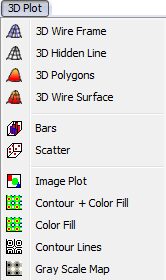
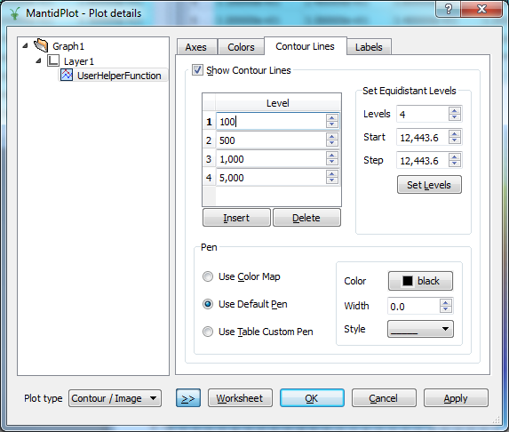
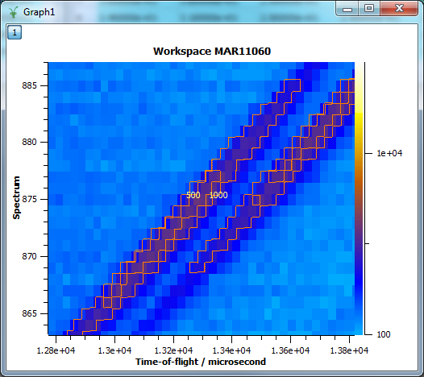
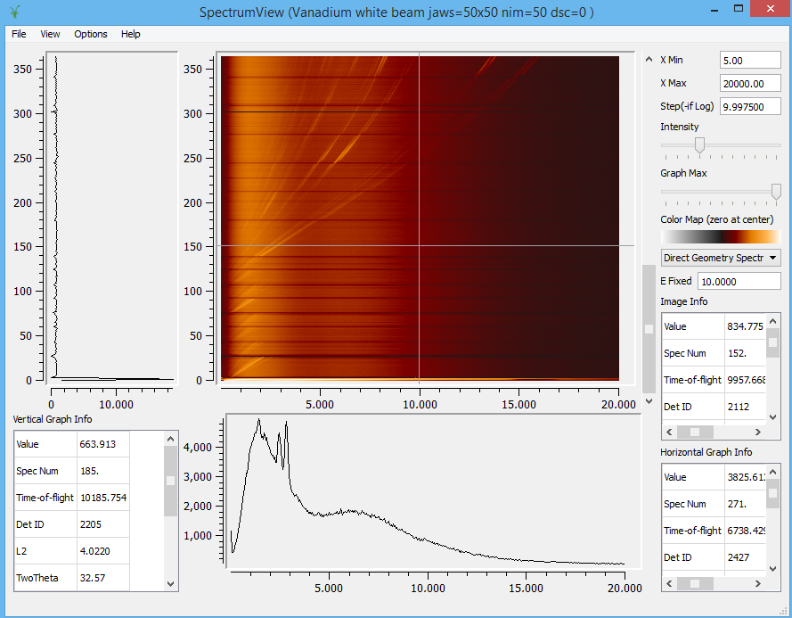

.. _train-MBC_Displaying_data_2D:

==================
Displaying data 2D
==================

Plotting All Spectra
====================

We have previously seen how to plot one or more rows from a dataset.
Here we will show how to visually inspect entire datasets.

#. :ref:`Load <algm-Load>` the MAR11060 dataset.
#. Right click the workspace in the workspace list and select "Colour
   Fill Plot". This will create a fairly boring blue display of the
   data, because one spectrum contains much higher counts than any of
   the other spectra, and the color scale has adjusted accordingly.
#. To make the colour fill plot more sensitive to its smaller features,
   right-click on the plot and select "Colour Bar->Log Scale".
#. Finally, right-clicking on the colour bar and selecting 'Rescale to
   show all' will give a more meaningful result:

.. image:: ../../images/ColourFillPlotMar11060.PNG

Plotting from the Matrix View
=============================

As long as this matrix is in focus, the MantidPlot menubar will contain
a menu called "3D Plot". This contains many options for plotting full
datasets. The "Color Fill" option is one of the most useful among them.

Changing the Colour Map
-----------------------

There are several colour maps to choose from that are already installed
with Mantid:

#. Double-click within the data of the plot (or right-click and select
   "Properties").
#. In the "Plot Details" dialog that appears select "Layer Details" in
   the left-hand pane.
#. Select "Custom Color Map" in "Colors" tab, click the "Select
   ColourMap" button, and select any of the colour map files.

Creating Your Own Colour Map
~~~~~~~~~~~~~~~~~~~~~~~~~~~~

If you don't like any of the colour maps you can create your own. The
files are just 256 entries of Red, Green and Blue values (0-255 for
each)::

	 ...
	 120 136 260
	 124 140 260
	 128 144 260
	 128 144 260
	 132 148 260
	 136 152 260
	 140 152 260
	 140 156 211
	 144 160 211
	 148 160 211
	 148 164 211
	 152 168 211
	 156 168 211
	 160 172 211
	 ...

Contour Lines
=============

You can plot contour lines onto your colour maps.

#. Double-click within the data of the plot (or right-click and select
   "Properties").
#. In the "Plot Details" dialog that appears select "Layer details" in
   the left hand pane.
#. Select the "Contour Lines" tab.
#. Here you can set the values for the contours; the pen contour, line
   thickness, etc.
#. Click "OK" and the contour lines will appear on your plot:

Spectrum Viewer
===============

The Spectrum viewer is a useful way to investigate 2D image data. You
can rapidly look through the spectrum and bin data for any point in the
2D map. To launch the Spectrum Viewer just right-click on the MAR11060
Workspace and select 'Show Spectrum Viewer':

