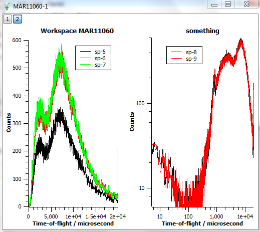

.. _train-MBC_Displaying_data_Complex:

Making a more complex example - Add a new layer to a plot
=========================================================

Adding a layer to a plot is, for example, like using subplots in
Matplotlib or Matlab.

#. Create a plot of spectra 5-7 from MAR11060.
#. Create a second plot of spectra 8 and 9.
#. Click on the plot window "MAR11060-1" and select the MantidPlot menu
   Graph->"Add layer" to add a new layer to this plot window. When
   presented with a window with the title "MantidPlot - Guess best
   origin for the new layer?", choose the default value of "Guess".
#. Right-click on the plot window "MAR11060-1" and select "Add/Remove
   Curve...". This will open an "Add/Remove curves" window.
#. Select in "Available data" the datasets "MAR11060-sp-8" and
   "MAR11060-sp-9" and use the right arrow to move these into the graph
   contents. Then press the "OK" button.
#. Note that the labels of the new layers are set to "X axis Title", "Y
   axis Title" and "Title". Change these (by double-clicking on them) to
   "Time-of-flight / microsecond", "Counts" and "Something".
#. Right-click on the plot while '2' is highlighted in the top left
   corner, and select Axes->"Log(x),Log(y)" to change both the axes of
   the 2nd layer to logarithmic scales.
#. Add a legend to the 2nd layer by selecting Graph->"Add New Legend".
#. Change the dimensions of this layer so that it is the same size as
   the previous layer.
#. Double-click on the new legend and change/move these legends until
   you get a result similar to the following:
   |TwoLayersExampleMBC.PNG|
#. When you're happy, you can export the plot to a number of different
   formats by right-clicking on the plot and selecting Export->Window,
   then for example saving the plot to a .jpeg file.

