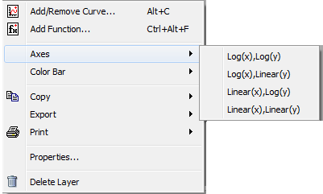

.. _train-MBC_Displaying_data_Formatting:

Floating and Docking a Window
=============================

By default on Windows a plot window will be floating, meaning it can be
dragged outside the main MantidPlot work area. For Linux versions,
windows do not float by default as they have a tendency to get lost
behind the main application window. The state of the selected window can
be controlled using the "Windows Menu".

#. Use "Windows->Change to docked". This will dock this plot window
   within MantidPlot.
#. Use "Windows->Change to floating" to float it again.

The Plot Toolbar
================

This toolbar is only active when a plot window is selected.

image:: ../../images/PlotToolbar.png

+------------------------------------------------------------------+------------------------------------------------------------------------------------------------------------------------------------------+----------------+--------------------------------------------------------------------------------------------------------------------------------------------+
| Icon                                                             | Command                                                                                                                                  | Key            | Description                                                                                                                                |
+==================================================================+==========================================================================================================================================+================+============================================================================================================================================+
| .. image:: ../../images/disable_plotToolbar.png                  | Selection Tool                                                                                                                           |                | Sets the mouse to the normal pointer mode. This is useful when you want to select items within the plot or axes.                           |
|    :alt: disable_plotToolbar.png                                 |                                                                                                                                          |                |                                                                                                                                            |
+------------------------------------------------------------------+------------------------------------------------------------------------------------------------------------------------------------------+----------------+--------------------------------------------------------------------------------------------------------------------------------------------+
| .. image:: ../../images/PanZoom_plotToolbar.png                  | `Zoom in or out and drag canvas <http://www.mantidproject.org/MantidPlot:_The_Data_Menu#Data_-.3E_Zoom_in_.28Ctrl-.2B.29>`__             | Shift+ +/-     | Click this tool and then move the mouse wheel over the plot to zoom in/out the active plot. The left mouse button drags the active plot.   |
|    :alt: PanZoom_plotToolbar.png                                 |                                                                                                                                          |                |                                                                                                                                            |
+------------------------------------------------------------------+------------------------------------------------------------------------------------------------------------------------------------------+----------------+--------------------------------------------------------------------------------------------------------------------------------------------+
| .. image:: ../../images/zoomin_plotToolbar.png                   | `Zoom in <http://www.mantidproject.org/MantidPlot:_The_Data_Menu#Data_-.3E_Zoom_in_.28Ctrl-.2B.29>`__                                    | Ctrl+ +        | Zooms in to the plot.                                                                                                                      |
|    :alt: zoomin_plotToolbar.png                                  |                                                                                                                                          |                |                                                                                                                                            |
+------------------------------------------------------------------+------------------------------------------------------------------------------------------------------------------------------------------+----------------+--------------------------------------------------------------------------------------------------------------------------------------------+
| .. image:: ../../images/zoomout_plotToolbar.png                  | `Zoom out <http://www.mantidproject.org/MantidPlot:_The_Data_Menu#Data_-.3E_Zoom_out_.28Ctrl--.29>`__                                    | Ctrl+ -        | Zooms out of the plot.                                                                                                                     |
|    :alt: zoomout_plotToolbar.png                                 |                                                                                                                                          |                |                                                                                                                                            |
+------------------------------------------------------------------+------------------------------------------------------------------------------------------------------------------------------------------+----------------+--------------------------------------------------------------------------------------------------------------------------------------------+
| .. image:: ../../images/rescaletoall_plotToolbar.png             | Rescale to Show All                                                                                                                      | Ctrl+Shift+R   | Rescales the axes to show all data points.                                                                                                 |
|    :alt: rescaletoall_plotToolbar.png                            |                                                                                                                                          |                |                                                                                                                                            |
+------------------------------------------------------------------+------------------------------------------------------------------------------------------------------------------------------------------+----------------+--------------------------------------------------------------------------------------------------------------------------------------------+
| .. image:: ../../images/screenreader_plotToolbar.png             | `Screen Reader <http://www.mantidproject.org/MantidPlot:_The_Data_Menu#Data_-.3E_Screen_Reader>`__                                       |                | Switches the plot to the "Screen Reader" mode. This allows you to read off axis values more accurately.                                    |
|    :alt: screenreader_plotToolbar.png                            |                                                                                                                                          |                |                                                                                                                                            |
+------------------------------------------------------------------+------------------------------------------------------------------------------------------------------------------------------------------+----------------+--------------------------------------------------------------------------------------------------------------------------------------------+
| .. image:: ../../images/Fit_PlotToolbar.png                      | `Fit Function/peak <http://www.mantidproject.org/MantidPlot:_Simple_Peak_Fitting_with_the_Fit_Wizard#Peak_Fit_Toolbar>`__                |                | Opens the "Fit Function" toolbox for fitting peaks or models to your data.                                                                 |
|    :alt: Fit_PlotToolbar.png                                     |                                                                                                                                          |                |                                                                                                                                            |
+------------------------------------------------------------------+------------------------------------------------------------------------------------------------------------------------------------------+----------------+--------------------------------------------------------------------------------------------------------------------------------------------+
| .. image:: ../../images/addtext_plotToolbar.png                  | `Add Text <http://www.mantidproject.org/MantidPlot:_The_Graph_Menu#Graph_-.3E_Add_Text_.28Alt-T.29>`__                                   | Alt+T          | Adds a new text element in the active plot.                                                                                                |
|    :alt: addtext_plotToolbar.png                                 |                                                                                                                                          |                |                                                                                                                                            |
+------------------------------------------------------------------+------------------------------------------------------------------------------------------------------------------------------------------+----------------+--------------------------------------------------------------------------------------------------------------------------------------------+
| .. image:: ../../images/drawarrow_plotToolbar.png                | `Draw Arrow <http://www.mantidproject.org/MantidPlot:_The_Graph_Menu#Graph_-.3E_Draw_Arrow_.28Ctrl-Alt-A.29>`__                          | Ctrl+Alt+A     | Adds a new arrow on the active plot.                                                                                                       |
|    :alt: drawarrow_plotToolbar.png                               |                                                                                                                                          |                |                                                                                                                                            |
+------------------------------------------------------------------+------------------------------------------------------------------------------------------------------------------------------------------+----------------+--------------------------------------------------------------------------------------------------------------------------------------------+
| .. image:: ../../images/drawline_plotToolbar.png                 | `Draw Line <http://www.mantidproject.org/MantidPlot:_The_Graph_Menu#Graph_-.3E_Draw_Line_.28Ctrl-Alt-L.29>`__                            | Ctrl+Alt+L     | Adds a new line on the active plot.                                                                                                        |
|    :alt: drawline_plotToolbar.png                                |                                                                                                                                          |                |                                                                                                                                            |
+------------------------------------------------------------------+------------------------------------------------------------------------------------------------------------------------------------------+----------------+--------------------------------------------------------------------------------------------------------------------------------------------+
| .. image:: ../../images/addfunction_plotToolbar.png              | `Add Function... <http://www.mantidproject.org/MantidPlot:_The_Graph_Menu#Graph_-.3E_Add_Layer_.28Alt-L.29>`__                           | Ctrl+Alt+F     | Adds a curve based on a function to the active plot window.                                                                                |
|    :alt: addfunction_plotToolbar.png                             |                                                                                                                                          |                |                                                                                                                                            |
+------------------------------------------------------------------+------------------------------------------------------------------------------------------------------------------------------------------+----------------+--------------------------------------------------------------------------------------------------------------------------------------------+
| .. image:: ../../images/newlegend_plotToolbar.png                | `New Legend <http://www.mantidproject.org/MantidPlot:_The_Graph_Menu#Graph_-.3E_New_Legend_.28Ctrl-L.29>`__                              | Ctrl+L         | Adds a new legend to the active plot window.                                                                                               |
|    :alt: newlegend_plotToolbar.png                               |                                                                                                                                          |                |                                                                                                                                            |
+------------------------------------------------------------------+------------------------------------------------------------------------------------------------------------------------------------------+----------------+--------------------------------------------------------------------------------------------------------------------------------------------+

Adjusting the Properties of Plot Windows
========================================

Many aspects of these graphs can be adjusted to fit how you want to
display the data. Just double-click on the item you want to change. For
example, the following are editable:

-  The graph title.
-  The legend text. You may also move the legend by selecting and
   dragging it.
-  The axes labels.
-  The axes themselves. You can change the range, scaling and gridlines,
   or even introduce axis breaks.
-  A curve allows you to set the line colour and styles.
-  Double-clicking the "1" in the corner allows you to remove curves or
   add them from other graphs.

Quickly changing to Log axes
----------------------------

We have a fast way to change the axes between log an linear as this is
such a common operation.

#. Right-click within the plot.
#. Select "Axes" to quickly switch the X and Y axes.
#. Select "Color Bar" to quickly switch the colour bar scaling.

