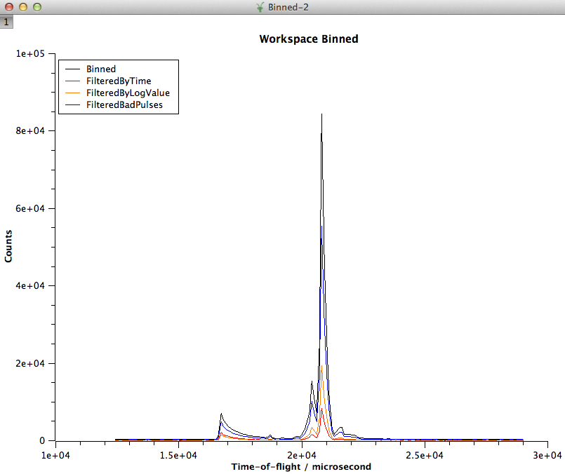
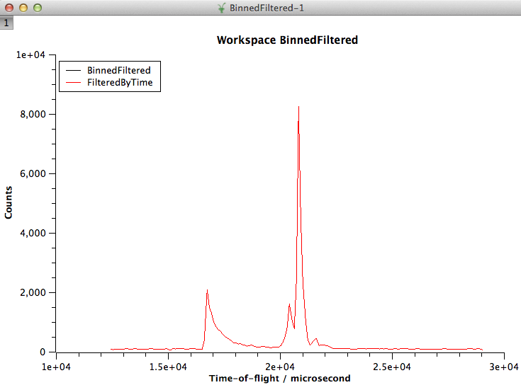
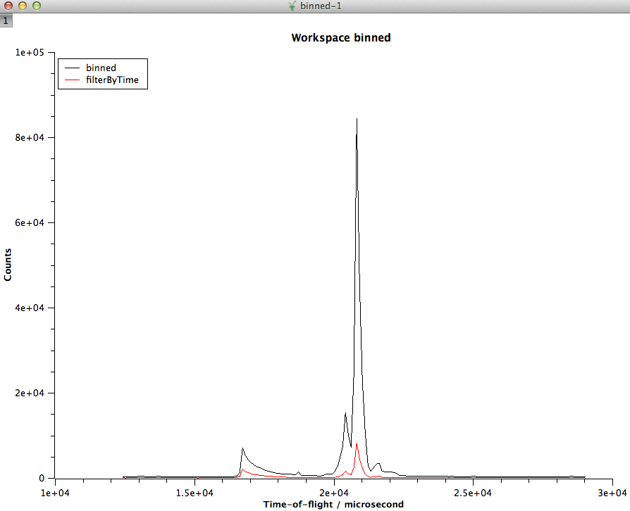

.. _train-MBC_Exercise_Algorithms_History_EventWorkspace:

=========================================
Exercise Algorithms, History & Workspaces
=========================================

Exercise 1
==========

#. :ref:`Load <algm-Load>` the :ref:`EventWorkspace <EventWorkspace>` *HYS_11388_event.nxs*
#. Sum across each spectra in the workspace using the :ref:`SumSpectra <algm-SumSpectra>`
   algorithm. Set the **OutputWorkspace** to be called *Sum*
#. :ref:`Rebin <algm-Rebin>` this grouped workspace, specify **OutputWorkspace** to
   *binned* and that the bin width is *100* microseconds, and keep
   **PreserveEvents** ticked
#. Right-click the workspace called *binned* and choose the **Plot
   Spectrum** option. Once the graph is plotted, leave do not delete it
#. Events in a :ref:`EventWorkspace <EventWorkspace>` may get filtered according to other
   recorded events during the experiments. At perhaps the simplest level
   you can filter out events between specific times. Use
   :ref:`FilterByTime  <algm-FilterByTime>` for this. It has a parameter called
   **StartTime**, which is the start time, in seconds, since the start
   of the run. Events before this time are filtered out. Run
   :ref:`FilterByTime <algm-FilterByTime>` with **StartTime**\ =\ *4000* and call the
   **OutputWorkspace** *FilteredByTime*
#. Drag the workspace FilteredByTime into the plot where workspace
   *binned* is plotted. What you should see now is
   |MBC_algorithm_example|
#. Replay by the steps used to create the *FilteredByTime* workspace
   from the history of this workspace

Exercise 2
==========

#. Using the *Binned* workspace from the previous example as the
   InputWorkspace, use :ref:`FilterByLogValue <algm-FilterByLogValue>` with
   **LogName**\ =\ *proton_charge*, **MinimumValue**\ =\ *17600000*,
   **MaximumValue**\ =\ *17890000*
#. Overplot the OutputWorkspace over your existing plots from the
   previous example
#. Run :ref:`FilterBadPulses <algm-FilterBadPulses>` with **InputWorkspace**\ =\ *Binned* and
   **LowerCutoff**\ =\ *99.999*
#. Overplot the *OutputWorkspace* over your existing plots

Exercise 3
==========

#. :ref:`Load <algm-Load>` the same workspace used in Exercise 1, but this time perform
   the same filtering achieved in Exercise 1 as part of the Loading
#. :ref:`SumSpectra <algm-SumSpectra>` on your new workspace
#. Use :ref:`RebinToWorkspace <algm-RebinToWorkspace>` to achieve the same binning as the existing
   *Binned* workspace
#. Plot both your newly rebinned workspace and *FilteredByTime* created
   in exercise 1 on a new plot.

