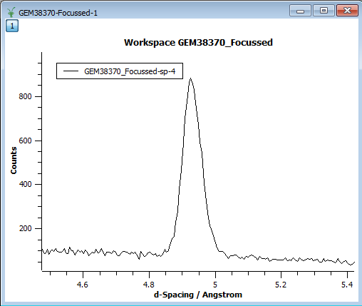
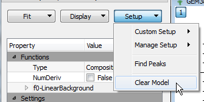
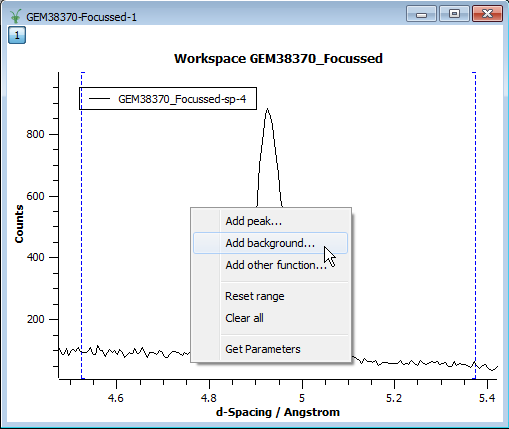
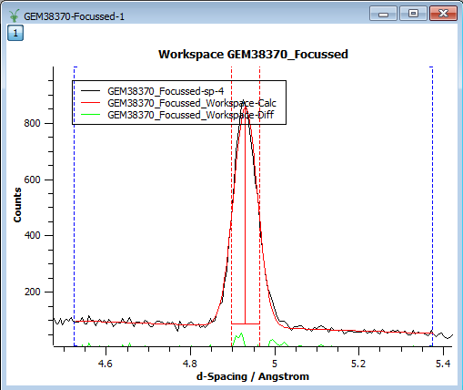
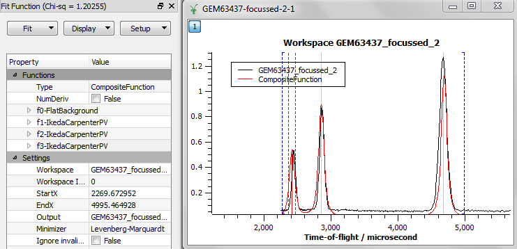
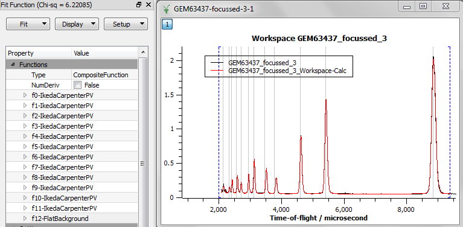

.. _train-MBC_Exercise_Intelligent_Fitting:

===============================
Exercise Fitting Models To Data
===============================

Exercise 1
==========

In this exercise we will fit a simple :ref:`Gaussian <func-Gaussian>` on a linear background.

#. Start with :ref:`Loading <algm-Load>` the data set (GEM38370_Focussed).
#. Plot spectrum 4.
#. Zoom into the peak around 5 angstroms.

   |GemSinglePeak.png|

#. Start the fitting tool.
#. Adjust the fitting range if needed.
#. Make sure the fitting model is empty in the Fit Function browser. If
   necessary clear it.

   |ClearModel.png|

#. Add a background function. Select :ref:`LinearBackground <func-LinearBackground>`.

   |AddBackgroundOption.png|

#. Add a peak. Select :ref:`Gaussian <func-Gaussian>`.
#. Click at peak's maximum point to set initial values for the centre
   and the height.
#. Adjust the width.

   |PreparedToFitGaussian.png|

#. Run Fit.

   |FittedGaussian.png|

Exercise 2
==========

This exercise will mainly quiz about fitting.

#. Ensure that the Fit Function panel is clear using panel option
   Setup->'Clear model'
#. :ref:`Load <algm-Load>` the GEM63437_focussed.nxs data. Note the workspace created is a
   :ref:`WorkspaceGroup <WorkspaceGroup>`. This is simply a containing workspace grouping one of
   more other workspaces. This dataset has been proceed already with
   Mantid. How many algorithms have been applied to this processed
   dataset?
#. Plot the spectrum in GEM63437_focussed_2, and zoom in on the area
   of the three peaks
#. Associate the plot with the Fit Function panel and set fitting range
   to be between approximately 2270 and 5000 microseconds
#. Right click on plot and select 'Add background...' then
   :ref:`FlatBackground  <func-FlatBackground>`
#. Right click on plot and add peak
   :ref:`IkedaCarpenterPV  <func-IkedaCarpenterPV>`. This is peak function where
   some parameters of the peak function may be related to instrument
   geometry. As of this writing scientist(s) of the GEM instrument
   modified the file MantidInstall/instrument/GEM_Parameters.xml such
   that when you added the :ref:`IkedaCarpenterPV <func-IkedaCarpenterPV>` peak it automatically
   selected some sensible starting parameter values. This is evident
   from the starting guess of the peak width but also by inspecting this
   function in the Fit Function panel
#. Hold down shift key and click on top of the two other peaks
#. Plot (fitting) guess and what you should see is something similar to

   |ExerciseFittingMBCguess.PNG|

   where the red line is the guess

#. Remove plot guess
#. Fit the data with the model, where the output should be something
   similar to

   |ExerciseFittingMBCfit.PNG|

   where the red line is here the fit

#. clear the model
#. Plot the spectrum in GEM63437_focussed_3
#. Using the same background and peak fitting function as above fit the
   region between about 2000 and 9400 microseconds, and obtain a result
   similar to

   |ExerciseFittingMBCfit 2.PNG|

   .. note:: this will take a while as it is a fit with almost 40
             independent parameters to optimise.

#. Optionally using a similar approach try to fit the spectrum in for
   example GEM63437_focussed_5

Exercise 3
==========

#. :ref:`Load <algm-Load>` the MUSR00015189 data set.
#. Plot a spectrum.
#. Start the fitting interface.
#. Follow the steps described earlier to add and set up a user defined
   function (:ref:`UserFunction <func-UserFunction>`).
#. Define a function with Formula = h\*exp(-a\*x)
#. Fit the data.

.. |PreparedToFitGaussian.png| image:: ../../images/PreparedToFitGaussian.png
			:width: 400px

.. |ExerciseFittingMBCfit.PNG| image:: ../../images/ExerciseFittingMBCfit.PNG
			:width: 400px

