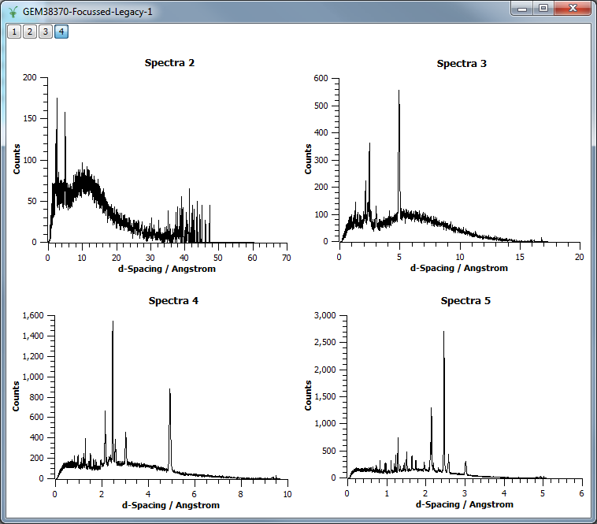

.. _train-MBC_Exercise_Loading_And_Displaying_Data:

====================================
Exercise Loading And Displaying Data
====================================

Part 1
======

#. :ref:`Load <algm-Load>` the File "GEM38370_Focussed_Legacy.nxs".
#. Plot spectra 2-7 (all of them).
#. Edit the d-spacing axis range, or zoom into the range of 0-10
   angstroms.
#. Try changing the X-Axis to log scaling.

Part 2
======

#. :ref:`Load <algm-Load>` the SANSLOQCan2D.nxs data. This is the output of a 2D SANS data
   reduction. Although a :ref:`Workspace2D <Workspace2D>` is mainly designed to store
   spectra, this is just the default, and in this data the loaded axes
   are momentum transfer Qx and the scattering cross section, and the
   'spectrum' axis is momentum transfer Qy.
#. Plot this data as a colour fill plot to get the following result:
   |Sans2Dcolourfillplotexercise1MBC|
#. Change the colour bar axis to logarithm.
#. Change the Colour Map to Jet.
#. Create Contour Lines and labels in White at 20, 30 and 40.
#. Zoom in to see the results of your work.

Part 3
======

#. Using the workspace GEM38370_Focussed_Legacy try to reproduce the
   graph below.

   -  You will need to add three layers to the graph.
   -  It is easier to start off with all three spectra in the first
      graph.
   -  Use the approach of double clicking on the layer label (top left
      numbers) to set the data for each layer.

.. |Sans2Dcolourfillplotexercise1MBC| image:: ../../images/Sans2Dcolourfillplotexercise1MBC.PNG

