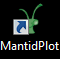
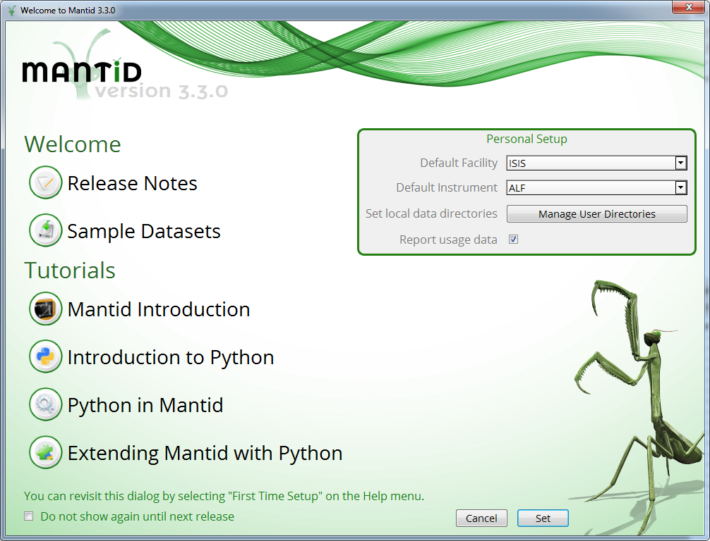
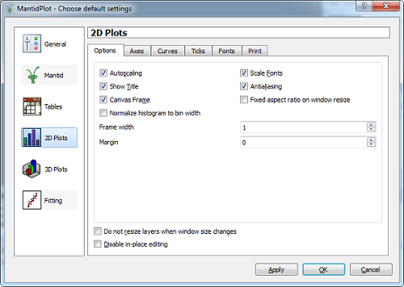
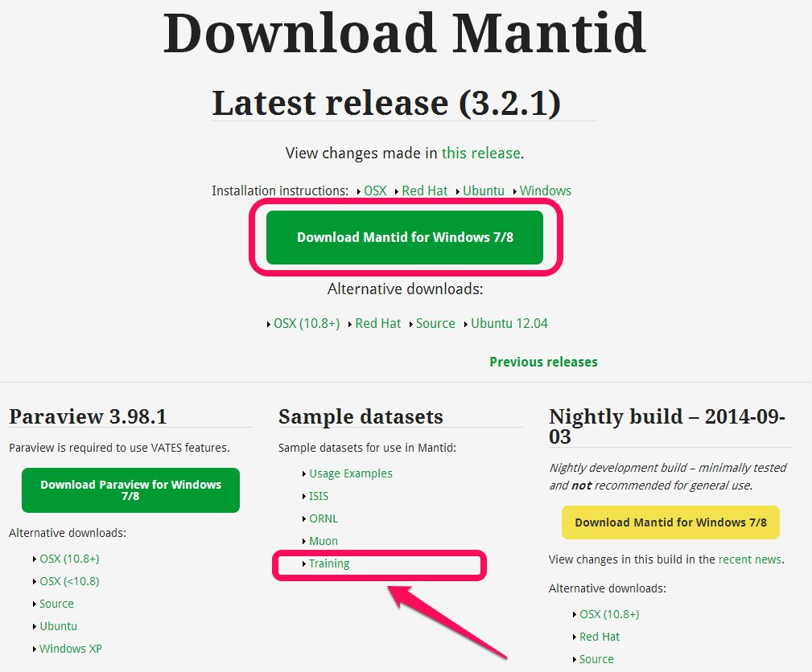

.. _train-MBC_Getting_set_up:

Installing Mantid
=================

If you do not already have Mantid installed then Mac, Linux and Windows
binaries are available to
`download <http://download.mantidproject.org/>`__ (using the "Latest
Release" is recommended). On Windows the result of the install is that
you should have a desktop icon called MantidPlot on your desktop:

A more detailed screencast on how to install Mantid is also
`available <http://files.mantidproject.org/videos/Installation.htm>`__.

Getting the Data Files
======================

**Note: This section has already been done on the Course provided
computers.**

#. The data you need to follow the Mantid Basic Course (MBC) tutorials
   can be downloaded from the `Mantid download
   page <http://download.mantidproject.org>`__. Pick the
   "TrainingCourseData.zip" file from the sample data section.
   |NewTrainingData.jpg|

#. Place the files in c:\\MantidInstall\\data on windows, and somewhere
   in your home directory on Mac or Linux.

MantidPlot First-Time Setup
===========================

The first time you start Mantidplot you will be presented with a
configuration window.

Default Instrument and Directories
----------------------------------

.. image:: ../../images/ManageDirectories.png
			:width: 300px
			:align: right

#. If you have a favourite instrument go ahead and select it, otherwise
   select ISIS and MARI.
#. Click on the "Manage User Directories" button.

   #. Click "Browse To Directory" and navigate to the location of the
      data files (c:\\mantidinstall\\data).
   #. Do the same for the default save directory.
   #. Click "OK".

#. Click "Set".

You can always get this back using the Help->First Time Setup menu item.
Manage User Directories is available from a number of other locations
also, see `here <http://www.mantidproject.org/ManageUserDirectories>`__.

Default Settings
----------------

Mantid can plot data with the intensity normalized by the bin width, and
this is the default behaviour for all histogram and event data. As we
are not going to use this normalization in this course we need to change
the default settings. To do that, go to "View"->"Preferences..." and in
the new window select "2D Plots" and untick "Normalize histograms to bin
width".

