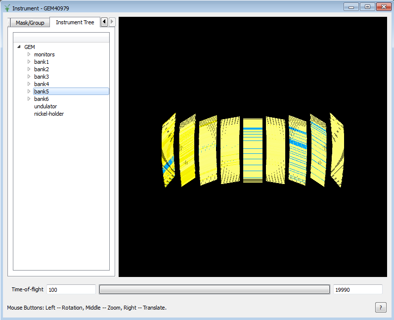

.. _train-MBC_Instrument_Tree:

Instrument Tree
===============

The Instrument Tree tab allows you to see parts of the instrument in
isolation. Select a part in the tree widget and the display will show
only the selected part.

.. raw:: mediawiki

   {{SlideNavigationLinks|MBC_Masking_and_Grouping|Mantid_Basic_Course|MBC_Exercise_Connecting_Data_To_Instrument}}

