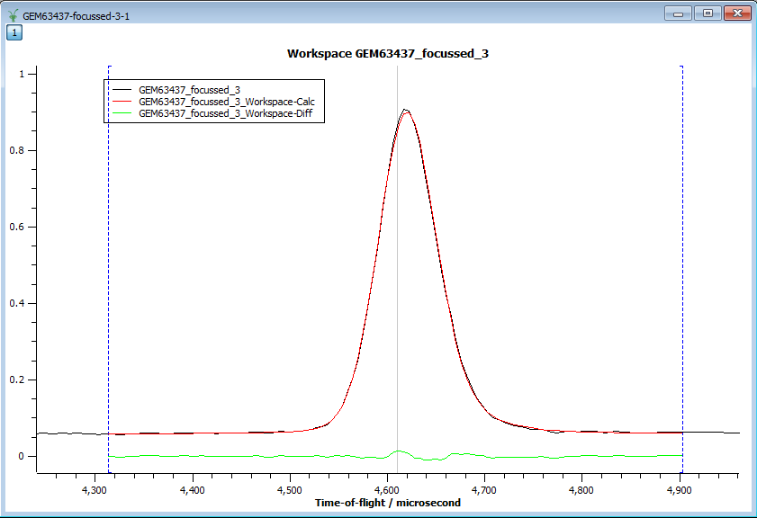
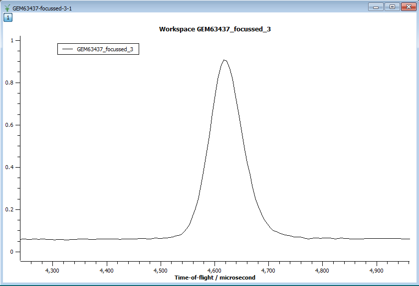
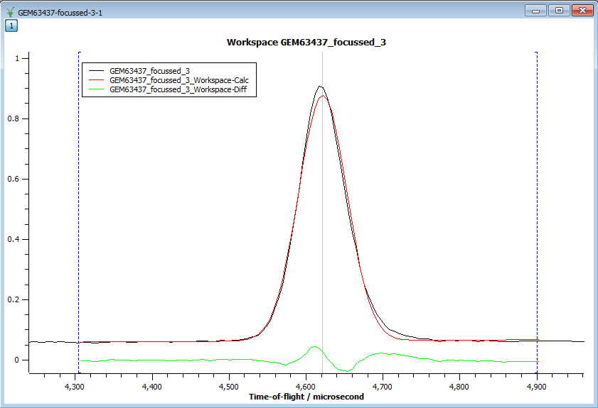

.. _train-MBC_Intelligent_Fitting:

Intelligent Fitting
===================

Fitting is the modelling of data where parameters of the model are
allowed to vary during a fitting process until the agreement between
model and data agree better according to some cost function.

In summary the Mantid fitting provides

-  General fitting capabilities
-  Neutron and Muon intelligent fitting tools, which makes use of
   additional information about the data, such as instrument geometry
   and log value information
-  Easily expandable

Here a more advanced aspect of Mantid fitting is presented. We will fit
an asymmetric peak from a GEM data set with the Ikeda-Carpenter function
on a :ref:`LinearBackground <func-LinearBackground>`.

| Let's load GEM63437_focussed.nxs file and plot GEM63437_focussed_3
  workspace. Zoom into the region 4300 - 4900 microseconds.
| |GEMAsymmetricPeak.png|

| Try to fit it with a :ref:`Gaussian <func-Gaussian>` (plus :ref:`LinearBackground <func-LinearBackground>`):
| |GEMGaussianFit.png|

Not a very good job. The :ref:`Ikeda-Carpenter <func-IkedaCarpenterPV>` function is a better
choice here. But this is a very difficult function to work with. It
requires very good initial parameter values for the fit to converge. The
Mantid approach is to use the pre-set values which are defined on a
per-instrument basis. For example, when the :ref:`Ikeda-Carpenter <func-IkedaCarpenterPV>` function is used with
GEM data the fitting tools automatically find and set the appropriate
initial values. This results in a good fit.

