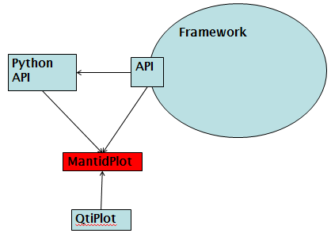

.. _train-MBC_Introduction:

About Mantid
============

The Mantid Framework has been created to manipulate and analyse neutron
and muon scattering data.

The MantidPlot Graphical User Interface (GUI) is one way in which this
framework has been exposed to users. MantidPlot also utilises a set of
tools offered by the scientific visualisation software "QtiPlot", which
like Mantid is also open-source.

In addition to the GUI, Python scripts can be executed (both inside and
outside of MantidPlot) that allow the automation of complex interactions
with the framework.

The dependencies between the various parts of Mantid can be visualised
as follows:

The aim of this tutorial is to present an overview of the MantidPlot
GUI.

Issues
======

Instructors will be around during the course, but afterwards help will
also available. The Mantid Development Team can be contacted either by
navigating to the 'Contact Us' section of the `Mantid
Wiki <http://www.mantidproject.org/Main_Page>`__, or by using the "Help" menu from within MantidPlot
itself:

.. image:: ../../images/MBC MantidPlotaskforhelp.PNG

