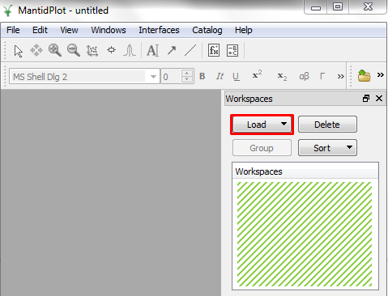

.. _train-MBC_Loading_Data:

Loading a File
==============

First, let's load the dataset MAR11060.raw collected on the ISIS MARI
instrument:

#. In MantidPlot click on the the "Load" button (as shown highlighted in
   red), and select "File". This will open the :ref:`Load <algm-Load>` Dialog window.
#. Browse to the location of the file MAR11060.raw.

   -  If you have successfully added the directory containing this file
      to your data search directories (see
      :ref:`MBC Getting set up <train-MBC_Getting_set_up>`) then you can
      simply enter the filename in the File textbox.
   -  Typing "MAR11060" would actually be enough for MantidPlot to find
      the data, but if you have set MARI as you default instrument
      typing just "11060" would work!

#. Mantid will suggest the OutputWorkspace name to be "MAR11060", but
   feel free to use whatever you like.
#. Leave the other properties alone and press the Run button. A
   :ref:`Workspace <Workspace>` will appear in the Workspaces list (as shown highlighted in
   green).
#. Click on this workspace entry and drag it into the main area to the
   left of the workspace. This will display the data in a matrix window
   named 'MAR11060 - Mantid', as shown below:

.. image:: ../../images/ShowMatrixOfMar11060.PNG

Other equivalent methods exist for loading files in MantidPlot:

-  Navigating to the "Load->File" menu item.
-  Clicking the |LoadFileButton.png| toolbar button.
-  Using the :ref:`Load <algm-Load>` Algorithm. (More on this later!)

.. figure:: ../../images/LoadAlgorithmsSep2013.PNG
	:width: 300px
	:align: right
	:alt: The list of Load algorithms for Mantid v2.6.

	The list of :ref:`Load <algm-Load>` algorithms for Mantid v2.6.

Types of Data Files
===================

Mantid can load many different data formats. A few examples are:

-  ISIS, SNS, ILL, PSI .nexus data files.
-  ISIS .raw data and log files.
-  Simulated data formats.
-  Ascii data, Table data, etc.
-  Live data streams.

Fortunately, you don't have to learn how to use all of these :ref:`Load <algm-Load>`
algorithms. In fact, just one, ":ref:`Load <algm-Load>`", which was used earlier when you
loaded the workspace. Whenever you use ":ref:`Load <algm-Load>`" Mantid takes care of the
following:

-  Expanding out run numbers to full file names.
-  Finding the file in the data search directories, and optionally the
   facility archive.
-  Determining the format of the file and using the correct algorithm to
   read it.
-  Loading or summing multiple files.

Loading Lots of Data Files
==========================

You can load multiple files into mantid with a single :ref:`Load <algm-Load>` command,
either keeping each workspace separate, or summing the data into a
single workspace:

+---------------------------------+--------------------------------+-----------------+------------------------------------------------------------+
| Usage                           | Description                    | Example                                                                      |
|                                 |                                +-----------------+------------------------------------------------------------+
|                                 |                                | Input           | Result                                                     |
+=================================+================================+=================+============================================================+
| ``<run>,<run>``                 | Load a list of runs.           | ``INST1,2,3``   | Load runs 1, 2 and 3.                                      |
+---------------------------------+--------------------------------+-----------------+------------------------------------------------------------+
| ``<run>+<run>``                 | Sum a list of runs together.   | ``INST1+2+3``   | Load and sum runs 1, 2 and 3.                              |
+---------------------------------+--------------------------------+-----------------+------------------------------------------------------------+
| ``<run>:<run>``                 | Load a range of runs.          | ``INST1:4``     | Load runs 1, 2, 3 and 4.                                   |
+---------------------------------+--------------------------------+-----------------+------------------------------------------------------------+
| ``<run>-<run>``                 | Sum a range of runs.           | ``INST1-4``     | Load and then sum runs 1, 2, 3 and 4.                      |
+---------------------------------+--------------------------------+-----------------+------------------------------------------------------------+

A full explanation of all the functionality and limitations is
`available <http://www.mantidproject.org/MultiFileLoading>`__.

