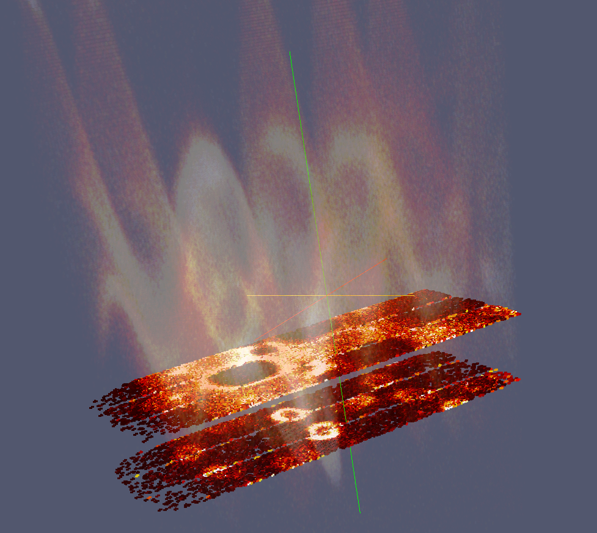
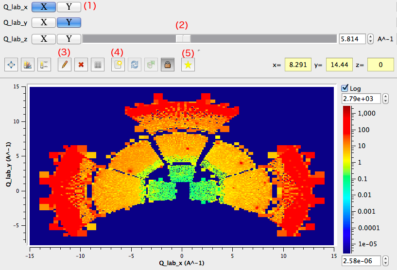
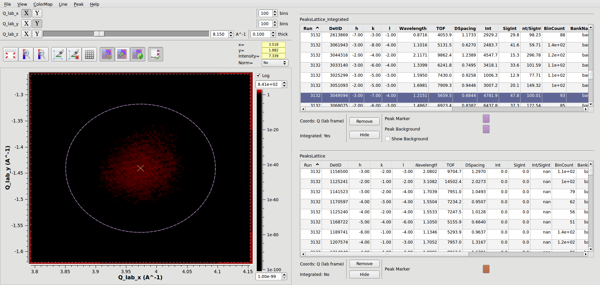

.. _train-MBC_MDVisualisation:

==========================
MD Workspace Visualisation
==========================

Creating Your Data
==================

The next section requires a dataset that is faster to create than :ref:`Load <algm-Load>`.

#. Click the View -> Script window menu.
#. In the script window click File->Open, and open the file
   "C:\\MantidInstall\\data\\CreateSXDNaClQLab.py"
#. Click the Execute -> Execute All menu.
#. After about 30 seconds you should have a SXDNaClQLab workspace.

**Note to Demonstrators:** You may want to do this during the preceding
exercise.

SliceViewer
===========

| |MBC_SliceViewer_Controls.png|
| The `SliceViewer <SliceViewer>`__ provides 2D slices through
  MDWorkspaces. It is designed to provide very fast, interactive
  projections on large datasets. The SliceViewer is also furnished with
  a number of 2D tools to aid further visualisation and analysis.

Features include:

-  `LineViewer <LineViewer>`__ for creating arbitrary 1D integrated cuts
   as separate workspaces
-  `PeaksViewer <PeaksViewer>`__ for over-plotting one or more
   :ref:`PeaksWorkspaces  <PeaksWorkspace>` in the Q coordinate frame
-  Control via python `SliceViewer Python
   Interface <SliceViewer_Python_Interface>`__
-  In-situ rebinning according to slice location
-  Zooming and panning control

Introduction to Feature Controls
--------------------------------

From the image above

Dimension Selection (1)
~~~~~~~~~~~~~~~~~~~~~~~

Allows you to choose which dimensions in the workspace are to be plotted
X and Y on the plot. All other dimensions are provided as sliders. Each
dimension has an **X** button and a **Y** button. Selecting one of these
will make this dimension either the X or Y of the plot.

Slice Point Selection (2)
~~~~~~~~~~~~~~~~~~~~~~~~~

| Sliders allow you to choose the slice location. The plot will
  immediately update to show a projection at the new slice location. N-2
  dimensions are represented with sliders.

Line Integration Mode (3)
~~~~~~~~~~~~~~~~~~~~~~~~~

.. image:: ../../images/SliceViewer_and_LineViewer.png
			:width: 500px
			:align: right

Selecting this button will allow you to draw a line on the current
slice. This will also open the *LineViewer* panel. The line can be
controlled in the following ways:

-  Start and end positions
-  Width in plane
-  Thickness (into plane)
-  Number of bins

The controls may be updated either graphically, for example by grabbing
the start position point and moving it with the left-click mouse option,
or by updating the coordinates in the *LineViewer* panel.

| Hitting the *Apply* button results in the generation of a new
  :ref:`Workspace <Workspace>` which is one-dimensional.

Dynamic Rebinning (4)
~~~~~~~~~~~~~~~~~~~~~

The slice viewer allows you to
interactively rebin the currently viewed slice to a regular grid. This
will also result in the generation of a new rebinned workspace in
Mantid.

+---------------------------------------------------------+-------------------------------------------------------+
| Original Data                                           | Dynamically Rebinned Data                             |
+=========================================================+=======================================================+
| .. image:: ../../images/SliceViewer_DynamicRebinOff.png | .. image:: ../../images/SliceViewer_DynamicRebinOn.png|
|              :width: 400px                              |              :width: 400px                            |
+---------------------------------------------------------+-------------------------------------------------------+

 
Peaks Viewer (5)
~~~~~~~~~~~~~~~~
 
|Peaks_view_outline_unannotated.png|

The *PeaksViewer* is a tool for Single Crystal Diffraction. It allows
you to overlay one or more PeaksWorkspaces over the :ref:`MDWorkspace <MDWorkspace>` to
which it belongs. PeaksWorkspaces are typically generated by running
algorithms, such as :ref:`FindPeaksMD  <algm-FindPeaksMD>`.

-  Slice through the :ref:`MDWorkspace <MDWorkspace>` and the PeaksWorkspaces simultaneously
   in the SliceViewer plot
-  Select peaks from the peaks list in the PeaksViewer, and cause the
   SliceViewer to zoom into that exact location on the plot
-  Show integration regions and optionally integration background
   regions
-  PeaksViewer auto selects the coordinates frame for the
   PeaksWorkspaces based on the :ref:`MDWorkspace <MDWorkspace>`
-  Sort the PeaksWorkspaces in-situ, for example by greatest intensity

Amongst other usages, this tool therefore allows you to inspect the
quality of the peak finding, or peak integration operations.

Example
-------

#. Run :ref:`Load <algm-Load>` on the :ref:`MDWorkspace <MDWorkspace>` file *SXDNaClQLab.nxs*
#. Run :ref:`Load <algm-Load>` on the :ref:`PeaksWorkspace <PeaksWorkspace>` file *peaks_qLab.nxs*
#. Right click the :ref:`MDWorkspace <MDWorkspace>` and select *Show Slice Viewer* option
#. Use the Slider to slice through the Qz dimension
#. Open the LineViewer and draw a line

Vates Simple Interface
======================

The `Vates Simple Interface <VatesSimpleInterface_v2>`__, or VSI provides full-blown 4D
visualisation capabilities. The VSI uses ParaView as the visualisation
engine.

| The VSI is only enabled if you have the correct version of ParaView
  installed on your computer. Instructions on how to do this are
  `here <Paraview_setup>`__ for windows. The current version of ParaView
  required is ParaView 3.98.1, which should be sourced from the Mantid
  download page `here <http://download.mantidproject.org/>`__.

Examples
========

Example 1
---------

#. Run :ref:`Load <algm-Load>` on the :ref:`MDWorkspace <MDWorkspace>` file *SXDNaClQLab.nxs*
#. Right click the :ref:`MDWorkspace <MDWorkspace>` and select *Show Vates Simple Interface*.
   The VSI should open showing a 3D representation of the :ref:`MDWorkspace <MDWorkspace>`

   |MantidPlot_VSI-v2_Menu.png|
#. Click the :ref:`Rebin <algm-Rebin>` button above the plot area
#. On the properties panel change the number of **Bins** property to 100
   for each dimension click the **Apply** button. The Workspace should
   now be rebinned to a regular 100\*100\*100 Grid

   .. image:: ../../images/MBC_VSI_Example1.png
			:width: 400px

Example 2
---------

#. Complete Example 1 if you haven't already and leave the VSI open
#. On the top menu select the '''MultiSlice '''
   |VSI-MultisliceButton.png| mode
#. The view should be empty. Cuts can be added by double-clicking on an
   axis scale between the axis scale line and the view area to place an
   indicator at that point and this adds the slice on the 3D view. Add a
   few cuts
#. Move the cut slice positions along the axis and observe the surface
   projections updating

   .. image:: ../../images/MBC_VSI_Example2.png
			:width: 400px

Example 3
---------

#. Follow steps 1-2 from Example 1.
#. On the top menu select the **ScatterPlot**
   |VSI-SplatterPlotButton.png| mode
#. Set the **Top Percentile** option on the Properties Tab to be *0.05*
#. Click *'Use Log :ref:`Scale <algm-Scale>`* at the top of the plot area
#. Without closing the VSI load the file **peaks_qLab.nxs** into
   MantidPlot, which produces a :ref:`PeaksWorkspace <PeaksWorkspace>`.
#. Load the :ref:`PeaksWorkspace <PeaksWorkspace>` into the VSI, by right-clicking the workspace
   and selecting *Show Vates Simple Interface*. You should now see peak
   positions as cross-hairs overlayed over the original :ref:`MDWorkspace <MDWorkspace>`
   data.

   .. image:: ../../images/MBC_VSI_Example3.png
			:width: 400px

.. |MantidPlot_VSI-v2_Menu.png| image:: ../../images/MantidPlot_VSI-v2_Menu.png

