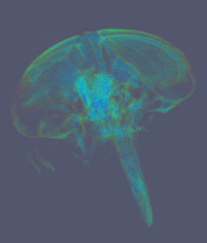

.. _train-MBC_MDWorkspaces:

=============
MD Workspaces
=============

Where multi-dimensional capabilities are required, Mantid provides a
relatively new set of :ref:`MDWorkspace <MDWorkspace>` (multi-dimensional workspace) types.
MDWorkspaces come in two forms :ref:`MDEventWorkspaces <MDWorkspace>`,
which are analogous to :ref:`EventWorkspaces  <EventWorkspace>` and the
:ref:`MDHistoWorkspace  <MDHistoWorkspace>`, which is analogous to the
:ref:`Workspace2D  <Workspace2D>`.

MDEventWorkspaces
=================

These carry the transformed observed events, organised into a tree image
structure. The name of this workspace type is a little misleading, as
the source data does not necessarily have to come from an
EventsWorkspace. |MDWorkspace_structure.png|

MDHistoWorkspaces
=================

:ref:`MDHistoWorkspaces  <MDHistoWorkspace>` store regularly binned
multi-dimensional data. These are image-only.

Creating MDWorkspaces
=====================

:ref:`ConvertToMD  <algm-ConvertToMD>` is an umbrella algorithm that provides a
large number of conversions. The details of all the available options
are outside the scope of this course.

Below is an example of the generation of a 4D :ref:`MDWorkspace <MDWorkspace>` from a direct
run on CNCS.

-  Run :ref:`Load <algm-Load>` with **Filename** *CNCS_7860_event.nxs*
-  Run :ref:`AddSampleLog <algm-AddSampleLog>` with **LogName**\ =\ *Ei*, **LogText**\ =\ *3*,
   **LogType**\ =\ *Number*
-  Run :ref:`SetUB <algm-SetUB>` with **a, b and c** = *1.4165*, **u**\ =\ *[1,0,0]*,
   **v**\ =\ *[0,1,0]*
-  Run :ref:`SetGoniometer <algm-SetGoniometer>` with **Axis0**\ =\ *Psi,0,1,0,1*
-  Now Run :ref:`ConvertToMD <algm-ConvertToMD>` with **QDimensions**\ =\ *Q3D*,
   **QConversionScales**\ =\ *HKL*, **dEAnalysisMode**\ =\ *Direct*,
   **MinValues**\ =\ *[-3,-3,-3,-1]*, **MaxValues**\ =\ *[3,3,3,3]*

or run the following ...

.. code:: python

	ws = Load(Filename='CNCS_7860_event')
	AddSampleLog(Workspace=ws,LogName='Ei',LogText='3.0',LogType='Number')
	SetUB(Workspace=ws,a='1.4165',b='1.4165',c='1.4165',u=[1,0,0],v=[0,1,0])
	AddSampleLog(Workspace=ws,LogName='Psi',LogText='0.0', LogType='Number')
	x = ws.getRun().getLogData('Psi')
	SetGoniometer(Workspace=ws,Axis0='Psi,0,1,0,1')
	mdws = ConvertToMD(InputWorkspace=ws,QDimensions='Q3D',QConversionScales='HKL', dEAnalysisMode='Direct',MinValues=[-3,-3,-3,-1],MaxValues=[3,3,3,3])
	plotSlice(mdws, xydim=["[H,0,0]","[0,K,0]"], slicepoint=[0,0], colorscalelog=True )

Other sources
-------------

MDWorkspaces need not be in **Q** at all. Below is an example of image
data ported into an :ref:`MDEventWorkspace <MDWorkspace>`, where coordinates are in
real-space.

|Fly.png|

.. |MDWorkspace_structure.png| image:: ../../images/MDWorkspace_structure.png

