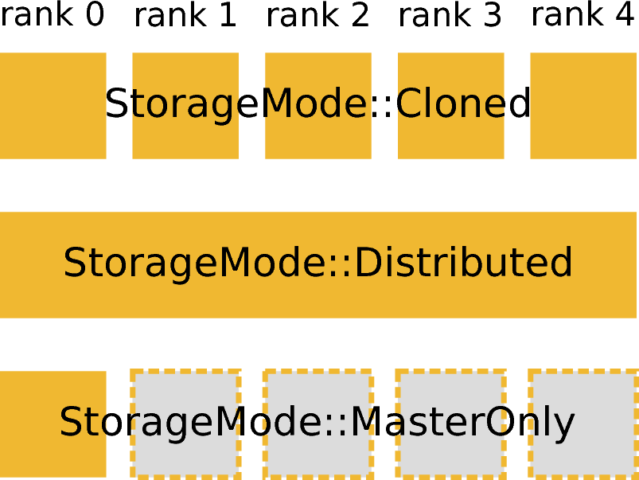
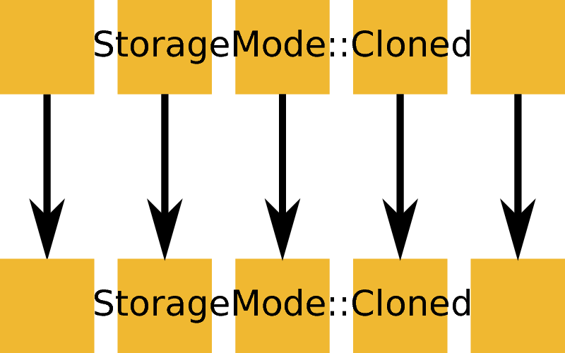
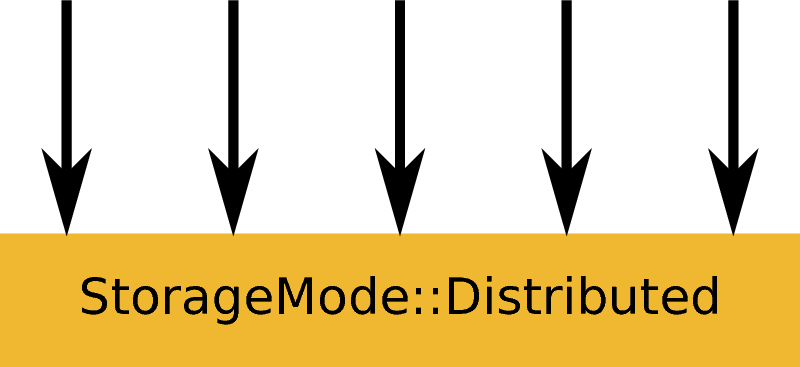
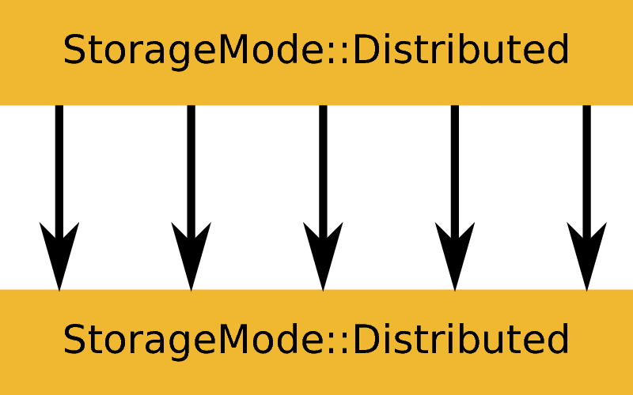
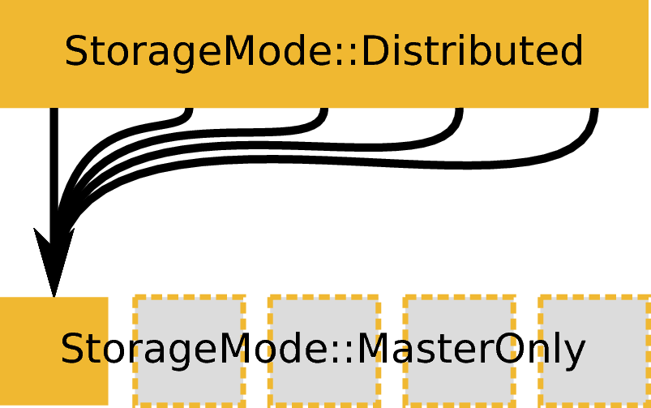
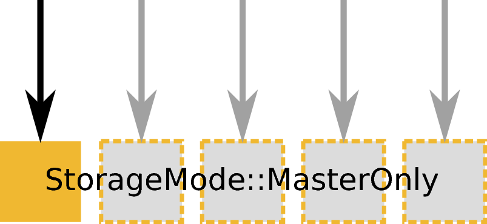
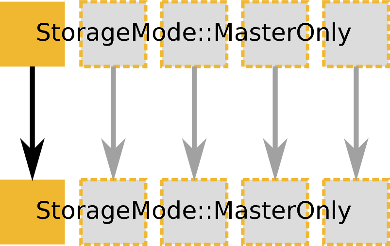
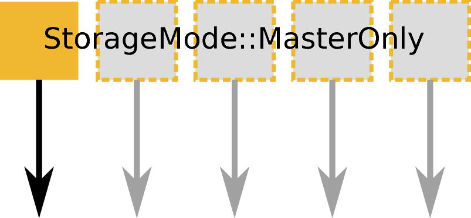

.. _AlgorithmMPISupport:

==========================
MPI Support for Algorithms
==========================

.. contents::
  :local:

Concept
#######

Introduction
------------

MPI support in Mantid is based on processing a subset of spectra on each MPI rank.
Many algorithms process each spectrum independently so this is an efficient way of splitting the computational effort and data volume.

Note that the multi-dimensional workspaces ``MDHistoWorkspace`` and ``MDEventWorkspace`` handle data differently and thus cannot be dealt with in this way.
MPI support for these multi-dimensional workspaces is beyond the scope of this document.

Spectrum and Detector
---------------------

In Mantid the terms spectrum and detector are used interchangeably at times, leading to confusion.
In particular, it is sometimes assumed that there is a 1:1 correspondence between spectra and detectors.
It is important to clearly distinguish between a spectrum and a detector, especially in the context of MPI support.
We may define the terms as follows:

- A **detector** is a single pixel of the instrument. Data obtained from it may be used to create a list or histogram of neutron events. If the detector can move, it can contribute to more than one list or histogram of neutron events.
- A **spectrum** is a list or histogram of neutron events collected in a specific region of (typically) space. The data contained in the spectrum is data obtained from on one or more detectors.

Examples may help to clarify this:

- If the detectors are not moveable, a 1:1 mapping is the most common.
- Some beamlines at ISIS group multiple detectors into a single spectrum, so the region of space corresponding to a spectrum is larger than a single detector pixel.
- After running algorithms like ``SumSpectra`` or ``DiffractionFocussing``, a spectrum will contain data from more than one detector, even if there was an initial 1:1 correspondence.
- If the detectors are moveable, a spectrum would correspond to a region of space given by the position a specific detector had in a certain time interval.
- There can be detectors without a corresponding spectrum, and Mantid is thus not handling data of those detectors.

For the purpose of MPI support, Mantid always stores the complete instrument including **all detectors** on **every MPI rank**. [#split-instrument]_
Only a subset of all spectra is stored on the local MPI rank, so a detector may be locally without corresponding spectrum but have a spectrum associated to it on another MPI rank.

Storage Mode
------------

   Visualization of available storage modes. In this and the following figures a vertical column is used to depict an MPI rank.

Not all data in an MPI-based data reduction can be or has to be distributed.
Some data may be present on all ranks or only on a single rank.
To formalize this concept a ``Workspace`` in Mantid now has an associated storage mode (``Parallel::StorageMode``), as visualized in the figure on the right.
The storage mode of a workspace can be obtained by calling ``Workspace::storageMode()``.
There are three available storage modes

- ``StorageMode::Cloned`` implies that the data is not split and each rank holds a complete and identical clone.
- ``StorageMode::Distributed`` implies that each rank holds a subset of the data and that the combination of all subsets gives the full data.
- ``StorageMode::MasterOnly`` implies that only the master rank (rank 0) has the data.

Currently only workspaces have an associated storage mode.
For all other data, such as a scalar value provided as an input to an algorithm are implicitly assumed to have ``StorageMode::Cloned``, i.e., have the same value on all MPI ranks.

Usage examples for the storage modes could include:

- A workspace containing the neutron monitors could be used for normalization on all ranks and could use ``StorageMode::Cloned``.
- A workspace containing the data for all detector pixels would usually use ``StorageMode::Distributed``.
- A workspace containing the result of summing all spectra, such as obtained from ``DiffractionFocussing`` would usually use ``StorageMode::MasterOnly``.

Execution Mode
--------------

   ``ExecutionMode::Identical`` based on an input and output workspace with ``StorageMode::Cloned``. Example: ``ConvertUnits``, ``Rebin``, or many other algorithm that do not load or save data.

   ``ExecutionMode::Distributed`` creating an output workspace with ``StorageMode::Distributed``. Example: ``LoadEventNexus``.

   ``ExecutionMode::Distributed`` based on an input and output workspace with ``StorageMode::MasterOnly``. Example: ``ConvertUnits`` or ``Rebin``.

   ``ExecutionMode::Distributed`` based on an input workspace with ``StorageMode::Distributed`` creating an output workspace with ``StorageMode::MasterOnly``. Example: ``DiffractionFocussing``.

   ``ExecutionMode::MasterOnly`` creating an output workspace with ``StorageMode::Distributed``. Example: ``LoadEventNexus`` or other load algorithms.

   ``ExecutionMode::MasterOnly`` based on an input and output workspace with ``StorageMode::MasterOnly``. Example: ``ConvertUnits``, ``Rebin``, or many other algorithm that do not load or save data.

   ``ExecutionMode::MasterOnly`` based on an input workspace with ``StorageMode::MasterOnly`` an no output. Example: ``Save`` or any other save algorithm.

Just like the storage mode describes how data is stored, and execution mode describes how an algorithm is executed on this data.
There are five execution modes (in namespace ``Parallel``):

- ``ExecutionMode::Invalid`` is used to indicate that execution is not possible, e.g., if the storage modes of the inputs are inconsistent.
- ``ExecutionMode::Serial`` is used for serial execution, i.e., in non-MPI builds of Mantid or if there is only a single MPI rank. Having this mode allows for running algorithms that do not support MPI in MPI builds by running only with a single MPI rank.
- ``ExecutionMode::Identical`` is used for running an algorithm in an identical way on all MPI ranks. This would typically be used if the input workspaces have ``StorageMode::Cloned``.
- ``ExecutionMode::Distributed`` is used for running an algorithm in a distributed way across all MPI ranks. This would typically be used if the input workspaces have ``StorageMode::Distributed``.
- ``ExecutionMode::MasterOnly`` is typically used for running an algorithm if the input workspaces have ``StorageMode::MasterOnly``.

The use of the word 'typically' above is intentional and indicates that there may be other cases.
In particular, an algorithm may cause a transition from one storage mode to another, or may take inputs with different storage modes.
Examples are given in the series of figures on the right.

Building and Running Mantid with MPI Support
############################################

Build with MPI support
----------------------

To build Mantid with MPI support as described in this document run ``cmake`` with the additional option ``-DMPI_EXPERIMENTAL=ON``.
This requires ``boost-mpi`` and a working MPI installation.

Configuration
-------------

To avoid unintentional DDOSing or potential other issues, there is no MPI support for ``DownloadInstrument`` and ``CheckMantidVersion``.
Error messages can be avoided by disabling these startup checks in the configuration.
Furthermore, to avoid pollution of usage reports, usage reporting should be disabled:

.. code-block:: sh

  UpdateInstrumentDefinitions.OnStartup = 0
  CheckMantidVersion.OnStartup = 0
  usagereports.enabled = 0

Writing and running Python scripts
----------------------------------

In principle Python scripts that use only algorithms that support MPI can be run with MPI **without changes**.
For example:

.. code-block:: python

  from mantid.simpleapi import *

  dataX = [1,2,3,4,2,3,4,5,3,4,5,6,4,5,6,7]
  dataY = [1,1,1,1,1,1,1,1,1,1,1,1]
  dataE = [1,1,1,1,1,1,1,1,1,1,1,1]

  # CreateWorkspace has a new property called ParallelStorageMode that allows setting the
  # desired storage mode. It defaults to "Parallel::StorageMode::Cloned".
  dataWS = CreateWorkspace(DataX=dataX, DataY=dataY, DataE=dataE, NSpec=4, UnitX="Wavelength", ParallelStorageMode="Parallel::StorageMode::Distributed")
  ws = Rebin(dataWS, "1,1,7");

  print("Histograms: " + str(ws.getNumberHistograms()))
  for i in range(ws.getNumberHistograms()):
      print("(Local) workspace index: " + str(i))
      print(ws.readX(i))
      print(ws.readY(i))

Run Python with ``mpirun`` and the desired number of MPI ranks, by using the new ``-n`` flag to ``mantidpython``:

.. code-block:: sh

  mantidpython -n 3 test.py

Possible output:

.. code-block:: sh

  CreateWorkspace-[Notice] CreateWorkspace started
  CreateWorkspace-[Notice] CreateWorkspace successful, Duration 0.02 seconds
  Rebin-[Notice] Rebin started
  Rebin-[Notice] Rebin successful, Duration 0.01 seconds
  Histograms: 2
  (Local) workspace index: 0
  [ 1.  2.  3.  4.  5.  6.  7.]
  [ 1.  1.  1.  0.  0.  0.]
  (Local) workspace index: 1
  [ 1.  2.  3.  4.  5.  6.  7.]
  [ 0.  0.  0.  1.  1.  1.]
  Histograms: 1
  (Local) workspace index: 0
  [ 1.  2.  3.  4.  5.  6.  7.]
  [ 0.  1.  1.  1.  0.  0.]
  Histograms: 1
  (Local) workspace index: 0
  [ 1.  2.  3.  4.  5.  6.  7.]
  [ 0.  0.  1.  1.  1.  0.]

Output involving the local number of histograms and local indices is obviously not useful for users and should be avoided (see also the section on workspace indices), this example is merely for illustration.

Note that currently Mantid does not support workspaces without spectra, so running above example with more than four MPI ranks fill fail since there are only four spectra.
This is probably not a problem in practice.

Logging output
--------------

With many MPI ranks it is common to get spammed by logging output.
Since there is not control of output order for multi-line log messages it also tends to become hard to read since output from different ranks get interleaved.

The current solution to this is a logging offset for all but the master rank.
By default an offset of 1 is added, i.e., an error message from any rank but rank 0 will be displayed as a warning.
The offset can be adjusted in the Mantid properties file, e.g.,

.. code-block:: sh

  mpi.loggingOffset=3

The drawback of this approach is that information contained in error or warning messages that are specific to a spectrum, such as a missing detector ID, can be hidden or lost.
If that is an issue the logging offset can simply be set to 0.

Implementing MPI Support for an Algorithm
#########################################

Supported workspace types
-------------------------

Only ``MatrixWorkspace`` and its subclasses support ``StorageMode::Distributed``.
All other workspace types, in particular ``TableWorkspace`` and ``MDWorkspace`` are restricted to ``StorageMode::MasterOnly`` and ``StorageMode::Cloned``.

Mechanism
---------

By default an algorithm does not support MPI and any attempt to execute it in an MPI run will throw an exception.
MPI support for an algorithm is implemented by means of a couple of virtual methods in the ``Algorithm`` base class:

.. code-block:: c++

  class Algorithm {
    // ...
  protected:
    virtual void execDistributed();
    virtual void execMasterOnly();
    virtual Parallel::ExecutionMode getParallelExecutionMode(
        const std::map<std::string, Parallel::StorageMode> &storageModes) const;
    // ...
  };

In general it is **not** necessary to implement all of these methods.
For many algorithms it can be sufficient to implement ``getParallelExecutionMode``.
This is often the case if an algorithm has only a single input and a single output and treats all spectra independently.
In that case the execution mode can simply be determined from the input workspace as follows:

.. code-block:: c++

  Parallel::ExecutionMode MyAlg::getParallelExecutionMode(
      const std::map<std::string, Parallel::StorageMode> &storageModes) const {
    // The map key is the property name. If there is only one input workspace it can usually be ignored.
    return Parallel::getCorrespondingExecutionMode(storageModes.begin()->second);
  }

Here the helper ``Parallel::getCorrespondingExecutionMode`` is used to obtain the 'natural' execution mode from a storage mode, i.e., ``ExecutionMode::Identical`` for ``StorageMode::Cloned``, ``ExecutionMode::Distributed`` for ``StorageMode::Distributed``, and ``ExecutionMode::MasterOnly`` for ``StorageMode::MasterOnly``.
More complex algorithms may require more complex decision mechanism, e.g., when there is more than one input workspace.

For many algorithms a sufficient default implementation of ``Algorithm::getParallelExecutionMode()`` is provided by one of the base classes ``API::SerialAlgorithm``, ``API::ParallelAlgorithm``, or ``API::DistributedAlgorithm``.
MPI support can simply be enabled by inheriting from one of these instead of from ``Algorithm``.
The level of thereby enabled MPI support is as follows:

- ``API::SerialAlgorithm`` supports only ``ExecutionMode::MasterOnly``.
- ``API::ParallelAlgorithm`` supports parallel execution, but not distributed execution, i.e., ``ExecutionMode::MasterOnly`` and  ``ExecutionMode::IdenticalOnly``.
- ``API::DistributedAlgorithm`` supports distributed execution, i.e., ``ExecutionMode::MasterOnly``, ``ExecutionMode::IdenticalOnly``, and  ``ExecutionMode::Distributed``.

In the latter two cases more than one execution mode is supported.
Thus this usually works only for algorithms with a single input (and a single output) such that the execution mode can be uniquely derived from the storage mode of the input workpace.
Multiple inputs are also supported to a certain extent. For example, for ``API::DistributedAlgorithm`` the storage modes of the inputs can be mixed if they are compatible, such as ``StorageMode::Distributed`` with ``StorageMode::Cloned`` (resulting in ``ExecutionMode::Distributed``).

If none of the other virtual methods listed above is implemented, ``Algorithm`` will run the normal ``exec()`` method on all MPI ranks.
The exception are non-master ranks if the execution mode is ``ExecutionMode::MasterOnly`` -- in that case creating a dummy workspace is attempted.
This is discussed in more detail in the subsections below.

Identical execution
-------------------

Identical execution with execution mode ``ExecutionMode::Identical`` is usually done for data with storage mode ``StorageMode::Cloned``.
Execution is handled by simply calling ``Algorithm::exec()`` on all MPI ranks.

A notable exception that has to be kept in mind are algorithms that are saving workspaces or write to other resources, since the file names will be in conflict.

Distributed execution
---------------------

Distributed execution is handled by ``Algorithm::execDistributed()``.
By default this simply calls ``Algorithm::exec()``.
In many cases this may be perfectly fine and more convenient than reimplementing ``Algorithm::execDistributed()``.

The following example illustrates the difference.
We can either check for the number of MPI ranks in the normal ``exec()`` method:

.. code-block:: c++

  void MyAlg::exec() {
    //// Algorithm logics, e.g., a sum over all spectra ////
    if (communicator.size() > 1) {
      //// MPI calls, e.g., a global sum ////
    }
  }

Alternatively, we can implement ``Algorithm::execDistributed()``:

.. code-block:: c++

  void MyAlg::exec() {
    //// Algorithm logics ////
  }

  void MyAlg::execDistributed() {
    //// Algorithm logics but in a very different way ////
  }

Many algorithms in Mantid will require very little modification for MPI support and thus the first option is likely to be the first choice.

Master-only execution
---------------------

Master-only execution is handled by ``Algorithm::execMasterOnly()``.
By default this simply calls ``Algorithm::exec()`` on rank 0 and does nothing on all other ranks.

To support running existing Python scripts without significant modification, and to be able to automatically determine execution modes based on input workspaces, workspaces with storage mode ``StorageMode::MasterOnly`` also exist on the non-master ranks.

Given that no algorithm execution happens on non-master ranks, workspaces with ``StorageMode::MasterOnly`` do not exist on non-master ranks.
This implies:
- No methods of such a workspace can be called, except when wrapped in an algorithm that has ``ExecutionMode::MasterOnly``.
- Retrieving such a workspace from the AnalysisDataService is not possible.
- Algorithms that transform a workspace into a workspace with ``StorageMode::MasterOnly`` such as ``DiffractionFocussing2`` should delete the input workspace when using in-place operation.

Setting spectrum numbers
------------------------

Setting spectrum numbers via the legacy interface ``MatrixWorkspace::getSpectrum(size_t)::setSpectrumNo(specnum_t)`` is not supported in MPI runs and will throw an exception.
The reason is that spectrum numbers are used to globally identify a spectrum and thus changing a spectrum number must be done globally, i.e., on all MPI ranks.
Spectrum numbers should be set by using ``Indexing::IndexInfo`` and ``MatrixWorkspace::setIndexInfo()``, or rather by passing the ``IndexInfo`` to one of the workspace factory functions from ``DataObjects/WorkspaceCreation.h``.

Workspace indices
-----------------

If a workspace is distributed, i.e., has storage mode ``StorageMode::Distributed`` workspaces indices lose their meaning.
In particular, ``MatrixWorkspace::getNumberHistograms()`` will return the local number of spectra and not the global size of the workspace.
For purposes of interaction with the user interface and for internal consistency a global equivalent of the 'workspace index' concept has been introduced.
This index is represented by ``Indexing::GlobalSpectrumIndex``. [#spectrum-index]_

The consequences are as follows:

- Workspace indices should not be logged or written into output of other types such as tables. Instead spectrum numbers (``Indexing::SpectrumNumber``) or global spectrum indices (``Indexing::GlobalSpectrumIndex``) must be used.
- The number of histograms in a workspace obtained from ``MatrixWorkspace::getNumberHistograms()`` may only be used for processing all spectra, i.e., when each MPI rank is processing all its local spectra.
  It should not be logged, written as output, or used for branching execution paths since it is meaningless.
  If the total number of spectra in a workspace is required it can be accessed via ``MatrixWorkspace::indexInfo()::globalSize()``.
- User input providing indices or spectrum numbers in one way or another must be translated into local indices by ``IndexInfo``.
  The most common cases are a workspace property that also accepts indices, see :ref:`IndexProperty <IndexProperty>`.
- The distinction between local and global indices must not be exposed to the user.
  In particular, the 'global' prefix should be omitted, i.e., for the user interface we keep referring to 'workspace index', even though it is internally not what used to be the workspace index but rather a global index.
  Indices provided by a user may never be interpreted as local indices, since a local index has no fixed meaning.

Instrument and detectors
------------------------

As described above, the full set of detectors is held on each MPI rank.
Thus, algorithms that modify detectors must do so **in an identical** manner on all MPI ranks.
That is, if for example detector positions would be modified in an Algorithm it is **not** sufficient to do so for all detectors that have a corresponding spectrum on the MPI rank.
Instead such a modification must be done for all detectors.

The details of this depend on what exactly an algorithm is supposed to do and a generic recipe cannot be given here.
It is however essential to think of this when providing MPI support for an algorithm.

GUI
---

Running the Mantid GUI with MPI support, such as a client GUI with a MPI-based backend, is currently not possible.
If it cannot be avoided to add an MPI-related property to an algorithm is shall be made invisible in the GUI.
This can be done by adjusting the property settings when implementing ``Algorithm::init()``:

.. code-block:: c++

  #include "MantidKernel/InvisibleProperty.h"

  void MyAlg::init() {
    // ...
    setPropertySettings("MyProperty", std::make_unique<InvisibleProperty>());
  }

Units Tests
-----------

For unit testing the MPI support of an algorithm a fake backend that can be run without MPI is provided.
No modifications to the code under test a required.
In the unit test case ``ParallelRunner`` from ``MantidTestHelpers`` is used to run the algorithm (or other code) under test as if it were part of on MPI run.
A typical example could look as follows:

.. code-block:: c++
  :linenos:

  #include "MantidTestHelpers/ParallelAlgorithmCreation.h"
  #include "MantidTestHelpers/ParallelRunner.h"

  namespace {
  void run_algorithm(const Parallel::Communicator &comm,
                     const MyType1 &arbitrary, const MyType2 &arguments) {
    // Creating the algorithm with this helper function is the recommended way,
    // otherwise the communicator has to be set by hand and the name of the
    // output workspace must be set to a different value depending on comm.rank()
    // to avoid clashes, since the threading backend in ParallelRunner shares the
    // ADS for all 'ranks'.
    auto alg = ParallelTestHelpers::create<Mantid::Algorithms::MyAlg>(comm);
    alg->setProperty("InputWorkspace", boost::make_shared<WorkspaceTester>());
    alg->execute();
    Workspace_const_sptr ws = alg->getProperty("OutputWorkspace");
    TS_ASSERT_EQUALS(ws->storageMode(), Parallel::StorageMode::Distributed);
  }

  class MyAlgTest : public CxxTest::TestSuite {
  public:
    // ...

    void test_parallel() {
      // Runs run_algorithm in multiple threads. The first argument passed to
      // run_algorithm is of type Parallel::Communicator and is guaranteed to
      // have size() > 1, i.e., more than one rank, in at least one call to
      // run_algorithm (it is in addition also called with a single 'rank').
      ParallelTestHelpers::runParallel(run_algorithm, 42, 42.0);
    }
  };

Here ``MantidTestHelpers/ParallelAlgorithmCreation.h`` provides the algorithm factory method ``ParallelTestHelpers::create<WorkspaceType>``.
``MantidTestHelpers/ParallelRunner.h`` provides ``ParallelTestHelpers::runParallel``, which uses ``ParallelRunner`` with a reasonable default choice for the number of ranks.

Documentation
-------------

When adding MPI support for an algorithm, add it to the table at the end of this document.
Potential limitations must be described in the comments.

Porting Python reduction scripts in practice
--------------------------------------------

The mechanism of execution modes and storage modes allows for "guided" porting of algorithms as follows:

1. Run Python script such as a system test with two (or more) MPI ranks.
2. At some point an algorithm without any MPI support or inadequate MPI support may be encountered, resulting in an error message similar to this:

  .. code-block:: none

    MyAlg-[Error] Error in execution of algorithm MyAlg:
    MyAlg-[Error] Algorithm does not support execution with input workspaces of the following storage types:
    MyAlg-[Error] InputWorkspace Parallel::StorageMode::Distributed
    MyAlg-[Error] InputWorkspaceMonitor Parallel::StorageMode::Cloned
    MyAlg-[Error] .

3. Add the required MPI support to ``MyAlg`` with one of the mechanisms described above. In rare cases the combination of storage modes of the inputs may be unexpected, indicating an error earlier in the chain which needs to be fixed.
4. Go to 1., until the script finishes successfully.

Supported Algorithms
####################

====================================== ======================= ========
Algorithm                              Supported modes         Comments
====================================== ======================= ========
AlignAndFocusPowder                    all
AlignAndFocusPowderFromFiles           Distributed
AlignDetectors                         all                     with ``StorageMode::Distributed`` this touches only detectors that have spectra on this rank, i.e., the modified instrument is not in an identical state on all ranks
BinaryOperation                        all                     not supported if ``AllowDifferentNumberSpectra`` is enabled
CalculateChiSquared                    MasterOnly, Identical   see ``IFittingAlgorithm``
CalculateCostFunction                  MasterOnly, Identical   see ``IFittingAlgorithm``
CalculateFlatBackground                MasterOnly, Identical
CalculateTransmission                  MasterOnly, Identical
CloneWorkspace                         all
Comment                                all
CompareWorkspace                       MasterOnly, Identical   if one input has ``StorageMode::Cloned`` and the other has ``StorageMode::MasterOnly`` then ``ExecutionMode::MasterOnly`` is used, with ``ExecutionMode::MasterOnly`` the workspaces always compare equal on non-master ranks
CompressEvents                         all
ConvertDiffCal                         MasterOnly, Identical
ConvertToHistogram                     all
ConvertToPointData                     all
ConvertUnits                           all                     ``AlignBins`` not supported; for indirect energy mode the number of resulting bins is in general inconsistent across MPI ranks
CopyInstrumentParameters               all
CreateSingleValuedWorkspace            Identical               ``OutputWorkspace`` has ``StorageMode::Cloned``, support of ``MasterOnly`` would require adding property for selecting the mode
CreateWorkspace                        all
CropToComponent                        all
CropWorkspace                          all                     see ``ExtractSpectra`` regarding X cropping
DeleteWorkspace                        all
DetermineChunking                      MasterOnly, Identical
Divide                                 all                     see ``BinaryOperation``
EstimateFitParameters                  MasterOnly, Identical   see ``IFittingAlgorithm``
EvaluateFunction                       MasterOnly, Identical   see ``IFittingAlgorithm``
ExponentialCorrection                  all                     see ``UnaryOperation``
ExtractSingleSpectrum                  all                     in practice ``ExecutionMode::Distributed`` not supported due to current nonzero-spectrum-count limitation
ExtractSpectra2                        all                     currently not available via algorithm factory or Python
ExtractSpectra                         all                     not supported with ``DetectorList``, cropping in X may exhibit inconsistent behavior in case spectra have common boundaries within some ranks but not within all ranks or across ranks
FFTSmooth2                             MasterOnly, Identical
FilterBadPulses                        all
FilterByLogValue                       all
FilterByTime                           all
FilterEventsByLogValuePreNexus         Identical               see ``IFileLoader``
FindDetectorsInShape                   all
FindPeakBackground                     MasterOnly, Identical
FindPeaks                              MasterOnly, Identical
Fit                                    MasterOnly, Identical   see ``IFittingAlgorithm``
GeneratePythonScript                   MasterOnly
GroupWorkspaces                        all                     grouping workspaces with mixed ``StorageMode`` is not supported
IFileLoader                            Identical               implicitly adds support for many load-algorithms inheriting from this
IFittingAlgorithm                      MasterOnly, Identical   implicitly adds support for several fit-algorithms inheriting from this
Load                                   all                     actual supported mode is dictated by underlying load algorithm, which depends on file type
LoadAscii2                             Identical               see ``IFileLoader``
LoadAscii                              Identical               see ``IFileLoader``
LoadBBY                                Identical               see ``IFileLoader``
LoadCalFile                            Identical
LoadCanSAS1D                           Identical               see ``IFileLoader``
LoadDaveGrp                            Identical               see ``IFileLoader``
LoadDiffCal                            Identical
LoadEmptyInstrument                    Identical               see ``IFileLoader``
LoadEventAndCompress                   Distributed
LoadEventNexus                         Distributed             storage mode of output cannot be changed via a parameter currently, min and max bin boundary are not globally the same
LoadEventPreNexus2                     Identical               see ``IFileLoader``
LoadFITS                               Identical               see ``IFileLoader``
LoadGSS                                Identical               see ``IFileLoader``
LoadILLDiffraction                     Identical               see ``IFileLoader``
LoadILLIndirect2                       Identical               see ``IFileLoader``
LoadILLReflectometry                   Identical               see ``IFileLoader``
LoadILLSANS                            Identical               see ``IFileLoader``
LoadILLTOF2                            Identical               see ``IFileLoader``
LoadInstrument                         all
LoadIsawPeaks                          Identical               see ``IFileLoader``
LoadISISNexus2                         Identical               see ``IFileLoader``
LoadLLB                                Identical               see ``IFileLoader``
LoadMask                               Identical
LoadMcStas                             Identical               see ``IFileLoader``
LoadMcStasNexus                        Identical               see ``IFileLoader``
LoadMD                                 Identical               see ``IFileLoader``
LoadMLZ                                Identical               see ``IFileLoader``
LoadMuonNexus                          Identical               see ``IFileLoader``
LoadNexusLogs                          all
LoadNexusMonitors2                     Identical
LoadNexusProcessed                     Identical               see ``IFileLoader``
LoadNXcanSAS                           Identical               see ``IFileLoader``
LoadNXSPE                              Identical               see ``IFileLoader``
LoadParameterFile                      all                     segfaults when used in unit tests with MPI threading backend due to `#9365 <https://github.com/mantidproject/mantid/issues/9365>`_, normal use should be ok
LoadPDFgetNFile                        Identical               see ``IFileLoader``
LoadPreNexus                           Identical               see ``IFileLoader``
LoadQKK                                Identical               see ``IFileLoader``
LoadRawHelper                          Identical               see ``IFileLoader``
LoadRKH                                Identical               see ``IFileLoader``
LoadSassena                            Identical               see ``IFileLoader``
LoadSESANS                             Identical               see ``IFileLoader``
LoadSINQFocus                          Identical               see ``IFileLoader``
LoadSNSspec                            Identical               see ``IFileLoader``
LoadSPE                                Identical               see ``IFileLoader``
LoadSpice2D                            Identical               see ``IFileLoader``
LoadSQW2                               Identical               see ``IFileLoader``
LoadSQW                                Identical               see ``IFileLoader``
LoadSwans                              Identical               see ``IFileLoader``
LoadTBL                                Identical               see ``IFileLoader``
LoadTOFRawNexus                        Identical               see ``IFileLoader``
Logarithm                              all                     see ``UnaryOperation``
MaskBins                               all
MaskDetectorsInShape                   all
MaskSpectra                            all
Minus                                  all                     see ``BinaryOperation``
MoveInstrumentComponent                all
MultipleScatteringCylinderAbsorption   all
Multiply                               all                     see ``BinaryOperation``
NormaliseByCurrent                     all
OneMinusExponentialCor                 all                     see ``UnaryOperation``
PDDetermineCharacterizations           all
PDLoadCharacterizations                Identical
Plus                                   all                     see ``BinaryOperation``
PoissonErrors                          all                     see ``BinaryOperation``
PolynomialCorrection                   all                     see ``UnaryOperation``
Q1D2                                   all                     not all optional normalization inputs are supported
Power                                  all                     see ``UnaryOperation``
PowerLawCorrection                     all                     see ``UnaryOperation``
RealFFT                                MasterOnly, Identical
Rebin                                  all
RebinToWorkspace                       all                     ``WorkspaceToMatch`` must have ``StorageMode::Cloned``
RemoveLowResTOF                        all
RemovePromptPulse                      all
RenameWorkspace                        all
ReplaceSpecialValues                   all                     see ``UnaryOperation``
RotateInstrumentComponent              all
SANSCalculateTransmission              MasterOnly, Identical
SANSConvertToQ                         all
SANSConvertToWavelength                all
SANSConvertToWavelengthAndRebin        all
SANSCreateAdjustmentWorkspaces         all
SANSCreateWavelengthAndPixelAdjustment MasterOnly, Identical
SANSCrop                               all
SANSFitShiftScale                      MasterOnly, Identical
SANSLoad                               MasterOnly, Identical   child algorithms may actually be run with ``ExecutionMode::Distributed`` if that is their default
SANSMaskWorkspace                      all
SANSMove                               all
SANSNormalizeToMonitor                 MasterOnly, Identical
SANSReductionCore                      all
SANSScale                              all
SANSSingleReduction                    all
SANSSliceEvent                         all
SANSStitch                             MasterOnly, Identical
SaveFocusedXYE                         MasterOnly
SaveGSS                                MasterOnly
SaveNexus                              MasterOnly
SaveNexusProcessed                     MasterOnly
Scale                                  all
SetSampleMaterial                      all
SetUncertainties                       MasterOnly, Identical
SignalOverError                        all                     see ``UnaryOperation``
SNSPowderReduction                     Distributed
SortEvents                             all
SortTableWorkspace                     MasterOnly, Identical
StripPeaks                             MasterOnly, Identical
StripVanadiumPeaks2                    MasterOnly, Identical
SumSpectra                             MasterOnly, Identical
UnaryOperation                         all
WeightedMean                           all                     see ``BinaryOperation``
====================================== ======================= ========

Currently none of the above algorithms works with ``StorageMode::Distributed`` in case there are zero spectra on any rank.

.. rubric:: Footnotes

.. [#split-instrument] The complexity and overhead of splitting the instrument, in particular given the overhead ensuing from handling all cases exemplified above, led to the decision split only the neutron data based on spectra, but not detectors.

.. [#spectrum-index] Some will argue that this should be ``GlobalWorkspaceIndex``.
  However it is not an index of a workspace so the term ``GlobalSpectrumIndex`` has been chosen for clarity.
  On the user interface side this will still be named 'workspace index', dropping the 'global' since the distinction between global and local indices is irrelevant for users.
