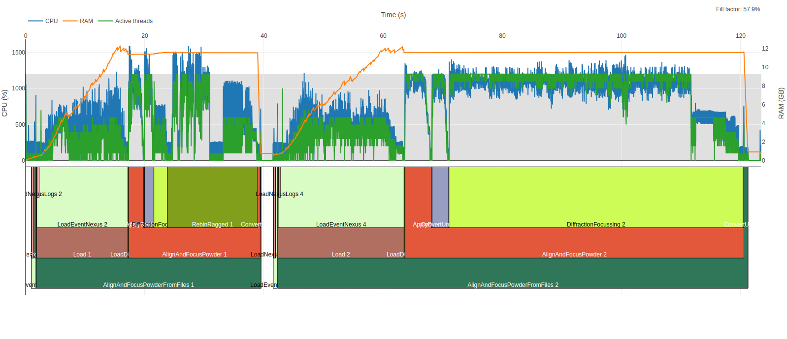

.. _AlgorithmProfiler:

==============================
Work flows algorithm profiling
==============================

.. contents:: Contents
   :local:

Summary
^^^^^^^

Due to the need of investigation of algorithms performance issues, the proper method is introduced.
It consists two to parts: special mantid build and analytical tool.

.. note::
   Available for Linux only.

Mantid build
^^^^^^^^^^^^

On linux the profiler is built by default but to enable profiling, the :ref:`properties <mantd:Algorithm_Profiling>` must be set.
Enabling the profiler will create a file that contains the time stamps for start and finish of executed algorithms with ~nanosecond precision in a very simple text format.

Adding more detailed information
^^^^^^^^^^^^^^^^^^^^^^^^^^^^^^^^

More detailed information can be added to individual function calls in C++ with the help of ``std::chrono``.
At the top of the function create a "start time"

.. code-block:: c++

   const auto startTime = std::chrono::high_resolution_clock::now();

Then at the bottom of the section being timed, add it to the profiling output

.. code-block:: c++

   addTimer("createOutputWorkspacesSplitters", startTime, std::chrono::high_resolution_clock::now());

where ``createOutputWorkspacesSplitters`` is the name that will appear, similar to a child algorithm.
The names in the report will be suffixed with ``1`` because the tool thinks they are the "default version" of a child algorithm.

An example of this can be found in `FilterEvents.cpp <https://github.com/mantidproject/mantid/blob/main/Framework/Algorithms/src/FilterEvents.cpp>`_.

Analysing tool
^^^^^^^^^^^^^^

The `mantid-profiler project <https://github.com/mantidproject/mantid-profiler>`_ provides the nice graphical tool to interpret the information contained in the dumped file.
The project has more detiled instructions, but in general

.. code-block:: sh

   python path/to/myscript.py & python path/to/mantid-profiler/mantid-profiler.py $!

The ``&`` puts the python process in the background.
The ``$!`` is the process-id (PID) of the last process run and allows mantid-profiler to attach to the process.
