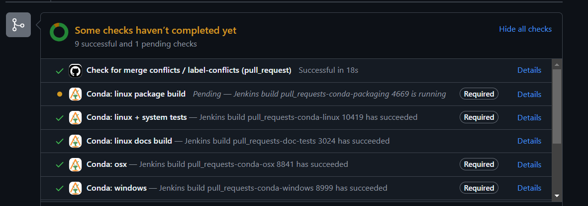
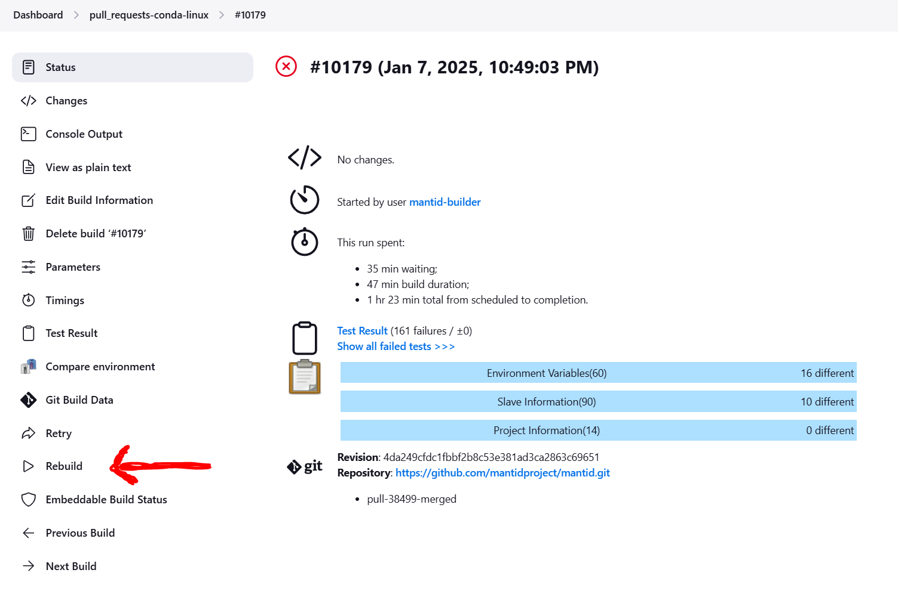

===========================
The Automated Build Process
===========================

.. contents:: Contents
   :local:

Summary
^^^^^^^

If your changes break the master builds in any way, on any platform,
then it is your responsibility to fix the error immediately!

The Details
^^^^^^^^^^^

You should follow the :ref:`dev-docs-git-workflow`. When you open a
pull request (or commit to an already open pull request) the automated
build process will start. There will be a different build for each
platform/job. A status will appear for each job in the pull request.

The status for each build will be either pending, success or failed.

To see the details of a particular build in Jenkins click on Details
next to the status. To restart a build, if it failed with a spurious
error not related to your code changes, then you can restart that
particular build by selecting Rebuild in Jenkins. Then press rebuild
again on the next screen while not changing any of the parameters. If
you don't have permission to restart builds in Jenkins you will have
to ask someone who does.

Other Notes
^^^^^^^^^^^

The build will fail if it cannot be cleanly merged with master.

Leeroy will check every 10 minutes for any missed builds, should the
GitHub hooks fail to activate or the build server was down when the
pull request was opened.

The pull request builder we are using is called `Leeroy
<https://github.com/jfrazelle/leeroy>`_

You can find a list of all the pull request Jenkins jobs at `here
<http://builds.mantidproject.org/view/Pull%20Requests/>`_.
