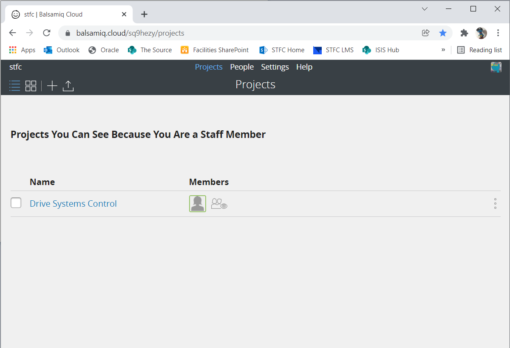
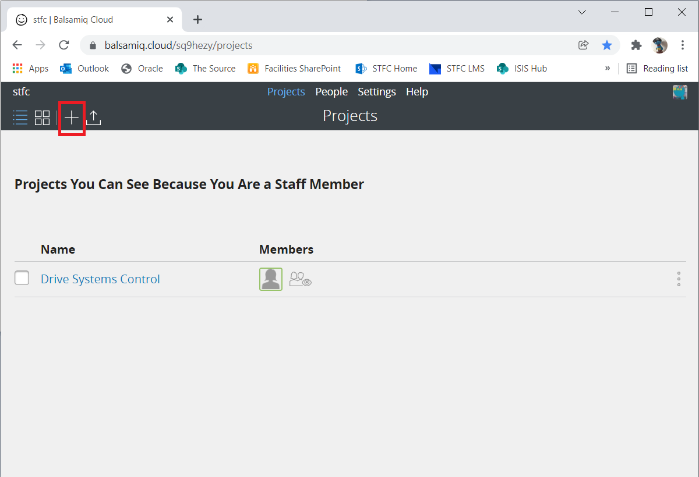
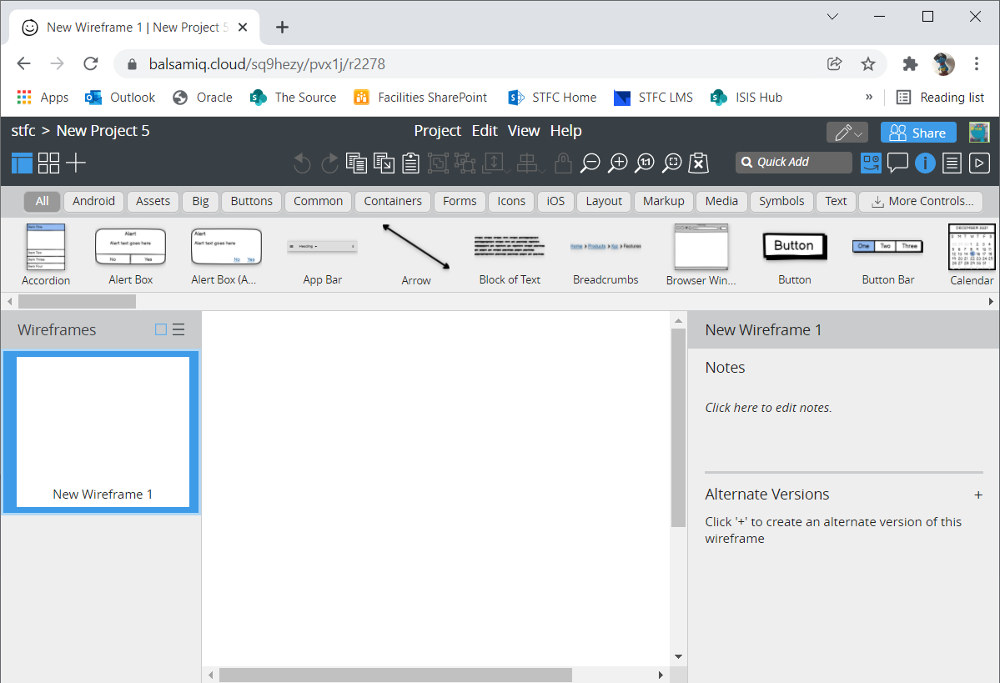

================================
Mockups with Balsamiq Wireframes
================================

This page provides a brief introduction to mockups with Balsamiq Wireframes.

Overview
--------

Mockups are very useful in the early phases of software development. They can be utilised for capturing requirements as well as getting feedback from the user. Usually the focus lies
on the structure of a UI and interactions between different elements of a UI.
Mockup tools help to create mockups with different levels of detail, from a rough sketch to very detailed requirements. Balsamiq Wireframes is a mockup tool that allows you to quickly
sketch UIs. It is essentially a collection of the most commonly used widgets for a variety of UI types. The user can arrange these widgets in a drag-and-drop editor which is often
much faster than drawing a mockup by hand.

Balsamiq mockups always have an unfinished look and feel to them. This is actually intended for several reasons. It encourages the user to give honest feedback as they might not feel
that a lot of work has to be redone to include the suggested changes. Even more important, the mockup is not mistaken for the finished product. None will assume that it is a
screenshot of the final version and most of the code behind it already written.

With the cloud version of Balsamiq Wireframes several users can work together on the same mockup.

First steps with Balsamiq Wireframes
------------------------------------

We have licenses for the cloud version of Balsamiq: https://balsamiq.cloud/
Please use your STFC email address to register and access the STFC space:

Create a project by clicking the ``+`` (plus) in the upper left hand corner:

The new project automatically opens within the editor with the canvas and the UI library as well as several toolbars and panels:

Invite collaborators to provide feedback or even edit the wireframes of your project. Please note that Balsamiq do not charge per user so feel free to invite your stakeholders to review you mockups.

Projects can be downloaded as a BMPR file. Regularly backing up projects by downloading its BMPR file from the projects homepage is recommended. It is also possible to upload existing BMPR files.
Wireframes in a project can be exported to a variety of formats, for instance PDF or PNG.
