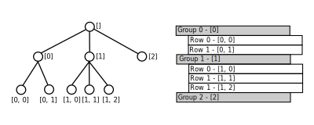
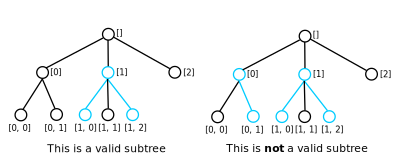

.. _JobTreeView:

=============
Job Tree View
=============

The :code:`JobTreeView` component provides an MVP style view interface for a hierarchical table
with a spreadsheet-like appearance for configuring and indicating the status of multiple (batch)
reduction jobs. It is currently used to implement the tree component of the Batch Widget.

It is written in C++ and exposed to python through SIP leading to similar APIs as shown by the
examples below.

.. literalinclude:: CodeExamples/init.py

.. literalinclude:: CodeExamples/init.cpp
   :language: c++

API Concepts
############

Row Location
^^^^^^^^^^^^

A row location is the notion of an individual row's position within the table. Since the
table is hierarchical, unlike a traditional spreadsheet, the table is more like a
tree of rows where all non-leaf nodes can have any number of children.

In practice some interfaces such as Reflectometry are likely to want to constrain the
number of children or depth of the tree, the batch widget has mechanisms for performing this.

Currently a row location is represented as a path from the root node to the row node in question,
this is actualised in the :code:`RowLocation` class which contains an ordered list of integers where
each element represents the index of the next node in the path relative to it's predecessor in the
path. An example table and corresponding tree structure are illustrated in the diagram below
(complete with their paths).

Equality over :code:`RowLocation` objects is based on the equality of their paths. The other relational
operators have a definition based on a lexicographical comparison such that sorting a range of
:code:`RowLocation`\ s puts them in the same order as they would appear in the table. This is
demonstrated by the code below.

.. code-block:: c++

   auto items = std::vector<RowLocation>({
     RowLocation({2}),
     RowLocation({0}),
     RowLocation({1, 1}),
     RowLocation({1})
   });

   std::sort(items.begin(), items.end());

   auto expectedItems = std::vector<RowLocation>({
     RowLocation({0}),
     RowLocation({1}),
     RowLocation({1, 1}),
     RowLocation({2})
   });

   assert(expectedItems == items);

Dealing With Cells
------------------

Each row in the table can have 0-N cells. When interacting with the :code:`JobTreeView` we
sometimes need to be able to address and change the properties of an individual cell. To do this
we use both a :code:`RowLocation` and a column index.

Cells
^^^^^

In order to retrieve the view properties for one or more specific cells, the methods :code:`cellAt`
and :code:`cellsAt` can be used to retrieve :code:`Cell` objects for the cell at a row and column
index or all the cells for a particular row respectively.

The :code:`Cell` class contains the per-cell view properties (such as the text it contains) in a
view-implementation independent format.

These cell objects intentionally have no link back to the view they originated from, so mutating
them does not directly update the view. In order to update the cell or cells corresponding to a row,
the methods :code:`setCellAt` or :code:`setCellsAt` should be used. This process is illustrated in
the example code below.

.. literalinclude:: CodeExamples/change_color.py

Subtrees
^^^^^^^^

As previously illustrated the conceptual model for the API is a tree of tables. Initially, this
model presents some challenges when you think about how to represent a user's selection while
preserving the tree structure. This is however necessary in order to support presenters which wish
to have sensible behaviour for actions such as copy and
paste.

A subtree in this context refers to a set of one or more nodes within the tree where if the set has
a size greater than one, each node is directly connected to at least one other node in the set.
An example of a set of nodes which meets this constraint and a set of nodes which do not are
outlined in blue in the diagram below.

The :code:`Subtree` type used to represent this concept in the API is defined in the header
:code:`Row.h`. Refer to the documentation for the component :doc:`../Internals/ExtractSubtrees` for more detail
on the internal representation of a subtree in this API.

Notification
^^^^^^^^^^^^

:code:`JobTreeViewSubscriber` is the mechanism by which the JobTreeView communicates events such as
key presses to the presenter in an MVP setup.

.. literalinclude:: CodeExamples/init_with_custom_subscriber.cpp
   :language: c++

This interface is also implemented by :code:`JobTreeViewSignalAdapter` which makes it easy to use
signals and slots instead when writing a GUI from python.

Due to the interactive nature of some events (such as row insertion, cell modification and filter resets),
notification does not happen until after said event has taken place and the view has
already been updated. Therefore, if a presenter determines that said action is on-reflection invalid
it will be required to call a method which updates the view and rolls back the action.
This is illustrated in the example below.

.. literalinclude:: CodeExamples/depth_limit_example.py

Other events (those who's notification method name ends with :code:`Requested`) require the presenter
to update the view and/or model and so the notification happens before the view has been updated.

.. warning::
   After creating a :code:`JobTreeView` it is important to call the :code:`subscribe` method passing in
   the subscriber prior to calling any other methods, failure to do so may result in undefined behavior.

Filtering
^^^^^^^^^

Is is possible to make the JobTreeView only show a subset of the nodes in the tree based on an
arbitrary predicate over row locations. These can be translated to their corresponding
node in the MVP model or their corresponding cells from the view.

The header :code:`RowPredicate.h` defines the interface which must be implemented by implementations
of such predicates. The method :code:`filterRowsBy` defined in :code:`JobTreeView` can be used to set
the currently active filter as demonstrated by the code below.

.. literalinclude:: CodeExamples/filtering.py

The method :code:`resetFilter` is used to unset the filter so that all items are shown again and
the :code:`hasFilter` method is used to determine if the filter is currently set.

Some actions performed on the :code:`JobTreeView` can trigger the filter to be reset automatically.
This necessitates the :code:`notifyFilterReset` method in :code:`JobTreeViewSubscriber` which is
called whenever the filter is reset, even when requested explicitly.
