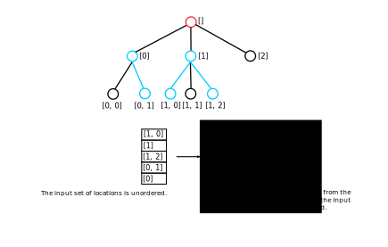
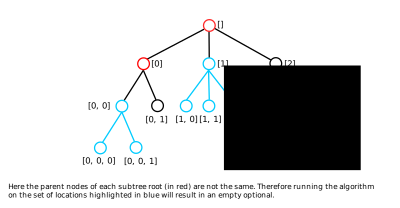

# Find Subtree Roots

The `FindSubtreeRoots` component filters an unordered set of row
locations down to a lexicographically ordered set of row locations where
each location corresponds to the root of a subtree.

Where multiple solutions are possible this algorithm will find the set
of subtrees with the minimal number of subtrees by grouping connected
row locations together into a single subtree.

The algorithm used to perform this conversion makes a simplifying
assumption that the roots of all subtrees in the result share a common
parent. If this assumption is untrue then the input set is unsuitable
and the algorithm will return an empty optional.

The above example fails due to a *shallow* root, a root which has a
depth *smaller* than the first root we encounter.

This example fails due to a *deep* root, a root which has a depth
*larger* than the first root we encounter.

This example fails due to the fact that the parents of the subtree roots
are not the same.

These conditions are checked using the functions defined in `Subtree.h`.

This algorithm is used by `../API/JobTreeView` in the
`selectedSubtreeRoots` method which is required to implement non-trivial
copy and paste.
