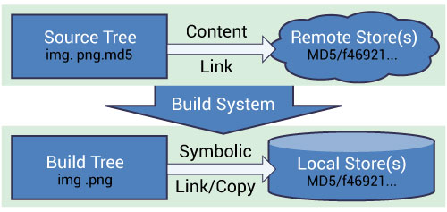

.. _DataFilesForTesting:

======================
Data Files for Testing
======================

.. contents::
  :local:

Summary
#######

This page gives an overview of how data files are managed within Mantid.

Motivation
##########

Some unit tests use a small amount of data that is created by the test
harness and others load data from a file. Take the example of
``ApplyCalibrationTest``. In its first test, testSimple, it creates a
workspace with 10 detectors using
``WorkspaceCreationHelper::create2DWorkspaceWithFullInstrument()``. In
the second test, testComplex, it reads a file
``unit_testing/MAPS_Definition_Reduced.xml``, which contains
the definition of a MAPS instrument with the number of detectors reduced
much to ensure it is read quickly but preserving the other properties of
this instrument. However, new tests should avoid even loading of this
nature unless there is a strong justification for doing so.

**Main issues:**

-  need to store data, mainly for testing, alongside the code
-  some data needs to be versioned
-  merging system tests back with main code requires handling large data
   files
-  git is bad at handling binary files

**Possible solutions:**

-  CMake's `ExternalData <http://www.kitware.com/source/home/post/107>`__
-  don't have any reference to data in git and force developers to
   manage the data stored on a file server
-  extensions to git, e.g.
   `git-fat <https://github.com/jedbrown/git-fat>`__,
   `git-annex <https://git-annex.branchable.com/>`__ to deal with large
   files

We have chosen to use CMake as it is already in use as a build system
and it doesn't involve introducing extra work with git.

CMake's External Data
#####################

   Image originated at http://www.kitware.com/source/home/post/107

**Terminology:**

-  content - the real data
-  content link - text file containing a hash (MD5) of the real content.
   The filename is the filename of the real data plus the ``.md5``
   extension
-  object - a file that stores the real data and whose name is the ``MD5``
   hash of the content

**Overview:**

-  git does not store any content, it only stores content links
-  content is stored on a remote server that can be accessed via a
   ``http`` link
-  running cmake sets up build rules so that the content is downloaded
   when dependent projects are built

Local Object Store
##################

CMake does not download content directly but stores the content in a
*Local Object Store*, whose location is defined by the
``ExternalData_OBJECT_STORES`` CMake variable. This allows it to share
content between build trees, especially useful for continuous
integration servers.

Binary Root
###########

The final step is to create the *real* filename and symbolic link (copy
on windows) it to the object in the local object store. The location of
the *real* filenames is controlled by the ``ExternalData_BINARY_ROOT``
CMake variable and defaults to ``build/ExternalData``.

Using Existing Data
###################

For unit testings, there are two places files may be found:

- `.../Testing/Data/ <https://github.com/mantidproject/mantid/tree/main/Testing/Data>`__
  for :ref:`unit test <RunningTheUnitTests>`, :ref:`doc test <DocumentationGuideForDevs>`, and :ref:`system test <SystemTests>` data
- `.../instrument/unit_testing <https://github.com/mantidproject/mantid/tree/main/instrument/unit_testing>`__
  for test :ref:`IDF <InstrumentDefinitionFile>` files

For system testings, there is one more location developers use to dump reference
data files:

- `.../Testing/SystemTests/tests/framework/reference`

Generally speaking, the testing system will look for the default locations for
corresponding tests:

- `.../Testing/Data/DocTest`
- `.../Testing/Data/SystemTest`
- `.../Testing/Data/UnitTest`

However, it is known that some developers like to reuse the same data files for
different type of tests, therefore sometime the DocTest and SystemTest is using
data from UnitTest, which means you should fetch all testing data before trying
to run any test locally.
Furthermore, this location is mostly considered as a centralized location for all
testing data.
But some groups prefer to treat this location for storing **input** testing data
only, therefore the testing system will look for the reference folder mentioned
above if it cannot find the reference data here.
Overall, it is important to talk to the senior developers in your team to learn
the preferred location for storing testing data.

.. _DataFilesForTesting_AddingANewFile:

Adding A New File(s)
####################

A helper git command is defined called ``add-test-data``. Before first use, the command must be
aliased using the procedure outlined :ref:`below <DataFilesForTesting_DeveloperSetup>`. Once setup,
it would be called like this:

.. code-block:: sh

   git add-test-data Testing/Data/UnitTest/INST12345.nxs

This does the following:

-  computes the MD5 hash of the data, e.g.
   ``d6948514d78db7fe251efb6cce4a9b83``
-  stores the MD5 hash in a file called
   ``Testing/Data/UnitTest/INST12345.nxs.md5``
-  renames the original data file to be its md5 sum
   ``Testing/Data/UnitTest/d6948514d78db7fe251efb6cce4a9b83``
-  runs ``git add Testing/Data/UnitTest/INST12345.nxs.md5``
-  tells the user to upload the file(s),
   ``d6948514d78db7fe251efb6cce4a9b83``, to the `remote store <https://testdata.mantidproject.org/ftp/external-data/upload>`_

**Notes:**

-  For the change to have effect, re-run ``cmake`` in the build area
-  You need to use a shell to add & modify data files under Windows in
   this way. Not every shell works as described, though `Github for
   Windows <https://windows.github.com/>`__ shell would allow you to do
   everything described here step by step without deviations.
-  Note, that ILL test data should be placed under ``ILL/${INSTRUMENT}``
   subdirectories (e.g. ``ILL/IN16B``), and should not contain any
   instrument prefix in the file name.

Updating File(s)
################

The workflow is the same as :ref:`adding new files <DataFilesForTesting_AddingANewFile>` except that the developer must first put the new version of the file in the right place. For the example above, it would be ``Testing/Data/UnitTest/INST12345.nxs``. Then the new ``.md5`` file and associated renamed file will be created. ``git diff`` will show that change to the contents of ``Testing/Data/UnitTest/INST12345.nxs.md5`` and that there is an untracked file with the md5 sum for a name.

.. _DataFilesForTesting_DeveloperSetup:

Developer Setup
###############

To add the ``add-test-data`` command alias to git run

.. code-block:: sh

   git config alias.add-test-data '!bash -c "tools/Development/git/git-add-test-data $*"'

in the git bash shell
(`script source <https://github.com/mantidproject/mantid/blob/main/tools/Development/git/git-add-test-data>`_).
The single quotes are important so that bash doesn't expand the exclamation mark as a variable.

It is advised that CMake is told where to put the "real" data as the
default is ``$HOME/MantidExternalData`` on Linux/Mac or
``C:/MantidExternalData`` on Windows. Over time the store will grow so
it is recommended that it be placed on a disk with a large amount of
space. CMake uses the ``MANTID_DATA_STORE`` variable to define where the
data is stored.

Example cmake command:
----------------------

**Linux/Mac:**

.. code-block:: sh

   mkdir -p build
   cmake -DMANTID_DATA_STORE=/home/mgigg/Data/LocalObjectStore ../Code/Mantid

**Windows:**

.. code-block:: sh

   mkdir build
   cmake -DMANTID_DATA_STORE=D:/Data/LocalObjectStore ../Code/Mantid

Setting With Dropbox:
---------------------

This is for people in the ORNL dropbox share and has the effect of
reducing external network traffic. There is a `gist
<http://gist.github.com/peterfpeterson/638490530e37c3d8dba5>`__ for
getting dropbox running on linux. Instead of defining the
``MANTID_DATA_STORE`` in cmake, it is simplest to create a symbolic
link

.. code-block:: sh

   ln -s ~/Dropbox\ \(ORNL\)/MantidExternalData ~

Then everything will happen automatically using CMake's default behavior.

Proxy Settings
--------------

If you are sitting behind a proxy server then the shell or Visual studio
needs to know about the proxy server. You must set the ``http_proxy``
environment variable to ``http://HOSTNAME:PORT``.

On Windows you go to ``Control Panel->System`` and
``Security->System->Advanced System settings->Environment Variables`` and
click ``New...`` to add a variable.

On Linux/Mac you will need to set the variable in the shell profile or
on Linux you can set it system wide in ``/etc/environment``.

Troubleshooting
---------------

If you find that your tests cannot find the data they require check the
following gotchas:

-  Check that you have re-run CMake in the build directory
-  Check that you have uploaded the original file renamed as a hash to
   the Mantid file repository
-  Check that you have removed any user defined data search directories
   in ``~/.mantid``
-  Check that you have rebuilt the test executable you're trying to run
-  Check that you have rebuilt the SystemTestData target
