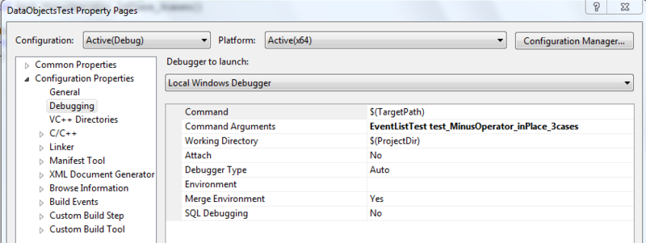
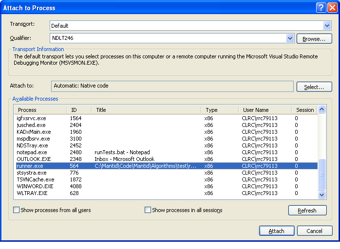

Debugging Unit Tests
====================

.. contents::
  :local:

Using gdb
---------

Debugging typically requires the test executable to be run directly,
rather than via ctest (which typically spawns off a separate process to
run the actual tests). So an example of debugging test function
``testworkspace1D_dist`` of Suite ``RebinTest`` from the command line
using gdb would be::

    $ gdb bin/AlgorithmsTest
    (gdb) r RebinTest testworkspace1D_dist

If you do need to run ctest in order to debug - if, for example, a test
is failing when run in ctest, but not if run directly - then you can
start the test off and then attach to the actual test executable from
another terminal (or your IDE). You may need to pause or slow down the
test using, e.g., the method described for Visual Studio debugging
below.

If the issue is with a python unit test, the call is slightly more
complicated::

    $  env PYTHONPATH=$PWD/bin gdb --args python /full/path/to/mantid/Framework/PythonInterface/test/python/mantid/kernel/TimeSeriesPropertyTest.py
    (gdb) run

Within Eclipse
--------------

#. Go to Run->Debug Configurations
#. Create a new Debug Configuration. I called mine "DataHandling Test
   Debug".
#. For me, it worked best using the "Standard Create Process Launcher"
   (bottom option on the "Main" tab)
#. Set the C/C++ application to the path to the test executable, e.g.
   bin/DataHandlingTest
#. Under the "Arguments" tab, add the name of the test class you want to
   debug under "Program arguments", e.g. LoadTest

   #. To only run one test in a class, you can add the particular test
      to run, e.g. "LoadTest test_exec"

#. Under "Common" you can put the debug config in your "favorites" menu.

You can then run the debugger on this configuration from the Run menu or
the toolbar.

Within Visual Studio (debugging run method)
-------------------------------------------

I've found that this method works with Visual Studio Express (which does
not allow "attach to process").

-  Right-click the test project, e.g. DataObjectsTest.
-  Select Properties.

   -  Under Debugging -> Command Arguments, type in the test suite and,
      optionally, single test name. e.g. "EventListTest
      test_MinusOperator_inPlace_3cases" in the screenshot below.

   VisualStudioTestDebugProperties.png

-  Put a break point somewhere in the test code that will be run.
-  Select the project and click Debug -> Start Debugging.
-  Fun test debugging times!

Within Visual Studio (attach to process version)
------------------------------------------------

The process here is not as straight forward as it is in eclipse. It
involves a few steps, but it does work!

1. Edit the test to add a pause at the start of the test you are
interested in. This will make the test wait for keyboard input, all you
need to do is hit enter, but you can use this delay to attach to the
debugger to running process.

.. code-block:: c++

  std::string s;
  std::getline(std::cin, s);

| 2. Run ctest with the appropriate arguments to run the test you are
  investigating.
| 3. When the test pauses for input within visual studio select
  Debug\Attach to Process... |AttachToProcess.png|
| 4. Select the test executable (e.g. DataHandlingTest.exe) from the
  list and click attach. Visual studio will change to debug mode.
| 5. Set any breakpoints you want, go back to the runner.exe window and
  hit enter to stop the pause. This should then ctach on any breakpoints
  you have set.
| 6. VERY IMPORTANT - Clean up when you have done, and do not check in
  with any paused tests!

