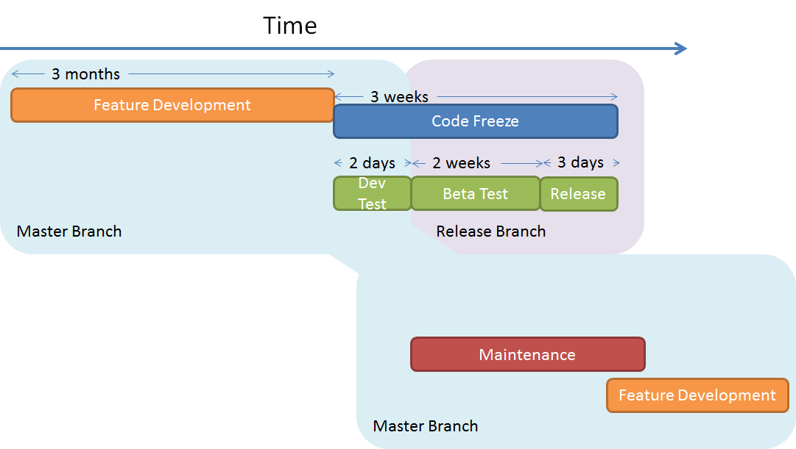

.. _DevelopmentAndReleaseCycle:

=============================
Development and Release Cycle
=============================

Mantid makes 3 point releases per year. The list of current milestones, along with their
expected release dates, is shown at https://github.com/mantidproject/mantid/milestones. The rough
structure of the development cycle is shown in the following figure:

Each release is divided, roughly, into:

* a 3 month development period where new features and bugfixes are developed
* a 3 week code freeze where the code is tested and prepared for the next release (details in the :ref:`release checklist <ReleaseChecklist>`)

  * during the freeze a 2 week beta-test period is given to users to test the upcoming
    release candidate (deployed in the form of a nightly build).

Feature development occurs on the `main <https://github.com/mantidproject/mantid/tree/main>`__ branch.
At the code freeze, once all pull requests marked for the release have been merged, a new branch is created for the next release.
Fixes found during testing are merged to the release branch and the main branch remains open to changes not destined for this release.

The maintenance period generally overlaps with the tail end of the code freeze.
All maintenance tasks occur on the main branch and should not disturb the release branch.
