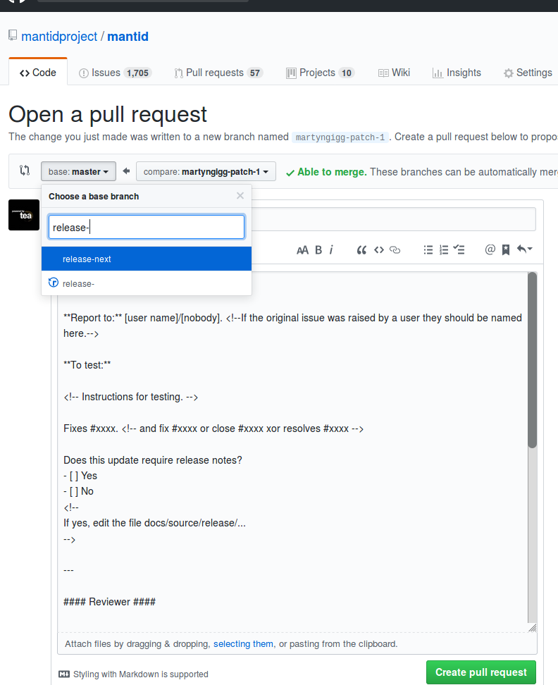

.. _GitWorkflow:

===================
Mantid Git Workflow
===================

.. contents:: Contents
   :local:

Summary
-------

Go to the :doc:`GitConfig` page to ensure that Git is set up correctly
before starting.

This page describes the workflow used in conjunction with `Git
<http://git-scm.com>`_ and `GitHub <https://www.github.com/>`_ for
those who have push access to the repository.

Go `here
<https://education.github.com/git-cheat-sheet-education.pdf>`__
or `here
<https://www.atlassian.com/git/tutorials/atlassian-git-cheatsheet>`__
for a cheatsheet of Git commands.

Go `here <https://github.com/k88hudson/git-flight-rules>`__ for a
(fairly) comprehensive guide to solving your various Git problems.

Description
-----------

We follow the `GitHub flow
<https://guides.github.com/introduction/flow/index.html>`_, using
branches for new work and pull requests for verifying the work.

The steps for a new piece of work can be summarised as follows:

1. Push up or `create <https://guides.github.com/features/issues>`_ an
   issue `here <https://github.com/mantidproject/mantid/issues>`__
2. Create a branch from ``main`` using the naming convention described
   at :ref:`GitWorkflowNamingBranches`
3. Do the work and commit changes to the branch. On commit, the
   `pre-commit <https://pre-commit.com/>`_ framework will run, it will
   check all your changes for formatting, linting, and perform static
   analysis. Push the branch regularly to GitHub to make sure no work
   is accidentally lost.
4. When you are finished with the work, ensure that all of the unit
   tests, documentation tests and system tests if necessary pass on
   your own machine
5. Open a pull request (:ref:`GitWorkflowPullRequests`)
   from the `GitHub branches
   <https://github.com/mantidproject/mantid/branches/>`_ page

   - This will check with the buildservers for cross-platform
     compatibility
   - If any issues come up, continue working on your branch and push
     to GitHub - the pull request will update automatically

.. _GitWorkflowNamingBranches:

Naming Branches
---------------

When naming `public branches
<http://github.com/mantidproject/mantid/branches>`_ that will be
pushed to GitHub, please follow the convention of
``issuenumber_short_description``. This will allow others to discover
what the branch is for (issue number) and quickly know what is being
done there (short description).

.. _GitWorkflowPullRequests:

Pull Requests
-------------

For an general overview of using pull requests on GitHub look `here
<https://help.github.com/articles/using-pull-requests/>`__.

When creating a pull request you should:

- Ensure that the title succinctly describes the changes so it is easy
  to read on the overview page

  - The title should **not** contain the issue number
- `Reference the issue which the pull request is closing  <https://github.com/blog/1506-closing-issues-via-pull-requests>`_, using one of `these <https://help.github.com/articles/closing-issues-via-commit-messages>`_ keywords
- State the user and facility (if relevant) who initiated the original issue, if they are named in the issue. Please do not put full email addresses on the Pull Request, as it is publicly accessible.
  If the user would not be easily identified by someone picking up the ticket, be prepared to act as a point of contact with the reporter.
- Ensure the description follows the format described by the `PR
  template
  <https://github.com/mantidproject/mantid/blob/main/.github/PULL_REQUEST_TEMPLATE.md>`_
  on GitHub

A good example is `here <https://github.com/mantidproject/mantid/pull/18713>`__.

Recommended reading: `How to Write the Perfect Pull Request <https://github.com/blog/1943-how-to-write-the-perfect-pull-request>`_

For further information about the review process see :ref:`reviewing a pull request <ReviewingAPullRequest>`.

Checkout a Pull Request
^^^^^^^^^^^^^^^^^^^^^^^

To check out a particular pull request for functional testing use the ``test-pr`` alias that was set up in the :doc:`GitConfig` instructions.

.. code-block:: sh

   git test-pr <remote-name> <ID>

where ``<ID>`` is the pull request number given on GitHub and ``<remote-name>`` is the name
of the remote pointing to the original ``mantid`` repository. If you cloned directly from `mantid <https://github.com/mantidproject/mantid>`_
then ``remote-name=origin`` else if you cloned from a fork then it is the name of remote that points
back to the original repository.

Note that these commands will checkout a temporary branch that has the development branch merged with ``main`` and not just
the development branch on its own.

The :doc:`GitConfig` page also provides the follow alias to delete all ``pr/`` prefixed branches, which is useful if you have several:

.. code-block:: sh

   git test-pr-remove-all

Stale Pull Requests
^^^^^^^^^^^^^^^^^^^

Pull requests that go an extended period of time without any activity
are considered stale and will be picked up by a (partially) automated
bot which will notify those that are required to take action in order
to keep the review process going.

This is also used to notify developers of pull requests that develop
conflicts with the base branch and that fail continuous integration
tests, in those two cases the age of the pull request is ignored.

The reasons a pull request may be flagged up currently are:

- Conflicts with base branch
- Failing CI
- Last developer has left the Mantid team
- Nobody has reviewed the PR
- An assigned reviewer has yet to complete a review
- A gatekeeper has not second reviewed an approved PR
- A review from a specific user was requested but that user has yet to complete a review
- The developer has yet to act on comments left in a review

(code for the bot is currently `here
<https://github.com/DanNixon/mantid_pr_bot>`__)

Code Freeze
-----------

At the start of a *code freeze* before a major release there will be a
release branch created named ``release-next``. At this point
only bugfixes should be applied to this release branch so that it can
be stabilized for the release. The release branch will be merged to
``main`` periodically so bugfixes do not need to be separately
merged to ``main``.

New Branches
^^^^^^^^^^^^

During the code freeze it is important to ensure that a new branch is
created from the correct base branch depending on the scope of the
changes:

- ``main``: maintenance fixes, new features. Command: ``git fetch -p && git checkout --no-track -b MYBRANCH_NAME origin/main``
- ``release-next``: bugfixes. Command: ``git fetch -p && git checkout --no-track -b MYBRANCH_NAME origin/release-next``

Pull Requests
^^^^^^^^^^^^^

To merge code with the release branch, open a pull request as usual but instead of using the
default merge target select ``release-next``:

Fixing a PR with an Incorrect Base Branch
^^^^^^^^^^^^^^^^^^^^^^^^^^^^^^^^^^^^^^^^^

The target branch on GitHub needs to match the base branch used in the
commands above when the branch was initially created. If the compare
view shows changes other than your own it is most likely that the base
branch is incorrect and it needs to be fixed.

As an example consider the scenario where a branch named ``topic`` has
been based off the ``main`` branch as follows::

   o---o---o---o---o  main
      |           \
      |            o---o---o  topic
       \
        o---o---o---o---o  release-next

where we actually want the ``topic`` branch based off ``release-next``
instead i.e. ::

   o---o---o---o---o  main
       \
        o---o---o---o---o  release-next
                                \
                                 o'---o'---o'  topic

To fix this situation we use the ``rebase`` command, providing the
``--onto`` option as follows:

.. code-block:: bash

    git fetch
    git rebase --onto origin/release-next $(git merge-base origin/main origin/topic) topic

Fixing a merge conflict between protected branches
^^^^^^^^^^^^^^^^^^^^^^^^^^^^^^^^^^^^^^^^^^^^^^^^^^

A Gatekeeper should follow :ref:`these instructions <FixProtectedBranchMergeConflict>` if there is a merge conflict between two protected branches e.g. ``main`` and ``release-next``.
