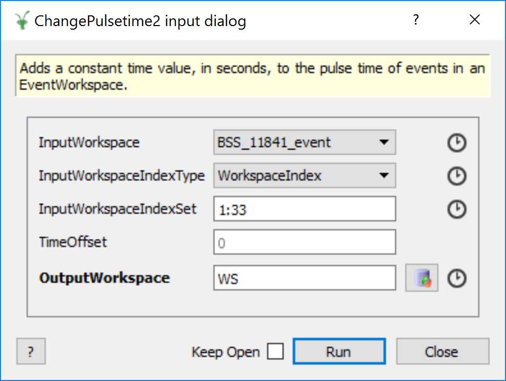

.. _IndexProperty:

Index Property
==============

.. contents::
  :local:

Why IndexProperty?
------------------

In many cases, indices are captured from the user with the ``ArrayProperty<int>`` property type. However, this lacks a few key behaviours which
a property collecting workspace index information should have. Firstly, there is no automatic validation of the indices with respect to
the workspace itself. Therefore users could enter invalid input e.g negative numbers, or numbers outside of
the range of spectra held by the workspace, unless bounded validators or used. Finally, any conversion between "index types" i.e. conversion from
spectrum numbers to workspace indices (also known as spectrum indices) must be managed by the algorithm developer. This style
of development is very error prone and could lead to inconsitencies across algorithms as
each developer may have a different approach to addressing the aforementioned issues.

The ``IndexProperty`` in Mantid provides a consistent interface for algorithms
which need to access a subset of the workspace spectra for processing.The ``IndexProperty`` facilitates
the retrieval of a set of workspace indices, called a ``SpectrumIndexSet``, once provided with a set of workspace indices or
spectrum numbers [#]_. Therefore algorithm developers do not need to perform any conversions manually.

.. [#] Not specifying any indices/spectrum numbers results in the processing of the entire workspace.

How to use the IndexProperty
----------------------------

Unlike other property types in Mantid, the ``IndexProperty`` is designed to be used in conjunction with other properties
which define the workspace and the input type of the indices which represent
the subset of the data. However, developers do not need to concern themselves
with maintaining these properties on their own. There are few special methods in
``Algorithm`` which handle this. Namely, ``Algorithm::declareWorkspaceInputProperties``,
``Algorithm::setWorkspaceInputProperties`` and ``Algorithm::getWorkspaceAndIndices`` [#]_.

Property declaration is as shown below:

.. code-block:: cpp

  #include "MantidAPI/Algorithm.hxx"

  // Declare property with default settings
  // IndexType::WorkspaceIndex is default
  declareWorkspaceInputProperties<MatrixWorkspace>(
      "InputWorkspace",
      "This is an input workspace with associated index handling");

  // Declare all arguments
  declareWorkspaceInputProperties<MatrixWorkspace,
                                  IndexType::SpectrumNum | IndexType::WorkspaceIndex>(
      "InputWorkspace",
      "This is an input workspace with associated index handling"
      /* optional PropertyMode, LockMode, and validator forwarded to WorkspaceProperty */);

Internally, a ``WorkspaceProperty`` is created along with an ``IndexTypeProperty`` for
managing the workspace and the type of user-defined input index list respectively. Their names are
automatically generated based on the property name in the declaration.
A toy example algorithm dialog in the GUI would have the following inputs defined:

After properties have been set, client code can retrieve the values of interest from
within the algorithm as follows:

.. code-block:: cpp

  //Declare workspace and index set
  MatrixWorkspace_sptr inputWs;
  SpectrumIndexSet indexSet;

  //Method returns a tuple of the workspace
  //and index set simultaneously
  std::tie(inputWs, indexSet) =
        getWorkspaceAndIndices<MatrixWorkspace>("InputWorkspace");

  for(auto index: indexSet){
    auto &spec = inputWs->getSpectrum(index);
    //do something with spectrum.
  }

For setting the property values, there are 4 valid options:

.. code-block:: cpp

   //Set Property with workspace_sptr and string of indices
   setWorkspaceInputProperties<MatrixWorkspace, std::string>(
      "InputWorkspace", ws, IndexType::WorkspaceIndex, "1:5")

   //Set Property with workspace name and string of indices
   setWorkspaceInputProperties<MatrixWorkspace, std::string>(
      "InputWorkspace", "ws", IndexType::WorkspaceIndex, "1:5")

   //Set Property with workspace_sptr and vector of indices
   setWorkspaceInputProperties<MatrixWorkspace, std::vector<int>>(
      "InputWorkspace", ws, IndexType::WorkspaceIndex,
       std::vector<int>{1, 2, 3, 4, 5})

   //Set Property with workspace name and vector of indices
   setWorkspaceInputProperties<MatrixWorkspace, std::vector<int>>(
      "InputWorkspace", "ws", IndexType::WorkspaceIndex,
       std::vector<int>{1, 2, 3, 4, 5})

.. [#] It is important to note that any attempt to access the ``IndexProperty`` or the ``WorkspaceProperty`` in isolation will fail. Once defined using the ``Algorithm::declareWorkspaceInputProperties`` method, all access must be via the three methods mentioned above.
