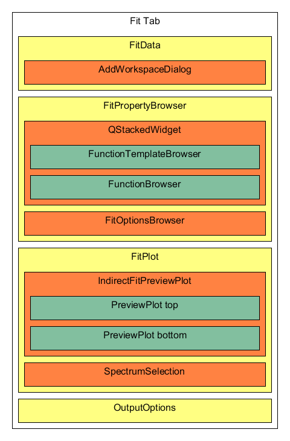

# IndirectDataAnalysis File Structure

The many levels of inheritance in the indirect data analysis codebase
can be confusing. it is not always clear how they all interact.

The Elwin and I(Q,t) are the most different as their components are all
contained within a single UI file. This is something that should be
fixed to be more modular but it could be left till the fit tabs are
separated out entirely.

# Fit Tab structure

The QENS fit tabs in Inelastic Data analysis have this general
structure. Different tabs will feature different derived classes for the
IndirectDataAnalysisTab, FitDataView, FunctionTemplateBrowser, and the
AddWorkspaceDialog

<figure>

</figure>

# QENS Fit class structure

<figure>

</figure>

The ideal structure for the interface should include MVP for each
defined section. As part of the refactoring of the old
IndirectFittingModel has been broken up, the IndirectFitData and
IndirectFitPlot all previously used the same instance of the fitting
model, now communication is handled with signals through the presenters
and they each have their own. Some objects are shared between models,
but as a design rule only one object should ever make changes to it e.g.
the IndirectFitData is controlled by IndirectFitDataModel, but is
sometimes read by IndirectFitPlot.

The IndirectFitPlotModel also contains a pointer to the active fit
function and the IndirectFitOutput from the IndirectFittingModel, again
should only ever READ FROM THESE OBJECTS only the IndirectFittingModel
should control it.

## IndirectDataAnalysisTab

The IndirectDataAnalysisTab is the master container for each IDA tab,
contained in this are the individual tabs IndirectFittingModel and View,
as well as the sub widgets that make up the interface. Each Tab
contains: - an IndirectFitDataInterface that manages the input of data
to the tab - an IndirectFitPlot that contains two mini-plots: one for
the data, and one for the fit difference. - an
IndirectFitPropertyBrowser that contains the processes for manipulating
the fit function and fit methods. - an IndirectFitOutputOptions that
contains methods of producing plots of fitted data.

## IndirectFittingModel

The fitting function for the interface is run from the
IndirectFittingModel, the fitting model controls an IndirectFitOutput,
this object contains data from fits run through the model so that the
results can then be read by the IndirectFitPlotModel to be used in the
mini-plot. The IndirectFittingModel also contains specifics for the
functions that can be utilized by the IndirectFitPropertyBrowser,
listing the available functions and their ties.

## IndirectFitDataInterface

The IndirectFitDataInterface is the container that controls data input
for the tab, it contains a table of spectra added through the
AddWorkspaceDialog, some tabs require different inputs, for example, the
ConvFitTab requires each data entry to have both a sample and resolution
workspace. Because of this, some tabs have their version of this widget
that allows for these specific additions. The data input is stored in
the IndirectFitData object that can then be read by the
IndirectFitPlotModel to be used in the mini-plot.

On construction, the IndirectFitDataPresenter is passed a Model
(IIndirectFitDataModel) and a view (IIndirectFitDataView) these define
the usage of the widget and the data to be contained within. The
Presenter connects the signals when the editable entries in the view's
data table with the model that records the contents of the table in the
IndirectFitData container. The presenter also contains the command for
creating the AddWorkspaceDialog object which is overwritten when a
different version is needed (e.g. ConvFitDataPresenter creates
ConvfitAddWorkspaceDialogue) the presenter then connects signals from
the dialogue for data being added. Different versions of the presenter
utilize a different form of the
addTableEntry function to use their
unique layouts for their data and store the relevant data through the
model. The IndirectFitDataModel is identical for all tabs and contains
the functionality required for all even if some parts are not required
such as the resolution in ConvFit. The model contains functions for
manipulating the contents of IndirectFitData (m_fittingData) and
recalling information from it to be passed to the FittingModel. The
contents of the model can be queried using either the FitDomainIndex
(the position of a workspace-spectra on the data table) or with
WorkspaceID (the position of a workspace in m_fittingData) and
WorkspaceIndex (the WorkspaceIndex of spectra within the workspace)

## IndirectFitPlot

The IndirectFitPlot is the container that controls the miniplots within
the tab, this consists of two miniplot frames. One to contains the
selected spectra, the guess for the fit function if selected, and the
fitted function if ran. and the second to contain the fit difference
once the tab has been run. this widget also contains the controls for
which spectra should be plotted.

## IndirectFitPropertyBrowser

The IndirectFitPropertyBrowser is the container that controls the
fitting function to be used within the tab. These each has their own
sets of functions that are stored within the TemplateBrowser, the
TemplateBrowser is a simplified version of the normal Mantid fit
property browser that contains only the factors relevant to the
processes used in the tab. the contents of this Browser are given to the
FittingModel to be processed.

## IndirectFitOutputOptions

The IndirectFitOutputOptions contains a set of controls that allow for
the output of fits from the interface to be plotted separately,
including plotting fit parameters from simultaneous or sequential fits.

## IndirectFitData

The IndirectFitData container serves as a storage container for the data
contained within the IndirectFitDataInterface, it allows for data to be
communicated between the plot and the data input without extraneous
signals. By design, the only thing that should manipulate to contents of
IndirectFitData is the IndirectFitDataInterface. IndirectFitPlot should
only ever read the contents of IndirectFitData.

## IndirectFitOutput

The IndirectFitData container serves as a storage container for the
output of fits from the tabs, it allows for data to be communicated
between the plot and the FittingModel without extraneous signals. By
design, the only thing that should manipulate to contents of
IndirectFitOutput is the IndirectFittingModel. IndirectFitPlot should
only ever read the contents of IndirectFitOutput.
