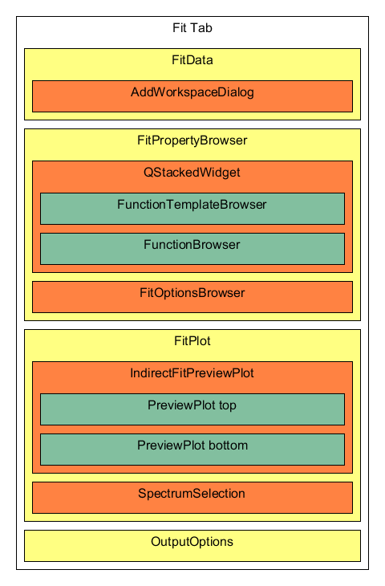

.. _IDA-Structure-ref:

IndirectDataAnalysis File Structure
===================================

The many levels of inheritance in the indirect data analysis codebase can be confusing. it is not always clear how they
all interact.

The Elwin and I(Q,t) are the most different as their components are all contained within a single UI file. This is
something that should be fixed to be more modular but it could be left till the fit tabs are separated out entirely.

Fit Tab structure
=================

The QENS fit tabs in Inelastic Data analysis have this general structure. Different tabs will feature different derived
classes for the IndirectFitAnalysisTab, FitDataView, FunctionTemplateBrowser, and the AddWorkspaceDialog

QENS Fit class structure
=========================

.. figure::  images/QENS/IndirectFitClassStructure.png
   :width: 2000px

The ideal structure for the interface should include MVP for each defined section. As part of the refactor the old
IndirectFittingModel has been broken up, the IndirectFitData and IndirectFitPlot all previously used the same instance
of the fitting model, now communication is handled with signals through the presenters and they each have their own.
Some objects are shared between models, but as a design rule only one object should ever make changes to it e.g. the
IndirectFitData which is controlled by IndirectFitDataModel, but is sometimes read by IndirectFitPlot.

The IndirectFitPlotModel also contains a pointer to the active fit function and the IndirectFitOutput from the
IndirectFittingModel, again it should only ever READ FROM THESE OBJECTS only the IndirectFittingModel should control it.