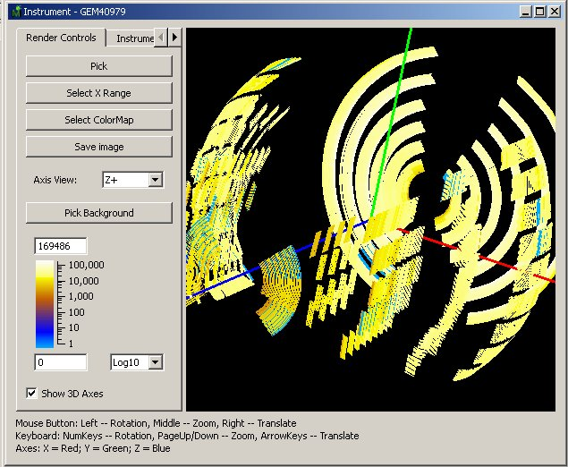
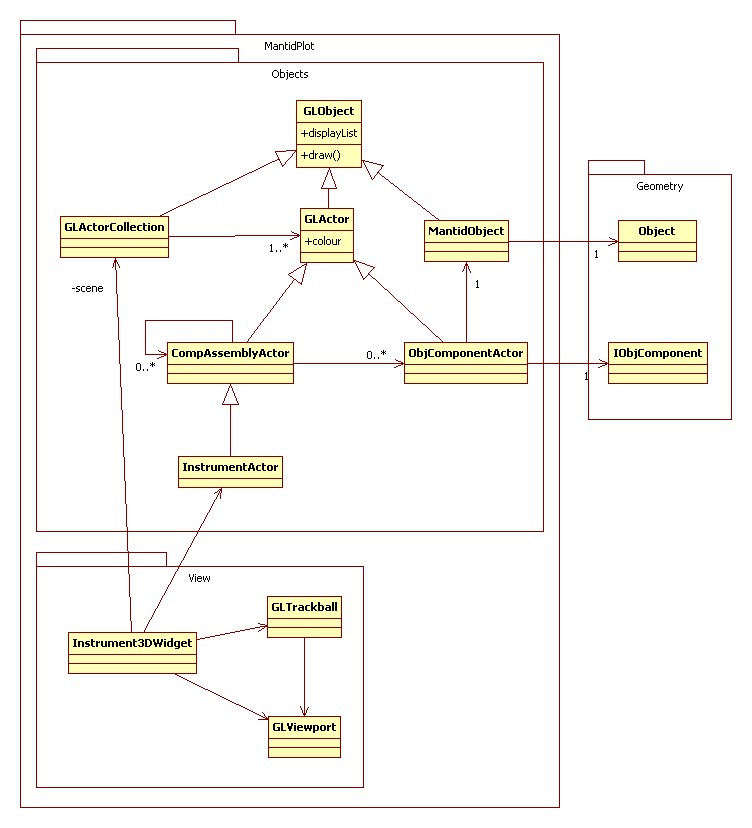
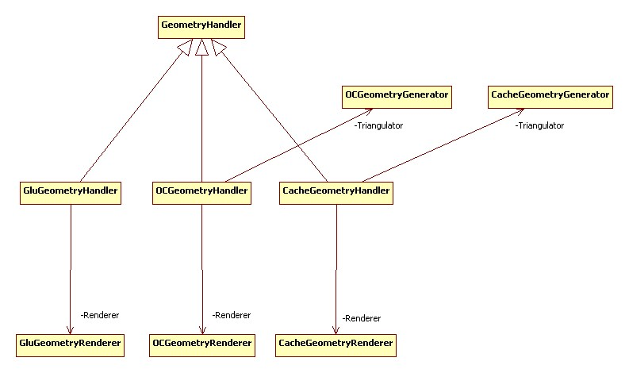

.. _InstrumentViewer:

========================
Instrument Viewer Widget
========================

.. contents::
  :local:

Overview
--------

Mantid visualisation system allows users to view the geometry of an instrument and also select and query individual detectors.
An instrument is always shown in a context of a workspace of data recorded on this instrument.
The detectors are coloured according to the data in the corresponding spectra of the workspace.
The user can select individual detectors by clicking on them and request to see the data recorded by this detector as a table or a graph.
The instrument view also allows users to see close-ups of any component.

Implementation
--------------

MantidPlot uses OpenGL to plot the geometry. Instrument3DWidget represents the view window and controls the viewport and the scene.
The base class for a visual element is GLObject. Actors and MantidObject inherit from it. Actors represent the instrument components.

Detector Picking
----------------

Detector picking is a process of selecting a detector in the instrument view by clicking on it.
When the user clicks the mouse inside the viewport in the picking mode, MantidPlot creates a hidden image of the instrument in which detectors are given colours encoding the detector's index in the instrument tree.
On the mouse click a colour is read in and decoded back into the index.

Geometry Handlers and Renderers
-------------------------------

Each object has a geometry handler attached to it.
The handler is responsible for creating the mesh and rendering the object.
Handlers have different methods of creating meshes.
For example, GluGeometryHandler can create simple shapes such as spheres and cylinders, OCGeometryHandler creates more complex geometries combining simple shapes together.
CacheGeometryHandler reads previously saved geometries from a file.

