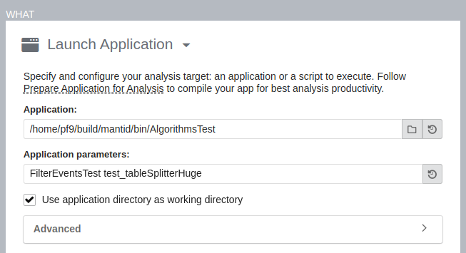

::: {.note}
::: {.title}
Note
:::

These tools generally require `sudo` permissions to configure the system
to allow them to get information.
:::

# Profiling with perf

Perf is a tool designed for use with the linux kernel, but can be used
to profile user apps as well. It is available on all linuxes, but
requries root permission to enable. Much of this information was
originally gained from [Nick Tompson's Performance Tuning
Tutorail](https://github.com/NAThompson/performance_tuning_tutorial)
held at Oak Ridge National Laboratory.

::: {.note}
::: {.title}
Note
:::

perf is a sampling based performance tool. This means the results are
percentages rather than absolute times. However, many visualizations
will associate times as well. Disk access issues are almost completely
invisible to perf-based tools.
:::

## Install and configure

To install perf on ubuntu one needs (this is [inspired from
here](https://www.howtoforge.com/how-to-install-perf-performance-analysis-tool-on-ubuntu-20-04/))

``` sh
sudo apt install linux-tools-common
sudo apt install linux-tools-generic
sudo apt install linux-tools-`uname -r`
```

the last command gets the kernel modules specific to your kernel.

The final step of configuration allows for getting more information from
perf traces. Any debug symbols that are found will aid in understanding
the output.

``` sh
#!/bin/bash
# Taken from Milian Wolf's talk "Linux perf for Qt developers"
sudo mount -o remount,mode=755 /sys/kernel/debug
sudo mount -o remount,mode=755 /sys/kernel/debug/tracing
echo "0" | sudo tee /proc/sys/kernel/kptr_restrict
echo "-1" | sudo tee /proc/sys/kernel/perf_event_paranoid
sudo chown `whoami` /sys/kernel/debug/tracing/uprobe_events
sudo chmod a+rw /sys/kernel/debug/tracing/uprobe_events
```

Python 3.12 will have [native support for
perf](https://docs.python.org/3.12/howto/perf_profiling.html).

## Running perf

To profile a single test (this starts with `time` to see how long the
overall test takes)

``` sh
time perf record -g ./bin/AlgorithmsTest FilterEventsTest
```

The report can be viewed in a couple of ways. Using the curses-based
tool

``` sh
perf report --no-children -s dso,sym,srcline
```

The report can also be viewed
[FlameGraph](https://github.com/brendangregg/FlameGraph) which generates
an `.svg` that can be viewed in a web browser

``` sh
perf script | ~/code/FlameGraph/stackcollapse-perf.pl | ~/code/FlameGraph/flamegraph.pl > flame.svg
```

# Profiling with Intel's VTune

Intel's VTune profiler ([download
link](https://www.intel.com/content/www/us/en/developer/tools/oneapi/vtune-profiler-download.html)
and [install
instructions](https://www.intel.com/content/www/us/en/docs/vtune-profiler/installation-guide/2023-0/package-managers.html))
is part of the one-api suite of software that is available for open
source projects. This is part of the same suite that provides TBB
(threaded building blocks) that are used in mantid. After installing,
one must configure (these [instructions are for
ubuntu](https://www.intel.com/content/www/us/en/docs/vtune-profiler/user-guide/2023-0/linux-targets.html))
using the command

``` sh
sudo sysctl -w kernel.yama.ptrace_scope=0
```

This needs to be done at every system reboot, but can be configured in
sysctl to be a permanent option as well. Finally, the environment
settings for vtune are in `/opt/intel/oneapi/vtune/latest/vtune-vars.sh`
and the gui can be started using `vtune-gui`.

From the welcome screen, you will want to "Configure Analysis" (the play
button).

<figure>

</figure>

This example takes advantage of how cxxtestgen works by running the
command

``` sh
bin/AlgorithmsTest FilterEventsTest test_tableSplitterHuge
```

which runs The `test_tableSplitterHuge` test of the `FilterEventsTest`
suite, in the `AlgorithmsTest` binary. It is suggested that one selects
"User-Mode Sampling" to avoid seeing kernel methods and get the flame
graph visualization. Once the analysis is completed, you will see the
summary. It is recommended that you start with the "Flame Graph" and
"Top-down Tree" visualizations first.
