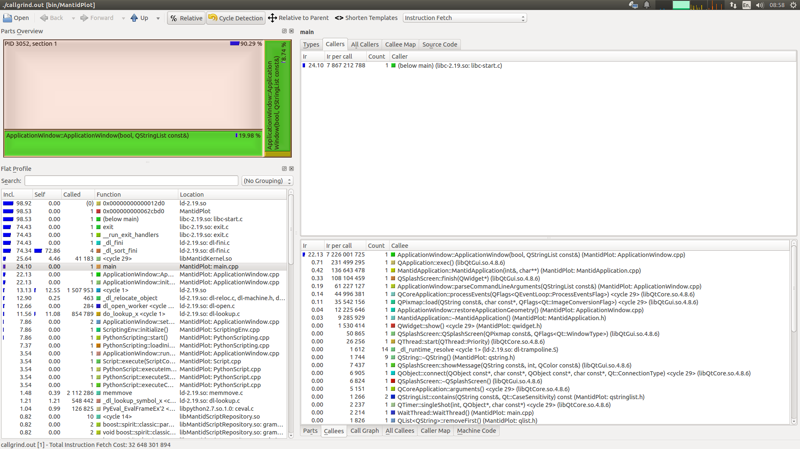

.. _ProfilingWithValgrind:

Profiling with Valgrind
=======================

Summary
-------

Describes how to use the
`callgrind <http://valgrind.org/docs/manual/cl-manual.html>`__ plugin to
the `valgrind <http://valgrind.org/>`__ tool set to profile your code.

*Note: Valgrind is a Linux only tool*

Installation
------------

You will need to install both *valgrind* & the visualizer tool
*kcachegrind* - both of which should be available in your distribution's
repositories.

Ubuntu
~~~~~~

::

    >> apt-get install valgrind kcachegrind

Red Hat/Fedora
~~~~~~~~~~~~~~

::

    >> yum install valgrind kcachegrind

Preparation
-----------

To be most effective valgrind requires that debugging information be
present in the binaries that are being instrumented, although a full
debug build is not required. On gcc this means compiling with the *-g*
flag. For Mantid the recommended setup is to use a separate build with
the *CMAKE_BUILD_TYPE* set to *RelWithDebInfo*. This provides a good
balance between performance and availability of debugging information.

Running the Profiler
--------------------

The profiler can instrument the code in a number of different ways. Some
of these will be described here. For more detail information see the
`callgrind manual <http://valgrind.org/docs/manual/cl-manual.html>`__.

During execution the callgrind tool creates many output file named
*callgrind.output.pid.X*. For this reason it is recommended that each
profile run be executed from within a separate directory, named with a
description of the activity. This allows the separate profiled runs to
be found more easily in the future.

**Beware**: The code will execute many times (factors of 10) slower than
when not profiling - this is just a consequence of how valgrind
instruments the code.

Profile a Whole Program Run
~~~~~~~~~~~~~~~~~~~~~~~~~~~

This is the simplest mode of operation. Simply pass the program
executable, along with any arguments to the valgrind executable:

::

    >> valgrind --tool=callgrind --dump-instr=yes --simulate-cache=yes --collect-jumps=yes <executable> [args...]

Profile Selected Portions of the Code
~~~~~~~~~~~~~~~~~~~~~~~~~~~~~~~~~~~~~

For larger pieces of code it can be quite likely that you wish to
profile only a selected portion of it. This is possible if you have a
access to recompile the source code of the binaries to be instrumented
as valgrind has a C api that can be used talk to the profiler. It uses a
set of
`macros <http://valgrind.org/docs/manual/cl-manual.html#cl-manual.clientrequests>`__
to instruct the profiler what to do when it hits certain points of the
code.

As an example take a simple main function composed of several function
calls:

.. code:: cpp

    int main()
    {
      foo1();
      bar1();
      foo2();
      foo3();
    }

To profile only the call to ``bar1()`` then you would do the following
to the code:

.. code:: cpp

    #include <valgrind/callgrind.h>

    int main()
    {
      foo1();
      CALLGRIND_START_INSTRUMENTATION;
      CALLGRIND_TOGGLE_COLLECT;
      bar1();
      CALLGRIND_TOGGLE_COLLECT;
      CALLGRIND_STOP_INSTRUMENTATION;
      foo2();
      foo3();
    }

After recompiling the code you would then run the profiler again but
this time adding the *--instr-atstart=no --collect-atstart=no* flags,
like so

::

    >> valgrind --tool=callgrind --dump-instr=yes --simulate-cache=yes --collect-jumps=yes --collect-atstart=no --instr-atstart=no <executable> [args...]

The *--instru-at-start=no* is not strictly necessary but it will speed
up the code up until the profiling point at the cost of the less
accuracy about the cache usage. See
`here <http://valgrind.org/docs/manual/cl-manual.html#opt.instr-atstart>`__
more details.

Visualisation
-------------

Callgrind produces a large amount of data about the program's execution.
It is most easily understood using the *kcachegrind* GUI tool. This
reads the information produced by callgrind and creates a list of
function calls along with information on timings of each of the calls
during the profiled run. If the source code is available it can also
show the lines of code that relate to the functions being inspected.

   Example of KCachegrind display a profile of MantidPlot starting up
   and closing down

By default KCachegrind shows the number of instructions fetched within
its displays. This can be changed using the drop-down box at the top
right of the screen. The *Instruction Fetch* and *Cycle Estimation* are
generally the most widely used and roughly correlate to the amount of
time spent performing the displayed functions.

Some of the key features display are:

Flat Profile View
~~~~~~~~~~~~~~~~~

-  Incl. - Sum of itself + all child calls as a percentage of the whole.
   Programs with little static allocation should have main() at 100%.
   Units are those selected by the to-right drop-down
-  Self - Exclusive count spent in the selected function. Units are
   those selected by the to-right drop-down
-  Called - Number of times the function was called.

Function Call Detail
~~~~~~~~~~~~~~~~~~~~

Click on function in flat view to get more detail on the right.

Displays details about the selected function call plus details about all
child calls it made. The *call graph* tab at the bottom gives a nice
graphical overview of the relative function cost.
