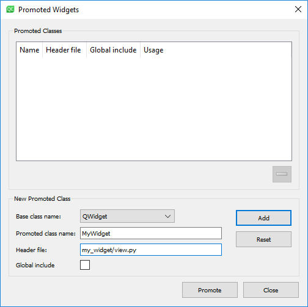

.. _QtDesignerForPython:

======================
Qt Designer for Python
======================

Motivation
----------

Code for setting up individual widgets and the layout of a view can
become large and difficult to maintain by hand. It usually easier to
edit such code using a drag and drop WYSIWYG (What You See Is What You
Get) editor such as Qt Creator/Designer. However, doing so requires some
additional actions to implement your layout into a view script.

Implementation
--------------

Qt Creator was not originally designed to work with Python, and it is
therefore not possible to directly save or export the layout as a
Python script. Instead you must first save the layout in a ``.ui``
file and use a separate package to to convert it to a python class.
Including this at the start of your view script will import a class
``Ui_MyWidget`` that you can use with your view.

.. code-block:: python

    from mantidqt.utils.qt import load_ui

    Ui_MyWidget, _ = load_ui(__file__, "my_widget.ui")

Using the Generated Class
--------------------------

When following the MVP design pattern as described at
:ref:`MVPDesignIntro`, the generated class alone is not
sufficient as a :ref:`MVPDesignView`. The generated class
lacks any method for sending signals or changing data in its own widgets.
Directly accessing the widgets and the signals defined on the view from
the presenter moves the view implementation details into the presenter,
which makes it harder to change the names and types of widgets used to
display the information. Instead it is best to create a separate new class
which inherits from the imported one.

.. code-block:: python

    from qtpy import QtCore, QtGui, QtWidgets
    import matplotlib.pyplot as plt
    from mantidqt.utils.qt import load_ui
    from matplotlib.backends.backend_qt5agg import FigureCanvasQTAgg as FigureCanvas

    Ui_MyWidget, _ = load_ui(__file__, "my_widget.ui")

    class MyWidget(QtWidgets.QWidget, Ui_MyWidget):
        def __init__(self, parent=None):
            super(MyWidget, self).__init__(parent)

You can then add separate methods to the view for accessing and mutating
the content of the widgets as well as add any necessary signals which
form the interface to the view.

Integrating into Workbench
--------------------------

In order to implement a new interface into Mantid Workbench it is best to
start with a up to date build from ``main``. For this demo our interface does
not need any presenter or model, those can be added later, all that is needed
is a ``.ui`` file and a script that will open it as an application. Take view
from above and use the following as your main:

.. code-block:: python

    from qtpy import QtWidgets
    import sys
    import my_widget.view as view

    class demo(QtWidgets.QMainWindow):
        def __init__(self, parent=None):
            super(demo, self).__init__(parent)
            self.window = QtWidgets.QMainWindow()
            my_view = view.MyWidget(parent=self)
            self.setCentralWidget(my_view)
            self.setWindowTitle("Demo Interface")

and put them in folder called ``my_widget.py`` in the ``scripts`` folder of your
source directory. You will note that when we are importing view into the main
script we are importing ``my_widget.view``, this is because our interface is in
the form of a package that will be called by another script.

.. code-block:: python

    from my_widget.main import demo

    widget = demo()
    widget.show()

This script call this script ``my_widget.py`` saved in the ``scripts`` folder of
your source directory.

Finally we have to add ``my_widget`` to the list of interfaces. to do this open
``[Mantid Source Directory]/Framework/Properties/Mandtid.properties.template``
and find the line starting ``mantidqt.python_interfaces =``. At the end of this
line, add ``My_widgets/my_widget.py``.

Rebuild Mantid and open workbench. Your interface should be located under
Interfaces --> My Widgets --> my widget.

Keeping GUIs modular using Widgets
##################################

.. _motivation-1:

Motivation
----------

When designing a GUI in QtCreator it is often too easy to end up with
the entire interface in a single UI file. This can then lead to having a
single presenter for the entire GUI and sometimes even a single model.
This makes the UI harder to maintain as a whole and difficult to re-use,
move and separate out individual sections.

Instead when building a GUI it is sometimes better to separate parts of
the interface into smaller views and presenters which form a hierarchy
of widgets. For example the new SANS Run Summation page is in it's own
UI file and uses two separate widgets - a ``RunSelectorWidget`` and a
``SummationSettingsWidget``. Although these widgets are not currently
used in any other interface, they are still isolated from the Run
Summation tab and could easily be used in another interface should the
need arise. The code is also better organised and more modular as a
result of this clean separation.

.. _implementation-1:

Implementation
--------------

Qt Creator allows us to promote widgets in a ``.ui`` file into more complex
widgets from a python script. This allows for the easy reuse of widgets
in other interfaces while keeping the same methods.

Begin in Qt Creator by making a blank QWidget then right click on it and
go to ``Promote to..``

The header will need to point to the view file that you made previously.
Make sure this widgets name is left as the default ``widget`` and save.
This promoted widget will contain all the same properties as the optional
including any methods you added to ``view.py``. Replace the view used in
the previous example with a script that generates your promoted widget
called ``view_promoted.py``. Restart Workbench and check your widget, it
should look identical. You can experiment with adding more than one
promoted widget.

Your original view is embedded in the new widget as an object, as such
any methods are also within that object. As such where you would have called
a method in the original with ``self.view.getColours()``, when using a
promoted widget you call it using ``self.view.widget.getColours()``. Good
practice would be to write a method in the master view script that returns the
sub view object like in the script for :ref:`the plotting widget <CompleteGUI>`.

It may help to get some practice with Qt Creator by recreating
:ref:`the plotting widget <CompleteGUI>`. you should be able to use the same
model and presenter scripts with the ``.ui`` based view scripts.
