.. _QtDesignerForPython:

======================
Qt Designer for Python
======================

Motivation
----------

Code for setting up individual widgets and the layout of a view can
become large and difficult to maintain by hand. It usually easier to
edit such code using a drag and drop WYSIWYG (What You See Is What You
Get) editor such as Qt Creator/Designer. However, doing so requires some
additional actions at build time.

Implementation
--------------

Qt Creator was not originally designed to work with Python, and it is
therefore not possible to directly save or export the layout as a
Python script. Instead you must first save the layout in a ``.ui``
file and use the ``pyuic4`` tool to convert it to a python script.

Integration With CMake
----------------------

Running this tool manually for each ui file in the project would
quickly become infeasible. Fortunately it is easy to integrate this
with the cmake build using the ``UiToPy`` function defined in
``buildconfig/CMake/UiToPy.cmake``. This function takes a list of ui
files and a name to be used for a cmake target. It will produce a
target with the specified name, which, when built runs the ``pyuic4``
command on each of the ``.ui`` files to generate a ``.py`` file with a
``ui_`` prefix in the same directory.

For example the following CMakeLists.txt:

.. code:: cmake

    include(UiToPy)
    set(UI_FILES
      sans_data_processor_window.ui
      settings_diagnostic_tab.ui
      masking_table.ui
    )

    UiToPy(UI_FILES CompileUISANSDataProcessorInterface)

Produces a cmake target ``CompileUISANSDataProcessorInterface`` which
when built runs::

   pyuic4 sans_data_processor_window.ui -o ui_sans_data_processor_window.py
   pyuic4 settings_diagnostic_tab.ui -o ui_settings_diagnostic_tab.py
   pyuic4 masking_table.ui -o ui_masking_table.py

The generated target also runs a script wrap_pyui.py which prepends
``#pylint: skip-file`` to the top of the generated file.

It is worth noting that for the main Mantid repository, in most cases
``include(UiToPy)`` can be omitted since the majority of Python GUIs
have their ``.ui`` files under the ``scripts/Interface/ui`` directory
and so ``scripts/Interface/ui/CMakeLists.txt`` performs this include.

Using the Generated Script
--------------------------

When following the MVP design pattern as described at
:ref:`GuiDesignGuidelinesMVPIntro`, the generated file alone is not sufficient
as a :ref:`GuiDesignGuidelinesMVPView`. Directly accessing the widgets and the
signals defined on the view from the presenter moves the view
implementation details into the presenter, which makes it harder to
change the names and types of widgets used to display the
information. Instead it is best to create a separate Python file which
imports the generated one and adds a separate view class which
inherits from the generated one.

.. code:: python

    import ui_add_runs_page # This imports the file generated by pyuic.

    class AddRunsPage(QtGui.QWidget, ui_add_runs_page.Ui_AddRunsPage):
       pass

You can then add separate methods to the view for accessing and mutating
the content of the widgets as well as add any necessary signals which
form the interface to the view.

.. code:: python

    import ui_add_runs_page # This imports the file generated by pyuic.

    class AddRunsPage(QtGui.QWidget, ui_add_runs_page.Ui_AddRunsPage):
        outFileChanged = pyqtSignal()

        def __init__(self, parent=None):
            super(AddRunsPage, self).__init__(parent)
            self.setupUi(self)
            self._connect_signals()

        def _connect_signals(self):
            self.fileNameEdit.editingFinished.connect(self.outFileChanged)

        def out_file_name(self):
            return self.fileNameEdit.text().encode('utf-8')

Keeping GUIs modular using Widgets
##################################

.. _motivation-1:

Motivation
----------

When designing a GUI in QtCreator it is often too easy to end up with
the entire interface in a single UI file. This can then lead to having a
single presenter for the entire GUI and sometimes even a single model.
This makes the UI harder to maintain as a whole and difficult to re-use,
move and separate out individual sections.

Instead when building a GUI it is sometimes better to separate parts of
the interface into smaller views and presenters which form a hierarchy
of widgets. For example the new SANS Run Summation page is in it's own
UI file and uses two separate widgets - a ``RunSelectorWidget`` and a
``SummationSettingsWidget``. Although these widgets are not currently
used in any other interface, they are still isolated from the Run
Summation tab and could easily be used in another interface should the
need arise. The code is also better organised and more modular as a
result of this clean separation.

.. _implementation-1:

Implementation
--------------

Assuming we start with QtCreator with .ui file open which contains a
section of an interface which we wish to move to its own widget. We must
start by creating a new .ui file

1. Go to *File* > *New File Or Project* and select *Qt Designer Form*
from the list of templates.

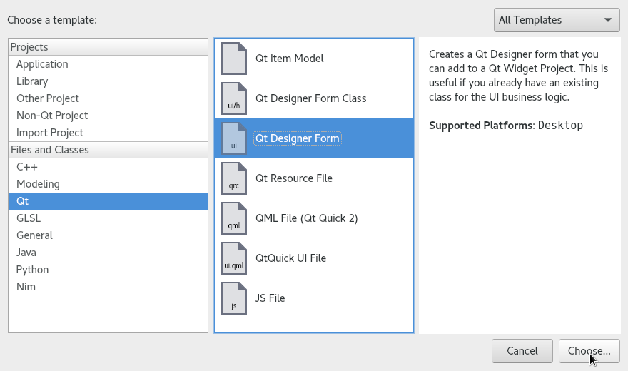

2. Then select *Widget* from the list of form templates.

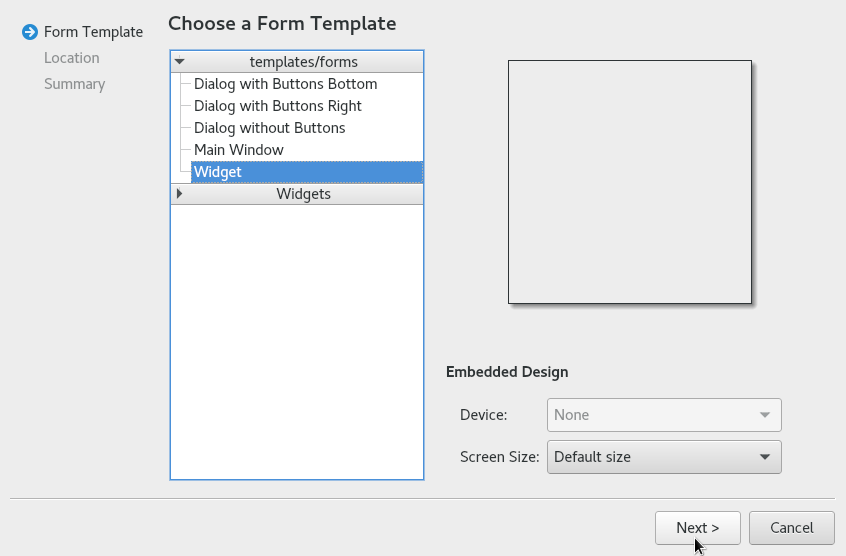

3. Enter the name for the file and save it to the location containing
the corresponding CMakeLists.txt

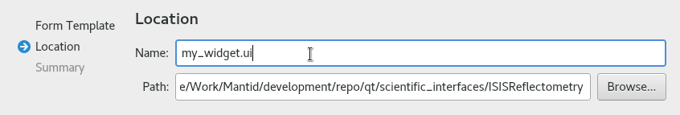

4. Click *Next* and adjust any project management settings as you wish
before clicking *Finish*.

At this point you should have an empty Widget in the design area.

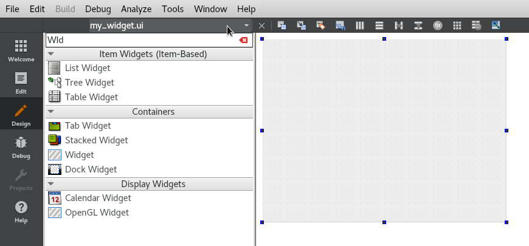

You can switch between the two ``.ui`` files using the menu in the top left.

5. Next, copy the components you wish to move into the new widget and
paste them into the new file.

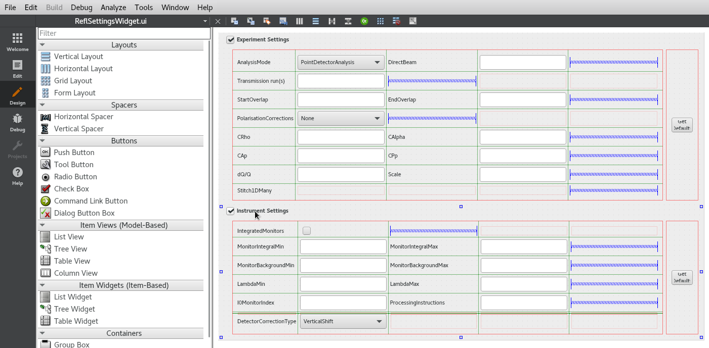

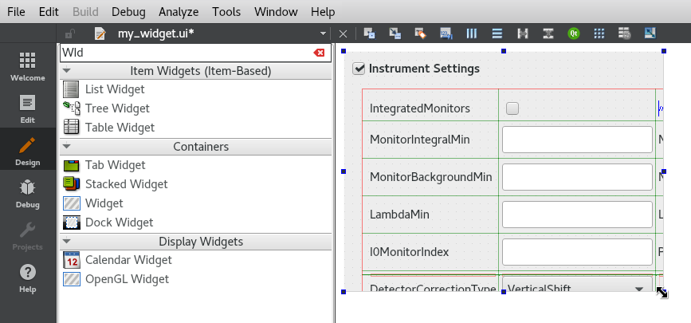

6. Make adjustments to the layout and resize behaviour of the widget as
you see fit.

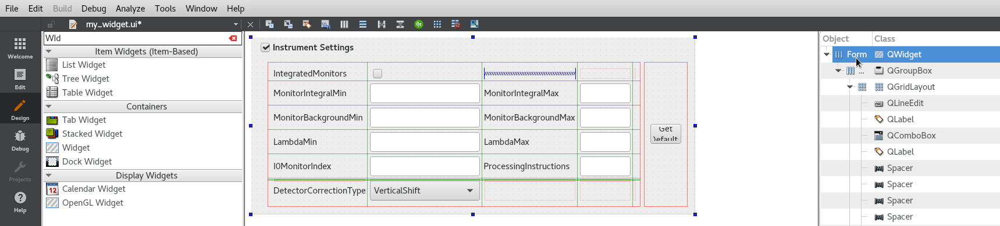

7. Add the following CMake snippet to your CMakeLists.txt, note that
you may already have a target for generating the Python files in which
case you can simply add your new ``.ui`` file to the list of existing
``.ui`` files.

.. code:: cmake

    set(UI_FILES
      my_widget.ui
    )

    UiToPy(UI_FILES CompileUIMyWidget)

Test that this has worked by saving your ``.ui`` file and re-running
the build, the output should contain a line similar to the following:

``[1/1] Generating scripts/Interface/ui/sans/ui_my_widget.py``

8. Add a separate python file containing the `View <GuiDesignGuidelinesMVPView>`__
class which extends the generated one.

.. code:: python

    # my_widget.py
    import ui_my_widget

    class MyWidget(QtGui.QWidget, ui_add_runs_page.Ui_MyWidget):
       pass

9. Return to the original interface file, delete the components you
copied across and replace them with a single *Widget* component found in
the containers section.

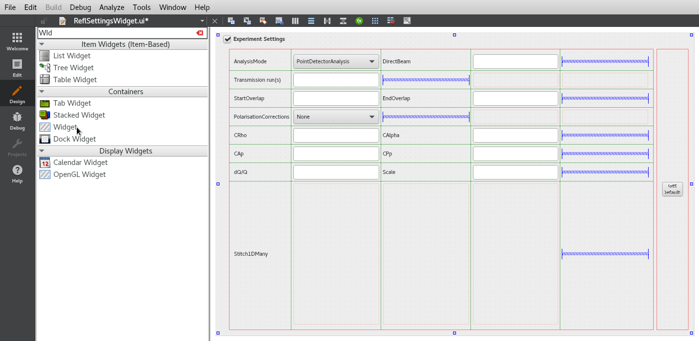

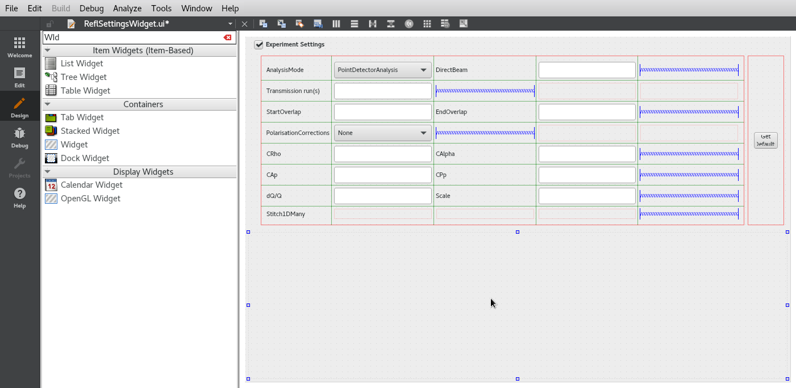

10. Right click on the newly created widget container and select
*Promote To...*

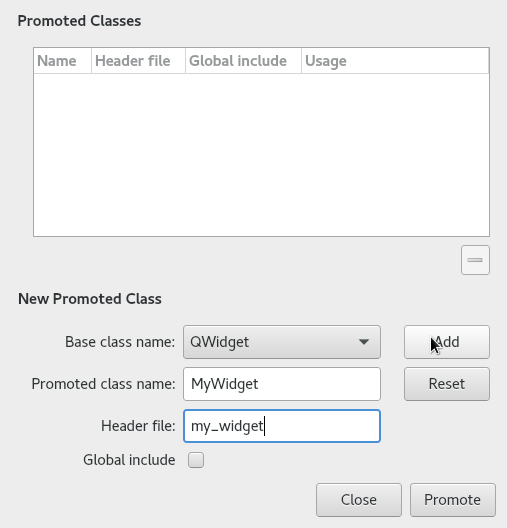

11. For the *Promoted Class Name* field enter the name of the view
class. If you are taking the advice given above, this should be the name
of the class which inherits from the generated
``ui_my_widget.Ui_MyWidget`` class.

12. For the *Header File* field enter the fully qualified path of the
python module which contains the class mentioned above.

13. You can leave the *Global Include* box un-ticked. Finish the
promotion by pressing *Add* and then *Promote*.

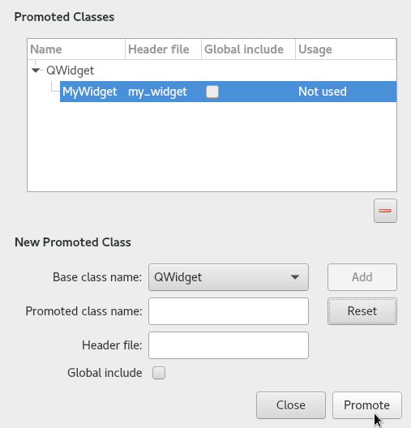

14. Save your ui files, re-run and launch the build to see the finished
result.
