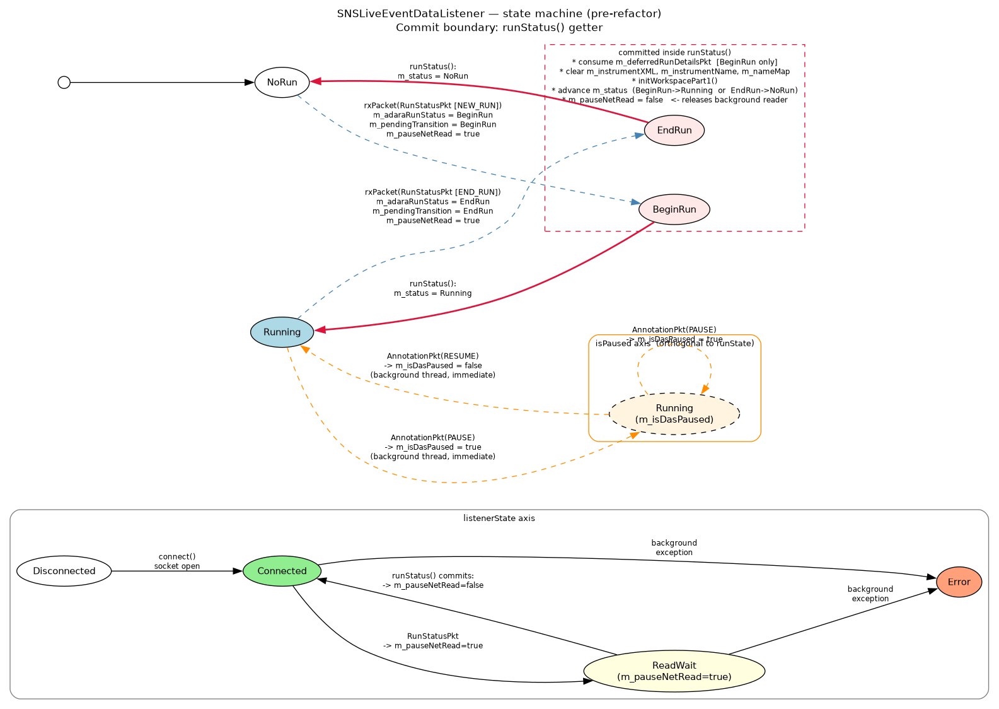
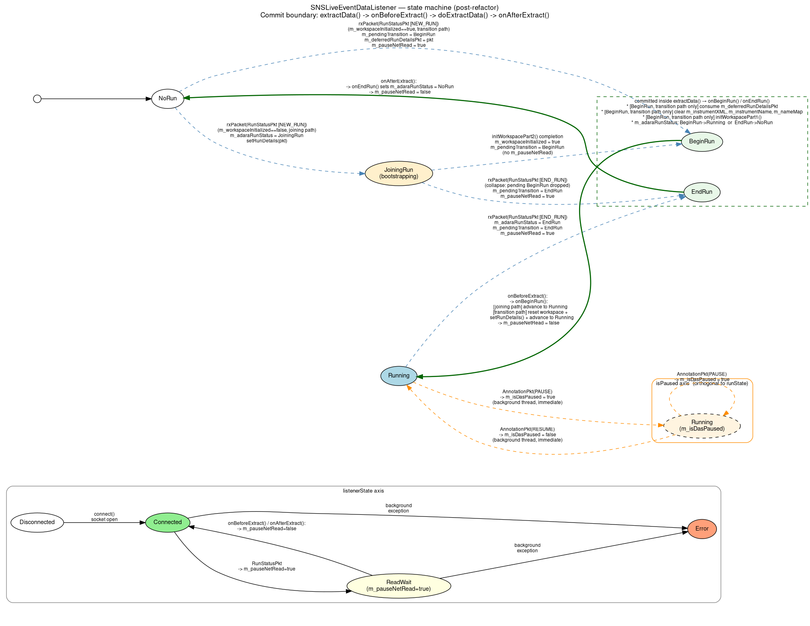

.. _SNSLiveEventDataListenerRefactoring:

``SNSLiveEventDataListener`` refactoring
==========================================

This document covers the listener-specific aspects of the June 2026 live-listener
refactor (the ADARA packet flow, the deferred ``RunStatusPkt`` handling,
the ``m_pauseNetRead`` back-pressure mechanism, and the state-machine
diagrams) for ``SNSLiveEventDataListener``.

For the generic interface — the four pure-getter queries, the
``extractData()`` template method, the migration recipe, and worked
examples for non-SNS listeners — see :ref:`LiveListenerMigration`.

.. contents::
   :local:
   :depth: 2

Scope
-----

``SNSLiveEventDataListener`` is the most complex concrete
``ILiveListener`` subclass in the tree.  It is the *only* listener
that:

* maintains a real ``BeginRun`` / ``EndRun`` edge-detection contract
  with its consumers;
* defers run-status side effects (cache clears, workspace re-init,
  deferred-packet consumption) across thread boundaries;
* uses an explicit back-pressure flag (``m_pauseNetRead``) between
  the background reader and the foreground extractor;
* has a documented pause/resume orthogonal axis driven by ADARA
  annotation packets.

Everything in this document applies to ``SNSLiveEventDataListener``
specifically.  Other listeners are simpler and are covered in
:ref:`LiveListenerMigration`.

ADARA protocol context
----------------------

The SNS live-event stream is the ADARA protocol.  Five packet types
are relevant to the state machine:

* ``ADARA::RunStatusPkt`` — carries ``NEW_RUN`` (run is starting) and
  ``END_RUN`` (run is ending) markers.  Drives the ``runState()`` axis.
* ``ADARA::AnnotationPkt`` — carries ``PAUSE`` and ``RESUME`` markers.
  Drives the ``isPaused()`` axis.
* ``ADARA::BeamlineInfoPkt`` and ``ADARA::GeometryPkt``— carry instrument-geometry
  information.  Allow completion of workspace initialization.
* ``ADARA::BankedEventPkt`` — carries the actual neutron-event
  records.  Gated on ``m_isDasPaused`` so paused events are discarded.

Two orthogonal state axes
~~~~~~~~~~~~~~~~~~~~~~~~~~

The ADARA protocol exposes two independent state axes that the
legacy ``runStatus()`` conflated:

* **Run state** — whether the DAS is in a run
  (``NoRun / BeginRun / Running / EndRun``).  Driven by
  ``RunStatusPkt``.  Transitions require workspace-level coordination
  (cache clears, re-init), so they are queued and committed in
  ``extractData()``.

* **Pause state** — whether the current run is paused.  Driven by
  ``AnnotationPkt`` ``PAUSE`` / ``RESUME`` markers.  Orthogonal to
  run state: a run can be in ``Running`` status while paused, and the
  ADARA protocol does not change the ``RunStatus`` field on a pause.
  Pause state has **no workspace-level side effects** beyond gating
  event appending, so it is applied immediately in the background
  thread, not queued.

A summary of where each axis is read and written:

.. list-table::
   :header-rows: 1
   :widths: 35 30 35

   * - Question
     - Answer
     - Type
   * - What is the DAS run state right now?
     - ``RunStatus``
     - pure read (``runState()``)
   * - Is the current run paused?
     - ``bool``
     - pure read (``isPaused()``)
   * - Is the listener connected / back-pressure / errored?
     - ``ListenerState``
     - pure read (``listenerState()``)
   * - What run-state transition (if any) did the most recent
       ``extractData()`` consume?
     - ``optional<RunStatus>``
     - pure read (``lastTransition()``)

Pre-refactor problem
--------------------

The legacy ``SNSLiveEventDataListener::runStatus()`` (roughly lines
1495–1534 in the pre-refactor ``SNSLiveEventDataListener.cpp``)
performed *all* of the following inside what callers treated as a
getter:

* Returned the cached ``m_status`` value.
* On ``BeginRun``: consumed ``m_deferredRunDetailsPkt`` via
  ``setRunDetails(*m_deferredRunDetailsPkt)``, reset the deferred
  packet, advanced ``m_status`` to ``Running``.
* On ``EndRun``: cleared ``m_instrumentXML``, ``m_instrumentName``,
  ``m_dataStartTime``, advanced ``m_status`` to ``NoRun``.
* Unconditionally: cleared the ``m_pauseNetRead`` back-pressure flag,
  releasing the background reader.
* Implicitly: marked the workspace as needing re-initialisation and
  ran ``initWorkspacePart1()`` to populate it.

This produced four distinct problems:

1. **Conflated state.**  A single ``RunStatus`` return value reported
   both the DAS run state and the listener's internal FSM position.
2. **Hidden side effects.**  Every call to ``runStatus()`` mutated
   caches and consumed packets.  Reading the state without changing
   it was impossible.
3. **The "little white lie" path (resolved by** ``JoiningRun`` **).**
   When ``NEW_RUN`` arrived before the workspace was initialised,
   ``rxPacket(RunStatusPkt)`` skipped the ``BeginRun`` transition and
   pretended the state was already ``Running``, preserving the
   workspace-init invariant but at the cost of an off-diagram code path
   that was the only ``NoRun → Running`` transition committed outside
   ``onBeginRun()``.  This is now eliminated: the listener instead
   advances to the new ``JoiningRun`` state and queues a normal
   ``BeginRun`` edge once ``initWorkspacePart2()`` completes (see
   :ref:`joining-run-state` below).
4. **Stand-alone ``LoadLiveData`` deadlock.**  ``LoadLiveData`` does
   not call ``runStatus()``.  After ``rxPacket(RunStatusPkt)`` set
   ``m_pauseNetRead = true``, nothing ever cleared it.  The
   background reader stopped, the workspace could not be
   re-initialised, and ``extractData()`` either timed out
   (``NotYet``) or spun on a stale workspace.

A fifth, more subtle issue: ``MonitorLiveData`` worked correctly *only
because* it happened to call ``extractData()`` first and
``runStatus()`` second within each polling iteration.  Nothing in
the type system enforced that ordering; it was an undocumented
contract.

New state model
---------------

The conflated ``m_status`` member is split into three:

* ``m_adaraRunStatus`` — what the DAS run state is right now (read by
  ``runState()``).  Written by ``rxPacket(RunStatusPkt)`` and by the
  ``onBeginRun()`` / ``onEndRun()`` hooks.
* ``m_pendingTransition`` — exactly one run-state edge waiting to be
  consumed by ``extractData()`` (queued by
  ``rxPacket(RunStatusPkt)``, dequeued by ``onBeforeExtract()`` for
  ``BeginRun`` and by ``onAfterExtract()`` for ``EndRun``).
* ``m_lastTransition`` — the run-state edge committed by the most
  recent successful ``extractData()`` (read by ``lastTransition()``).
  Both ``BeginRun`` and ``EndRun`` are observable to the caller between
  the ``extractData()`` that committed them and the next successful
  ``extractData()``.
* ``m_previousExtractCompleted`` — set ``true`` at the end of
  ``onAfterExtract()``, consumed (cleared) at the start of the next
  ``onBeforeExtract()`` after both ``NotYet`` gates pass.  Gates the
  deferred clear of ``m_lastTransition`` so the edge survives
  ``Exception::NotYet`` retries (the C1 invariant).

The pause flag is renamed for clarity: ``m_runPaused`` →
``m_isDasPaused``, read by ``isPaused()``.

The back-pressure flag ``m_pauseNetRead`` keeps both its name and its
meaning, to keep the diff focused and the explanatory comments in
``rxPacket(RunStatusPkt)`` intelligible.

.. _joining-run-state:

Single-slot invariant
~~~~~~~~~~~~~~~~~~~~~

At most one un-consumed transition can exist at a time.  The background
thread enforces this by setting ``m_pauseNetRead = true`` whenever it
queues a transition; the background reader then blocks until
``extractData()`` releases ``m_pauseNetRead`` via the hook.

The ``JoiningRun`` case (``NEW_RUN`` with workspace not yet initialised)
is the one path that queues *no* back-pressure: the background thread
must keep reading packets to complete workspace initialisation.  It
queues a ``BeginRun`` edge only once ``initWorkspacePart2()`` succeeds,
at which point ``m_pendingTransition`` is not yet occupied and no
back-pressure is needed (there are no prior run's events to protect).

The invariant is checked explicitly in ``rxPacket(RunStatusPkt)``;
violation is treated as an implementation error and raises:

.. code-block:: cpp

   if (m_pendingTransition) {
       throw std::runtime_error(
           "SNSLiveEventDataListener: pending run-state transition was not "
           "consumed before a new transition arrived — back-pressure invariant "
           "violation.");
   }
   m_pendingTransition = BeginRun;   // or EndRun
   m_pauseNetRead      = true;

This is a ``runtime_error`` rather than a debug-only assertion so the
condition is never silently masked in release builds.

Header summary
~~~~~~~~~~~~~~

.. code-block:: cpp

   class SNSLiveEventDataListener : public API::LiveListener,
                                    public Poco::Runnable,
                                    public ADARA::Parser {
   public:
       // pure queries
       RunStatus runState() const override;
       bool isPaused() const override;
       ListenerState listenerState() const override;
       std::optional<RunStatus> lastTransition() const override;

       int runNumber() const override { return m_runNumber; }
       bool isConnected() override;

   protected:
       /// Phase 1 of extraction: commit any queued ``BeginRun`` transition.
       /// Called by LiveListener::extractData() before doExtractData().
       /// Runs on the foreground thread.
       void onBeforeExtract() override;

       /// Phase 2/3 of extraction: wait for workspace initialisation,
       /// build the new EventWorkspace, swap, and return it.
       std::shared_ptr<API::Workspace> doExtractData() override;

       /// Phase 4 of extraction: commit any queued ``EndRun`` transition.
       /// Deferred to after doExtractData() so the finishing run's
       /// accumulated events are harvested before the workspace buffer
       /// is reset by onEndRun().
       void onAfterExtract() override;

       /// Explicit, named state-transition hooks.
       virtual void onBeginRun();
       virtual void onEndRun();
       virtual void onRunPause(bool paused);

   private:
       // ADARA / DAS state (written by background thread)
       RunStatus m_adaraRunStatus{NoRun};
       std::shared_ptr<ADARA::RunStatusPkt> m_deferredRunDetailsPkt;

       // Pending run-state transition (background -> foreground).
       // INVARIANT: at most one un-consumed transition at a time.
       std::optional<RunStatus> m_pendingTransition;

       // Result of the most recent commit (read by lastTransition()).
       std::optional<RunStatus> m_lastTransition;

       // Listener health
       std::shared_ptr<std::runtime_error> m_backgroundException;

       // Existing members (unchanged)
       int m_runNumber{0};
       DataObjects::EventWorkspace_sptr m_eventBuffer;
       bool m_workspaceInitialized{false};
       std::string m_instrumentName;
       std::string m_instrumentXML;
       /* ... etc. ... */
       mutable std::mutex m_mutex;        ///< guards all of the above
       bool m_pauseNetRead{false};        ///< back-pressure flag
       bool m_isDasPaused{false};         ///< set by onRunPause(); read by isPaused()
       NameMapType m_nameMap;
       /* ... etc. ... */
   };

State-machine diagrams
----------------------

Two diagrams below show the ``runState`` evolution for the SNS
listener.  Apart from the addition of a new ``JoiningRun`` state,
the shape of the state machine is unchanged between
pre- and post-refactor; what changes is **where the transitions are
committed** — and that change is what makes the listener safe to use
from stand-alone ``LoadLiveData``.

In both diagrams:

* Nodes are the four ``runState`` values (``NoRun``, ``BeginRun``,
  ``Running``, ``EndRun``).
* Edges are labelled with the ADARA packet (or call) that triggers
  the transition.
* A dashed box (cluster) encloses the transitions that are
  **committed at a particular point in the code** — i.e. where the
  visible state mutation and the workspace-level side effects
  actually occur.
* The ``isPaused()`` axis is shown as a separate small subgraph; it
  is orthogonal to ``runState`` and applied immediately in the
  background thread.
* The ``listenerState()`` axis is shown as a separate small subgraph.

Pre-refactor: transitions committed inside ``runStatus()``
~~~~~~~~~~~~~~~~~~~~~~~~~~~~~~~~~~~~~~~~~~~~~~~~~~~~~~~~~~

         BeginRun→Running and EndRun→NoRun edges are enclosed in a
         dashed cluster labelled "committed inside runStatus()",
         indicating that the cache clears, workspace re-init, deferred
         RunStatusPkt consumption, and m_pauseNetRead release all
         happen as side effects of the runStatus() getter.

In the pre-refactor design the commit boundary is **the
``runStatus()`` getter itself**.  External callers that never invoke
``runStatus()`` — notably stand-alone ``LoadLiveData`` — never trigger
the transition, ``m_pauseNetRead`` is never released, and the
listener deadlocks.

The diagram source is committed alongside the rendered image at
``dev-docs/source/images/SNSLiveEventDataListener-state-machine-before.dot``;
regenerate the PNG with::

    dot -Tpng -o SNSLiveEventDataListener-state-machine-before.png \
              SNSLiveEventDataListener-state-machine-before.dot

Post-refactor: transitions committed inside ``extractData()``
~~~~~~~~~~~~~~~~~~~~~~~~~~~~~~~~~~~~~~~~~~~~~~~~~~~~~~~~~~~~~

         BeginRun→Running and EndRun→NoRun edges are enclosed in a
         dashed cluster labelled "committed inside extractData()
         (onBeforeExtract → doExtractData → onAfterExtract)",
         indicating that the cache clears, workspace re-init,
         deferred-packet consumption, and m_pauseNetRead release all
         happen as part of the template-method extractData() call —
         with BeginRun dispatched in onBeforeExtract() and EndRun
         deferred to onAfterExtract() so the finishing run's events
         are harvested first.

In the post-refactor design the commit boundary is **the
``extractData()`` template method** — specifically the
``onBeforeExtract()`` and ``onAfterExtract()`` hooks that bracket
``doExtractData()``.  ``BeginRun`` is dispatched in
``onBeforeExtract()`` so the new run's workspace is initialised
before ``doExtractData()`` snapshots it; ``EndRun`` is dispatched in
``onAfterExtract()`` so the finishing run's accumulated events are
harvested before ``onEndRun()`` resets the buffer.
Because every consumer of ``ILiveListener`` calls ``extractData()``,
every consumer drives the FSM forward, and stand-alone
``LoadLiveData`` works without changes.

The diagram source is committed alongside the rendered image at
``dev-docs/source/images/SNSLiveEventDataListener-state-machine-after.dot``;
regenerate the PNG with the analogous ``dot`` command.

Implementation
--------------

Pure getters
~~~~~~~~~~~~

.. code-block:: cpp

   ILiveListener::RunStatus
   SNSLiveEventDataListener::runState() const {
       if (m_backgroundException) throw *m_backgroundException;
       std::lock_guard lock(m_mutex);
       return m_adaraRunStatus;
   }

   ListenerState
   SNSLiveEventDataListener::listenerState() const {
       std::lock_guard lock(m_mutex);
       if (m_backgroundException) return ListenerState::Error;
       if (!m_isConnected)        return ListenerState::Disconnected;
       if (m_pauseNetRead)        return ListenerState::ReadWait;
       return ListenerState::Connected;
   }

   std::optional<ILiveListener::RunStatus>
   SNSLiveEventDataListener::lastTransition() const {
       if (m_backgroundException) throw *m_backgroundException;
       std::lock_guard lock(m_mutex);
       return m_lastTransition;
   }

   bool SNSLiveEventDataListener::isPaused() const {
       std::lock_guard lock(m_mutex);
       return m_isDasPaused;
   }

All four getters are ``const`` and have no side effects.  None mutate
``m_adaraRunStatus``, ``m_isDasPaused``, ``m_pendingTransition``,
``m_pauseNetRead``, or any cache.

Background reader and packet handlers
~~~~~~~~~~~~~~~~~~~~~~~~~~~~~~~~~~~~~

In ``rxPacket(const ADARA::RunStatusPkt &pkt)`` the changes versus the
legacy implementation are:

* Replace assignments to the conflated ``m_status`` with assignments
  to ``m_adaraRunStatus``.
* On ``NEW_RUN`` with ``m_workspaceInitialized == true``: enforce the
  single-slot invariant, queue ``m_pendingTransition = BeginRun``,
  set ``m_pauseNetRead = true``.
* On ``NEW_RUN`` with ``m_workspaceInitialized == false`` (joining path):
  set ``m_adaraRunStatus = JoiningRun``, call ``setRunDetails(pkt)``
  immediately so ``run_number`` / ``run_start`` are available during the
  bootstrap window, queue **no** transition, set **no** back-pressure.
  The background thread must keep reading to complete workspace init.
  Once ``initWorkspacePart2()`` sets ``m_workspaceInitialized = true``
  and sees ``m_adaraRunStatus == JoiningRun``, it queues
  ``m_pendingTransition = BeginRun``; the foreground then commits to
  ``Running`` via the normal ``onBeginRun()`` hook (joining-completion
  path: no cache reset, no ``m_deferredRunDetailsPkt`` needed).
* On ``END_RUN``: enforce the single-slot invariant, queue
  ``m_pendingTransition = EndRun``, set ``m_pauseNetRead = true``,
  copy ``setRunDetails(pkt)`` if ``!haveRunNumber`` (unchanged).
  ``m_adaraRunStatus`` is **not** mutated here — it is advanced to
  ``NoRun`` later from ``onEndRun()`` (dispatched from
  ``onAfterExtract()`` after ``doExtractData()`` has harvested the
  finishing run's events).  Until that commit, ``runState()`` continues
  to report ``Running`` (or ``JoiningRun``); the ``EndRun`` edge is
  delivered to consumers via ``lastTransition()`` and the legacy
  ``runStatus()`` shim, satisfying the "exactly once" delivery contract.

In ``rxPacket(const ADARA::AnnotationPkt &pkt)``, ``PAUSE`` and
``RESUME`` markers call ``onRunPause(true/false)`` directly from the
background thread.  This is intentional: pause state has no
workspace-level side effects (it only gates event appending in
``rxPacket(BankedEventPkt)``), so applying it immediately at the
packet boundary gives the most accurate event filtering relative to
the DAS timeline.  The pause/resume path does **not** use
``m_pendingTransition`` and does **not** set ``m_pauseNetRead``.

Foreground snapshot gate (``m_bgThreadCaughtUp``)
~~~~~~~~~~~~~~~~~~~~~~~~~~~~~~~~~~~~~~~~~~~~~~~~~

A new ``std::atomic<bool> m_bgThreadCaughtUp{false}`` field
synchronises the background parser and the foreground extractor:

* **Background writes:** stored ``false`` at the start of every
  ``bufferParse()`` iteration; stored ``true`` at the end.
  ``receiveBytes()`` does **not** touch the flag — a background thread
  blocked in receive presents as "caught-up" because its in-memory
  state is stable.
* **Foreground use in** ``onBeforeExtract()``: if
  ``m_thread.isRunning() && !m_bgThreadCaughtUp``, the call throws
  ``Exception::NotYet`` immediately, without touching any shared state.
  This closes the inter-``rxPacket()`` race window — without it, the
  foreground could snapshot ``m_pendingTransition`` between two
  ``rxPacket()`` calls in the same ``bufferParse()`` iteration.
* **Background use in the pause loop:** the inner pause loop
  short-circuits on ``m_bgThreadCaughtUp == false`` so the foreground
  cannot wake the background thread (by clearing ``m_pauseNetRead``)
  while a parse is still in flight.
* **Run-boundary reset:** ``onEndRun()`` stores ``false`` immediately
  before setting ``m_adaraRunStatus = NoRun``.  This re-arms the
  first-extract synchronisation for every subsequent run, exactly
  mirroring the construction-time initial value: the first
  ``extractData()`` of each run is gated on that run's first
  ``bufferParse()``, not just the very first run.
* **Test-fixture note:** ``NoNetworkTest`` fixtures run with no
  background thread, so ``m_thread.isRunning()`` short-circuits the
  guard for them; no fake flag manipulation is required in tests.

``extractData()`` — the only commit point
~~~~~~~~~~~~~~~~~~~~~~~~~~~~~~~~~~~~~~~~~~

The body below is presented as a single ``extractData()`` for clarity.
In the actual implementation it is split across the three-phase
``LiveListener::extractData()`` template method
(``onBeforeExtract()`` → ``doExtractData()`` → ``onAfterExtract()``),
with the ``m_backgroundException`` rethrow remaining the
responsibility of the individual SNS getters (``runState()``,
``lastTransition()`` — see the pure-getters section above).
``onBeforeExtract()`` handles Phase 1 (commit a pending ``BeginRun``
edge); ``doExtractData()`` handles Phase 2/3 (workspace-init wait +
``EventWorkspace`` build + swap); ``onAfterExtract()`` handles Phase 4
(commit a pending ``EndRun`` edge, deferred until after
``doExtractData()`` so the finishing run's events are harvested first).
The exception-safety guarantees described below survive the split
unchanged.

.. code-block:: cpp

   std::shared_ptr<Workspace>
   SNSLiveEventDataListener::extractData() {     // conceptually
       // m_backgroundException is re-thrown in the individual SNS getters
       // (runState(), lastTransition()), not in this template method body.
       // Shown here for orientation; the base LiveListener::extractData() body
       // is simply: onBeforeExtract() → doExtractData() → onAfterExtract().

       // ---- Phase 1 (onBeforeExtract): commit a pending BeginRun --------
       {
           // Fast-path: throw NotYet immediately if the background thread is
           // mid-parse (before taking any lock).
           if (m_thread.isRunning() && !m_bgThreadCaughtUp.load(std::memory_order_acquire))
               throw Exception::NotYet("Background thread parse is in flight.");

           std::optional<RunStatus> pending;
           {
               std::lock_guard lock(m_mutex);
               // Re-check under the lock to close the TOCTOU window.
               if (m_thread.isRunning() && !m_bgThreadCaughtUp.load(std::memory_order_acquire))
                   throw Exception::NotYet("Background thread parse is in flight.");
               // Both NotYet gates passed: the prior extract's edge has been
               // delivered.  Clear it now so the next tick sees nullopt.
               // m_previousExtractCompleted is false during a NotYet retry, so
               // the edge survives retries (C1 invariant).
               if (m_previousExtractCompleted) {
                   m_lastTransition.reset();
                   m_previousExtractCompleted = false;
               }
               pending = m_pendingTransition;
           }
           if (pending && *pending == BeginRun) {
               {
                   std::lock_guard lock(m_mutex);
                   m_pendingTransition.reset();
               }
               onBeginRun();
               {
                   std::lock_guard lock(m_mutex);
                   m_lastTransition = BeginRun;     // memoise for lastTransition()
               }
               m_pauseNetRead = false;
           }
       }

       // ---- Phase 2: wait for workspace initialisation (unchanged) -----
       static const double maxBlockTime = 10.0;
       const DateAndTime endTime = DateAndTime::getCurrentTime() + maxBlockTime;
       while (!m_workspaceInitialized && DateAndTime::getCurrentTime() < endTime) {
           Poco::Thread::sleep(100);
       }
       if (!m_workspaceInitialized) {
           throw Exception::NotYet("The workspace has not yet been initialized.");
       }
       if (m_ignorePackets) {
           throw Exception::NotYet("Waiting for a run to start.");
       }

       // ---- Phase 3: build the new EventWorkspace and swap (unchanged) -
       EventWorkspace_sptr temp = std::dynamic_pointer_cast<EventWorkspace>(
           API::WorkspaceFactory::Instance().create(
               "EventWorkspace", m_eventBuffer->getNumberHistograms(), 2, 1));
       API::WorkspaceFactory::Instance().initializeFromParent(*m_eventBuffer, *temp, false);
       temp->mutableRun().clearOutdatedTimeSeriesLogValues();
       for (auto &monitorLog : m_monitorLogs)
           temp->mutableRun().removeProperty(monitorLog);
       m_monitorLogs.clear();

       auto monitorBuffer = m_eventBuffer->monitorWorkspace();
       if (monitorBuffer) {
           auto newMonitorBuffer = WorkspaceFactory::Instance().create(
               "EventWorkspace", monitorBuffer->getNumberHistograms(), 1, 1);
           WorkspaceFactory::Instance().initializeFromParent(
               *monitorBuffer, *newMonitorBuffer, false);
           temp->setMonitorWorkspace(newMonitorBuffer);
       }
       {
           std::lock_guard lock(m_mutex);
           std::swap(m_eventBuffer, temp);
       }

       // ---- Phase 4 (onAfterExtract): commit a pending EndRun ----------
       // Deferred so the snapshot above contains the finishing run's
       // accumulated events before onEndRun() resets the buffer.
       {
           std::optional<RunStatus> pending;
           {
               std::lock_guard lock(m_mutex);
               pending = m_pendingTransition;
               // m_lastTransition is NOT cleared here; it is cleared at the
               // start of the next onBeforeExtract() after both NotYet gates
               // pass, guarded by m_previousExtractCompleted.
           }
           if (pending && *pending == EndRun) {
               {
                   std::lock_guard lock(m_mutex);
                   m_pendingTransition.reset();
                   m_lastTransition = EndRun;   // memoise for lastTransition()
               }
               onEndRun();
               m_pauseNetRead = false;
           }
       }
       {
           std::lock_guard lock(m_mutex);
           m_previousExtractCompleted = true;   // allow next onBeforeExtract to clear
       }
       return temp;
   }

.. _sns-c1-invariant:

Critical detail (C1)
~~~~~~~~~~~~~~~~~~~~

``m_lastTransition`` is cleared at the **start of the next
onBeforeExtract()**, after both ``NotYet`` gates pass, guarded by
``m_previousExtractCompleted``.  The flag is set to ``true`` only at
the end of ``onAfterExtract()`` — which runs only when
``doExtractData()`` returns normally.  A ``NotYet`` thrown from Phase
1 (before either gate returns) or Phase 2/3 therefore leaves
``m_previousExtractCompleted == false``, so the retry's
``onBeforeExtract()`` preserves the edge intact.  This is the **C1
invariant**.

Important properties:

* **Each phase runs once per call.**  The pending transition is dequeued
  atomically in whichever phase claims it (Phase 1 for ``BeginRun``,
  Phase 4 for ``EndRun``); no ``m_transitionHandled`` flag is needed.
* **``BeginRun`` and ``EndRun`` are symmetric.**  Both are observable to
  the caller via ``lastTransition()`` between the ``extractData()`` that
  committed them and the next successful ``extractData()``.  This matters
  for ``MonitorLiveData``, which reads ``lastTransition()`` *after*
  ``extractData()`` returns and uses a ``BeginRun`` edge to drive the
  ``_post`` workspace-rename path.
* **The transition phases hold the mutex only while reading the
  queue**, not while running the transition hook.  Hooks may safely
  take the mutex themselves.
* **Exception-safe.**  ``m_previousExtractCompleted`` flips to ``true``
  only at the end of ``onAfterExtract()``, which runs only after
  ``doExtractData()`` returns normally.  Any ``Exception::NotYet``
  thrown from Phase 1 (before either gate) or Phase 2/3 structurally
  leaves the flag ``false``, so the deferred clear is skipped on the
  retry — the :ref:`C1 invariant <sns-c1-invariant>` is a consequence
  of the template-method contract and the flag's placement, not an
  extra branch.  A pending ``EndRun`` is not consumed until Phase 4
  completes, so a Phase 2/3 failure leaves it queued for the next
  ``extractData()``.

Transition hooks
~~~~~~~~~~~~~~~~

.. code-block:: cpp

   void SNSLiveEventDataListener::onBeginRun() {
       std::lock_guard lock(m_mutex);

       m_workspaceInitialized = false;

       // Cache clears: exactly the set the legacy runStatus() clears.
       m_instrumentXML.clear();
       m_instrumentName.clear();
       // Note: m_dataStartTime NOT cleared on BeginRun — matches legacy.
       m_nameMap.clear();

       initWorkspacePart1();

       if (!m_deferredRunDetailsPkt) {
           // Invariant: rxPacket(NEW_RUN) must have stashed the RunStatusPkt
           // before queueing BeginRun. Reaching here means a producer queued
           // a BeginRun transition without populating m_deferredRunDetailsPkt,
           // which is an implementation error in the listener itself.
           throw std::runtime_error(
               "SNSLiveEventDataListener::onBeginRun(): "
               "m_deferredRunDetailsPkt is null — invariant violation.");
       }
       setRunDetails(*m_deferredRunDetailsPkt);
       m_deferredRunDetailsPkt.reset();

       m_adaraRunStatus = Running;   // we've crossed the edge
       // m_pauseNetRead released by the caller (onBeforeExtract) after
       // this hook returns — not here.
   }

   void SNSLiveEventDataListener::onEndRun() {
       std::lock_guard lock(m_mutex);

       m_workspaceInitialized = false;

       m_instrumentXML.clear();
       m_instrumentName.clear();
       m_dataStartTime = Types::Core::DateAndTime();   // cleared only on EndRun
       m_nameMap.clear();

       initWorkspacePart1();

       m_adaraRunStatus = NoRun;
       // m_pauseNetRead released by the caller (onAfterExtract) after
       // this hook returns — not here.
   }

   void SNSLiveEventDataListener::onRunPause(bool paused) {
       // Called from rxPacket(AnnotationPkt) which already holds m_mutex;
       // the hook does not re-lock.
       //
       // NOT dispatched through the pending-transition queue.
       // Pause state is orthogonal to run state: m_adaraRunStatus remains
       // Running while the run is paused. m_isDasPaused is read by
       // isPaused() and by rxPacket(BankedEventPkt) to gate event
       // appending.  Applying this immediately gives accurate event counts:
       // events received after the PAUSE annotation but before the next
       // extractData() call are correctly discarded.
       m_isDasPaused = paused;
   }

Notes:

* The cache-clear side effects inside ``onBeginRun()`` / ``onEndRun()``
  (``m_instrumentXML``, ``m_instrumentName``, ``m_nameMap``,
  ``initWorkspacePart1()``, etc.) are identical to what the legacy
  ``runStatus()`` did.  The ``m_pauseNetRead`` release has moved out
  of these hooks into their callers (``onBeforeExtract()`` /
  ``onAfterExtract()``), so the back-pressure flag is owned by the
  same scope that decided to dispatch the hook.
* ``onBeginRun()`` and ``onEndRun()`` are ``protected virtual`` and
  dispatched only from ``onBeforeExtract()`` and ``onAfterExtract()``
  respectively.  Tests can subclass the listener and override the
  hooks to assert they fired with the expected preconditions.
* ``onRunPause()`` is ``protected virtual`` and called only from
  ``rxPacket(AnnotationPkt)`` in the background thread, which already
  holds ``m_mutex``.  The hook therefore does not take the mutex
  itself.  Its dispatch point differs from ``onBeginRun()`` /
  ``onEndRun()`` by design.
* The existing ``m_runPaused`` check in ``rxPacket(BankedEventPkt)``
  is updated to reference ``m_isDasPaused``; no other change to that
  function.

Background reader loop
~~~~~~~~~~~~~~~~~~~~~~

The loop has two notable changes from the pre-refactor version.

First, the pause condition is short-circuited on
``m_bgThreadCaughtUp``.  When the flag is ``false`` (i.e. a
``bufferParse()`` iteration is in flight), the background thread never
honours ``m_pauseNetRead`` — this prevents the foreground from
releasing back-pressure while ``rxPacket()`` callbacks may still be
mutating shared state.

Second, the ``m_bgThreadCaughtUp`` flag is stored ``false``
immediately before ``bufferParse()`` and ``true`` immediately
after, framing the only window during which ``onBeforeExtract()``
must throw ``NotYet``.  ``receiveBytes()`` does **not** touch the
flag; a background thread blocked in receive presents as caught-up.

.. code-block:: cpp

   void SNSLiveEventDataListener::run() {
       // ... unchanged setup (hello packet, etc.) ...
       while (!m_stopThread) {
           // Only honour m_pauseNetRead when no parse is in flight.
           // Short-circuit on m_bgThreadCaughtUp == false prevents a race
           // where the foreground clears m_pauseNetRead while we are still
           // inside bufferParse() mutating shared state.
           while (m_bgThreadCaughtUp.load(std::memory_order_acquire)
                  && m_pauseNetRead && !m_stopThread) {
               Poco::Thread::sleep(100);
           }
           if (m_stopThread) break;

           // receiveBytes() does NOT touch m_bgThreadCaughtUp.
           // A thread blocked here presents as caught-up.
           receiveBytes();   // fills the ADARA parse buffer

           // Close the foreground snapshot window for bufferParse() only.
           m_bgThreadCaughtUp.store(false, std::memory_order_release);
           bufferParse();    // drives rxPacket() callbacks
           m_bgThreadCaughtUp.store(true, std::memory_order_release);
           // Snapshot window re-opened; m_pendingTransition is now stable.
       }
       // ... unchanged exception capture into m_backgroundException ...
   }

The ``m_pauseNetRead`` back-pressure is released by
``onBeforeExtract()`` (for ``BeginRun``) and ``onAfterExtract()``
(for ``EndRun``) inside ``extractData()``, so stand-alone
``LoadLiveData`` no longer deadlocks.

Note that ``onEndRun()`` also participates in the flag's lifecycle: it
stores ``false`` to re-arm the per-run first-extract gate (see the
"Foreground snapshot gate" section above).  The background loop itself
only writes the flag around ``bufferParse()``; ``onEndRun()`` is the
only other writer.

Behaviour preservation (SNS-specific)
-------------------------------------

.. list-table::
   :header-rows: 1
   :widths: 50 22 28

   * - Behaviour
     - Pre-refactor
     - Post-refactor
   * - ``runStatus()`` returns ``BeginRun`` exactly once at the start
       of a run
     - yes, via mutation
     - yes, via ``lastTransition()`` populated by ``extractData()``
   * - ``runStatus()`` returns ``EndRun`` exactly once at the end of
       a run
     - yes
     - yes
   * - Workspace re-initialised at run boundaries
     - inside ``runStatus()``
     - inside ``onBeginRun()`` / ``onEndRun()``
   * - ``m_dataStartTime`` cleared on ``EndRun`` only, not on
       ``BeginRun``
     - yes
     - yes
   * - ``m_instrumentXML``, ``m_instrumentName``, ``m_nameMap``
       cleared at both boundaries
     - yes
     - yes
   * - ``m_deferredRunDetailsPkt`` consumed at ``BeginRun``
     - yes
     - yes, inside ``onBeginRun()``
   * - ``m_pauseNetRead`` released after the boundary is consumed
     - inside ``runStatus()``
     - inside ``onBeforeExtract()`` / ``onAfterExtract()``, immediately
       after the inner hook (``onBeginRun()`` / ``onEndRun()``) returns
   * - ``JoiningRun`` mid-stream bootstrap when ``NEW_RUN`` arrives
       before ``m_workspaceInitialized``
     - yes (as "little white lie" direct ``Running`` assignment)
     - yes — replaced by honest ``JoiningRun`` state; ``BeginRun``
       edge queued from ``initWorkspacePart2()`` completion
   * - ``m_isDasPaused`` flips on ``AnnotationPkt`` PAUSE / RESUME
     - yes, inline
     - yes, routed through ``onRunPause()`` in background thread
   * - Paused events discarded at the correct packet boundary
     - yes
     - yes — ``m_isDasPaused`` flipped immediately in background
       thread, not deferred
   * - ``isPaused()`` query available without calling ``runStatus()``
     - **no**
     - yes (``isPaused()`` is a ``const`` pure getter)
   * - ``MonitorLiveData`` workspace renaming triggers on
       ``BeginRun`` / ``EndRun``
     - yes
     - yes (legacy ``runStatus()`` shim returns the edge)
   * - Stand-alone ``LoadLiveData`` produces a workspace
     - **no** (deadlocks)
     - yes (commit happens inside ``extractData()``)
   * - Listener can be queried for its state without mutating it
     - **no**
     - yes (all queries ``const``)

There is one behaviour that is intentionally not preserved, and it is
the bug the refactor exists to fix: stand-alone ``LoadLiveData``
previously deadlocked after a run boundary; it now succeeds.

Appendix — pre-existing defect: ``m_ignorePackets`` is never set ``true``
--------------------------------------------------------------------------

This is a **pre-existing defect** in the upstream
``SNSLiveEventDataListener``, discovered while writing the new
integration-test suite.  It is **not** introduced by the v3 refactor;
it predates the refactor by many years.  It is documented here so that
maintainers do not waste time hunting it during code review of the
refactor PR.

Summary
~~~~~~~

``SNSLiveEventDataListener::m_ignorePackets`` is declared with an
in-class initialiser of ``false`` and is **never assigned ``true``
anywhere in the codebase**.  As a consequence:

* The "filter packets until run start" path
  (``m_filterUntilRunStart``) is unreachable.
* The "filter packets until absolute start time" path is unreachable.
* The variable-value packet cache (``m_variableMap``) is populated by
  the ``rxPacket(VariableU32Pkt&)`` / ``VariableDoublePkt`` /
  ``VariableStringPkt`` overloads but is **never replayed**, because
  ``replayVariableCache()`` is only called from inside the
  ``if (!m_ignorePackets) { ... }`` block of ``ignorePacket()``, which
  is itself reached only when ``m_ignorePackets`` is ``true``.
* The ``extractData()`` guard
  ``if (m_ignorePackets) throw Exception::NotYet("Waiting for a run to start.");``
  can never throw.

In short: a chunk of ``SNSLiveEventDataListener`` that exists
specifically to support ``StartLiveData``'s "from start of run" and
"from absolute time" modes is dead code as currently written.

Evidence
~~~~~~~~

The only writes to ``m_ignorePackets`` are *clears* inside
``ignorePacket()`` — there is no ``m_ignorePackets = true;`` anywhere
in the tree.  ``start()`` parses the requested ``startTime`` to decide
which filter mode to use, but only sets ``m_filterUntilRunStart``,
never ``m_ignorePackets``:

.. code-block:: cpp

   void SNSLiveEventDataListener::start(const Types::Core::DateAndTime startTime) {
       m_startTime = startTime;
       if (m_startTime.totalNanoseconds() == 1000000000) {
           // "from start of previous run" sentinel
           m_filterUntilRunStart = true;
           // m_ignorePackets = true;   // <-- MISSING
       }
       // else if (m_startTime != DateAndTime()) {
       //     m_ignorePackets = true;   // <-- MISSING (time-based filter)
       // }
       m_thread.start(*this);
   }

The ``else`` branch in ``ignorePacket()`` whose comment reads
*"Filter based solely on time"* is, today, unreachable without the
missing assignment in ``start()``.

Provenance
~~~~~~~~~~

This was checked against multiple points in the upstream history.  The
defect is present in:

* ``mantidproject/mantid`` @ current ``main``,
* ``mantidproject/mantid`` @ ``a86c1e02`` (~2018).

The defect is therefore pre-existing in upstream and predates any of
the work on the current refactor.

Impact
~~~~~~

* ``StartLiveData`` "Now" mode (no ``StartTime``, no historical
  replay) is unaffected — that path was never supposed to set
  ``m_ignorePackets``.
* ``StartLiveData`` "from start of run" mode: historical packets sent
  by SMS that precede the most recent ``NEW_RUN`` are **not** filtered
  out.  The user sees whatever SMS happens to send.
* ``StartLiveData`` with a non-default ``StartTime``: packets older
  than ``m_startTime`` are **not** filtered out.
* Variable-value packets that arrive during what *should* be the
  filtered prefix are not deferred-and-replayed; they are processed
  immediately, in arrival order, with no end-of-filter coalescing.

Why it has gone unnoticed: the only existing unit-test suite
(``SNSLiveEventDataListenerNoNetworkTest.h``) does not exercise the
filter paths, and the disabled legacy integration suite was
network-dependent and unregistered.  The behavioural difference is
subtle: extra historical events at the front of the stream rather than
a hard failure.

Recommended fix (separate PR)
~~~~~~~~~~~~~~~~~~~~~~~~~~~~~

In ``SNSLiveEventDataListener::start()``:

.. code-block:: cpp

   void SNSLiveEventDataListener::start(const Types::Core::DateAndTime startTime) {
       m_startTime = startTime;

       if (m_startTime.totalNanoseconds() == 1000000000) {
           // "From start of previous run" sentinel: replay everything,
           // then filter out all packets older than the next NEW_RUN.
           m_filterUntilRunStart = true;
           m_ignorePackets       = true;
       } else if (m_startTime != Types::Core::DateAndTime()) {
           // Absolute-time filter: drop everything older than m_startTime.
           m_ignorePackets = true;
       }
       // else: "Now" mode — no historical filtering, m_ignorePackets
       // stays false (the default).

       m_thread.start(*this);
   }

The fix must be accompanied by:

* A targeted no-network unit test for ``start()`` itself, asserting
  that the correct combination of ``m_ignorePackets`` /
  ``m_filterUntilRunStart`` is produced for each of the three
  ``startTime`` inputs (sentinel, absolute past time,
  default-constructed "now").
* Re-enabling any integration tests that were ``TS_SKIP``-guarded
  pending this fix.
* A conversation with the SNS team confirming the intended semantics
  — in particular, when the sentinel ``1e9 ns`` value is used, is the
  intent really to ignore *all* packets until a ``NEW_RUN``, or is the
  intent to ignore everything older than the *previous* run's
  ``NEW_RUN``?  The dead code implies the former; the comment in
  ``start()`` implies the latter.

New integration-tests that depend on the filter paths working should
guard those tests with ``TS_WARN("XFAIL:...")``, citing this defect.

Testing
-------

Unit tests — ``SNSLiveEventDataListenerNoNetworkTest.h``
~~~~~~~~~~~~~~~~~~~~~~~~~~~~~~~~~~~~~~~~~~~~~~~~~~~~~~~~~

These tests exercise the state machine and hooks with no background
thread and no network connection.  All live in
``Framework/LiveData/test/SNSLiveEventDataListenerNoNetworkTest.h``.

* ``test_field_rename_does_not_break_pause_handling``
* ``test_onBeginRun_throws_when_deferred_run_details_missing``
* ``test_onRunPause_is_callable_and_toggles``
* ``test_runState_pure_getter_does_not_mutate``
* ``test_listenerState_initially_disconnected``
* ``test_lastTransition_initially_null``
* ``test_isPaused_initially_false``
* ``test_isPaused_orthogonal_to_runState``
* ``test_onBeforeExtract_dispatches_BeginRun_to_hook``
* ``test_onAfterExtract_dispatches_EndRun_to_hook``
* ``test_no_transition_no_hook``
* ``test_lastTransition_survives_NotYet_retry``
* ``test_lastTransition_cleared_after_successful_extract``
* ``test_lastTransition_reports_EndRun_then_null_after_success``
* ``test_legacy_runStatus_returns_edge_then_state``
* ``test_background_exception_propagates_from_all_getters``
* ``test_rxRunStatusPkt_newRun_throws_when_slot_occupied``
* ``test_rxRunStatusPkt_endRun_throws_when_slot_occupied``

Integration tests — ``SNSLiveEventDataListenerTest.h``
~~~~~~~~~~~~~~~~~~~~~~~~~~~~~~~~~~~~~~~~~~~~~~~~~~~~~~~

These tests spin up an in-process mock SMS server (Unix-domain
socket) and drive the full packet-parse path including the background
reader thread.  All live in
``Framework/LiveData/test/SNSLiveEventDataListenerTest.h``.
Key tests include (the file is the authoritative list):

* ``test_connect_succeeds_over_uds``
* ``test_singleRun_extractsEventsAndRunNumber``
* ``test_fullRun_beginExtractEndExtract``
* ``test_runNumber_proposalId_title_propagate``
* ``test_lastTransition_preservedAcrossNotYet``
* ``test_notYet_whenGeometryDelayed``
* ``test_consecutiveNewRun_surfacesRuntimeError``
* ``test_newRunEndRun_backPressureProducesReadWaitThenCleanEndRun``
* ``test_pauseResume_orthogonalToRunState``
* ``test_pausedEvents_droppedByDefault``
* ``test_pausedEvents_keptWhenConfigured``
* ``test_filterUntilRunStart_dropsPreRunPackets``
* ``test_variableCache_replayedAfterStartCondition``
* ``test_bgThreadCaughtUp_throwsNotYet_whenBgThreadStillReceiving``
* ``test_bgThreadCaughtUp_proceeds_afterCaughtUp``
* (plus additional coverage of monitors, bad pixels, disconnect, etc.)

Integration tests — ``SNSLiveEventDataListenerAlgorithmIntegrationTest.h``
~~~~~~~~~~~~~~~~~~~~~~~~~~~~~~~~~~~~~~~~~~~~~~~~~~~~~~~~~~~~~~~~~~~~~~~~~~

These tests exercise the full ``LoadLiveData`` / ``MonitorLiveData``
algorithm stack on top of the listener.  Both live in
``Framework/LiveData/test/SNSLiveEventDataListenerAlgorithmIntegrationTest.h``.

* ``test_LoadLiveData_standalone_no_deadlock`` — drives a ``BeginRun``
  boundary through the complete ``LoadLiveData`` algorithm; asserts the
  algorithm completes without deadlocking and produces a workspace.
  This is the **regression test** for the bug that motivated v3.
* ``test_MonitorLiveData_workspace_renaming_unchanged`` — drives a
  ``NoRun → BeginRun → Running → EndRun → NoRun`` sequence; asserts
  the output workspace is renamed with the correct suffix at each
  boundary using the *unmodified* ``MonitorLiveData``, proving
  backward compatibility.

Legacy tests — ``SNSLiveEventDataListenerLegacyTest.h``
~~~~~~~~~~~~~~~~~~~~~~~~~~~~~~~~~~~~~~~~~~~~~~~~~~~~~~~

The only pre-existing tests for the ``SNSLiveEventDataListener`` were in
the original network-dependent test suite (``testProperties``,
``testStart``, ``testExtractData``, ``testThreadSafety``) that
required a live SEQUOIA instrument connection.  Previously these tests
were not registered in ``CMakeLists.txt``, and therefore did not run in CI.
After this refactor, this file is retained as a historical reference only;
the integration and unit test files above supersede it.

Further reading
---------------

* :ref:`LiveListenerMigration` — the generic migration guide and
  per-listener worked examples.
* ``Framework/LiveData/inc/MantidLiveData/SNSLiveEventDataListener.h``
* ``Framework/LiveData/src/SNSLiveEventDataListener.cpp``
* ``Framework/API/inc/MantidAPI/LiveListener.h`` — ``extractData()``
  template method.
* ``Framework/API/inc/MantidAPI/ILiveListener.h`` — base-class
  interface.
