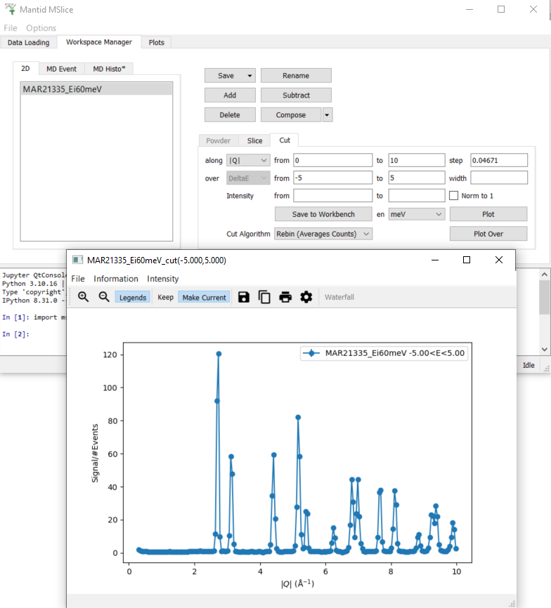
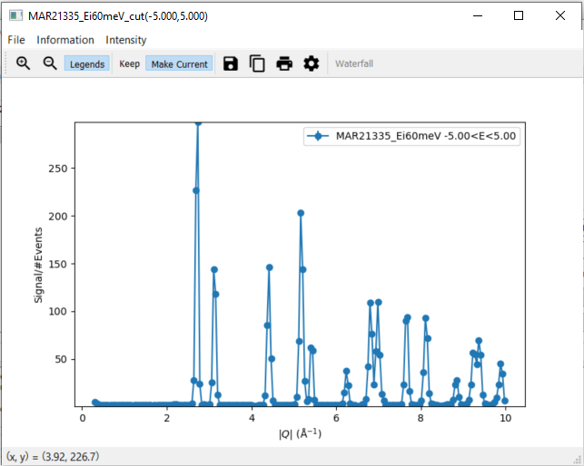

.. _mslice_testing:
.. only:: html

  :math:`\renewcommand\AA{\mathring{A}}`

MSlice Testing
===================

.. contents::
   :local:

Introduction
------------
MSlice is a tool for visualizing cuts and slices of inelastic neutron scattering data. This version uses Mantid to process the data and plots it using matplotlib. It includes both a GUI and a commandline interface with a script generator.

See here for the current MSlice documentation: http://mantidproject.github.io/mslice

Set Up
------

#. Ensure you have the `ISIS Sample Data <http://download.mantidproject.org>`__ available on your machine.
#. If you are using a conda install of Mantid Workbench, make sure to install MSlice by running ``mamba install -c mantid mslice`` inside your conda enviroment and restart the Mantid Workbench.
#. If you are using a standalone install of Mantid Workbench, MSlice should already be available within it.
#. Open ``Interfaces`` > ``Direct`` > ``MSlice``
#. Go to the ``Data Loading`` tab and select ``MAR21335_Ei60meV.nxs`` from the sample data.
#. Click ``Load Data``
#. This should open the ``Workspace Manager`` tab with a workspace called ``MAR21335_Ei60meV``

Default Settings
----------------

#. In the ``Options`` menu, change ``Default Energy Units`` from ``meV`` to ``cm-1`` and ``Cut algorithm default`` from ``Rebin (Averages Counts)`` to ``Integration (Sum Counts)``.
#. The ``en`` setting on the ``Slice`` tab changes from ``meV`` to ``cm-1`` and the values in the row labelled ``y`` change. Please note that the ``Slice`` and ``Cut`` tabs are not enabled before at least one data set has been loaded.
#. Navigate to the ``Cut`` tab
#. Verify that ``en`` is set to ``cm-1`` and ``Cut Algorithm`` to ``Integration (Sum Counts)``
#. Change both settings back to their original values, ``Default Energy Units`` to ``meV`` and ``Cut algorithm default`` to ``Rebin (Averages Counts)``.

Taking Slices
-------------

1. Plotting a Slice
###################

#. In the ``Workspace Manager`` tab select the workspace ``MAR21335_Ei60meV``
#. Click ``Display`` in the ``Slice`` tab without changing the default values
#. On the slice plot, click ``Keep``

.. figure:: ../../../../docs/source/images/slice_plot.png
   :alt: slice_plot.png
   :align: center
   :width: 80%

2. Modifying a Slice
####################

#. Modify the slice settings in the ``Slice`` tab, for instance the values for x for ``from`` to ``1.5`` and ``to`` to ``5.5`` , and click ``Display``
#. A second slice plot should open with a plot reflecting your changes in the settings
#. The original slice plot should remain unchanged

.. figure:: ../../../../docs/source/images/modified_slice_plot.png
   :alt: modified_slice_plot.png
   :align: center
   :width: 80%

3. The Plots Tab
################

#. Navigate to the ``Plots`` tab of MSlice and check that there are entries for two plots
#. Open the ``Plots`` tab of Mantid and check that there are no entries for plots
#. Select one of the plots in the ``Plots`` tab of MSlice and click on ``Hide``, the corresponding plot should disappear
#. Now click on ``Show`` for this plot and it should re-appear again
#. Double-click on elements of the original slice plot and modify settings, for instance the plot itself and the colorbar axes
#. Change the plot title and the y axis label to LaTeX, for instance ``$\mathrm{\AA}^{-1}$``, and ensure the text is displayed correctly (for ``$\mathrm{\AA}^{-1}$`` it should be :math:`\mathrm{\AA}^{-1}`)
#. Ensure that the slice plot changes accordingly
#. Click ``Make Current`` on the original slice plot
#. Modify the slice settings in the ``Slice`` tab again and click ``Display``
#. This time the new slice plot overwrites the original slice plot

4. Overplot Recoil Lines and Bragg Peaks
########################################

#. Navigate to the ``Information`` menu on the slice plot
#. Select ``Hydrogen`` from the submenu for ``Recoil lines``. A blue line should appear on the slice plot.
#. Select two or three materials from the submenu for ``Bragg peaks`` and ensure that Bragg peaks in different colours per material are plotted on the slice plot.
#. Make sure that when deselecting one of the materials only the respective Bragg peaks are removed from the slice plot but the ones still selected remain.

.. figure:: ../../../../docs/source/images/recoil_line_bragg_peaks.png
   :alt: recoil_line_bragg_peaks.png
   :align: center
   :width: 80%

5. Generate a Script
####################

#. Navigate to the ``File`` menu on the slice plot
#. Select ``Generate Script to Clipboard`` and paste the script into the Mantid editor. Please note that on Linux ``Ctrl + V`` might not work as expected. Use ``shift insert`` instead in this case.
#. Run the script and check that the same slice plot is displayed

Taking Cuts
-----------

1. Plotting a Cut
#################

#. In the ``Workspace Manager`` tab select the workspace ``MAR21335_Ei60meV``
#. Navigate to the ``Cut`` tab
#. In the row labelled ``along``, set the ``from`` value to ``0`` and the ``to`` value to ``10``
#. In the row labelled ``over``, set the ``from`` value to ``-5`` and the ``to`` value to ``5``
#. Click ``Plot``. A new window with a cut plot should open.

2. Changing the intensity of a Cut
##################################
#. Navigate to the ``Intensity`` menu on the cut plot
#. Select ``Chi''(Q,E)`` and set a value of ``100``
#. The y axis of the cut plot should change to a higher maximal value

3. Modifying a Cut
##################

#. Check that the menu item ``Recoil lines`` is disabled within the menu item ``Information``.
#. Modify the step size on the ``Cut`` tab to ``0.02`` and click ``Plot Over``. A second cut should appear on the cut plot in a different colour.
#. Click on Plot Options on the cut plot and modify settings
#. Ensure that the cut plot changes accordingly
#. Click on Save to Workbench on the ``Cut`` tab and check that in Mantid a workspace with the name ``MAR21335_Ei60meV_cut(-5.000,5.000)`` appears. In case there are several cuts with the same parameter, these workspaces are differentiated by appending an index, so there might be a workspace named ``MAR21335_Ei60meV_cut(-5.000,5.000)_(2)`` instead.
#. In the row labelled ``over``, set the ``from`` value to ``-1`` and the ``to`` value to ``1`` and click ``Plot``
#. Navigate to the tab ``MD Histo`` tab and check that there are at least two entries, ``MAR21335_Ei60meV_cut(-5.000,5.000)`` and ``MAR21335_Ei60meV_cut(-1.000,1.000)``. Please note that there might be more entries from the previous tests.
#. Select ``MAR21335_Ei60meV_cut(-1.000,1.000)`` and click ``Save to Workbench``
#. Check that in Mantid a workspace with the name ``MAR21335_Ei60meV_cut(-1.000,1.000)`` appears
#. Navigate to the ``Cut`` tab
#. In the row labelled ``along``, select ``DeltaE``
#. In the row labelled ``over``, select ``2Theta``
#. In the row labelled ``along``, set the ``from`` value to ``-5`` and the ``to`` value to ``5``
#. In the row labelled ``over``, set the ``from`` value to ``30`` and the ``to`` value to ``60``
#. Click ``Plot``
#. Depending on the cutting algorithm, the plot will look similar to the plot below when using the integration method

.. figure:: ../../../../docs/source/images/cut_plot.png
   :alt: cut_plot.png
   :align: center
   :width: 80%

and similar to the plot below when using the rebin method.

.. figure:: ../../../../docs/source/images/cut_plot_2.png
   :alt: cut_plot.png
   :align: center
   :width: 80%

4. Interactive Cuts
###################

#. Navigate to the ``Slice`` tab of the ``Workspace Manager`` tab
#. Click ``Display`` in the ``Slice`` tab without changing the default values
#. On the slice plot, select ``Interactive Cuts``
#. Use the cursor to select a rectangular region in the slice plot. A second window with a cut plot should open.
#. Check that the menu item ``Intensity`` is disabled as well as the item ``Recoil lines`` within the menu item ``Information`` in the new plot window
#. Check that the ``File`` menu only has one menu item, ``Close``
#. Change the rectangle by changing its size or dragging it to a different area of the slice plot. The cut plot should update accordingly.
#. Click on ``Save Cut to Workspace`` and check the ``MD Histo`` tab of the Workspace Manager to verify that the new workspace was added
#. Click on Flip Integration Axis. The x axis label changes from ``Energy Transfer (meV)`` to :math:`|Q| (\mathrm{\AA}^{-1})` or vice versa, depending on the initial label.

.. figure:: ../../../../docs/source/images/flip_integration_axis.png
   :alt: flip_integration_axis.png
   :align: center
   :width: 10%

.. figure:: ../../../../docs/source/images/interactive_cuts.png
   :alt: interactive_cuts.png
   :align: center
   :width: 80%

5. Overplot Bragg Peaks
#######################

#. Navigate to the ``Information`` menu on the cut plot
#. Select ``Aluminium`` from the submenu for ``Bragg peaks``. Green lines should appear on the cut plot with a respective legend entry.
#. Deselect ``Aluminium`` form the submenu for ``Bragg peaks``. Both green lines and the respective legend entry should disappear.

.. figure:: ../../../../docs/source/images/cut_with_bragg_peaks.png
   :alt: cut_with_bragg_peaks.png
   :align: center
   :width: 80%

6. Generate a Script
####################

#. Navigate to the ``Cut`` tab
#. In the row labelled ``along``, select ``|Q|`` and set the ``from`` value to ``0`` and the ``to`` value to ``10``
#. In the row labelled ``over``, set the ``from`` value to ``-5`` and the ``to`` value to ``5``
#. Click ``Plot``. A new window with a cut plot should open.
#. Navigate to the ``Information`` menu on the cut plot
#. Select ``Aluminium`` from the submenu for ``Bragg peaks``. Green lines should appear on the cut plot with a respective legend entry.
#. Navigate to the ``File`` menu on a cut plot. Please note that this needs to be a cut plot created via the ``Cut`` tab and not an interactive cut.
#. Select ``Generate Script to Clipboard`` and paste the script into the Mantid editor. Please note that on Linux ``Ctrl + V`` might not work as expected. Use ``shift insert`` instead in this case.
#. Run the script and check that the same cut plot is displayed

The Command Line Interface
--------------------------

1. Use the Mantid Editor
########################

#. Close all plots currently open but not the MSlice interface
#. Copy the following code into the Mantid editor. You might have to modify the file path for the Load command to the correct location of ``MAR21335_Ei60meV.nxs``.

.. code:: python

    import mslice.cli as mc

    ws = mc.Load('C:\\MAR21335_Ei60meV.nxs')
    wsq = mc.Cut(ws, '|Q|', 'DeltaE, -1, 1')
    mc.PlotCut(wsq)

    ws2d = mc.Slice(ws, '|Q|, 0, 10, 0.01', 'DeltaE, -5, 55, 0.5')
    mc.PlotSlice(ws2d)

2. Run an Example Script
########################

#. Run the script.
#. There should be two new windows with a slice plot and a cut plot

.. figure:: ../../../../docs/source/images/output_mslice_script.png
   :alt: output_mslice_script.png
   :align: center
   :width: 80%

3. Use the Jupyter QtConsole
############################

#. Repeat the same test by copying the script into the Jupyter QtConsole of the MSlice interface

.. figure:: ../../../../docs/source/images/mslice_jupyter_qtconsole.png
   :alt: mslice_jupyter_qtconsole.png
   :align: center
   :width: 80%

4. Run Another Example Script in the Mantid Editor
##################################################

#. Select the ``MAR21335_Ei60meV`` workspace in the ``Workspace Manager``, click ``Compose`` and then ``Scale``
#. Enter a scale factor of 1.0 and click ``Ok``
#. Select the ``MAR21335_Ei60meV`` workspace again and click ``Subtract``
#. Select the ``MAR21335_Ei60meV_scaled`` workspace and leave the self-shielding factor as 1.0, then click ``Ok``
#. Select the ``MAR21335_Ei60meV_subtracted`` workspace and click ``Display`` in the ``Slice`` tab
#. Verify that all values are zeros
#. Navigate to the ``File`` menu on the slice plot, select ``Generate Script to Clipboard`` and paste the script into the Mantid editor
#. Close the slice plot with all zeros
#. Run the script in the Mantid editor and verify that a slice plot with all zeros is reproduced
