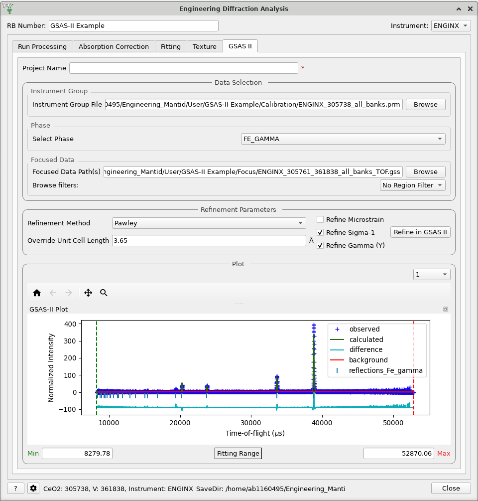

.. _Engineering_Diffraction_TestGuide-ref:

Engineering Diffraction Testing
=================================

Preamble
^^^^^^^^^
- This document is tailored towards developers intending to test the Engineering Diffraction interface.
- Runs can be loaded from the archive, however it is possible that different run numbers will be needed as older runs may be deleted.
- The nexus files for all the runs used below are available from ``<mantidBuildDir>/ExternalData/Testing/Data/DocTest`` path
- Data loading time from the archive can be reduced by adding the above path at ``File`` -> ``Manage User Directories`` -> ``Data Search Directories`` before starting the tests.

Automated coverage
------------------

Each test below has an attached note with the automated UI tests that aim to cover the functionality and
the steps that can still only be checked by hand. The automated tests live in
``Testing/AutomatedUITests/EngineeringDiffraction/`` and
are described in :ref:`AutomatedUITests`; run them with
``ctest -R AutomatedUITest.EngineeringDiffraction``.

``EngDiffGuiImatTest.py`` corresponds to no numbered test below: it repeats `Test 1`'s
calibrate-and-focus path on IMAT against fabricated run data, and checks the IMAT-specific region of
interest options, peak function and TOF binning.

Overview
^^^^^^^^
The Engineering Diffraction interface allows scientists using the EnginX instrument to interactively
process their data. There are 5 tabs in total. These are:

- ``Run Processing`` - This is where a cerium oxide run is entered to calibrate the subsequent data, which can also be
  focussed into a single spectrum.
- ``Absorption Correction`` - This is where the experimental can be corrected for beam attenuation
- ``Fitting`` - Where peaks can be fitted on focused data
- ``Texture`` - Where pole figure's can be generated for experimental runs and their fitted peaks
- ``GSAS II`` - Run a basic refinement on the `GSASIIscriptable API <https://gsas-ii.readthedocs.io/en/latest/GSASIIscriptable.html>`_

Especially to aide ``GSASII`` testing, please test on an ENGINX IDAaaS instance.

The tests are designed to be run from a starting point where no settings relating to the Engineering Diffraction Gui
have been saved in the Mantid Workbench ini file. This file is in ``C:\Users\<fed id>\AppData\Roaming\mantidproject`` on
Windows and ``~/.config/mantidproject/`` on linux. To ensure there are no saved settings open up the file mantidworkbench.ini
and delete the settings with names starting with EngineeringDiffraction2 from the CustomInterfaces section

Test 1 - Calibration and focussing
^^^^^^^^^^^^^^^^^^^^^^^^^^^^^^^^^^

.. note::
   Automated by the four classes in ``EngDiffGuiRunProcessingTest.py``:
   ``EngDiffGuiCalibrateAndFocusTest`` (Calibration 3, 8-9, 11-12 and Focus 2, 5-7),
   ``EngDiffGuiPlotOutputTest`` (Calibration 10-11 and Focus 3, both checkboxes on and off),
   ``EngDiffGuiLoadExistingCalibrationTest`` (Calibration 13-14 and Focus 4-5) and
   ``EngDiffGuiSaveLocationAndRbNumberTest`` (Calibration 5, including changing the save location
   mid-session).

   The plots are checked for their contents, not merely for having appeared: the calibration figure
   for its two rows, its "Peak centres" and "quadratic fit" curves, its axis labels and its subplot
   title, and the focus figure for carrying the focused workspace's own data under a legend naming
   the instrument, run and spectrum.

   Still manual: Calibration 1-2 (archive access, and opening the interface from the menu), and
   comparing the two figures against the screenshots - the curves are asserted, but whether the
   result *looks* right is still a human judgement.

This test follows the simple steps for calibrating and focusing in the Engineering Diffraction Gui.

Calibration
-----------

1. Ensure you can access the ISIS data archive.

2. Open the Engineering Diffraction gui: ``Interfaces`` -> ``Diffraction`` -> ``Engineering Diffraction``

3. On opening the gui the ``Create New Calibration`` option should be selected.

4. Open the settings dialog from the cog in the bottom left of the gui.

5. Set the ``Save Location`` to a directory of your choice.

6. Check that the ``Full Calibration`` setting has a default path to a `.nxs` file (currently ``ENGINX_full_instrument_calibration_193749.nxs``)

7. Close the settings window

8. For the ``Vanadium #`` enter ``307521``.

9. For the ``Calibration Sample #`` enter ``305738``.

10. Tick the ``Plot Calibrated Workspace`` option.

11. Click ``Calibrate``, after completing calibration it should produce the following plot.

.. image:: /images/EngineeringDiffractionTest/EnggDiffExpectedLinear.png
    :width: 900px

12. Check that in your save location there is a Calibration folder containing three `.prm` files
    `ENGINX_305738` with the suffixes `_all_banks`, `_bank_1`, `_bank_2`.

13. Close the Engineering Diffraction gui and reopen it. The ``Load Existing Calibration`` radio
    button should be checked on the ``Calibration`` tab and the path should be populated with the
    `_all_banks.prm` file generated earlier in this test.

14. In the ``Load Existing Calibration`` box browse to the `_bank_2.prm` file and click the ``Load`` button.

Focus
-----

1. Now let's look at the ``Focus`` group.

2. For the ``Sample Run #`` use ``305761`` and leave ``Vanadium #`` set to ``307521``.

3. Tick the ``Plot Focused Workspace`` option and click ``Focus``. It should produce a plot of a single spectrum for bank 2.

4. In the ``Calibration`` group select an existing calibration file for both banks e.g. `ENGINX_305738_all_banks.prm` and click ``Load``.

5. Click the ``Focus`` button, after completing calibration it should produce a plot.

.. image:: /images/EngineeringDiffractionTest/EnggDiffExampleFocusOutput.png
    :width: 900px

6. Check that in your save location there is a Focus folder containing the following files:

    - ENGINX_305738_305721_all_banks_dSpacing.abc
    - ENGINX_305738_305721_all_banks_dSpacing.gss
    - ENGINX_305738_305721_all_banks_TOF.abc
    - ENGINX_305738_305721_all_banks_TOF.gss
    - ENGINX_305738_305721_bank_1_dSpacing.nxs
    - ENGINX_305738_305721_bank_1_TOF.nxs
    - ENGINX_305738_305721_bank_2_dSpacing.nxs
    - ENGINX_305738_305721_bank_2_TOF.nxs
    - CombinedFiles/ENGINX_305761_236516_bank_dSpacing.nxs

7. There should also be a ``CombinedFiles`` folder which should contain:

   - ENGINX_305761_307521_bank_dSpacing.nxs
   - ENGINX_305761_307521_bank_2_dSpacing.nxs

Test 2 - RB Number
^^^^^^^^^^^^^^^^^^

.. note::
   Automated by ``EngDiffGuiSaveLocationAndRbNumberTest`` (``EngDiffGuiRunProcessingTest.py``) for
   the calibration and focus output. The rule that texture output goes *only* to the RB directory is
   asserted by ``EngDiffGuiTextureRoiTest`` (``EngDiffGuiCroppingTest.py``), and the same RB layout
   is checked for the other tabs' output by ``EngDiffGuiTexturePoleFigureTest``
   (``EngDiffGuiTextureTest.py``) and ``EngDiffGuiGsas2MultipleTest`` (``EngDiffGuiGsas2Test.py``).

This test covers the RB number.

1. Enter a string into the ``RB Number`` box.

2. Follow the steps of `Test 1`, any output files (for non-texture ROI) should now be located in both
   [Save location]/User/[RB number] and [Save location] (for texture ROI the files will be saved in the first location
   if an RB number is specified, otherwise they will be saved in the latter - this is to reduce the number of files being written).

Test 3 - Cropping
^^^^^^^^^^^^^^^^^

.. note::
   Automated by the three classes in ``EngDiffGuiCroppingTest.py``: ``EngDiffGuiRoiOptionsTest``
   (step 2's region of interest widget - which options each instrument offers, which extra input
   each one reveals, and how an invalid spectrum range is rejected), ``EngDiffGuiCroppedCalibrationTest``
   (steps 2-3, 5-6 and 8) and ``EngDiffGuiTextureRoiTest`` (steps 1, 7 and 9, including the output
   file layout for a texture grouping).

   The plot shapes these steps describe are asserted from the region of interest: step 4's two
   subplots for one bank, step 8's "only 2 subplots" for a cropped range, and step 9's "5 tiled plot
   windows, 4 spectra per window" for twenty texture groups all come from one rule, expressed once
   in ``EngDiffGuiTestBase.calibration_plot_layout``.

   Still manual: comparing the figures against the screenshots.

This test covers the Cropping functionality in the ``Run Processing`` tab.

1. Change the ``RB Number`` to ``North``, this is purely to separate the cropped output files into their own space.

2. Go to the ``Run Processing`` tab, select ``Create New Calibration`` and tick the ``Set Calibration Region of Interest`` option. In the drop down ``Region of Interest`` select ``1 (North)``.

3. Check the ``Plot Calibrated Workspace`` checkbox and click ``Calibrate``.

4. The generated figure should show a plot of TOF vs d-spacing and plot showing residuals of the quadratic fit.

5. Check that only one `.prm` and one `.nxs` output file was generated.

6. Click the ``Focus`` button.

7. Change the ``RB number`` to `Custom`.

8. Set the ``Region Of Interest`` to ``Crop to Spectra`` and using ``Custom Spectra`` ``1200-2400`` (these spectrum numbers correspond to the South Bank).
   Please note that some custom spectra values may cause the algorithms to fail. Click ``Calibrate`` and a similar plot to before should appear but with only 2 subplots.

9. Set the ``Region of Interest`` to ``Texture (20 spec)`` and click ``Calibrate`` - there should be 20 spectra per run (5 tiled plot windows, 4 spectra per window).

Test 4 - Absorption Correction
^^^^^^^^^^^^^^^^^^^^^^^^^^^^^^

.. note::
   Automated by the two classes in ``EngDiffGuiCorrectionTest.py``.
   ``EngDiffGuiCorrectionTableTest`` covers steps 1-9 and 11-16 - the table, the reference workspace,
   and the STL shape, CSG shape, material and orientation dialogs, each of which really runs its
   algorithm. ``EngDiffGuiCorrectionApplyTest`` covers steps 19-20 and 22-23, plus the divergence
   correction, the attenuation table and the Monte Carlo parameters, which this guide does not ask
   for. Part of step 24 is covered too: loading a run collection, and loading orientation files of
   both matrices and Euler angles.

   The shape figures at steps 9-10 are checked for drawing a solid on 3D axes whose extent matches
   the sample's own bounding box, rather than only for having opened.

   Still manual: step 21, where the shape is viewed again after a custom gauge volume is chosen;
   steps 17-18's texture directions, whose settings are covered by `Test 12` but not their effect on
   a correction; the screenshot comparisons; and the rest of step 24.

This test covers the sample setting functionality in the ``Absorption Correction`` tab.

1. Change the ``RB Number`` to ``ManualTesting``.

2. Go to the ``Absorption Correction`` tab, in ``Sample Run(s)`` enter ``305738`` and click ``Load Files``

3. A row should have been added to the table with ``Run: ENGINX00305738``, ``Shape: Not Set``, ``Material: Not set``, and ``Orientation: default``

4. Click ``Create Reference Workspace``, ``ManualTesting_reference_workspace`` should now be listed as ``Reference Frame``

5. In the ``Sample Shape`` section click ``Load Shape onto single WS``

6. Make sure ``InputWorkspace`` and ``OutputWorkspace`` are set to ``ManualTesting_reference_workspace``

7. Set ``Filename`` to a suitable file (``<mantidBuildDir>/ExternalData/Testing/Data/UnitTest/cube.stl``) and ``Scale`` to ``mm``

8. There should now be a ``View`` button next to ``Shape`` in the ``Reference Workspace Information``

9. Click this ``View`` button

10. If you have used the example STL you should get the following:

.. image:: /images/EngineeringDiffractionTest/EnggDiffSamplePlot.png
    :width: 600px

11. Now click ``Set Shape onto single WS`` and set ``InputWorkspace`` again to ``ManualTesting_reference_workspace``

12. Set ``ShapeXML`` to:

..testcode::

   <cuboid id='some-cuboid'> \
   <height val='0.015'  /> \
   <width val='0.012' />  \
   <depth  val='0.012' />  \
   <centre x='0.0' y='0.0' z='0.0'  />  \
   </cuboid>  \
   <algebra val='some-cuboid' /> \

13. Click ``Set Sample Material``, set ``InputWorkspace`` to ``ManualTesting_reference_workspace`` and ``ChemicalFormula`` to ``Fe`` and click ``Run``

14. Click ``Set Single Orientation`` and set the ``Workspace`` as ``ENGINX00305738`` and set ``Axis0`` to ``90,1,0,0,1`` and ``Axis1`` to ``135,0,0,1,-1``, then click ``Run``

15. Click either the checkbox in the table or ``Select All`` beneath the table to select the workspace and click ``Copy Reference Sample``

16. The table should now be updated to ``Run: ENGINX00305738``, ``Shape: [View Shape]``, ``Material: Fe``, and ``Orientation: set``

17. Open the settings menu (gear icon, bottom left)

18. Set Texture Directions to be ``D1  0  1  0``, ``D2  1  0  0``, and ``D3  0  0  1`` and click ``OK``

19. Down under the ``Include Absorption Correction`` change ``4mmCube`` to ``Custom Shape``

20. A new ``Custom Gauge Volume File`` field should have appeared, click ``Browse`` and navigate to ``<mantidBuildDir>/ExternalData/Testing/Data/SystemTest/Texture/custom_gauge_volume.xml``

21. Clicking ``View Shape`` again, the shape should now look like:

.. image:: /images/EngineeringDiffractionTest/EnggDiffSamplePlot2.png
    :width: 600px

22. Click ``Apply Correction`` at the bottom of the tab

23. In the save directories, you should see an ``AbsorptionCorrection`` folder with ``Corrected_ENGINX00305738.nxs``

24. Play around with other functionality (tool tips or Technique reference might be helpful) in this tab some things you can try:

   - Load a collection of runs using the search ``305793-305795``
   - Load runs from browsing (some more ENGINX data can be found in ``ExternalData/Testing/Data/SystemTest``)
   - Load Orientation File (some orientation files can be found in ``ExternalData/Testing/Data/SystemTest/Texture``)

Test 5 - Focused data
^^^^^^^^^^^^^^^^^^^^^

.. note::
   Automated in full by ``EngDiffGuiFittingDataTest`` (``EngDiffGuiFittingTest.py``), which reaches
   the tab by really calibrating and focusing first, as steps 1-2 do. It covers step 3 (the finder
   is prefilled with the focused files), step 4 (a row per file, and each row of ``run_info_Fitting``
   and of every sample log table lining up with the UI table row), step 6 (``Add To Plot``, and that
   unticking a row's ``Plot`` box removes its line), step 7 (loading the d-spacing files instead of
   the TOF ones) and steps 8-9 (un-docking and re-docking the plot).

   Step 5 is covered separately, by ``EngDiffGuiFittingSettingsTest``, which unticks a sample log in
   the settings dialog, reopens the interface and checks the selection was remembered. That class
   needs no data, so it also stands as a quick check of the settings store on its own.

This test covers the loading and plotting focused data in the fitting tab.

.. note:: Sometimes it will be tricky to load ENGINX files from the archive and the red ``*`` next to the ``Browse`` button won't disappear. Proceeding with the red ``*`` will raise an error saying ``Check run numbers/path is valid.`` or ``Mantid is searching for data files. Please wait``. In such cases, please try re-entering the text and wait till the red ``*`` is cleared before proceeding. If the log level is set to Information, found path = 1 will be visible in the message log when the runs are found from the archive.

1. Ensure you can access the ISIS data archive. In the ``Run Processing`` tab, select ``Create New Calibration`` and enter ``Calibration sample`` # ``305738`` and ``Vanadium #`` to ``307521``. Before proceeding, make sure the red ``*`` next to the ``Browse`` button is disappeared when clicked somewhere outside that text box.
   Untick ``Set Calibration Region of Interest`` option and click on ``Calibrate`` button.

2.  Set ``Sample Run #`` to ``305793-305795``. These sample runs have different stress and strain log values. Make sure the red ``*`` s next to the two ``Browse`` buttons are cleared when clicked outside the text boxes or wait otherwise. Then click ``Focus``.

3. In the ``Fitting`` tab, load multiple of these newly focused TOF `.nxs` files in the ``Load Focused Data`` section. The path to the focused files should be auto populated.

4. Click the ``Load`` button. A row should be added to the UI table for each focused run.
   There should be a grouped workspace with the suffix `_logs_Fitting` in the ADS with tables corresponding to each log value specified in the settings (to open the settings use the cog in the bottom left corner of the UI).
   In the same grouped workspace there should be an additional table called `run_info_Fitting` that provides some of the metadata for each run.
   Each row in these tables should correspond to the equivalent row in the UI table.

5. The log values that are averaged can be selected in the settings (cog button in the bottom left corner of the UI). Change which sample log checkboxes are selected. Close settings and then close and re-open the Engineering Diffraction interface.
   Reopen settings to check these selected sample logs have been remembered. Note that any change to the selected logs won't take effect until the interface is reopened.

6. Clear the runs by clicking ``Remove All`` below the table. Repeat steps 1-2 above but this time try checking the ``Add To Plot`` checkbox, when loading the run(s) the data should now be plotted and the checkbox in the ``Plot`` column of the UI table should be checked.

7. Clear the runs by clicking ``Remove All`` below the table. Repeat steps 1-2 again but load the d-spacing .nxs file(s) instead.

8. Plot some data and un-dock the plot in the UI by dragging or double-clicking the bar at the top of the plot labelled ``Fit Plot``. The plot can now be re-sized.

9. To dock it double click the ``Fit Plot`` bar (or drag to the bottom of the toolbar). You may want to un-dock it again for subsequent tests.

Test 6 - Browse Filters
^^^^^^^^^^^^^^^^^^^^^^^

.. note::
   Automated by ``EngDiffGuiFittingDataTest._check_prefill_and_filters``
   (``EngDiffGuiFittingTest.py``), which asserts the file filter each combination of ``Unit Filter``
   and ``Region Filter`` produces, including the ``dSpacing``/Texture and ``TOF``/North pairs this
   step names. It checks the filter string rather than the files offered, because the browse dialog
   is modal.

This tests the ``Browse Filters`` functionality to filter the focused data in the ``Load Focused Data`` section at the top of ``Fitting`` tab.

1. The tests so far have enabled you to produce many different focussed data files. In the ``Load Focused Data`` section at the top of ``Fitting`` tab,
   when clicked on ``Browse`` button, check that the ``Unit Filter`` and ``Region Filter`` combo boxes help you to find ``dSpacing`` data for Texture regions and ``TOF`` data for North bank.

Test 7 - Run removal
^^^^^^^^^^^^^^^^^^^^

.. note::
   Automated by ``EngDiffGuiFittingDataTest._check_removal`` (``EngDiffGuiFittingTest.py``) for
   steps 2 and 3: ``Remove Selected`` drops only that row and takes both its focused and its
   ``_bgsub`` workspace out of the ADS, and ``Remove All`` empties the table.

   Steps 4 to 6 are covered too: reloading a run is asserted to make no further ``AverageLogData``
   call - read off the notice log, as this step tells you to - and deleting a workspace from the ADS
   is asserted to take its row with it, while deleting only its ``_bgsub`` partner unticks
   ``Subtract BG`` and leaves the row in place.

   Still manual: step 2's check on the log table rows after a removal. The row-for-row
   correspondence is asserted when the runs are loaded (`Test 5` step 4) but not again afterwards.

This tests the removal of focused runs from the ``Fitting`` tab.

1. Load multiple runs using the ``Browse`` button. This should take you to a folder called "`Focus`" containing `.nxs` files that have been previously generated from the ``Focus`` group of the ``Run Processing`` tab. Select multiple files and click on ``Open``

2. Having loaded multiple runs, select a row in the UI table and then click the ``Remove Selected`` button below the table.
   The row should be removed, if the run was plotted it will disappear from the plot and there should be one less row in each of the table workspaces inside the "_logs_Fitting" workspace group with each row corresponding to the run in the same row of the UI table.
   The workspaces called "ENGINX\_...._TOF" and "ENGINX\_...._TOG_bgsub" will be deleted from the ADS

3. Try clicking the ``Remove All`` button, the UI table should be empty and the workspace group with name ending "_logs_Fitting" should no longer be present.

4. Try loading in a run again, the UI should still be able to access the workspace and remember the log values - check there are no calls to ``AverageLogData`` in the log (should be visible when log level is ``Notice``).

5. Try removing a workspace by deleting it in the ADS, the corresponding row in the log tables and the UI table should have been removed.

6. Delete a ``_bgsub`` workspace in the ADS, the corresponding row will not be deleted, but the ``Subtract BG`` checkbox will be unchecked.

Test 8 - Background subtraction
^^^^^^^^^^^^^^^^^^^^^^^^^^^^^^^

.. note::
   Automated by ``EngDiffGuiFittingDataTest._check_background_subtraction`` and
   ``_check_plot_background_button`` (``EngDiffGuiFittingTest.py``): step 1, including that the
   subtracted data really is below the raw data; step 2's enablement rule; and step 3's requirement
   that changing ``Niter`` and ``SG`` changes the subtracted data.

   The ``Inspect Background`` figure is checked for its contents: the raw data and the subtracted
   data are matched against the workspaces they came from, both curves are named, and the background
   curve is asserted to be the raw data minus the subtracted data.

This tests that the background subtraction works.

1. Load in a run - the ``Subtract BG`` box should be checked in the UI table by default. This should generate a workspace with suffix `_bgsub` and the data should look like the background is flat and roughly zero on the plot using the default parameters (other columns in the UI table).

2. Select the row in the table and check the ``Inspect Background`` button should now be enabled regardless of whether the ``Subtract BG`` box is checked.

3. Click  ``Inspect Background`` to open a new figure which shows the raw data, the background and the subtracted data. Changing the values of ``Niter``, ``BG``, ``XWindow`` and ``SG`` (input to ``EnggEstimateFocussedBackground``, hover over a cell in the table to see a tool tip for explanation) should produce a change in the background on the external plot and in the UI plot.

Test 9 - Fit browser
^^^^^^^^^^^^^^^^^^^^

.. note::
   Automated by ``EngDiffGuiSequentialFitTest`` (``EngDiffGuiFittingTest.py``): step 1 (with nothing
   plotted the ``Fit`` button does not open the browser), step 3, step 4 (the ``Settings > Workspace``
   combo follows the ``Plot`` checkboxes), part of step 5, and step 6 - the ``_fits`` group appears,
   with a matrix workspace per fitted parameter, the peak width also as an FWHM, the peak centre
   converted to d-spacing, and a ``model`` table with a row per fitted run.

   Step 5 is covered in two halves. The right-click menu's entries are asserted by building the menu
   the way the canvas handler does, and a ``BackToBackExponential`` added to the browser is asserted
   to come back with ``A`` and ``B`` already fixed - which is what ENGIN-X's instrument parameter
   file asks for, and which nothing else in the repository tests. Note that the fixing happens on the
   *add peak* path only: the same function loaded from a function string arrives unfixed.

   Still manual: step 2, actually clicking through the right-click menu, and step 7 entirely. The
   fit browser's ``Custom Setup``, ``Clear Model`` and ``Evaluate Function`` have no Python API.

This tests the operation of the fit browser.

1. Check that when no data are plotted the ``Fit`` button on the toolbar does nothing.

2. Check the ``Unit Filter`` combobox for ``Browse Filters`` is set to ``TOF`` and click Browse. In the ``Focus`` folder of the save directory, there should be output focussed TOF files.
   Select multiple focussed files and click Open. Back on the main interface, check the box ``Add to Plot`` and click ``Load``.

3. Click the ``Fit`` button in the plot toolbar. A simplified version of the standard mantid fit property browser should now be visible.

4. In the fit property browser, all the plotted spectra should be available in the ``Settings > Workspace`` combo box.
   In the central ``Run Selection`` table, remove one spectrum from the plot by unticking the ``Plot`` checkbox for one row.
   The ``Settings > Workspace`` combo box should now update and not include the removed spectrum.

5. Right-click on the plot image and select ``Add Peak`` and add a peak to the plot. Change the peak type by right clicking on the plot and selecting ``Select peak type`` and add another peak. Also add a Linear background by right clicking on the plot to select ``Add background`` and selecting ``LinearBackground`` as the function.
   Make sure to add a ``BackToBackExponential`` peak if you have not already. For ``BackToBackExponential`` peaks, the ``A`` and ``B`` parameters should be fixed automatically for ENGIN-X data.

6. Perform a fit by clicking ``Fit > Fit`` in the fit browser. On completion of the fit, a group workspace with suffix `_fits` should have appeared in the Workspaces Toolbox(ADS).
   In this group of workspaces there should be a matrix workspace for each parameter fitted (named by convention ``FunctionName_ParameterName`` e.g `BackToBackExponential_I`), to view this right-click on the workspace
   and ``Show Data``. If there are more than 1 fitting function of the same type, the fitting values for each parameter would appear in the columns where each workspace is listed in the rows. Any runs not fit will have a `NaN` value in the `Y` and `E` fields. In addition there is a workspace that has converted any peak centres from TOF to d-spacing (suffix `_dSpacing`).
   There should be an additional table called `model` that summarises the `chisq` value and the function string including the best-fit parameters.

7. In the Fit property browser, go to ``Setup > Custom Setup``. The function string, including the best-fit parameters, should also have been automatically saved
   as a custom setup. Select ``Setup > Clear Model``, then select this new custom setup model. Inspect the fit by clicking ``Fit > Evaluate`` Function.

Test 10 - Sequential fitting
^^^^^^^^^^^^^^^^^^^^^^^^^^^^

.. note::
   Automated by ``EngDiffGuiSequentialFitTest`` (``EngDiffGuiFittingTest.py``). Step 5 is driven from
   the toolbar button: every loaded run is fitted, the result reports itself as a sequential fit, and
   each fit is asserted to have converged using the framework's own definition. The ordering of steps
   6-8 is covered too - sorting by a primary log keeps every run, unticking ``Ascending`` reverses
   the order, and a blank primary log falls back to the table order.

   The order is read back off the notice log, exactly as step 6 asks: the tab logs "Starting to fit
   workspace ..." once per run, in the order it visits them, and that sequence is compared against
   the primary log's ordering and then against its reversal for step 8. Steps 2 and 9 - choosing the
   primary log and its direction in the settings dialog, and finding them remembered after a restart
   - are covered by ``EngDiffGuiFittingSettingsTest``.

   Still manual: step 0, setting the workbench log level, which the automated tests do not need.

This tests the sequential fitting capability of the UI (where the result of a fit to one workspace is used as the initial guess for the next).
This test uses data generated in `Test 4`.

0. In the main workbench window, right-click on the Message log and set the ``Log Level`` to ``Notice``.

1. Close and re-open the Engineering Diffraction interface.

2. Enter the Engineering Diffraction settings menu by clicking the cog wheel in the bottom left. In the ``Sample Logs - Fitting / GSAS II`` section,
   you can select which sample logs to output to table workspaces by ticking in the list of boxes, and select the `Primary Log` from the combo box underneath the checkboxes for Sequential fit ordering,
   and whether this should be in ``Ascending`` or ``Descending`` order by ticking the corresponding box to the right.
   In the `Primary Log` combobox, select ``ADC1_0`` and tick ``Ascending``.

3. On the ``Fitting`` tab, Load in several focused runs e.g. ``305793-305795`` from `Test 4`.

4. Plot just one run, click ``Fit`` to open the fit property browser and input a valid fit function including a peak and a background.

5. Click the ``Sequential Fit`` button in the plot toolbar. A group of fit workspaces should appear in the Workspaces Toolbox (ADS),
   each with a row for each of the runs in the table. All the runs should have been fitted.

6. The order of the runs in the sequential fit should be obtainable from the log at notice level -
   check that this corresponds to the order of the average value of the primary log - ``ADC1_0``
   You can check the value of this sample log for each run in the output GroupWorkspace with the suffix ``_logs_Fitting``. Note this order down.

7. Try changing the primary log to blank and re-run the ``Sequential Fit`` This should make the Sequential fit use the order of the runs in the central ``Run Selection`` table.

8. In the Engineering Diffraction settings, set the `Primary Log` back to ``ADC1_0`` and tick ``Descending``.
   Re-run the ``Sequential Fit`` and check that the order of runs in the output workspaces has reversed compared to `Step 6`.

9. Close and re-open the Engineering Diffraction interface. Reopen the Engineering Diffraction settings menu, it should remember the `Primary Log` and the order.

Test 11 - Serial fitting
^^^^^^^^^^^^^^^^^^^^^^^^

.. note::
   Automated by ``EngDiffGuiSequentialFitTest._check_serial_fit`` (``EngDiffGuiFittingTest.py``) for
   step 2: the ``Serial Fit`` toolbar button fits every loaded run, the result reports itself as a
   serial rather than a sequential fit, each fit converged, and the fitted peak centre is the one
   the fixture generated.

   Step 3 is covered too: the order the runs are fitted in is read off the notice log and compared
   against the table's own order, a serial fit doing no sorting of its own.

This tests the serial fitting capability of the UI (where all loaded workspaces are fitted from the same starting parameters).
This test uses data generated in `Test 4`.

1. Repeat steps 1-4 in the previous test (`Test 9`).

2. Now click the ``Serial Fit`` button in the plot toolbar and the group of fit workspaces should appear in the ADS,
   each with a row for each of the runs in the table. All the runs should have been fitted.

3. The order of the runs in the serial fit should be obtainable from the log at notice level - check that this
   corresponds to the order of the runs in the table.

Test 12 - Pole Figures
^^^^^^^^^^^^^^^^^^^^^^

.. note::
   Automated by the two classes in ``EngDiffGuiTextureTest.py``, using the same shipped validation
   files this test names. ``EngDiffGuiTextureLoadingTest`` covers steps 1-5 and 8-10 - the table, the
   pairing of each run with its parameter table, the parameter column selector appearing, and the
   ``Remove Selected Parameters`` and ``Delete Selected`` buttons. ``EngDiffGuiTexturePoleFigureTest``
   covers steps 7 and 11, going further than "a plot appeared": each projection is asserted to
   produce a different set of scatter points, and the chosen parameter column to drive the plotted
   colour data. Part of step 15 is covered too - changing the projection, and including scattering
   power for a ``1,1,0`` reflection with the crystal set from lattice parameters.

   Steps 6 and 12-14 are covered as well: the texture directions are set through the dialog and read
   back from the stored transform, and unticking ``Scatter Plot Experimental Pole Figure`` with a
   ``Contour Kernel Size`` of 6.0 is asserted to replace the scattered points with a contour. The two
   modes draw the same *number* of collections, so they are told apart by the kind of artist drawn.

   Note the naming: this guide calls the sample directions ``D1``/``D2``/``D3``, while the interface
   and its settings call them ``RD``/``ND``/``TD``. There is no ``D1`` anywhere in the code.

   Still manual: step 15, and the three screenshot comparisons.

This test will check the Pole Figure plotting in the Texture Tab

1. Click on the ``Texture Tab``

2. Click ``Browse`` next to ``Load Workspace Files`` and navigate to ``<mantidBuildDir>/ExternalData/Testing/Data/SystemTest/Texture/ValidationFiles/Focus``

3. Select all the files within that folder and click ``Load Workspace Files``

4. You should see seven rows populate the table

5. Click ``Select All Files``

6. In settings, ensure the texture directions are set to  ``D1  1  0  0``, ``D2  0  1  0``, and ``D3  0  0  1``, and the ``Scatter Plot Experimental Pole Figure`` is checked, then click ``OK``

7. Click ``Calculate Pole Figure``, you should get a plot like the one below (the colours may be different, they should correspond to the order of the files in the table, for this example the files are in ascending run number order)

.. image:: /images/EngineeringDiffractionTest/EnggDiffPF1.png
    :width: 600px

8. Now click ``Browse`` next to ``Load Parameter Files`` and navigate to ``<mantidBuildDir>/ExternalData/Testing/Data/SystemTest/Texture/ValidationFiles/FitParameters``

9. Select all the files within that folder and click ``Load Parameter Files``

10. The ``Fit Parameters`` column should now be populated in the table, as well as a readout column option having appeared above ``Calculate Pole Figure``

11. Click ``Calculate Pole Figure``, you should get a plot like the one below

.. image:: /images/EngineeringDiffractionTest/EnggDiffPF2.png
    :width: 600px

12. Open the settings menu and set ``Scatter Plot Experimental Pole Figure`` to unchecked

13. This should enable ``Contour Kernel Size``, set this to ``6.0`` and click ``OK``

14. Click ``Calculate Pole Figure``, you should get a plot like the one below

.. image:: /images/EngineeringDiffractionTest/EnggDiffPF3.png
    :width: 600px

15. Try changing options around in the interface, see if you can break it (some things you can try if you are short ideas):

   - Try different sample axes
   - Try changing the projection
   - Try including scattering power (HKL for this peak is 1,1,0 if you set the crystal to the ``Fe.cif``)
   - Try disabling some of the rows
   - Try having a mixture of runs with/without parameter files

Test 13 - GSASII
^^^^^^^^^^^^^^^^

.. note::
   Automated by ``EngDiffGuiGsas2SingleTest`` (``EngDiffGuiGsas2Test.py``), with one important
   caveat: **GSAS-II is not run**. The subprocess call is mocked and canned outputs are copied in, so
   both sides of that seam are real - the command line and JSON handed to GSAS-II, and the parsing,
   tables, saved files and plot built from its output - but nothing here would catch a change in
   GSAS-II itself.

   Covered: step 6 (the phase combo, the custom phase finder and the project name), step 7 (the
   refinement runs, the histogram selector lists one entry per bank, the lattice, instrument
   parameter and reflection tables are built, and the plot has its four curves, reflection markers,
   title and TOF axis), step 8 (x limits are seeded from the data, passed through to GSAS-II and
   reset when different input files are chosen) and step 12's advisory marker.

   Step 11 is covered as far as it can be without a real GSAS-II: the ``Override Unit Cell Length``
   typed into the tab is asserted to reach GSAS-II as the phase's cell lengths, read as a cubic cell.
   Whether the fit is thereby *better* needs the real program.

   Steps 2-5 are covered by ``EngDiffGuiGsas2PrefillTest``, which calibrates and focuses for real and
   then checks the tab's ``Instrument Group`` and ``Focused Data`` paths were filled in from them.
   It is the only class here that runs a genuine calibration, which is why it is kept separate.

   Still manual: step 1, and step 9's browse.

Note this test will only work if ``GSASII`` is also installed.
Please test this on IDAaaS: an ENGINX instance should have MantidWorkbenchNightly and ``GSASII`` installed in the expected location.

1. Close and re-open the Engineering Diffraction interface.

2. Go to the ``Run Processing`` tab, select ``Create New Calibration`` and un-tick the ``Set Calibration Region of Interest`` option.

3. For the ``Calibration Sample #`` enter ``305738`` and ``Vanadium #`` ``307521`` and click the ``Calibrate`` button.

4. In the ``Focus`` group, enter ``Sample Run #`` ``305761`` and click the ``Focus`` button.

5. Change to the ``GSASII`` tab. The ``Instrument Group`` path should be pre-filled to a `.prm` file output by the calibration
   and the ``Focused Data`` path should be pre-filled to the `.gss` file output from the ``Focus`` group.

6. For the ``Phase`` filepath, select ``FE_GAMMA`` from the list. For the ``Project Name`` at the top, enter a string of your choice.

7. Now, click ``Refine in GSAS II``. After a few seconds, the output fit should be plotted. In the top right of the plot widget, the refined spectrum can be changed using the combo-box.

8. Change the fitting range by dragging the limits, or by editing the ``Min``, ``Max`` line edit boxes. Again, click ``Refine in GSAS II`` and this should only fit to the user defined range.

9. Back in the file loading section, Browse for files for the inputs ``Instrument Group`` and ``Focused Data``,
   and select files with ``bank_1`` in the name, which were produced by the ``Calibration`` and ``Focus`` in `Test 3`.

10. Now, click ``Refine in GSAS II``. The previously set fitting range should be ignored as new input files were selected. There should now only be one spectrum available in the output spectrum combobox.

11. Set the ``Override Unit Cell Length`` to ``3.65`` and click ``Refine in GSAS II``, the fit should be better.

12. Tick all the checkboxes: ``Microstrain``, ``Sigma-1`` and ``Gamma (Y)``. An asterisk should appear with an advice tooltip.

Test 14 - GSASII multiple files
^^^^^^^^^^^^^^^^^^^^^^^^^^^^^^^

.. note::
   Automated by ``EngDiffGuiGsas2MultipleTest`` (``EngDiffGuiGsas2Test.py``), with the same caveat as
   `Test 13`: GSAS-II itself is mocked. It covers step 8 - each focused file is refined in its own
   GSAS-II call, each produces its own tables and its own save directory, and the sample logs cover
   every bank of both files - and adds the RB number save location, which this test does not ask for.
   All three of step 9's error cases are covered by ``EngDiffGuiGsas2SingleTest``: more than one
   instrument file, a single-bank ``.gss`` against a two-bank instrument file, and data files whose
   bank counts differ from each other.

   That last case does not behave quite as this step describes, and the test records what actually
   happens: the error *is* reported, but only the offending file is dropped - the file whose bank
   count does match is still refined, rather than the whole request being rejected as it is for the
   other two cases.

   Still manual: steps 1-4 for the same reason as `Test 13`, and steps 5-7's browsing.

This test covers the multiple data files functionality with multiple banks per file in the ``GSAS II`` tab.

Note this test will only work if ``GSASII`` is also installed.
Please test this on IDAaaS: an ENGINX instance should have ``MantidWorkbenchNightly`` and ``GSASII`` installed in the expected location.

1. Close and re-open the Engineering Diffraction interface.

2. Go to the ``Run Processing`` tab, select ``Create New Calibration`` and un-tick the ``Set Calibration Region of Interest`` option.

3. For the ``Calibration Sample`` # enter ``305738`` and ``Vanadium #`` enter ``307521`` and click the ``Calibrate`` button.

4. Enter Sample Run # ``305793-305795`` and click the ``Focus`` button. This will generate multiple focused data files.
Change to the ``GSAS II`` tab. Clear any pre-filled paths.

5. For the ``Instrument Group`` filepath, browse and select the single `.prm` file output by the calibration (should be `ENGINX_305738_all_banks.prm`).

6. For the ``Focused Data`` filepath, browse and select multiple `.gss` files that each contain multiple banks. Ensure all selected files have the same number of banks (e.g., select the all_banks files: E`NGINX_305738_305793_all_banks_dSpacing.gss`, `ENGINX_305738_305794_all_banks_dSpacing.gss`, `ENGINX_305738_305795_all_banks_dSpacing.gss`).

7. For the ``Phase`` filepath, select ``FE_GAMMA`` from the list. For the ``Project Name`` at the top, enter a string of your choice.

8. Click Refine in ``GSAS II``. After a few seconds, the output fit should be plotted. In the top right of the plot widget, verify that the refined spectrum combobox shows entries for the banks of the last refined data file.

9. Test Error Cases: Try selecting multiple instrument `.prm` files (should show error message about requiring exactly one instrument file). Try selecting `.gss` files with different numbers of banks (should show error about inconsistent bank counts). Try selecting single-bank `.gss` files (should show error about requiring multiple banks per file).
