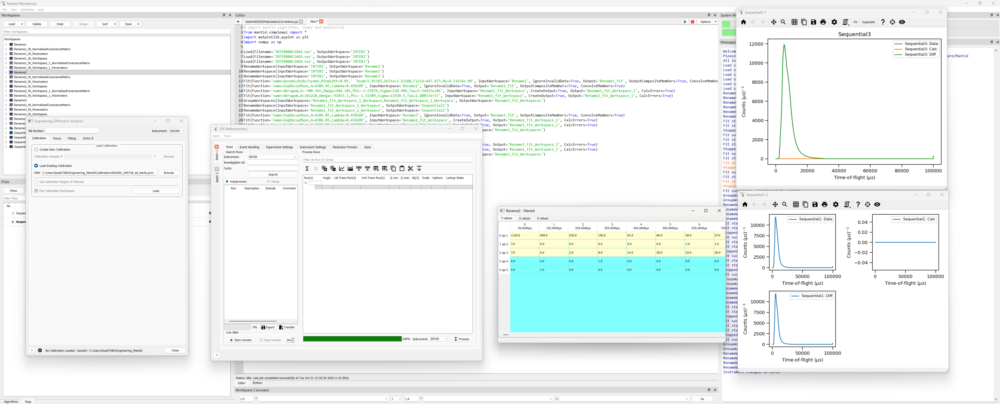

.. _project_recovery_testing:

Project Recovery Testing
=========================

.. contents::
  :local:

Project Recovery test
---------------------

*Preparation*

- Before running these tests, set project recovery to run every 2 seconds. The instructions for this
  are on the `Project Recovery concepts page <http://docs.mantidproject.org/nightly/concepts/ProjectRecovery.html>`_.
- Get the ISIS sample dataset from the `Downloads page <http://download.mantidproject.org/>`_.
- Get the file `TOPAZ_3132_event.nxs`
- Put the data in a data directory, referred to as ``data_directory`` in the scripts below
- Set up a directory to store output for comparison, referred to as ``testing_directory`` below

**Time required 15 - 30  minutes**

--------------

1. Simple tests and Muon-esque workflow

- Open MantidPlot - make sure no other instances of MantidPlot are running
- Right-click in the Results Log and set `Log level` to `Debug`
- The Results Log should be printing `Nothing to save`
- Run the following command to create a simple workspace:

.. code-block:: python

  CreateWorkspace(DataX=range(12), DataY=range(12), DataE=range(12), NSpec=4, OutputWorkspace='NewWorkspace')

- The Results Log should now be printing `Project Recovery: Saving started` and `Project Recovery: Saving finished` on alternate lines
- Now run this script:

.. code-block:: python

   data_directory=<path-to-data>
   testing_directory=<path-to-test>
   Load(Filename=data_directory + '/INTER00013464.nxs', OutputWorkspace='INTER1')
   Load(Filename=data_directory + '/INTER00013469.nxs', OutputWorkspace='INTER2')  
   Load(Filename=data_directory + '/INTER00013469.nxs', OutputWorkspace='INTER3')  
   RenameWorkspace(InputWorkspace='INTER2', OutputWorkspace='Rename2')  
   RenameWorkspace(InputWorkspace='INTER1', OutputWorkspace='Rename1') 
   RenameWorkspace(InputWorkspace='INTER3', OutputWorkspace='Rename3')  
   Fit(Function='name=DynamicKuboToyabe,BinWidth=0.05,' 'Asym=5.83382,Delta=5.63288,Field=447.873,Nu=8.53636e-09', InputWorkspace='Rename1', IgnoreInvalidData=True, Output='Rename1_fit', OutputCompositeMembers=True, ConvolveMembers=True)  
   Fit(Function='name=ExpDecayMuon,A=4306.05,Lambda=0.458289', InputWorkspace='Rename2', IgnoreInvalidData=True, Output='Rename2_fit', OutputCompositeMembers=True, ConvolveMembers=True) 
   Fit(Function='name=Abragam,A=-500.565,Omega=944.105,Phi=-2.97876,Sigma=230.906,Tau=5.54415e+06', InputWorkspace='Rename1_fit_Workspace', CreateOutput=True, Output='Rename1_fit_Workspace_1', CalcErrors=True)
   Fit(Function='name=Abragam,A=343210,Omega=-91853.1,Phi=-1.51509,Sigma=11920.5,Tau=2.80013e+13', InputWorkspace='Rename2_fit_Workspace', CreateOutput=True, Output='Rename2_fit_Workspace_1', CalcErrors=True)
   GroupWorkspaces(InputWorkspaces='Rename1_fit_Workspace_1_Workspace,Rename2_fit_Workspace_1_Workspace', OutputWorkspace='Rename3_fit_Workspaces')  
   RenameWorkspace(InputWorkspace='Rename1_fit_Workspace_1_Workspace', OutputWorkspace='Sequential1')
   RenameWorkspace(InputWorkspace='Rename2_fit_Workspace_1_Workspace', OutputWorkspace='Sequential2')
   Fit(Function='name=ExpDecayMuon,A=4306.05,Lambda=0.458289', InputWorkspace='Rename3', IgnoreInvalidData=True, Output='Rename3_fit', OutputCompositeMembers=True, ConvolveMembers=True)  
   Fit(Function='name=ExpDecayMuon,A=4306.05,Lambda=0.458289', InputWorkspace='Rename2_fit_Workspace', CreateOutput=True, Output='Rename2_fit_Workspace_1', CalcErrors=True) 
   Fit(Function='name=ExpDecayMuon,A=4306.05,Lambda=0.458289', InputWorkspace='Rename3_fit_Workspace', CreateOutput=True, Output='Rename3_fit_Workspace_1', CalcErrors=True)  
   GroupWorkspaces(InputWorkspaces='Rename2_fit_Workspace_1_Workspace,Rename3_fit_Workspace_1_Workspace', OutputWorkspace='Rename3_fit_Workspaces') 
   RenameWorkspace(InputWorkspace='Rename3_fit_Workspace_1_Workspace', OutputWorkspace='Sequential3')
   RenameWorkspace(InputWorkspace='Rename2_fit_Workspace_1_Workspace', OutputWorkspace='Sequential4')
   Fit(Function='name=ExpDecayMuon,A=4306.05,Lambda=0.458289', InputWorkspace='Rename3_fit_Workspace', CreateOutput=True, Output='Rename3_fit_Workspace_1', CalcErrors=True) 
   Fit(Function='name=ExpDecayMuon,A=4306.05,Lambda=0.458289', InputWorkspace='Rename1_fit_Workspace', CreateOutput=True, Output='Rename1_fit_Workspace_1', CalcErrors=True)
   GroupWorkspaces(InputWorkspaces='Rename3_fit_Workspace_1_Workspace,Rename1_fit_Workspace_1_Workspace', OutputWorkspace='Rename3_fit_Workspaces') 
   RenameWorkspace(InputWorkspace='Rename3_fit_Workspace_1_Workspace', OutputWorkspace='Sequential5')
   RenameWorkspace(InputWorkspace='Rename1_fit_Workspace_1_Workspace', OutputWorkspace='Sequential6')
   SaveCSV(InputWorkspace='Sequential4', Filename=testing_directory + '/Sequence4.csv')
   SaveCSV(InputWorkspace='Sequential5', Filename=testing_directory + '/Sequence5.csv')
   SaveCSV(InputWorkspace='Sequential6', Filename=testing_directory + '/Sequence6.csv') 

- Wait a few seconds, then provoke a crash by running `Segfault`
- Re-start MantidPlot
- You should be presented with the Project Recovery dialog
- Choose `Yes`
- This should re-populate your workspace dialog and pop up a recovery script in the script window
- Run the following script:

.. code-block:: python

    testing_directory=<path-to-test>
    SaveCSV(InputWorkspace='Sequential4', Filename=testing_directory + '/Sequence4r.csv')
    SaveCSV(InputWorkspace='Sequential5', Filename=testing_directory + '/Sequence5r.csv')
    SaveCSV(InputWorkspace='Sequential6', Filename=testing_directory + '/Sequence6r.csv')

- Compare the contents of the `SequenceX.csv` and `SequenceXr.csv` files, they should be the same

-------- 

2. Testing many workspaces

- Open up MantidPlot, ensure that it is the only instance running
- Run the following script:

.. code-block:: python

   testing_directory=<path-to-test>
   CreateWorkspace(DataX=range(12), DataY=range(12), DataE=range(12), NSpec=4, OutputWorkspace='0Rebinned')
   for i in range(100):
       RenameWorkspace(InputWorkspace='%sRebinned'%str(i), OutputWorkspace='%sRebinned'%str(i+1))
   for i in range(3000):
       CloneWorkspace(InputWorkspace='100Rebinned', OutputWorkspace='%sClone'%str(i))
   SaveCSV(InputWorkspace='2999Clone', Filename=testing_directory + 'Clone.csv')

- Wait a few seconds, then provoke a crash by running `Segfault`
- Re-start MantidPlot
- You should be presented with the Project Recovery dialog
- Choose `Yes`
- This should re-populate your workspace dialog and pop up a recovery script in the script window
- Run the following script:

.. code-block:: python

   testing_directory=<path-to-test>
   SaveCSV(InputWorkspace='2999Clone', Filename=testing_directory +'Cloner.csv')

- Compare the contents of `Clone.csv` and `Cloner.csv`, they should be the same

------

3. Testing workspaces of different types

- Open up MantidPlot, ensure that only one instance is running
- Run the following script:

.. code-block:: python

   data_directory=<path-to-data>
   testing_directory=<path-to-test>
   Load(Filename= data_directory + '/TOPAZ_3132_event.nxs', OutputWorkspace='TOPAZ_3132_event', LoadMonitors='1')
   ConvertToMD(InputWorkspace='TOPAZ_3132_event', QDimensions='Q3D', dEAnalysisMode='Elastic', Q3DFrames='Q_sample', LorentzCorrection='1', OutputWorkspace='TOPAZ_3132_md',\
   MinValues='-25,-25,-25', MaxValues='25,25,25', SplitInto='2', SplitThreshold='50', MaxRecursionDepth='13', MinRecursionDepth='7')
   DeleteWorkspace("TOPAZ_3132_event")
   multi_d = RenameWorkspace('TOPAZ_3132_md')
   peaks=FindPeaksMD(InputWorkspace='multi_d', PeakDistanceThreshold='0.37680', MaxPeaks='50', DensityThresholdFactor='100', OutputWorkspace='TOPAZ_3132_peaks')

   long1=CreateMDHistoWorkspace(Dimensionality=2, Extents='-3,3,-10,10', SignalInput=range(0,10000), ErrorInput=range(0,10000),\
                           NumberOfBins='100,100', Names='Dim1,Dim2', Units='MomentumTransfer, EnergyTransfer')

   long2=CreateMDHistoWorkspace(Dimensionality=2, Extents='-3, 3, -10, 10', SignalInput=range(0, 10000), ErrorInput=range(0, 10000),\
                           NumberOfBins='100, 100', Names='Dim1, Dim2', Units='MomentumTransfer, EnergyTransfer')
   long3=long1+long2
   DeleteWorkspace("long1")
   DeleteWorkspace("long2")
   long4=long3.clone()
   DeleteWorkspace("long3")
   CloneWorkspace(InputWorkspace='long4', OutputWorkspace='Clone')
   ConvertMDHistoToMatrixWorkspace(InputWorkspace='Clone', OutputWorkspace='Clone_matrix')
   SaveCSV('Clone_matrix' , testing_directory + '/method_test.csv')

   DgsReduction(SampleInputFile=data_directory + 'MAR11001.raw', IncidentEnergyGuess=12, OutputWorkspace='ws')
   Rebin(InputWorkspace='ws', OutputWorkspace='rebin', Params='0.5')
   Rebin(InputWorkspace='rebin', OutputWorkspace='rebin', Params='0.6')
   Rebin(InputWorkspace='rebin', OutputWorkspace='rebin', Params='0.7')
   Rebin(InputWorkspace='rebin', OutputWorkspace='rebin', Params='0.8')
   RenameWorkspace(InputWorkspace='rebin', OutputWorkspace='renamed')
   SaveCSV('renamed', testing_directory + '/rebin_test.csv')

   long4 *= 4
   long4 += 3.00
   ConvertMDHistoToMatrixWorkspace(InputWorkspace='long4', OutputWorkspace='long4_matrix')
   SaveCSV('long4_matrix', testing_directory + '/test_binary_operators.csv')

- Force a crash of Mantid with `Segfault`
- On re-loading Mantid choose a full recovery

.. code-block:: python

    testing_directory=<path-to-test>
    SaveCSV('Clone_matrix' , testing_directory + '/method_test_r.csv')
    SaveCSV('long4_matrix', testing_directory + '/test_binary_operators_r.csv')

- Compare the contents of ``/test_binary_operators_r.csv`` and ``/test_binary_operators.csv``, they should be the same
- Compare the contents of ``/method_test_r.csv`` and ``/method_test_r.csv``, they should be the same

--------

4. Multiple instances of Mantid

- Open up MantidPlot, ensure that only one instance is running
- Right-click in the Results Log and set `Log level` to `Debug`
- The Results Log should be printing `Nothing to save`
- Run the following script:

.. code-block:: python

  CreateWorkspace(DataX=range(12), DataY=range(12), DataE=range(12), NSpec=4, OutputWorkspace='NewWorkspace')

- The Results Log should now be printing `Project Recovery: Saving started` and `Project Recovery: Saving finished` on alternate lines
- Now start a second instance of Mantid - note on OSX this has to be done from the command line, as OSX will not allow two instances of an executable to be run using the `open` command
- Set `Log level` to `Debug`
- Watch the `Results log` for 30 seconds (or longer than your interval for project recovery saving, see the `Preparation` section)
- No message about saving should be printed
- Now, crash the first instance of Mantid with `Segfault`
- Start a new instance of Mantid
- This should also have no messages about saving
- Close both instances of Mantid gracefully
- Start a new instance of Mantid
- You should be presented with the Project Recovery dialog
- Choose `Yes`
- This should repopulate your workspace window

--------

4. Recovering plots and windows

- Open MantidPlot - make sure no other instances of MantidPlot are running
- Run the second script from test 1
- In the workspace window right-click the ``Sequential3`` workspace and choose `Plot spectrum`
- Choose `Plot All`
- In the workspace window right-click the ``Sequential1`` workspace and choose `Plot advanced`
- Choose `Tiled plot`
- Drag workspace `Rename2` into the main window

- Crash Mantid with `Segfault`
- Reopen Mantid
- You should be presented with the Project Recovery dialog
- Choose `Yes`
- Mantid should reload the workspaces and open windows, so you should see the plots and the data in the main screen.

---------

5. Test multiple instances of Mantid running

- Open MantidPlot - make sure no other instances of MantidPlot are running
- Run the script:

.. code-block:: python

  CreateWorkspace(DataX=range(12), DataY=range(12), DataE=range(12), NSpec=4, OutputWorkspace='NewWorkspace1')

- Make sure that Log level is set to `Debug` in the results log
- Open a second instance of Mantid
- In the results log it should say ``Another MantidPlot process is running. Project recovery is disabled.`` 
- Run the script:

.. code-block:: python

  CreateWorkspace(DataX=range(12), DataY=range(12), DataE=range(12), NSpec=4, OutputWorkspace='NewWorkspace2')

- Crash the first instance of Mantid with `Segfault`; choose `Do not share information` in the error dialog
- Do not exit the second instance of Mantid
- Restart Mantid
- In the results log it should say ``Another MantidPlot process is running. Project recovery is disabled.`` 
- Close both instances of Mantid
- Restart Mantid
- You should be presented with a dialog offering to attempt a recovery - choose `Yes`
- `NewWorkspace1` should appear in the workspace dialog

---------

6. Opening script only

- Open MantidPlot - make sure no other instances of MantidPlot are running
- Run the second script from test 1
- In the workspace window right-click the ``Sequential3`` workspace and choose `Plot spectrum`
- Choose `Plot All`
- Crash Mantid with `Segfault`
- Reopen Mantid
- You should be presented with the Project Recovery dialog
- Choose `Only open in script editor`
- Mantid should open the script editor, with a script named `ordered_recovery.py`
- Run this script, it should repopulate the workspaces dialog, but not open any figures

