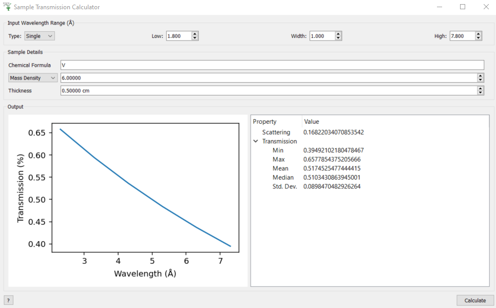

# Sample Transmission Calculator Testing

```{contents}
:local:
```

## Introduction

This is a manual testing guide for the `sample_transmission_calculator`
(Interfaces \> General \> Sample Transmission Calculator).

## Basic Usage

1.  For the Input Wavelength Range at the top of the window select
    `Single` from `Type` dropdown box and set

> - `Low=1.8`
> - `Width=1`
> - `High=7.8`

2.  In sample details set

> - `Chemical Formula = V`
> - `Mass Density = 6`
> - `Thickness = 0.5`

3.  Click `Calculate` button in bottom right - it should produce the
    following

<figure>

</figure>

4.  Select `Number Density` instead of `Mass Density` in the sample
    details and set `Number Density = 0.072` (it should produce an near
    identical result with transmission ~0.65 at the lowest wavelength).

## Multiple atoms in chemical formula

1.  In sample details set

> - `Chemical Formula = C2 H4`
> - `Mass Density = 0.93`
> - `Thickness = 0.015`

2.  Click `Calculate` - the transmission should be ~0.9 for all
    wavelengths (the cross-section is dominated by incoherent scattering
    rather than absorption - only the latter depends on wavelength).
3.  Set `Chemical Formula = C4 H8` and click `Calculate` - the result
    should not change. This doubles the number of scatterers in a
    formula unit, but because the mass density is the same it halves the
    number of formula units in the sample volume.
4.  Select `Number Density` instead of `Mass Density` in the sample
    details and set `Number Density = 0.12` (it should produce an near
    identical result with transmission ~0.9 at the lowest wavelength).
    This is because the units of `Number Density` are `atoms/Ang^3` not
    `formula units/Ang^3`.
5.  Set `Chemical Formula = C2 D4` and `Calculate` - the transmission
    should be ~1 (deuterium has a much smaller incoherent cross-section
    than hydrogen).

## Validation of Single Wavelength Range

For each of the following instructions there should be a warning message
in red at the bottom of the window.

1.  Try setting `Low > High`
2.  Try setting `Width > (High - Low)`
3.  Try setting `Width = 0`

It should not allow you to input the following in the spin-boxes (no
warning will be printed).

1.  Negative numbers
2.  Punctuation
3.  Non-numeric characters (including punctuation)

If you delete the contents of a box and then click `Calculate` it will
reset it with the previously entered values.

## Multiple Wavelength Range

1.  For the Input Wavelength Range at the top of the window select
    `Multiple` from `Type` dropdown box
2.  In the `Multiple` edit box enter `1,1,3` and click `Calculate`
3.  Right-click on the `transmission_ws` workspace in the main workbench
    window and `Show Data` - you should see that there are 2 bins at
    wavelengths `1.5 Ang` and `2.5 Ang`
4.  In the `Multiple` edit box enter `1,1,3,0.5,4` and click
    `Calculate` - in the workspace data table you should see additional
    bins at `3.25 Ang` and `3.75 Ang`
5.  Repeat the validation tests in
    `sample_transmission_wavelength_validation`

## Chemical Formula Validation

The following should produce a warning at the bottom of the window and
throw an error from `CalculateSampleTransmission
<algm-CalculateSampleTransmission>`

1.  Set `Chemical Formula = C2H4` (i.e. remove the space)
2.  Set `Chemical Formula = Z`
3.  Set `Chemical Formula = 0`
4.  Set `Chemical Formula = *`
5.  Set `Chemical Formula = 2C 4H`
