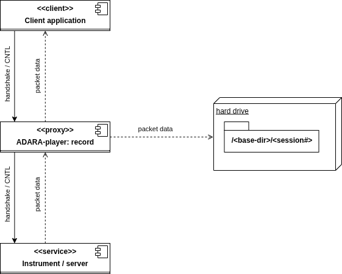
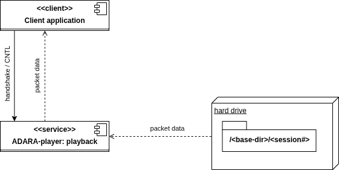

.. _live_data_packet_playback:

Working With Real Instruments
=============================

.. contents::
   :local:

Introduction
------------

For ORNL-facility instruments which use the ADARA system, it is possible to record and playback an ADARA-packet stream.
This ADARA-packet replay utility was developed to allow manual debugging of the live-data listener and the
live-reduction workflow.  The utility should also prove useful for debugging almost any live-data system in a
deterministic manner, even when disconnected from the instrument network or when the beam is down.

When recording a stream, ADARA packets are saved to files.  There can be many packets per file, or only one packet per
file, depending on the ``record.file_output`` setting in ``adara_player_conf.yml``. Usually it will be convenient to save the packet files for
a complete run (or part of a run) to a single directory.  For debugging or diagnostic purposes, often these packet files
can be obtained directly from the DAS group (, and in this case only the utility's playback functionality would be
used).  When packet-files are obtained directly, it will help if they retain their original modification times.  Moving
such files with ``mv`` does this automatically, but ``cp --preserve=timestamps`` must be used if the files are copied.  Files like this,
which have been saved to the ADARA cache by the ADARA system, contain *redundant* packet information, and usually will
need to be analyzed in some detail in order to arrive at a useful playback sequence.

How to use and modify ``Facilities.xml``
----------------------------------------

Mantid reads the ``Facilities.xml`` file to determine how to access each instrument.  The instrument's network address
is either in internet-socket (INET) form, as \<IPV4: port\> or \<IPV6: port\>, or in Unix-domain socket (UDS) form, as
any accessible file-path on the filesystem.  For example, in ``adara_player_conf.yml``, note that the default socket
address for the playback ``server`` resolves to ``${XDG_RUNTIME_DIR}/sock-adara_player``
(see the official `XDG Base Directory Specification <https://specifications.freedesktop.org/basedir/latest/>`_).
For testing, a loopback address such as ``127.0.0.1:12345`` may be used, but for security reasons, especially on multi-user systems, the UDS
form should generally be preferred.

When the ADARA-packet replay utility is used in ``playback mode``, it replaces the real instrument.  In this mode it may
be necessary to replace the instrument's address in ``Facilities.xml`` with the ``server`` address that will be
specified either in ``adara_player_conf.yml`` or on the commandline.  It is also possible to simply *override* the
instrument's address, using the ``Address`` argument of ``StartLiveData``.  Then, when the *client application* performs
its handshaking process to connect to the instrument and transfer data, it interacts with the ADARA-packet replay
utility instead of the real instrument.

When the ADARA-packet replay utility is used in ``record`` mode, the real instrument will *usually* still be used, and
the utility functions as a *proxy*.  As for ``playback`` mode, the instrument's address in ``Facilities.xml`` may be
replaced with the ``server`` address, but in addition, for ``record`` mode it is necessary to provide the *original*
instrument address as the ``source`` address, either in ``adara_player_conf.yml`` or on the commandline.  In this
situation, when the *client application* connects to the instrument, it interacts with the ADARA-packet replay utility,
which in this case connects to the real instrument as a *proxy* for the client application.

ADARA-server and listener handshaking protocol
----------------------------------------------
Both the ``SNSLiveEventDataListener``, and the ADARA-server itself, implement a handshaking protocol.  In its simplest
form, this protocol involves expecting a single ``CLIENT_HELLO_TYPE`` packet from the client at the start of each
session.  This hello-packet contains information about the required start-time for the requested data.

**Note that this ``CLIENT_HELLO_TYPE`` handshaking is the *only* handshaking presently implemented by the ADARA-packet
replay utility**.  Further, the utility does not change its behavior based on the time information present in the
hello-packet, nor does it filter out duplicate ``DEVICE_DESC_TYPE`` packets, if these are present.  Both of these
behaviors would be useful extensions to the utility's implementation.

Recording a packet stream
-------------------------

   ADARA-player: components used in record mode

#) Set up ``Facilities.xml``:

   * First of all, choose a suitable ``server`` address or note the default (see ``adara_player_conf.yml``).  Next,
     specify a *proxy* instrument in ``Facilities.xml``.  In most cases, a useful approach will be to comment out the
     existing instrument, copy its details to an adjacent location, and then modify the address to match the ``server``
     address.

#) Set up ``adara_player_conf.yml``:

   * make sure the ``server.address`` value matches that used in ``Facilities.xml``;

   * fill in the ``source`` address using the *original* instrument address;

#) Create a *base* directory for the saved packet data:

   * Note that each time the client application connects to the
     proxy, a *session* subdirectory will be created under this base directory.

#) In its own console, start the proxy server:

   ::

     adara_player --config <path to config file> --record <base directory path>

#) In another console, start your *client application* (e.g. ``workbench`` or your live-reduce Python script).

#) When you're done recording data, type CNTL-C in the proxy server's console.

Playing a packet-stream back
----------------------------

   ADARA-player: components used in playback mode

#)  Set up ``Facilities.xml``:

    * First of all, choose a suitable ``server`` address or note the default (see ``adara_player_conf.yml``).  Next,
      specify a *proxy* instrument in ``Facilities.xml``.  In most cases, a useful approach will be to comment out the
      existing instrument, copy its details to an adjacent location, and then modify the address to match the ``server``
      address.

#) Set up ``adara_player_conf.yml``:

   * make sure the ``server.address`` value matches that used in ``Facilities.xml``;

   * in ``playback`` mode, the ``source`` address will not be used, so it's OK if it's still the original instrument
     address;

   * decide on the playback ordering scheme: ``playback.packet_ordering``:

     - if the data was recorded using the ADARA-packet replay utility, this should be ``sequence_number``;

     - OTHERWISE it should usually be ``yaml``;

     - Specifying any other value for the ``playback.packet_ordering`` should be treated as *experimental*.

#) Figure out the details of the your data source directories.  The playback data can be specified by any of:

   * Specifying a ``sessions.yml`` file, which includes a ``base_path``, and then a list of ``sessions`` and lists of
     files for each session. This ``YAML`` file would usually be played back in the order of its sessions and file
     lists;

   * specifying the path to the base directory (which should contain *session* subdirectories, as noted previously);

   * OR specifying a Unix glob pattern for the input packet files (note that *braces* may be used to form this pattern);

#) In its own console, start the server, in playback mode:

   ::

     adara_player --config <path to config file> [--files <sessions.yml> | [<base directory path> | <Unix-format glob spec>]]

#) In another console, start your *client application* (e.g. ``workbench`` or your live-reduce Python script).  In
   playback mode, the client will be able to successfully connect as many times as there are *session* subdirectories.
   (For specific tests, you might want to create additional session subdirectories with duplicate content.  In this case,
   it's OK just to create a link: ``ln -s <existing session directory> <new session link>``, for each required session.
   For example ``ln -s <base directory>/0001 <base directory>/0022``, will allow session 22 to replay what was originally
   recorded as session 1.)

#) When you're done with the playback, type CNTL-C in the playback server's console.

Packet ordering during ``playback`` mode
----------------------------------------

If the stream being played back was saved using ``record``, and ``record.file_output`` was set to ``single_packet``
(in ``adara_player_conf.yml``), the playback order will be uniquely determined by the
<sequence number> part of each packet's filename.  During playback, each time the client application connects to the
server, a *session* subdirectory will be referenced, and the packet files in that directory will be played back in
sequence-number order.  Any time it's necessary to *programmatically* create a stream for deterministic playback, e.g.
using a Python script for some specific debugging scenario, this same directory and file naming scheme should be used.
Alternatively, a YAML file containing a <base directory> and a <sessions> list of files lists can be used.  In any of
these cases, it's possible to playback these session files using another ``playback.packet_ordering`` setting besides
``sequence_number`` or ``yaml``, but that's not recommended.

There are several ways to control the playback order of a packet stream.  Although an ADARA packet stream is somewhat
robust to changes in the ordering of the packets in the stream, how well this works depends on the details of the
specific packet types.  (For example, changing where a <run status> packet appears in the stream is probably a bad
idea!)  The ``player`` utility offers several distinct ways to control packet playback order (as specified in
``adara_player_conf.yml`` using the ``playback.packet_ordering`` key):

* ``yaml``: the order of the packet files is specified in the ``sessions.yml`` file;  or, if no ``sessions.yml`` file
  has been specified, the operating system's *directory-listing* order will be used;

* ``sequence_number``: the packet file's sequence number will be used (as generated by the ``record`` utility); this
  setting is recommended when the packet files were generated using ``record`` mode, OR when creating new packet files, or
  re-ordering packet files for special tests.  Using the YAML ``sessions.yml`` file is usually a better approach when not
  using ``record`` mode.

* ``mtime``: the packet file's modification time will be used;

* ``timestamp``: the ADARA-packet timestamp of the packet (or of the first packet in a file if it contains more than
  one); this should be used only in very special cases, or when there's no other alternative.  The main issue with using
  this approach is that often the ADARA system starts playback by inserting configuration (or reference) packets that may
  have been created months ago.  In general, the timestamps of these packets will not be updated for the new stream.
  Since this type of configuration packet may be inserted at multiple locations in the stream, the packet-timestamp based
  playback order does not end up corresponding to the playback order of the original stream.  (To solve this issue: use
  ``summarize`` mode, and then fill in a ``sessions.yml`` file!)

Using ``summarize`` mode
------------------------

Given a set of files containing ADARA-packet data, often it can be difficult to figure out how to set up a useful
``playback`` session.  This is especially true if the files contain *multiple* ADARA-packets per file.  ``summarize``
mode was implemented in order to provide additional information in this scenario.  To obtain a summary of the packet
data contained in the files, the commandline syntax is:

::

  adara_player --config <path to config file> --summarize <base directory path or glob spec>

For example, suppose we have a set of ADARA-packet files, as saved by the ADARA instrument server, from the SNAP
instrument run number 68851:

::

  (mantid-developer) [ADARA-data]$ ls -al ${ADARA-data}/SNAP/${68851_DATA} | cut -d' ' -f1-3,6-
  total 799824
  -rw-rw-r--  1 209715276 Nov 20 20:22 ds00000001-s00000001-run-68851.adara
  -rw-rw-r--  1 209715244 Nov 20 20:51 ds00000001-s00000002-run-68851.adara
  -rw-rw-r--  1  69131540 Nov 20 21:01 ds00000001-s00000003-run-68851.adara
  -rw-rw-r--  1  10367128 Nov 20 21:01 ds00000003-s00000001-run-68851.adara
  -rw-rw-r--  1 209715684 Nov 20 20:37 m00000001-f00000001-run-68851.adara
  -rw-rw-r--  1 110032168 Nov 20 21:01 m00000001-f00000002-run-68851.adara
  -rw-rw-r--  1       100 Nov 20 21:01 prologue-ds00000001-run-68851.adara
  -rw-rw-r--  1    143920 Nov 20 21:01 prologue-ds00000003-run-68851.adara
  -rw-rw-r--  1    158276 Nov 20 21:01 prologue-m00000001-run-68851.adara
  -rwxrwxr-x  1         0 Nov 20 19:53 proposal-IPTS-35450
  -rwxrwxr-x  1         0 Nov 20 21:01 translation_completed

Using the names and modification times of these files, we see that the files likely to contain *event data* (e.g. the
larger files) were saved with their modification times *before* those of the files containing the *run-status* and
*device-descriptor* data (such as ``ds00000001-s00000001-run-68851.adara``).  Although the server saves the complete data corresponding to any packet stream, we need to do
some additional work to recover what the *order* of that packet stream was likely to be.  In this case, the fact that
the server starts a new data file every 200 MB, and can *resend* the device-descriptor packets at that file transition
allows us to infer that here we probably have 3 complete 200 MB *data* sections, a *partial* ~ 100 MB section, and
possibly several other sections containing *run-status* and *device-descriptor* information.  Unfortunately, that's
still not enough information to reconstruct the stream's playback order.

Using ``summarize`` mode, pointed at this directory, the *console* log output shows us the location of the *session*
log, which then contains the summary content:

::

  (mantid-developer) [ADARA-data]adara_player --config ${adara_player_conf} --summarize "${SOURCE}/0001/*.adara"
  2026-01-26 05:24:06,189: INFO: Summarizing content of ADARA-packet files ...
  2026-01-26 05:24:06,189: INFO: Session 0001:
  2026-01-26 05:25:19,704: INFO: Summary available at: '${ADARA_PLAYER_LOGS}/session.574768.log'.

::

  (mantid-developer) [ADARA-data]$cat ${ADARA_PLAYER_LOGS}/session.574768.log
  2026-01-26 05:24:06,189: INFO: Summarizing content of ADARA-packet files ...
  2026-01-26 05:24:06,189: INFO: Session 0001:
  2026-01-26 05:24:06,190: INFO: Found 9 files ...
  2026-01-26 05:25:19,700: INFO: ---- prologue-m00000001-run-68851.adara (0.15 MB) ----
  2026-01-26 05:25:19,700: INFO:   packets: 434
  2026-01-26 05:25:19,700: INFO:     timestamps: 2025-10-13T13:14:16.606303719 .. 2025-11-21T02:01:14.440167100
  2026-01-26 05:25:19,700: INFO:   0x4004 RUN_INFO_TYPE: 1
  2026-01-26 05:25:19,700: INFO:   0x400a GEOMETRY_TYPE: 1
  2026-01-26 05:25:19,700: INFO:   0x400b BEAMLINE_INFO_TYPE: 1
  2026-01-26 05:25:19,700: INFO:   0x400d BEAM_MONITOR_CONFIG_TYPE: 1
  2026-01-26 05:25:19,700: INFO:   0x4102 PIXEL_MAPPING_ALT_TYPE: 1
  2026-01-26 05:25:19,700: INFO:   0x8000 DEVICE_DESC_TYPE: 39
  2026-01-26 05:25:19,700: INFO:   0x8001 VAR_VALUE_U32_TYPE: 43
  2026-01-26 05:25:19,700: INFO:   0x8002 VAR_VALUE_DOUBLE_TYPE: 291
  2026-01-26 05:25:19,700: INFO:   0x8003 VAR_VALUE_STRING_TYPE: 56
  2026-01-26 05:25:19,700: INFO: ------------------------------------------------------
  2026-01-26 05:25:19,700: INFO: ---- prologue-ds00000003-run-68851.adara (0.14 MB) ----
  2026-01-26 05:25:19,700: INFO:   packets: 427
  2026-01-26 05:25:19,700: INFO:     timestamps: 2025-10-13T13:14:16.606303719 .. 2025-11-21T02:01:14.440291536
  2026-01-26 05:25:19,700: INFO:   0x4007 STREAM_ANNOTATION_TYPE: 1
  2026-01-26 05:25:19,701: INFO:   0x8000 DEVICE_DESC_TYPE: 36
  2026-01-26 05:25:19,701: INFO:   0x8001 VAR_VALUE_U32_TYPE: 43
  2026-01-26 05:25:19,701: INFO:   0x8002 VAR_VALUE_DOUBLE_TYPE: 291
  2026-01-26 05:25:19,701: INFO:   0x8003 VAR_VALUE_STRING_TYPE: 56
  2026-01-26 05:25:19,701: INFO: -------------------------------------------------------
  2026-01-26 05:25:19,701: INFO: ---- ds00000003-s00000001-run-68851.adara (9.89 MB) ----
  2026-01-26 05:25:19,701: INFO:   packets: 284405
  2026-01-26 05:25:19,701: INFO:     timestamps: 2025-10-13T13:14:16.606303719 .. 2025-11-21T02:01:14.435576783
  2026-01-26 05:25:19,701: INFO:   0x4007 STREAM_ANNOTATION_TYPE: 1
  2026-01-26 05:25:19,701: INFO:   0x8000 DEVICE_DESC_TYPE: 36
  2026-01-26 05:25:19,701: INFO:   0x8001 VAR_VALUE_U32_TYPE: 43
  2026-01-26 05:25:19,701: INFO:   0x8002 VAR_VALUE_DOUBLE_TYPE: 284269
  2026-01-26 05:25:19,701: INFO:   0x8003 VAR_VALUE_STRING_TYPE: 56
  2026-01-26 05:25:19,701: INFO: --------------------------------------------------------
  2026-01-26 05:25:19,701: INFO: ---- prologue-ds00000001-run-68851.adara (0.00 MB) ----
  2026-01-26 05:25:19,701: INFO:   packets: 1
  2026-01-26 05:25:19,701: INFO:     timestamps: 2025-11-21T02:01:14.440245002 .. 2025-11-21T02:01:14.440245002
  2026-01-26 05:25:19,701: INFO:   0x4007 STREAM_ANNOTATION_TYPE: 1
  2026-01-26 05:25:19,701: INFO: -------------------------------------------------------
  2026-01-26 05:25:19,701: INFO: ---- ds00000001-s00000001-run-68851.adara (200.00 MB) ----
  2026-01-26 05:25:19,701: INFO:   packets: 2388572
  2026-01-26 05:25:19,701: INFO:     timestamps: 2025-11-21T00:53:03.112999667 .. 2025-11-21T01:22:18.141583667
  2026-01-26 05:25:19,701: INFO:     timestamps(events): 2025-11-21T00:53:03.112999667 .. 2025-11-21T01:22:18.108250667
  2026-01-26 05:25:19,701: INFO:   0x0000 RAW_EVENT_TYPE: 811457
  2026-01-26 05:25:19,701: INFO:   0x0001 RTDL_TYPE: 105300
  2026-01-26 05:25:19,701: INFO:   0x0003 MAPPED_EVENT_TYPE: 1471814
  2026-01-26 05:25:19,701: INFO:   0x4007 STREAM_ANNOTATION_TYPE: 1
  2026-01-26 05:25:19,701: INFO: ----------------------------------------------------------
  2026-01-26 05:25:19,701: INFO: ---- m00000001-f00000001-run-68851.adara (200.00 MB) ----
  2026-01-26 05:25:19,701: INFO:   packets: 1152529
  2026-01-26 05:25:19,701: INFO:     timestamps: 2025-10-13T13:14:16.606303719 .. 2025-11-21T01:37:46.863157722
  2026-01-26 05:25:19,701: INFO:     timestamps(events): 2025-11-21T00:53:03.112999667 .. 2025-11-21T01:37:45.806693667
  2026-01-26 05:25:19,701: INFO:   0x0001 RTDL_TYPE: 160960
  2026-01-26 05:25:19,701: INFO:   0x4000 BANKED_EVENT_TYPE: 160960
  2026-01-26 05:25:19,701: INFO:   0x4001 BEAM_MONITOR_EVENT_TYPE: 160960
  2026-01-26 05:25:19,701: INFO:   0x4003 RUN_STATUS_TYPE: 2
  2026-01-26 05:25:19,701: INFO:   0x4004 RUN_INFO_TYPE: 1
  2026-01-26 05:25:19,701: INFO:   0x4007 STREAM_ANNOTATION_TYPE: 2
  2026-01-26 05:25:19,701: INFO:   0x4008 SYNC_TYPE: 17
  2026-01-26 05:25:19,701: INFO:   0x400a GEOMETRY_TYPE: 1
  2026-01-26 05:25:19,701: INFO:   0x400b BEAMLINE_INFO_TYPE: 1
  2026-01-26 05:25:19,702: INFO:   0x400d BEAM_MONITOR_CONFIG_TYPE: 1
  2026-01-26 05:25:19,702: INFO:   0x4102 PIXEL_MAPPING_ALT_TYPE: 1
  2026-01-26 05:25:19,702: INFO:   0x8000 DEVICE_DESC_TYPE: 39
  2026-01-26 05:25:19,702: INFO:   0x8001 VAR_VALUE_U32_TYPE: 482918
  2026-01-26 05:25:19,702: INFO:   0x8002 VAR_VALUE_DOUBLE_TYPE: 186610
  2026-01-26 05:25:19,702: INFO:   0x8003 VAR_VALUE_STRING_TYPE: 56
  2026-01-26 05:25:19,702: INFO: ---------------------------------------------------------
  2026-01-26 05:25:19,702: INFO: ---- ds00000001-s00000003-run-68851.adara (65.93 MB) ----
  2026-01-26 05:25:19,702: INFO:   packets: 787850
  2026-01-26 05:25:19,702: INFO:     timestamps: 2025-11-21T01:51:35.153534667 .. 2025-11-21T02:01:14.446302667
  2026-01-26 05:25:19,702: INFO:     timestamps(events): 2025-11-21T01:51:35.153534667 .. 2025-11-21T02:01:14.429635667
  2026-01-26 05:25:19,702: INFO:   0x0000 RAW_EVENT_TYPE: 267784
  2026-01-26 05:25:19,702: INFO:   0x0001 RTDL_TYPE: 34754
  2026-01-26 05:25:19,702: INFO:   0x0003 MAPPED_EVENT_TYPE: 485311
  2026-01-26 05:25:19,702: INFO:   0x4007 STREAM_ANNOTATION_TYPE: 1
  2026-01-26 05:25:19,702: INFO: ---------------------------------------------------------
  2026-01-26 05:25:19,702: INFO: ---- ds00000001-s00000002-run-68851.adara (200.00 MB) ----
  2026-01-26 05:25:19,702: INFO:   packets: 2390236
  2026-01-26 05:25:19,702: INFO:     timestamps: 2025-11-21T01:22:18.091583667 .. 2025-11-21T01:51:35.203535667
  2026-01-26 05:25:19,702: INFO:     timestamps(events): 2025-11-21T01:22:18.091583667 .. 2025-11-21T01:51:35.170201667
  2026-01-26 05:25:19,702: INFO:   0x0000 RAW_EVENT_TYPE: 812452
  2026-01-26 05:25:19,702: INFO:   0x0001 RTDL_TYPE: 105422
  2026-01-26 05:25:19,702: INFO:   0x0003 MAPPED_EVENT_TYPE: 1472361
  2026-01-26 05:25:19,702: INFO:   0x4007 STREAM_ANNOTATION_TYPE: 1
  2026-01-26 05:25:19,702: INFO: ----------------------------------------------------------
  2026-01-26 05:25:19,702: INFO: ---- m00000001-f00000002-run-68851.adara (104.93 MB) ----
  2026-01-26 05:25:19,702: INFO:   packets: 605203
  2026-01-26 05:25:19,702: INFO:     timestamps: 2025-10-13T13:14:16.606303719 .. 2025-11-21T02:01:17.452662957
  2026-01-26 05:25:19,702: INFO:     timestamps(events): 2025-11-21T01:37:45.823360667 .. 2025-11-21T02:01:14.429635667
  2026-01-26 05:25:19,702: INFO:   0x0001 RTDL_TYPE: 84516
  2026-01-26 05:25:19,702: INFO:   0x4000 BANKED_EVENT_TYPE: 84516
  2026-01-26 05:25:19,702: INFO:   0x4001 BEAM_MONITOR_EVENT_TYPE: 84516
  2026-01-26 05:25:19,702: INFO:   0x4003 RUN_STATUS_TYPE: 2
  2026-01-26 05:25:19,702: INFO:   0x4004 RUN_INFO_TYPE: 1
  2026-01-26 05:25:19,702: INFO:   0x4007 STREAM_ANNOTATION_TYPE: 1
  2026-01-26 05:25:19,702: INFO:   0x4008 SYNC_TYPE: 9
  2026-01-26 05:25:19,702: INFO:   0x400a GEOMETRY_TYPE: 1
  2026-01-26 05:25:19,702: INFO:   0x400b BEAMLINE_INFO_TYPE: 1
  2026-01-26 05:25:19,702: INFO:   0x400d BEAM_MONITOR_CONFIG_TYPE: 1
  2026-01-26 05:25:19,702: INFO:   0x4102 PIXEL_MAPPING_ALT_TYPE: 1
  2026-01-26 05:25:19,702: INFO:   0x8000 DEVICE_DESC_TYPE: 39
  2026-01-26 05:25:19,702: INFO:   0x8001 VAR_VALUE_U32_TYPE: 253593
  2026-01-26 05:25:19,702: INFO:   0x8002 VAR_VALUE_DOUBLE_TYPE: 97950
  2026-01-26 05:25:19,703: INFO:   0x8003 VAR_VALUE_STRING_TYPE: 56
  2026-01-26 05:25:19,703: INFO: ---------------------------------------------------------
  2026-01-26 05:25:19,703: INFO: Suggested playback ordering:
  2026-01-26 05:25:19,703: INFO: ----------------------------
  2026-01-26 05:25:19,703: INFO:  ds00000003-s00000001-run-68851.adara (metadata: 2025-11-21T00:53:03.110000000)
  2026-01-26 05:25:19,703: INFO:  ds00000001-s00000001-run-68851.adara (events: 2025-11-21T00:53:03.110000000)
  2026-01-26 05:25:19,703: INFO:  m00000001-f00000001-run-68851.adara  (events: 2025-11-21T00:53:03.110000000)
  2026-01-26 05:25:19,703: INFO:  ds00000001-s00000002-run-68851.adara (events: 2025-11-21T01:22:18.088000000)
  2026-01-26 05:25:19,703: INFO:  m00000001-f00000002-run-68851.adara  (events: 2025-11-21T01:37:45.812000000)
  2026-01-26 05:25:19,703: INFO:  ds00000001-s00000003-run-68851.adara (events: 2025-11-21T01:51:35.140000000)
  2026-01-26 05:25:19,703: INFO:  prologue-ds00000001-run-68851.adara  (metadata: 2025-11-21T02:01:14.432000000)
  2026-01-26 05:25:19,703: INFO:  prologue-ds00000003-run-68851.adara  (metadata: 2025-11-21T02:01:14.432000000)
  2026-01-26 05:25:19,703: INFO:  prologue-m00000001-run-68851.adara   (metadata: 2025-11-21T02:01:14.432000000)
  2026-01-26 05:25:19,704: INFO: Summary available at: '${ADARA_PLAYER_LOGS}/session.574768.log'.

The section ``Suggested playback ordering`` at the end of the summary is an analysis of the *probable* file ordering
based on the packet timestamps.  The difficulty for this analysis stems primarily from the fact that several packet
types, such as geometry packets, have timestamps that correspond to the start of a proposal, which may be *months* in
the past.  For this reason, we use a combination of the event-timestamp ranges, followed by the control-packet
timestamps (an *ad hoc* hierarchy of packet types) to sort these files.  Whenever possible, files containing only
*metadata* packets precede files containing *event* packets.

The ``Suggested playback ordering`` can be used to create a ``sessions.yml`` file.  Each sublist under the ``sessions``
key corresponds to the playback order to use for a single session (i.e. a single client connection).  This YAML file can
then be used with the ``--files sessions.yml`` commandline argument of the ``adara_player`` application.  WARNING:
because of the way the ADARA-server saves its file data, often there will be duplicate ``DEVICE_DESC_TYPE`` packets in the group
of files corresponding to a single run.  Originally the ``SNSLiveEventDataListener`` treated this case as an error, but
in the current version, instead this will produce a *warning* in the logs, and the re-definition will be *skipped*.

::

  # example `sessions.yml`
  base_path: tests/scripts/data/test_input
  sessions:
    - # session 1:
      - ds00000003-s00000001-run-68851.adara  # initial metadata & run status
      - ds00000001-s00000001-run-68851.adara  # events
      - m00000001-f00000001-run-68851.adara   # events
      - ds00000001-s00000002-run-68851.adara  # events
      - m00000001-f00000002-run-68851.adara   # events
      - ds00000001-s00000003-run-68851.adara  # events
      - prologue-ds00000001-run-68851.adara   # trailing metadata: WARNING -- may be duplicate
      - prologue-ds00000003-run-68851.adara   # metadata: " "
      - prologue-m00000001-run-68851.adara    # metadata: " "

**Caveat RE ``Suggested playback ordering``**:

- At the moment, I recommend simply *ignoring* any metadata-only files.  Including these files in the playback generates
  "duplicate device-descriptor for XX" and "XX is not a time-series property" errors (i.e. the latter because "XX" has not seen its
  device-descriptor yet);

- This should be OK because the event-bearing files do contain the ``RUN_STATUS``, ``RUN_INFO``, ``GEOMETRY_TYPE``, and
  ``DEVICE_DESC_TYPE`` sections.

I'm not at all sure what is going on with this issue.  Possibly the ADARA-server is being somewhat *redundant* with
respect to the packet-data that it saves?

Setup for examples
------------------

In the following we assume that:

- your mantid build directory: ``${BUILD}``;
- the location of the scripts: ``${LIVEDATA_TEST_SCRIPTS}``:
  ``LIVEDATA_TEST_SCRIPTS=${BUILD}/../Framework/PythonInterface/test/python/mantid/LiveData/ADARA/utils/packet_playback/scripts``;
- the location of the ``adara_player.py``: ``${ADARA_PLAYER}``:
  ``ADARA_PLAYER=Framework/PythonInterface/mantid/LiveData/ADARA/utils/packet_playback/adara_player.py``;
- the location of the input data for these examples: ``${ADARA_PLAYER_INPUT_DATA}``;
- your logs output directory is: ``${ADARA_PLAYER_LOGS}``;
- from ``${BUILD}/bin/launch_mantidworkbench.sh``: ``${LOCAL_PRELOAD}``
- from ``${BUILD}/bin/launch_mantidworkbench.sh``: ``${LOCAL_PYTHONPATH}``

**Make sure that you redefine all of these for *every* console session.**

1\. Build mantid, or make sure you're using a version that has an updated `SNSLiveEventDataListener`.  The main issues
here are:

- the listener needs to be able to work successfully with Unix Domain Socket (UDS) addresses;

- duplicate ``DEVICE_DESC_TYPE`` packets now generate a warning, rather than raising an exception.

::

  # from the repository root
  mkdir build; cd build
  cmake .. -GNinja
  cmake --build . --target AllTests workbench StandardTestData SystemTestData

2\. Create the test directory structure:

::

  mkdir ${BUILD}/adara_player_tmp
  cd ${BUILD}/adara_player_tmp

  # a directory for the logs output
  mkdir ${BUILD}/adara_player_tmp/logs

  # extract the input data for these examples
  tar -xf ${BUILD}/ExternalData/Testing/Data/SystemTest/adara_player_input_data.tar

**For use in the following, here's a separate environment variables definition section**.
Note that these variable definitions could be stored in a file, and then the file could either be sourced or stored
as an ``.envrc`` file to be used along with utility ``direnv``.  Usually, this environment variable definition step
would be completed *before* creating the subdirectories and extracting the data, so that variables are readily available
when running these actions, and the directory locations will then automatically be *consistent* with the variable definitions.

::

  REPO_BASE=*** FILL THIS IN! ***
  BUILD=*** FILL THIS IN! ***

  # probable definitions, but check in your own ``${BUILD}/bin/launch_mantidworkbench.sh``
  LOCAL_PRELOAD=${HOME}/mambaforge/envs/mantid-developer/lib/libjemalloc.so.2
  LOCAL_PYTHONPATH=${BUILD}/bin

  LIVEDATA_TEST_SCRIPTS=${REPO_BASE}/Framework/PythonInterface/test/python/mantid/LiveData/ADARA/utils/packet_playback/scripts
  ADARA_PLAYER_UTILS=${REPO_BASE}/Framework/PythonInterface/mantid/LiveData/ADARA/utils/packet_playback
  ADARA_PLAYER=${ADARA_PLAYER_UTILS}/adara_player.py
  ADARA_PLAYER_LOGS=${BUILD}/adara_player_tmp/logs
  ADARA_PLAYER_INPUT_DATA=${BUILD}/adara_player_tmp/adara_player_input_data

  # define a directory for the output data
  ADARA_PLAYER_OUTPUT_DATA=${BUILD}/adara_player_tmp/output_data

| 3. **IMPORTANT reminder**: Set the ``base_path`` in ``${LIVEDATA_TEST_SCRIPTS}/adara_player_sessions.yml`` to the value of
  ``${ADARA_PLAYER_INPUT_DATA}``.

| 4. **IMPORTANT reminder**: Set the ``logging.filename`` in
  ``${ADARA_PLAYER_UTILS}/adara_player_conf.yml`` using the value from ``${ADARA_PLAYER_LOGS}``.  Note that the
  ``PID`` key will be substituted automatically, if present in the name.

Example ``playback`` mode session
---------------------------------

1\. In its **own** console: start `adara_player` in `playback` mode:

::

  # activate your `mantid-developer` environment
  mamba activate mantid-developer

  ##
  ## DEFINE all of your environment variables as in ``Setup for examples``!
  ##

  # this isn't strictly necessary, but this environment key allows you to control the YAML config location:
  adara_player_conf=${ADARA_PLAYER_UTILS}/adara_player_conf.yml

  echo "default SERVER_ADDRESS: ${XDG_RUNTIME_DIR}/sock-adara_player" # change this in `adara_player_conf.yml`, if required

  # default mode is `playback`:
  LD_PRELOAD=${LOCAL_PRELOAD} PYTHONPATH=${LOCAL_PYTHONPATH}\
    python ${ADARA_PLAYER} --config ${adara_player_conf} --files=${LIVEDATA_TEST_SCRIPTS}/adara_player_sessions.yml

::

  (mantid-developer) [packet_playback]> LD_PRELOAD=${LOCAL_PRELOAD} PYTHONPATH=${LOCAL_PYTHONPATH}  python ${ADARA_PLAYER} --config ${adara_player_conf} --files=${LIVEDATA_TEST_SCRIPTS}/adara_player_sessions.yml
  2026-01-27 05:06:19,835: INFO: Waiting for client connection at /run/user/46619/sock-adara_player...
  2026-01-27 05:06:19,836: INFO: Type CNTL-C to exit.

3\. In **another** console, run the script that calls `StartLiveData`.  Note that in this script, we change the
``Address`` argument to be our default ``SERVER_ADDRESS``:

::

  # activate your `mantid-developer` environment
  mamba activate mantid-developer

  ##
  ## DEFINE all of your environment variables as in ``Setup for examples``!
  ##

  cd ${LIVEDATA_TEST_SCRIPTS}
  LD_PRELOAD=${LOCAL_PRELOAD} PYTHONPATH=${LOCAL_PYTHONPATH}\
    python adara_player_StartLiveData.py

::

  (mantid-developer) [scripts]> LD_PRELOAD=${LOCAL_PRELOAD} PYTHONPATH=${LOCAL_PYTHONPATH}\
    python adara_player_StartLiveData.py
  FrameworkManager-[Notice] Welcome to Mantid 6.14.0.1.dev87
  FrameworkManager-[Notice] Please cite: http://dx.doi.org/10.1016/j.nima.2014.07.029 and this release: http://dx.doi.org/10.5286/Software/Mantid
  StartLiveData-[Notice] StartLiveData started
  SNSLiveEventDataListener-[Notice] Run number is 68851
  LoadLiveData-[Warning] The SNSLiveEventDataListener is not ready to return data: The workspace has not yet been initialized.
  LoadLiveData-[Warning] Trying again in 10 seconds - cancel the algorithm to stop.
  LoadLiveData-[Notice] Performing chunk processing using RunPythonScript
  Loaded chunk: 248988 events
    pulse-times: 2025-11-21T00:53:03.162999667 -- 2025-11-21T01:29:39.948780667
    event-times: 2025-11-21T00:53:03.162999667 -- 2025-11-21T01:29:39.948780667
  LoadLiveData-[Notice] Performing the Replace operation.
  StartLiveData-[Notice] StartLiveData successful, Duration 21.84 seconds
  MonitorLiveData-[Notice] MonitorLiveData started
  MonitorLiveData-[Notice] Loading live data chunk 0 at 10:44:13
  Loaded chunk: 210904 events
    pulse-times: 2025-11-21T01:29:39.948780667 -- 2025-11-21T02:01:14.346301667
    event-times: 2025-11-21T01:29:39.982113667 -- 2025-11-21T02:01:14.346301667
  MonitorLiveData-[Notice] Run #68851 ended. Clearing existing workspace.
  MonitorLiveData-[Notice] Loading live data chunk 1 at 10:44:23
  MonitorLiveData-[Warning] MonitorLiveData: Execution cancelled by user.
  (mantid-developer) [scripts]$

Example ``record`` mode session
-------------------------------
The beam is currently down, so what can we do?  It turns out quite a lot!  In this example we'll use ``adara_player`` in
``playback`` mode to mock the ADARA instrument server.  Then in a separate process, we'll use ``adara_player`` in
``record`` mode to record our *client application's* session.  To keep things simple, we'll duplicate some of the
sections above, but with a few small changes.

1\. Complete the setup as in ``Setup for examples``.

2\. a) In its **own** console: start ``adara_player`` in ``playback`` mode: **(here we add a "-source" *suffix* to the server address)**:

::

  # activate your `mantid-developer` environment
  mamba activate mantid-developer

  ##
  ## DEFINE all of your environment variables as in ``Setup for examples``!
  ##

  # this isn't strictly necessary, but it allows you to control the YAML config location:
  adara_player_conf=${ADARA_PLAYER_UTILS}/adara_player_conf.yml

  # add the "-source" suffix for this server process,
  #   this lets the ``record`` proxy process use the *default* address
  SERVER_ADDRESS=${XDG_RUNTIME_DIR}/sock-adara_player-source

  # default mode is `playback`:
  LD_PRELOAD=${LOCAL_PRELOAD} PYTHONPATH=${LOCAL_PYTHONPATH}\
    python ${ADARA_PLAYER} --config ${adara_player_conf} --server_address=${SERVER_ADDRESS} --files=${LIVEDATA_TEST_SCRIPTS}/adara_player_sessions.yml

2\. b) In **another** console: start ``adara_player`` in ``record`` mode: **(here we use the *default* server
address)**:

::

  # activate your `mantid-developer` environment
  mamba activate mantid-developer

  ##
  ## DEFINE all of your environment variables as in ``Setup for examples``!
  ##

  # this isn't strictly necessary, but it allows you to control the YAML config location:
  adara_player_conf=${ADARA_PLAYER_UTILS}/adara_player_conf.yml

  # set the source address to the server address used in ``2) a)``
  SOURCE_ADDRESS=${XDG_RUNTIME_DIR}/sock-adara_player-source

  # use ``record`` mode, but with the default server address:
  LD_PRELOAD=${LOCAL_PRELOAD} PYTHONPATH=${LOCAL_PYTHONPATH}\
    python ${ADARA_PLAYER} --config ${adara_player_conf} --record --source_address=${SOURCE_ADDRESS} ${ADARA_PLAYER_OUTPUT_DATA}

3\. Finally, in **yet another** console, run the script that calls `StartLiveData`: **(this is exactly the same as for the ``playback`` mode example)**.

::

  # activate your `mantid-developer` environment
  mamba activate mantid-developer

  ##
  ## DEFINE all of your environment variables as in ``Setup for examples``!
  ##

  cd ${LIVEDATA_TEST_SCRIPTS}
  LD_PRELOAD=${LOCAL_PRELOAD} PYTHONPATH=${LOCAL_PYTHONPATH}\
    python adara_player_StartLiveData.py

After the client session completes, the contents of the ``${ADARA_PLAYER_OUTPUT_DATA}`` directory should be:

::

    (mantid-developer) [packet_playback]$ tree ${ADARA_PLAYER_OUTPUT_DATA}
    ${ADARA_PLAYER_OUTPUT_DATA}
    └── 0001
        ├── session.adara
        └── session.log -> ${ADARA_PLAYER_LOGS}/session.614216.log

    1 directory, 2 files

Note that in ``record`` mode, the default is to output all of the packets to a single ``session.adara`` file, and even
in the case of only one client connection (i.e. "session") a complete session-directory tree will be created.  The
corresponding command to play this back is just ``adara_player ${ADARA_PLAYER_OUTPUT_DATA}`` -- only specifying the root of the tree.

4\. Just as a reality check, we'll **verify** the contents of the packet file from the recorded session:

::

  # activate your `mantid-developer` environment
  mamba activate mantid-developer

  ##
  ## DEFINE all of your environment variables as in ``Setup for examples``!
  ##

  # this isn't strictly necessary, but it allows you to control the YAML config location:
  adara_player_conf=${ADARA_PLAYER_UTILS}/adara_player_conf.yml

  LD_PRELOAD=${LOCAL_PRELOAD} PYTHONPATH=${LOCAL_PYTHONPATH}\
    python ${ADARA_PLAYER} --config ${adara_player_conf} --summarize ${ADARA_PLAYER_OUTPUT_DATA}

::

  2026-01-27 11:33:27,528: INFO: Summarizing content of ADARA-packet files ...
  2026-01-27 11:33:27,528: INFO: Session 0001:
  2026-01-27 11:33:32,323: INFO: Summary available at:
      '${ADARA_PLAYER_LOGS}/session.615527.log'.

::

  (mantid-developer) [packet_playback]$ cat ${ADARA_PLAYER_LOGS}/session.615527.log
  2026-01-27 11:33:27,528: INFO: Summarizing content of ADARA-packet files ...
  2026-01-27 11:33:27,528: INFO: Session 0001:
  2026-01-27 11:33:27,529: INFO: Found 1 files ...
  2026-01-27 11:33:32,322: INFO: ---- session.adara (40.17 MB) ----
  2026-01-27 11:33:32,322: INFO:   packets: 509390
  2026-01-27 11:33:32,322: INFO:     timestamps: 2025-10-13T13:14:16.606303719 .. 2025-11-21T01:22:18.141583667
  2026-01-27 11:33:32,322: INFO:     timestamps(events): 2025-11-21T00:53:03.112999667 .. 2025-11-21T01:22:18.091583667
  2026-01-27 11:33:32,322: INFO:   0x0000 RAW_EVENT_TYPE: 40579
  2026-01-27 11:33:32,322: INFO:   0x0001 RTDL_TYPE: 160402
  2026-01-27 11:33:32,322: INFO:   0x0003 MAPPED_EVENT_TYPE: 73230
  2026-01-27 11:33:32,322: INFO:   0x4000 BANKED_EVENT_TYPE: 2728
  2026-01-27 11:33:32,322: INFO:   0x4001 BEAM_MONITOR_EVENT_TYPE: 2764
  2026-01-27 11:33:32,322: INFO:   0x4003 RUN_STATUS_TYPE: 1
  2026-01-27 11:33:32,322: INFO:   0x4004 RUN_INFO_TYPE: 1
  2026-01-27 11:33:32,322: INFO:   0x4007 STREAM_ANNOTATION_TYPE: 3
  2026-01-27 11:33:32,322: INFO:   0x4008 SYNC_TYPE: 6
  2026-01-27 11:33:32,322: INFO:   0x400a GEOMETRY_TYPE: 1
  2026-01-27 11:33:32,322: INFO:   0x400b BEAMLINE_INFO_TYPE: 1
  2026-01-27 11:33:32,322: INFO:   0x400d BEAM_MONITOR_CONFIG_TYPE: 1
  2026-01-27 11:33:32,322: INFO:   0x4102 PIXEL_MAPPING_ALT_TYPE: 1
  2026-01-27 11:33:32,322: INFO:   0x8000 DEVICE_DESC_TYPE: 39
  2026-01-27 11:33:32,322: INFO:   0x8001 VAR_VALUE_U32_TYPE: 165346
  2026-01-27 11:33:32,322: INFO:   0x8002 VAR_VALUE_DOUBLE_TYPE: 64231
  2026-01-27 11:33:32,322: INFO:   0x8003 VAR_VALUE_STRING_TYPE: 56
  2026-01-27 11:33:32,322: INFO: ----------------------------------
  2026-01-27 11:33:32,322: INFO: Suggested playback ordering:
  2026-01-27 11:33:32,322: INFO: ----------------------------
  2026-01-27 11:33:32,323: INFO:  session.adara (events: 2025-11-21T00:53:03.110000000)
  2026-01-27 11:33:32,323: INFO: Summary available at:
      '${ADARA_PLAYER_LOGS}/session.615527.log'.

As can be seen, all of the packets have been combined into a single file.  Note that if it's ever required, in
``adara_player_conf.yml``, ``record.file_output`` can also be set to ``single_packet`` mode -- this might be useful for
special situations.
