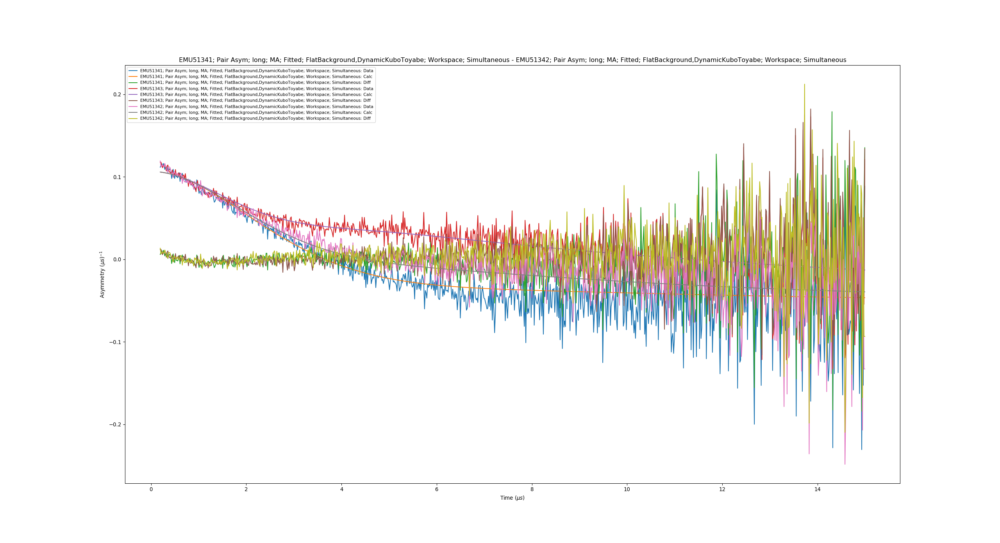
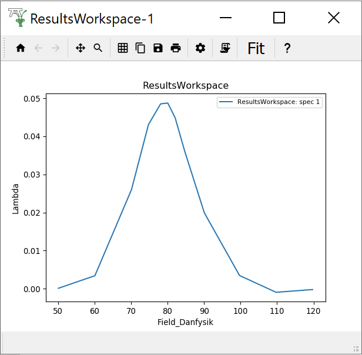

.. _Muon_Analysis_EMU-ref:

Muon Unscripted Testing: EMU
============================

.. contents:: Table of Contents
   :local:

Introduction
------------

These tests are for the EMU instrument at ISIS.
This section will show some advance fitting and plotting features of the GUI.
It would be worth closing the muon GUI and clearing the ADS before doing the second test.
This is to give a clean state so it is easier to find the correct results table.

-------------------------

.. _emu_ionic_diffusion_test:

Ionic Diffusion Test
--------------------

**Time required 5 - 10 minutes**

- Open **Muon Analysis** (*Interfaces* > *Muon* > *Muon Analysis*)
- Change *Instrument* to **EMU**, found in the *Home* tab
- Load runs ``51341-3``
- Go to the **Fitting** tab
	- Check the **Simultaneous fit over** checkbox, and change from **Run**
	  to **Group/Pair**
	- Right click the empty table area; Select **Add Function**
	- Add a **FlatBackground** (*Background* > *Flat Background*)
	- Similarly, add **DynamicKuboToyabe** (*Muon* > *MuonGeneric* >
	  *DynamicKuboToyabe*)
	- Check the **Global** checkbox for the parameters **A0**, **Asym**,
	  **Delta** and **Nu**
	- Set ``A0 = 0.05``, ``Asym = 0.15``, ``Delta = 0.2`` and ``Nu = 0.1``
	- Click the value for the **Field** parameter; A ``...`` should appear next
	  to it, click it. A new window should appear
	- Check the box called **Log**
	- Change the log to be **field_danfysik**
	- Click a row in the table
	- Click the **Set** drop down menu and choose **Set all to log**
	- The values should be roughly 0, 5 and 10.5
	- Do the same but this time choose **Fix all**, then click **Ok**
	- Click Fit
- Expected Values are (similar to within 50%):
	- **f0.A0:** ``-0.0467``
	- **f1.Asym:** ``0.155``
	- **f1.Delta:** ``0.389``
	- **f1.Nu:** ``0.474``
- Tick ``Plot Difference`` check box
- In the plotting window click the ``External Plot`` button
- You should get a plot that looks like the following:

- Go to the **Fitting** tab
	- Remove the ``DynamicKuboToyabe`` function
	- Uncheck the **Simultaneous fit over** checkbox
	- Press fit
	- Tick the ``Exclude Range`` option in the table
	- Enter values of 0 to 6
	- Press fit, notice that the fit line moves to lower y values

--------------------------------

.. _emu_superconducting_copper_test:

Superconducting Copper Test
---------------------------

**Time required 5 - 10 minutes**

To use the **Model Fitting** tab see the :ref:`Muon_Feature_Flags-ref` documentation. You will
need to set `model_analysis:2` before opening Workbench and starting this test.

- Open **Muon Analysis** (*Interfaces* > *Muon* > *Muon Analysis*)
- Change *Instrument* to **EMU**, found in the *Home* tab
- Load run ``20889-20900``
- Go to the **Fitting** tab
	- Right click the empty table area; Select **Add Function**
	- Add **ExpDecayMuon** (*Muon* > *MuonGeneric* >
	  *ExpDecMuon*)
- Go to the **Sequential Fitting** tab
	- Click **Sequentially Fit All**
- Go to the **Results** tab
	- At the bottom of the interface, click **Output Results**
	- Notice that the text for the output button is now in red (to warn the user they will overwrite it)
	- Change the name to "Results2" and it will turn black again
	- Above the log values table is a case sensitive search bar
	- Add the "run_number" and "Field_Danfysik" logs by ticking them
	- Click **Output Results**
- Go to the **Model Fitting** tab
	- In the ``Results table`` combobox you will see that two options are listed
	- Pick "Results2"
	- Set the ``Select Data`` to "Field_Danfysik" and "Lambda"
	- The plot will look similar to the one below (but a scatter plot)
	- Add a peak function (e.g. Gaussian)
	- Move the peak centre to around 79
	- You should be able to fit to the data
	- Pressing the ``Covariance Matrix`` button will give a pop up containing it
	- Ticking the ``Errors`` box below the plot will show the error bars on the data along with a shaded region
	- Change ``Plot guess using`` to "Uniform points across data range"
	- Tick ``Plot guess``, a smooth curve will appear
- The x and y values below the plot can be used to zoom in on specific regions of the data

