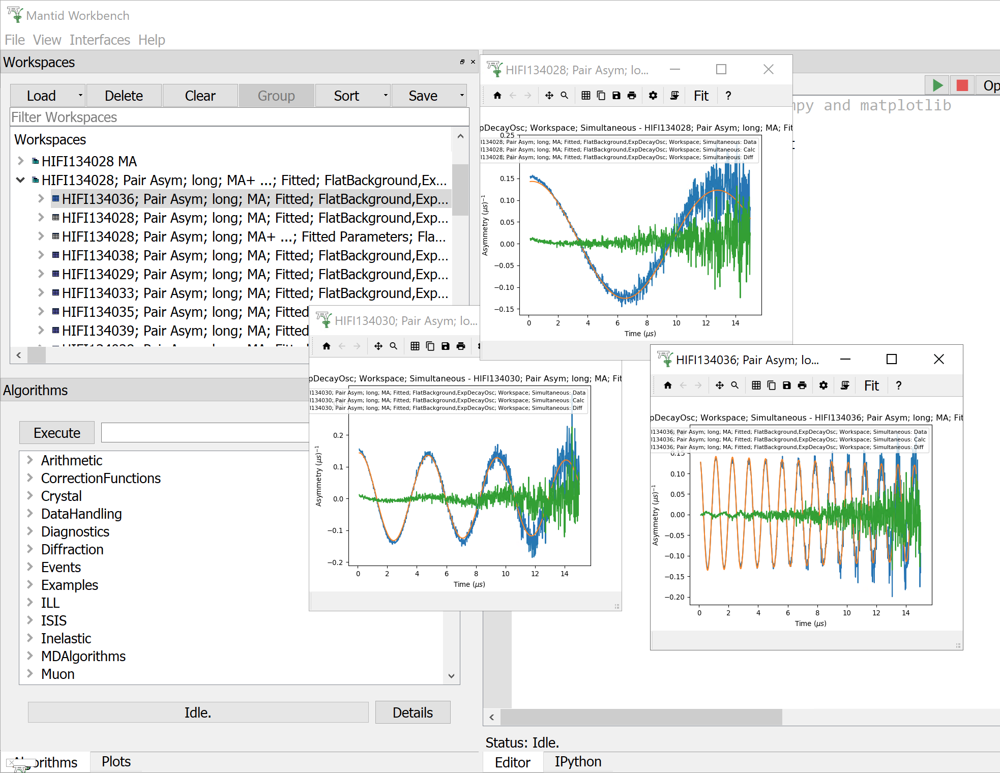

.. _Muon_Analysis_HIFI-ref:

Muon Unscripted Testing: HIFI
=============================

.. contents:: Table of Contents
   :local:

Introduction
------------

These tests looks at data from the HIFI instrument.
The first test will introduce dead time corrections.
When a detector receives a signal, there is small period of time afterwards when it can not record a new signal.
This is called the dead time.
We can model and adjust the data to compensate for the dead time.
When looking at the raw counts, which look like an exponential decay, the correction makes the biggest difference at large count values.
The second test will use multiple periods, this is when the same data is recorded twice at slightly different time intervals.

-----------------------------------------------

HIFI Transverse Field Simultaneous Fitting
------------------------------------------

**Time required 5 - 10 minutes**

- Open **Muon Analysis** (*Interfaces* > *Muon* > *Muon Analysis*)
- Change *Instrument* to **HIFI**, found in the *Home* tab
- In the loading bar enter ``134028-39``
- Some new data will appear in the plot
- Go to the **grouping tab**
	- In the group table, tick the ``Analyse`` option for ``fwd``
	- In the pair table below, untick the ``Analyse``  option for ``long``
- Go to the **Corrections** tab
	- Set the plot to ``Counts`` (combobox above the plot), you will now see an exponential decay
	- Change the dead time correction to ``None`` and notice that the counts at small times decreases
	- Change the dead time correction back to ``From Data File``
- Go to the **Grouping** tab
	- In the Pair table, click **Guess Alpha**
	- In the resulting dialog, change the run to ``HIFI134034`` to be used for
	  the calculation
	- A value close to ``1.3`` should appear
- Go to the **Fitting** tab
	- Check the **Simultaneous fit over** checkbox, and change from **Run**
	  to **Group/Pair**
	- Right click the empty table area; Select **Add Function**
	- Add a **FlatBackground** (*Background* > *Flat Background*)
	- Similarly, add **ExpDecayOsc** (*Muon* > *MuonGeneric* >
	  *ExpDecOsc*)
	- Set all parameters to **Global**, except **Frequency**
	- Click **Fit**
- The fit might work but with a large **Chi-squared** Squared value (``>100``)
- Now to try the fit a different way.
	- Click **Undo Fits**
	- Click the value for the **Frequency** parameter; A ``...`` should appear
	  next to it, click it. A new window should appear
	- Enter a value of ``0.01`` for the first run in the table
	- For each of the other runs in the table, enter values from ``0.1`` to ``1.1`` in steps of ``0.1``
	- Click **Ok**
	- Click **Fit**
	- This time the fit should work with a significantly lower value for **Chi-squared** (``<10``)
- Tick ``Tiled plot by`` in the plotting window
- Change the combobox to ``Run`` and each subplot will now contain just 2 lines
- Check that the lines look similar to the results below

-----------------------------------------------

.. _hifi_multi_period:

HIFI MultiPeriod Data
---------------------

**Time required 5 - 10 minutes**

- In the loading bar enter ``84447-9``
- Go to the **Grouping** tab and press ``Default``
- Go to the **Fitting** tab
	- Untick ``Tiled plot by`` in the plotting window
	- Untick ``Simultaneous over``
- Go to the **Sequential Fitting** tab
	- Press ``Sequentially fit all``
	- When its complete the table should update
	- It is ok if some of the rows say "Failed". This happens because these rows need more iterations to converge. However, if you go to the Fitting tab and cycle through the datasets, you can see that the fits are still reasonably good.
	- Selecting rows will show you the data and fit for those rows
- Go to the **Grouping** tab
	- The ``Period`` column in the group table will show a series of numbers (1, 2, 3 or 4)
	- Press the ``Periods`` button and a pop up will appear with 5 rows (one spare)
	- Close the pop up
	- Tick the ``Analyse`` box in the grouping table for "fwd1"
	- Untick all of the ``Analyse`` boxes in the pair table
	- This will leave you with 3 lines (one for each run)
	- In the ``Periods`` column you can sum periods byusing a comma seperated list or a range using a dash
	- When you change the periods summed the plot will change
