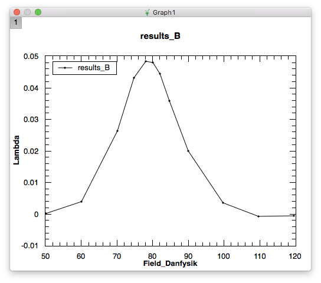
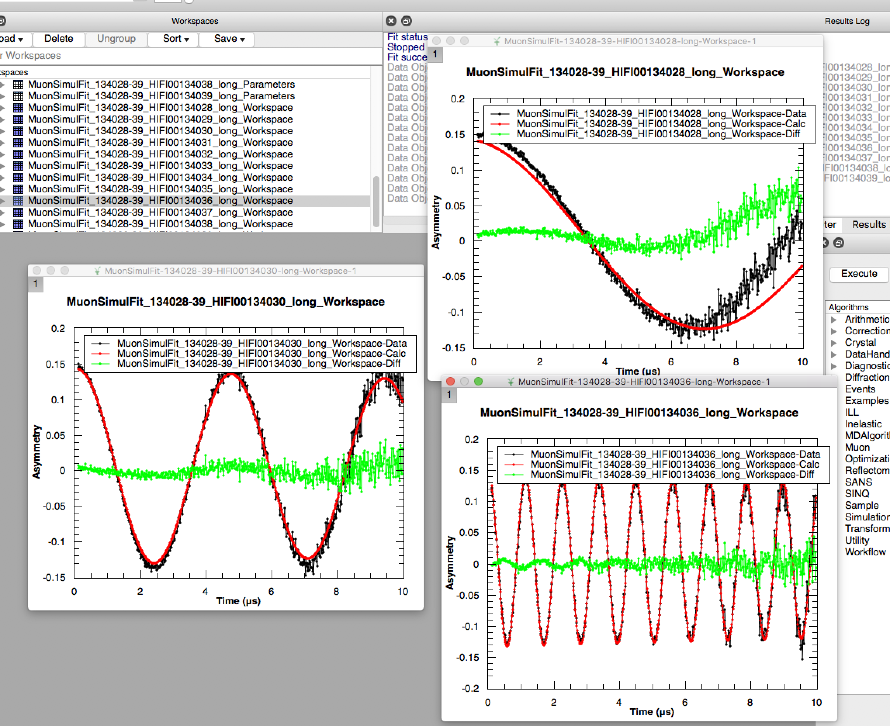

.. _muon_testing:

Muon Testing
============

.. contents::
  :local:

Ionic Diffusion test
--------------------

*Preparation*

-  Instrument ``EMU``
-  Files ``51341.nxs``, ``51342.nxs`` and ``51343.nxs``
-  Make sure the location of these files is included in your search
   directories. Full instructions `are available
   online <http://www.mantidproject.org/MBC_Getting_set_up#MantidPlot_First-Time_Setup>`__.

**Time required 5 - 10 minutes**

--------------

1. Make sure that the ``.nxs`` files are in one of the directories on
   Mantid’s search path.

-  Open Muon Analysis
-  Choose ``Machine``: ``EMU``
-  In ``Load Run`` enter ``51341``
-  Under ``Settings`` tab, ensure the ``Enable Multiple Fitting`` is
   checked
-  In ``Data Analysis Tab``

   -  Beside ``Runs`` enter ``51341-3`` and check ``Simultaneous`` below
   -  Right click the ``Fit Function`` table area; select
      ``Add Function``
   -  Add ``Background`` > ``Flat Background``
   -  Add ``Muon`` > ``DynamicKuboToyabe``
   -  Check the ``Global`` box for: ``A0``, ``Asym``, ``Delta``, ``Nu``
   -  Click on the value ``0.0000`` for ``Field`` - a ``...`` box should
      appear, click it

      -  On the ``Set`` dropdown, select ``Fix All``
      -  Enter values of ``0``, ``5``, ``10`` for the three runs

   -  Set ``A0 = 0.05``, ``Asym = 0.15``, ``Delta = 0.2``, ``Nu = 0.1``
   -  Click ``Fit`` > ``Fit``

-  In the ``Results Table`` tab

   -  Under ``Fitting Results`` check the ``Simultaneous`` button
   -  Click ``Create Table``
   -  A table should appear in the main Mantid work area

-  In the ``Results Table`` workspace

   -  Expected values (similar to within 50%) ..
   -  f0.A0: -0.083439833711330152
   -  f1.Asym: 0.19125607982528858
   -  f1:Delta: 0.3301445010124604
   -  f1:Nu: 0.8574644977974730220884

-  In the workspaces section of the main Mantid window:

   -  Click of the ``MuonSimulFit_5141-3`` group
   -  Within this there should be three workspaces
   -  Right-click each workspace
   -  Choose ``Plot spectrum``
   -  Choose ``1D plot`` and click ``Plot All``

Possible problems
^^^^^^^^^^^^^^^^^

-  Loading local data for 51341-3; these may not be in recognised
   directories - make sure that this is the case.

Superconducting Copper Test
---------------------------

*Preparation*

-  Files ``EMU00020882.nxs`` – ``EMU00020900.nxs``
-  Make sure the location of these files is included in your search
   directories

**Time required 5 - 10 minutes**

--------------

1. Make sure that the ``.nxs`` files are in one of the directories on
   Mantid’s search path.

-  Open Muon Analysis
-  Choose ``Machine``: ``EMU``
-  In ``Load Run`` enter ``20882``
-  Click the ``>`` tab next to ``Load Run`` a few times, this should
   produce new plots each time
-  Under ``Settings`` tab, ensure the ``Enable Multiple Fitting`` is
   un-checked
-  After loading ``20884`` switch to the ``Data Analysis`` tab
-  Right click under ``Property`` and select ``Add Function``
-  Choose ``Muon`` > ``ExpDecayMuon``
-  Click ``Fit`` > ``Fit``
-  Click ``Fit`` > ``Sequential Fit``
-  Beside ``Runs`` enter ``20889-20900``
-  Click ``start``
-  Close the ``Sequential Fits`` window
-  Switch to the ``Results Table`` tab
-  In the ``Fitting Results`` table check the ``Sequential`` radio
   button
-  In the ``Values`` table check ``Run Number`` and ``Field_Danfysik``
-  Ensure that all runs are checked in the ``Fitting Results`` table
-  Click ``Create Table``
-  In the main Mantid GUI select the ``ResultsTable`` in the
   ``Workspaces`` tab, this is the one you just created
-  Right click and select ``Convert to MatrixWorkspace``
-  In the resulting dialog select ``Column X`` as ``Field_Danfysik`` and
   ``Column Y`` as ``lambda``
-  Click ``Run``
-  Right click the new workspace created in the ``Workspaces`` tab
-  Select ``Plot Spectrum``
-  You should get something like the following plot:

HIFI Transverse Field Simultaneous Fitting
------------------------------------------

*Preparation*

-  Files ``HIFI00134028`` – ``HIFI00134039.nxs``
-  Make sure the location of these files is included in your search
   directories
-  Make sure that the instrument in the Muon Interface is set to
   ``HIFI``

**Time required 5 - 10 minutes**

--------------

1. Open the Muon interface, load the first file ``HIFI00134028``

-  Using the ``>`` to the right of the ``Load Data`` box, step through
   to ``134034``
-  Go to the ``Grouping Options`` tab
-  Click ``Guess Alpha`` - in the ``Pair Table`` box a value of Alpha
   close to 1.3 should appear
-  Return to ``Home`` tab
-  Click ``>`` until all data sets up to ``134039`` have been loaded
-  In the ``Settings`` tab ensure that ``Enable Multiple Fitting`` is
   checked
-  Go to the ``Data Analysis`` tab
-  Right-click in the ``Fit Functions`` box
-  Select ``Add function``
-  Choose ``Background``>\ ``Flat Background``
-  Right-click again and ``Add function``
-  Choose ``Muon``>\ ``ExpDecayOsc``
-  In the ``Fit Function`` window select all parameters except
   ``Frequency`` to be ``Global``
-  In the ``Runs`` box enter ``134028-39``
-  Check the ``Simultaneous`` radio button
-  Select ``Fit``>\ ``Fit``
-  After some time the fir should fail to converge, with a large ``Chi``
   value (>100) reported in the ``Fit Function`` box.
-  So we want to re-start to see if the fit works a different way
-  In the main Mantid ``Workspaces`` dialog select all the workspaces
   and delete them
-  Back in the Muon interface load up ``HIFI00134034``
-  Go to ``Grouping Options`` and select ``Guess Alpha``
-  Go to the ``Data Analysis`` tab
-  In the ``Runs`` box enter ``134028-39``
-  Check the ``Simultaneous`` radio button
-  Add the same functions as above (``Flat Background`` and
   ``ExpDecayOsc``)
-  In the ``Fit Function`` window select all parameters except
   ``Frequency`` to be ``Global``
-  Click on the value of the ``Frequency`` parameter; a ``...`` box
   should appear, click it
-  Enter values for each of the rows in the table that opens, values
   from ``0.0 - 1.1`` in steps of ``0.1``
-  Click ``OK``
-  Select ``Fit``>\ ``Fit``
-  You should now get a significantly lower ``Chi-sq`` value (<10)
-  In the main Mantid window
-  Click on the ``MuonSimulFit_134028-39``
-  Scroll to the workspaces
-  Right-click on one, choose ``Plot spectrum``
-  Choose ``1D Plot`` and select ``Plot All``
-  You should get some plots like this:

Transverse Field Asymmetry Test
-------------------------------

*Preparation*

-  Files ``MUSR00062260.nxs``
-  Make sure the location of these files is included in your search
   directories
-  Make sure that the instrument in the Muon Interface is set to
   ``MUSR``

**Time required 5 - 10 minutes**

--------------

1. Open the Muon Data Analysis interface

-  Go to the home tab and select instrument MUSR
-  Load run ``62260``
-  

   -  Add a “Flat Background” and “GausOsc” functions

-  In the Data Analysis tab “TF Asymmetry Mode” should be ticked
-  Set the “Groups/Pairs to fit” to “Custom”
-  A pop-up should appear and make sure that only “fwd” is ticked
-  Close the pop-up
-  Run a fit

