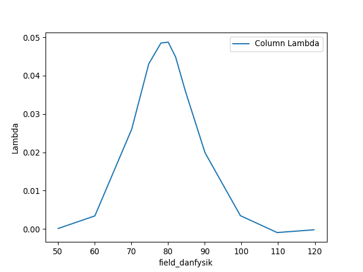

.. _muon_testing:

============
Muon Testing
============

.. contents:: Table of Contents
   :local:

Preparation
-----------

For these tests you will be using the files; ``EMU00051341-51343.nxs`` for
:ref:`ionic_diffusion_test`, ``EMU00020882-20900.nxs`` for
:ref:`superconducting_copper_test`, ``HIFI000134028-13439``
for :ref:`hifi_transverse_field_simultaneous_fitting`, and ``MUSR62260`` for
:ref:`transverse_field_asymmetry_test`. You will need access to the data
archive for this which can be activated through
:ref:`manage user directories <ManageUserDirectories>`.

-------------------------

.. _ionic_diffusion_test:

Ionic Diffusion Test
--------------------

**Time required 5 - 10 minutes**

- Open **Muon Analysis** (*Interfaces* > *Muon* > *Muon Analysis*)
- Change *Instrument* to **EMU**, found in the *Home* tab
- Load runs ``51341-3``
- Go to the **Fitting** tab
	- Check the **Simultaneous fit over** checkbox, and change from **Run**
	  to **Group/Pair**
	- Right click the empty table area; Select **Add Function**
	- Add a **Flat Background** (*Background* > *Flat Background*)
	- Similarly, add **DynamicKuboToyabe** (*Muon* > *MuonGeneric* >
	  *DynamicKuboToyabe*)
	- Check the **Global** checkbox for the parameters **A0**, **Asym**,
	  **Delta** and **Nu**
	- Set ``A0 = 0.05``, ``Asym = 0.15``, ``Delta = 0.2`` and ``Nu = 0.1``
	- Click the value for the **Field** parameter; A ``...`` should appear next
	  to it, click it. A new window should appear
	- Check the box called **Log**
	- Change the log to be **field_danfysik**
	- Click a row in the table
	- Click the **Set** drop down menu and choose **Set all to log**
	- Do the same but this time choose **Fix all**, then click **Ok**
	- Click Fit
- Go to the **Results** tab
	- At the bottom of the interface, click **Output Results**
	- A table should appear in the workspaces toolbox called *Results Table*
- Click on the main Workbench window and open the results table
- Expected Values are (similar to within 50%):
	- **f0.A0:** ``-0.0467``
	- **f1.Asym:** ``0.155``
	- **f1.Delta:** ``0.389``
	- **f1.Nu:** ``0.474``

- Back in the workspaces toolbox, click the workspace group for the fitted,
  data (Name similar to *EMU51341; Pair Asym; long; MA+ ...; Fitted; FlatBackground,DynamicKuboToyabe*)
- Ctrl + Click all the Workspace 2D data, then right click **Plot** > **Spectrum ...**
- Choose Plot type **Individual** and click **Plot All**
- You should get something like the following plot:

.. figure:: ../../images/MuonAnalysisTests/MATestingIDF.png
	:alt: MATestingIDF.png

--------------------------------

.. _superconducting_copper_test:

Superconducting Copper Test
---------------------------

**Time required 5 - 10 minutes**

- Open **Muon Analysis** (*Interfaces* > *Muon* > *Muon Analysis*)
- Change *Instrument* to **EMU**, found in the *Home* tab
- Load run ``20889-20900``
- Using the **>** button, step through a couple files (Plot should
  update each time)
- Go to the **Fitting** tab
	- Right click the empty table area; Select **Add Function**
	- Add **ExpDecayMuon** (*Muon* > *MuonGeneric* >
	  *ExpDecMuon*)
- Go to the **Sequential Fitting** tab
	- Click **Sequentially Fit All**
- Go to the **Results** tab
	- In the **Log Values** table, check **run_number** and **Field_Danfysik**
	- Click **Output Results**
- Open the results table by double clicking the table in the workspace toolbox
- Ctrl-Click the **field_danfysik** and the **lambda** column
- Right click **lambda** column, click **Plot...** and then **Line**
- You should get something like the following plot:

-----------------------------------------------

.. _hifi_transverse_field_simultaneous_fitting:

HIFI Transverse Field Simultaneous Fitting
------------------------------------------

**Time required 5 - 10 minutes**

- Open **Muon Analysis** (*Interfaces* > *Muon* > *Muon Analysis*)
- Change *Instrument* to **HIFI**, found in the *Home* tab
- Load runs ``134028-39``
- Go to the **Grouping** tab
	- In the Pair table, click **Guess Alpha**
	- In the resulting dialog, change the run to ``HIFI134034`` to be used for
	  the calculation
	- A value close to ``1.3`` should appear
- Go to the **Fitting** tab
	- Check the **Simultaneous fit over** checkbox, and change from **Run**
	  to **Group/Pair**
	- Right click the empty table area; Select **Add Function**
	- Add a **Flat Background** (*Background* > *Flat Background*)
	- Similarly, add **ExpDecayOsc** (*Muon* > *MuonGeneric* >
	  *ExpDecOsc*)
	- Set all parameters to **Global**, except **Frequency**
	- Click **Fit**
- The fit should fail with a large **Chi** value (``>100``)
- Now to try the fit a different way.
	- Click **Undo Fits**
	- Click the value for the **Frequency** parameter; A ``...`` should appear
	  next to it, click it. A new window should appear
	- Enter values for each run in the table as from ``0.1`` to ``1.1`` in
	  steps of ``0.1``
	- Click **Ok**
	- Click **Fit**
- This time the fit should work with a significantly lower value for **Chi
  squared** (``<10``)
- Back in the main workbench window, expand the fitting workspace and pick one
  of the fitted workspaces
- Double click and with plot type as **Individual**, click **Plot All**
- You should get plots that look like this:

.. figure:: ../../images/MuonAnalysisTests/HIFI-TF-Result.png
	:alt: HIFI-TF-Result.png

------------------------------------

.. _transverse_field_asymmetry_test:

Transverse Field Asymmetry Test
-------------------------------

**Time required 5 minutes**

- Open **Muon Analysis** (*Interfaces* > *Muon* > *Muon Analysis*)
- Change *Instrument* to **MUSR**, found in the *Home* tab
- Load run ``62260``
- Go to the **Fitting** tab
	- Change **Select Workspace** to workspace containing the **fwd** in the
	  name
	- Right click the empty table area; Select **Add Function**
	- Add **GuasOsc** (*Muon* > *MuonGeneric* > *GausOsc*)
	- Set ``Frequency = 1.3``
	- In the bottom table, check **TF Asymmetry Mode** to be ``true``
	- Click **Fit**

Possible Prolems
----------------

- If at any point data cannot be loaded check your
  :ref:`manage user directories <ManageUserDirectories>` to see if you have
  turned on archive search.
- If you cannot see all the runs once you reach the ``...`` step for a
  simultaneous fit, go back to the **Fitting** tab and make sure
  **Simultaneous fit over** is checked and it is over **Group/Pair**, not
  **Run**
