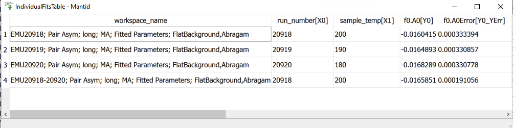
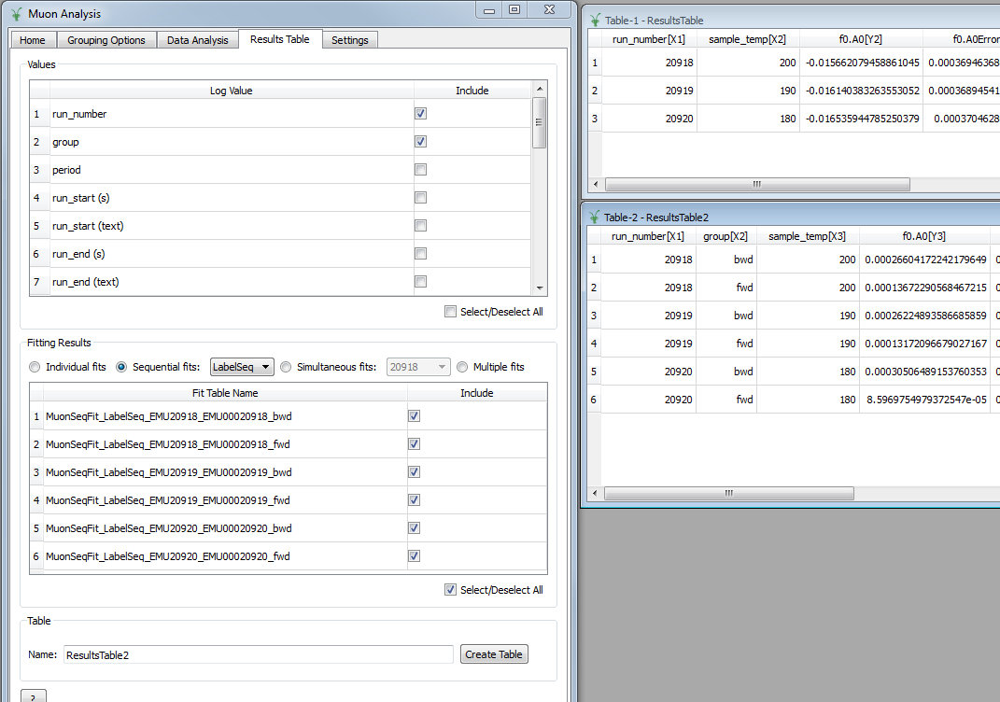
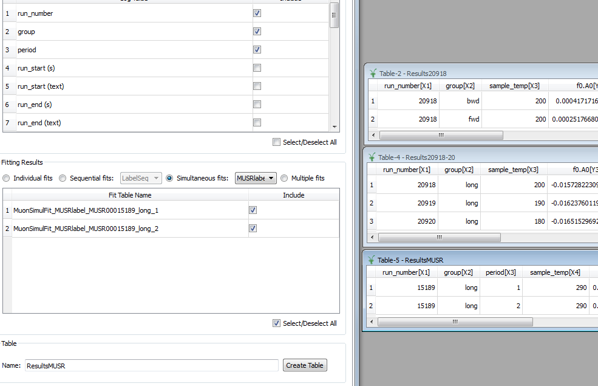
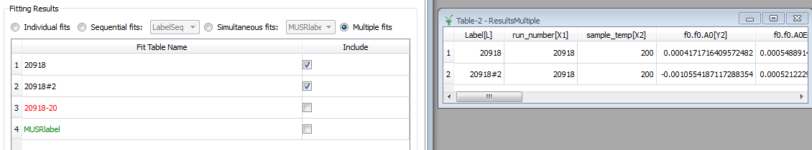

.. _Muon_Analysis_TestGuide_3_Results-ref:

Muon Analysis Unscripted Testing: Group 3 (Results Tables)
==========================================================

.. contents:: Table of Contents
    :local:
    
Introduction
^^^^^^^^^^^^

These are unscripted tests for the :program:`Muon Analysis` interface.
The tests here in group 3 are concerned with generating results tables from fits that have previously been run.
In this case, the fits previously run are those in test group 2, so those tests need to be run before these ones.

The master testing guide is located at :ref:`Muon_Analysis_TestGuide-ref`.

Tests
^^^^^

Ensure that you have first run all the tests in group 2, then go to the *Results Table* tab.

Test 1: individual fits
-----------------------
- Top group box: select ``run_number`` and ``sample_temp`` as logs
- Centre group box: keep the default, which should be the *Individual fits* radio button with both individual fits selected
- Create the table with the default name ``ResultsTable``.
- Table should have two rows, one for runs 20918-20 (co-added) and one for run 20918.
- Sample temp should be expressed correctly as a range "180 to 200" for co-added runs
- Should be one pair of columns for each parameter + error, plus a final column for "cost function value"

Like this:

Test 2: Sequential fit (simple)
-------------------------------
- Top group box: keep same logs as before
- Select the *Sequential fits* radio button in the centre group box, and "Label" in the drop-down, *i.e.* the first sequential fit you did. Keep all three runs included.
- Create the table - check that, if you don't change the name, it warns you about overwriting. (Say yes to create the table ``ResultsTable``.)
- The table should have three rows, one for each run, with the correct sample log values (180, 190, 200).
- Again there should be one pair of columns for each parameter and error, and a cost function column at the end.

Test 3: Sequential fit of simultaneous fits
-------------------------------------------
- Now select "LabelSeq" in the drop-down next to *Sequential fits* (see test 2).
- The top box should have extra log values for ``group`` and ``period`` - select ``group`` (as well as ``run_number``)
- Keep all runs selected and create table, this time with the name ``ResultsTable2``.
- There should be six rows in all, two per run (one for fwd, one for bwd).

Like this:

Test 4: Simultaneous fits
-------------------------
- Select the "Simultaneous fits" radio button above the centre group box.
- Keep the first label, "20918", selected in the drop-down list. (This was the fit across groups in the same run)
- Create the table with the name ``Results20918``
- There should be one row per run
- For the global parameters (``f1.A``, ``f1.Omega``, ``f1.Phi``, ``f1.Sigma``), note the error is non-zero for the first run and zero for the others as they were all fitted together.

Test 5: Simultaneous fits (2)
-----------------------------
- Now in the drop-down list next to the "Simultaneous fits" radio button, select the label "20918-20", which was the fit across runs.
- Create the table with the name ``Results20918-20``
- In the drop-down list, select the label "MUSRlabel", the fit across periods for MUSR data. Have the ``period`` log value selected in the top box for this one, and create the table ``ResultsMUSR``.

Should look like this:

Test 6: Multiple simultaneous fits
----------------------------------
- Select the last radio button, "Multiple", above the centre group box.
- Three simultaneous fit labels are listed: 20918, 20918#2, 20918-20 and MUSRlabel.
- Note that they have different colours, because the number of datasets and fit models differ. You should not be able to create a table with all of these selected.
- Select just the first two, i.e. "20918" and "20918#2", log values ``run_number`` and ``sample_temp``, and create the table.
- There should be columns for label, run number/sample temp (with correct ranges) and fit parameters.
- Non-global parameters should have a column for each dataset - so ``f0.f0.A0``, ``f1.f0.A0``, ``f2.f0.A0``
- Global parameters should share a column - so just ``f1.A``, ``f1.Omega`` etc.

Should look like this:

